# EPTA 440–449 · Section 04 — Propulsión por Combustión

## 1. Purpose

Section-level index for *Propulsión por Combustión* (`440-449`) within the EPTA band. Combustion propulsion: gas turbines and turbofan, turboprop/turboshaft, ICE and range extenders, hydrogen combustion and alternative fuels, combustion chambers and emissions, fuel system interfaces, thermal management, evidence governance, safety certification and emissions limits.

This section is part of the **ATLAS-1000** register, a subpart of the **Q+ATLANTIDE** baseline[^baseline][^n001]. Bands classify technologies, Q-Divisions provide technical authority and ORB-Functions provide enterprise support[^n002].

## 2. Scope

- Aggregates the subsections within the `440-449` code range listed in §3.
- Inherits Q-Division authority and ORB support from the parent row in [`../README.md` §3](../README.md#3-architecture-table)[^archtable].
- Each subsection folder contains its own `README.md` (subsection index) and may contain Overview and subsubject documents.
- All subsections under this section declare `governance_class: baseline` and maintain evidence traceability per the Q+ATLANTIDE templates system[^templates].

## 3. Subsection Index

| Code | Title | Folder | Status |
| ---: | --- | --- | --- |
| `440` | Arquitectura General de Propulsion por Combustion | [`./440_Arquitectura-General-de-Propulsion-por-Combustion/`](./440_Arquitectura-General-de-Propulsion-por-Combustion/) | active |
| `441` | Turbinas de Gas y Turbofan | [`./441_Turbinas-de-Gas-y-Turbofan/`](./441_Turbinas-de-Gas-y-Turbofan/) | active |
| `442` | Turboprop Turboshaft y Motores Regional | [`./442_Turboprop-Turboshaft-y-Motores-Regional/`](./442_Turboprop-Turboshaft-y-Motores-Regional/) | active |
| `443` | Motores de Combustion Interna y Range Extenders | [`./443_Motores-de-Combustion-Interna-y-Range-Extenders/`](./443_Motores-de-Combustion-Interna-y-Range-Extenders/) | active |
| `444` | Combustion de Hidrogeno y Combustibles Alternativos | [`./444_Combustion-de-Hidrogeno-y-Combustibles-Alternativos/`](./444_Combustion-de-Hidrogeno-y-Combustibles-Alternativos/) | active |
| `445` | Camaras de Combustion Emisiones y Estabilidad | [`./445_Camaras-de-Combustion-Emisiones-y-Estabilidad/`](./445_Camaras-de-Combustion-Emisiones-y-Estabilidad/) | active |
| `446` | Fuel System Interfaces y Control de Combustible | [`./446_Fuel-System-Interfaces-y-Control-de-Combustible/`](./446_Fuel-System-Interfaces-y-Control-de-Combustible/) | active |
| `447` | Thermal Management y Exhaust Integration | [`./447_Thermal-Management-y-Exhaust-Integration/`](./447_Thermal-Management-y-Exhaust-Integration/) | active |
| `448` | Evidencia Trazabilidad y Gobernanza de Combustion | [`./448_Evidencia-Trazabilidad-y-Gobernanza-de-Combustion/`](./448_Evidencia-Trazabilidad-y-Gobernanza-de-Combustion/) | active |
| `449` | Safety Certificacion y Limites de Emisiones | [`./449_Safety-Certificacion-y-Limites-de-Emisiones/`](./449_Safety-Certificacion-y-Limites-de-Emisiones/) | active |

## 4. Interfaces Diagram

```mermaid
flowchart TB
    PARENT["EPTA<br/>(`400–499` master range)"]:::parent
    SEC["Section 04 · 440-449<br/>Propulsión por Combustión"]:::sec
    PARENT --> SEC

    subgraph SUBS["Subsections"]
        direction LR
        SUB_440["440 — Arquitectura General de Propulsion por Combustion"]:::sub
        SUB_441["441 — Turbinas de Gas y Turbofan"]:::sub
        SUB_442["442 — Turboprop Turboshaft y Motores Regional"]:::sub
        SUB_443["443 — Motores de Combustion Interna y Range Extenders"]:::sub
        SUB_444["444 — Combustion de Hidrogeno y Combustibles Alternativos"]:::sub
        SUB_445["445 — Camaras de Combustion Emisiones y Estabilidad"]:::sub
        SUB_446["446 — Fuel System Interfaces y Control de Combustible"]:::sub
        SUB_447["447 — Thermal Management y Exhaust Integration"]:::sub
        SUB_448["448 — Evidencia Trazabilidad y Gobernanza de Combustion"]:::sub
        SUB_449["449 — Safety Certificacion y Limites de Emisiones"]:::sub
    end
    SEC --> SUBS

    SUBS --> SUB_440
    SUBS --> SUB_441
    SUBS --> SUB_442
    SUBS --> SUB_443
    SUBS --> SUB_444
    SUBS --> SUB_445
    SUBS --> SUB_446
    SUBS --> SUB_447
    SUBS --> SUB_448
    SUBS --> SUB_449

    QPRIM["Q-GREENTECH<br/>(primary Q-Division)"]:::qdiv
    QSUPP["Q-AIR, Q-MECHANICS<br/>(support Q-Divisions)"]:::qdiv
    ORB["ORB-PMO, ORB-FIN<br/>(ORB support)"]:::orb

    SEC --> QPRIM
    SEC -.-> QSUPP
    SEC -.-> ORB

    classDef parent fill:#1f3a93,stroke:#0b1d4a,color:#fff
    classDef sec fill:#2c82c9,stroke:#0b1d4a,color:#fff
    classDef sub fill:#eaf3fb,stroke:#2c82c9,color:#0b1d4a
    classDef qdiv fill:#f6e6ff,stroke:#7d3c98,color:#3b1f4d
    classDef orb fill:#fff4dd,stroke:#b9770e,color:#5a3b00
```

*Solid arrows show parent→section→subsection ownership and primary Q-Division authority; dotted arrows show support Q-Divisions and ORB enterprise support.*

## 5. Footprint

| Metric | Value |
| --- | --- |
| Architecture | `EPTA` — Energy & Propulsion Technology Architecture |
| Master range | `400–499` |
| Code range | `440-449` |
| Section | `04` — Propulsión por Combustión |
| Subsections | 10 populated |
| Primary Q-Division | Q-GREENTECH[^qdiv] |
| Support Q-Divisions | Q-AIR, Q-MECHANICS |
| ORB support | ORB-PMO, ORB-FIN |
| Governance class | `baseline`[^gov] |
| Folder path | `Q+ATLANTIDE/400-499_EPTA/440-449_Propulsion-por-Combustion/` |
| Document | `README.md` (this file) |
| Parent architecture | [`../README.md`](../README.md) |
| Parent baseline | [`organization/Q+ATLANTIDE.md`](../../../organization/Q+ATLANTIDE.md) |

## Governance

Governed by [`organization/Q+ATLANTIDE.md`](../../../organization/Q+ATLANTIDE.md)[^baseline]. All subsections under this section inherit `architecture_code = EPTA`, `primary_q_division = Q-GREENTECH`, and `governance_class = baseline` from this section header. Combustion propulsion documents must maintain evidence traceability per the Q+ATLANTIDE templates system[^templates]. Relevant standards include IEC 61508 (functional safety), SAE AS6968 (aircraft electric power), AS9100D (aerospace quality management), and S1000D (technical documentation). The No-AAA Rule[^n004] applies.

## 6. References & Citations

[^baseline]: **Q+ATLANTIDE controlled baseline (v1.0.0)** — [`organization/Q+ATLANTIDE.md`](../../../organization/Q+ATLANTIDE.md). Defines the controlled `000-999` architecture-band taxonomy and the ATLAS-1000 register subpart.

[^archtable]: **§3 — Architecture Table (parent)** — [`../README.md` §3](../README.md#3-architecture-table). Source of authority for primary/support Q-Divisions and ORB support of this section.

[^qdiv]: **Q-Division authority** — [`organization/Q-Divisions/`](../../../organization/Q-Divisions/). Technical-authority units for the Q+ATLANTIDE baseline.

[^gov]: **Governance class** — `baseline` denotes documents under standard Q+ATLANTIDE traceability and evidence requirements without additional restricted-band controls.

[^templates]: **§5 — Templates System** — [`organization/Q+ATLANTIDE.md` §5](../../../organization/Q+ATLANTIDE.md#5-templates-system).

[^n001]: **Note N-001** — Q+ATLANTIDE (with its ATLAS-1000 register subpart) is a taxonomy and traceability ecosystem, not an organization chart. See [`organization/Q+ATLANTIDE.md` §4](../../../organization/Q+ATLANTIDE.md#4-notes).

[^n002]: **Note N-002** — Architecture bands classify technologies; Q-Divisions provide technical authority; ORB-Functions provide enterprise support. See [`organization/Q+ATLANTIDE.md` §4](../../../organization/Q+ATLANTIDE.md#4-notes).

[^n004]: **Note N-004 (No-AAA Rule)** — "AAA" is not a valid domain, division, architecture, interface or function in this baseline. See [`organization/Q+ATLANTIDE.md` §4](../../../organization/Q+ATLANTIDE.md#4-notes).
