# EPTA 450–459 · Section 05 — Propulsión Eléctrica e Híbrida

## 1. Purpose

Section-level index for *Propulsión Eléctrica e Híbrida* (`450-459`) within the EPTA band. Electric and hybrid propulsion: electric motors and machines, inverters/converters/power electronics, batteries/fuel-cells/hybrid sources, distributed electric propulsion (DEP), series/parallel/turboelectric architectures, high-voltage distribution, thermal management, evidence governance, EMI/EMC safety and certification.

This section is part of the **ATLAS-1000** register, a subpart of the **Q+ATLANTIDE** baseline[^baseline][^n001]. Bands classify technologies, Q-Divisions provide technical authority and ORB-Functions provide enterprise support[^n002].

## 2. Scope

- Aggregates the subsections within the `450-459` code range listed in §3.
- Inherits Q-Division authority and ORB support from the parent row in [`../README.md` §3](../README.md#3-architecture-table)[^archtable].
- Each subsection folder contains its own `README.md` (subsection index) and may contain Overview and subsubject documents.
- All subsections under this section declare `governance_class: baseline` and maintain evidence traceability per the Q+ATLANTIDE templates system[^templates].

## 3. Subsection Index

| Code | Title | Folder | Status |
| ---: | --- | --- | --- |
| `450` | Arquitectura General de Propulsion Electrica e Hibrida | [`./450_Arquitectura-General-de-Propulsion-Electrica-e-Hibrida/`](./450_Arquitectura-General-de-Propulsion-Electrica-e-Hibrida/) | active |
| `451` | Motores Electricos y Maquinas Electricas | [`./451_Motores-Electricos-y-Maquinas-Electricas/`](./451_Motores-Electricos-y-Maquinas-Electricas/) | active |
| `452` | Inverters Converters y Power Electronics | [`./452_Inverters-Converters-y-Power-Electronics/`](./452_Inverters-Converters-y-Power-Electronics/) | active |
| `453` | Baterias Fuel Cells y Fuentes Hibridas | [`./453_Baterias-Fuel-Cells-y-Fuentes-Hibridas/`](./453_Baterias-Fuel-Cells-y-Fuentes-Hibridas/) | active |
| `454` | Distributed Electric Propulsion DEP | [`./454_Distributed-Electric-Propulsion-DEP/`](./454_Distributed-Electric-Propulsion-DEP/) | active |
| `455` | Series Parallel y Turboelectric Architectures | [`./455_Series-Parallel-y-Turboelectric-Architectures/`](./455_Series-Parallel-y-Turboelectric-Architectures/) | active |
| `456` | High Voltage Distribution y Protection | [`./456_High-Voltage-Distribution-y-Protection/`](./456_High-Voltage-Distribution-y-Protection/) | active |
| `457` | Thermal Management y Cooling Loops | [`./457_Thermal-Management-y-Cooling-Loops/`](./457_Thermal-Management-y-Cooling-Loops/) | active |
| `458` | Evidencia Trazabilidad y Gobernanza Hibrida | [`./458_Evidencia-Trazabilidad-y-Gobernanza-Hibrida/`](./458_Evidencia-Trazabilidad-y-Gobernanza-Hibrida/) | active |
| `459` | Safety EMI EMC y Certification Boundaries | [`./459_Safety-EMI-EMC-y-Certification-Boundaries/`](./459_Safety-EMI-EMC-y-Certification-Boundaries/) | active |

## 4. Interfaces Diagram

```mermaid
flowchart TB
    PARENT["EPTA<br/>(`400–499` master range)"]:::parent
    SEC["Section 05 · 450-459<br/>Propulsión Eléctrica e Híbrida"]:::sec
    PARENT --> SEC

    subgraph SUBS["Subsections"]
        direction LR
        SUB_450["450 — Arquitectura General de Propulsion Electrica e Hibrida"]:::sub
        SUB_451["451 — Motores Electricos y Maquinas Electricas"]:::sub
        SUB_452["452 — Inverters Converters y Power Electronics"]:::sub
        SUB_453["453 — Baterias Fuel Cells y Fuentes Hibridas"]:::sub
        SUB_454["454 — Distributed Electric Propulsion DEP"]:::sub
        SUB_455["455 — Series Parallel y Turboelectric Architectures"]:::sub
        SUB_456["456 — High Voltage Distribution y Protection"]:::sub
        SUB_457["457 — Thermal Management y Cooling Loops"]:::sub
        SUB_458["458 — Evidencia Trazabilidad y Gobernanza Hibrida"]:::sub
        SUB_459["459 — Safety EMI EMC y Certification Boundaries"]:::sub
    end
    SEC --> SUBS

    SUBS --> SUB_450
    SUBS --> SUB_451
    SUBS --> SUB_452
    SUBS --> SUB_453
    SUBS --> SUB_454
    SUBS --> SUB_455
    SUBS --> SUB_456
    SUBS --> SUB_457
    SUBS --> SUB_458
    SUBS --> SUB_459

    QPRIM["Q-GREENTECH<br/>(primary Q-Division)"]:::qdiv
    QSUPP["Q-HPC, Q-MECHANICS, Q-AIR<br/>(support Q-Divisions)"]:::qdiv
    ORB["ORB-PMO, ORB-LEG<br/>(ORB support)"]:::orb

    SEC --> QPRIM
    SEC -.-> QSUPP
    SEC -.-> ORB

    classDef parent fill:#1f3a93,stroke:#0b1d4a,color:#fff
    classDef sec fill:#2c82c9,stroke:#0b1d4a,color:#fff
    classDef sub fill:#eaf3fb,stroke:#2c82c9,color:#0b1d4a
    classDef qdiv fill:#f6e6ff,stroke:#7d3c98,color:#3b1f4d
    classDef orb fill:#fff4dd,stroke:#b9770e,color:#5a3b00
```

*Solid arrows show parent→section→subsection ownership and primary Q-Division authority; dotted arrows show support Q-Divisions and ORB enterprise support.*

## 5. Footprint

| Metric | Value |
| --- | --- |
| Architecture | `EPTA` — Energy & Propulsion Technology Architecture |
| Master range | `400–499` |
| Code range | `450-459` |
| Section | `05` — Propulsión Eléctrica e Híbrida |
| Subsections | 10 populated |
| Primary Q-Division | Q-GREENTECH[^qdiv] |
| Support Q-Divisions | Q-HPC, Q-MECHANICS, Q-AIR |
| ORB support | ORB-PMO, ORB-LEG |
| Governance class | `baseline`[^gov] |
| Folder path | `Q+ATLANTIDE/400-499_EPTA/450-459_Propulsion-Electrica-e-Hibrida/` |
| Document | `README.md` (this file) |
| Parent architecture | [`../README.md`](../README.md) |
| Parent baseline | [`organization/Q+ATLANTIDE.md`](../../../organization/Q+ATLANTIDE.md) |

## Governance

Governed by [`organization/Q+ATLANTIDE.md`](../../../organization/Q+ATLANTIDE.md)[^baseline]. All subsections under this section inherit `architecture_code = EPTA`, `primary_q_division = Q-GREENTECH`, and `governance_class = baseline` from this section header. Electric and hybrid propulsion documents must maintain evidence traceability per the Q+ATLANTIDE templates system[^templates]. Relevant standards include IEC 61508 (functional safety), SAE AS6968 (aircraft electric power characteristics), AS9100D (aerospace quality management), and S1000D (technical documentation). The No-AAA Rule[^n004] applies.

## 6. References & Citations

[^baseline]: **Q+ATLANTIDE controlled baseline (v1.0.0)** — [`organization/Q+ATLANTIDE.md`](../../../organization/Q+ATLANTIDE.md). Defines the controlled `000-999` architecture-band taxonomy and the ATLAS-1000 register subpart.

[^archtable]: **§3 — Architecture Table (parent)** — [`../README.md` §3](../README.md#3-architecture-table). Source of authority for primary/support Q-Divisions and ORB support of this section.

[^qdiv]: **Q-Division authority** — [`organization/Q-Divisions/`](../../../organization/Q-Divisions/). Technical-authority units for the Q+ATLANTIDE baseline.

[^gov]: **Governance class** — `baseline` denotes documents under standard Q+ATLANTIDE traceability and evidence requirements without additional restricted-band controls.

[^templates]: **§5 — Templates System** — [`organization/Q+ATLANTIDE.md` §5](../../../organization/Q+ATLANTIDE.md#5-templates-system).

[^n001]: **Note N-001** — Q+ATLANTIDE (with its ATLAS-1000 register subpart) is a taxonomy and traceability ecosystem, not an organization chart. See [`organization/Q+ATLANTIDE.md` §4](../../../organization/Q+ATLANTIDE.md#4-notes).

[^n002]: **Note N-002** — Architecture bands classify technologies; Q-Divisions provide technical authority; ORB-Functions provide enterprise support. See [`organization/Q+ATLANTIDE.md` §4](../../../organization/Q+ATLANTIDE.md#4-notes).

[^n004]: **Note N-004 (No-AAA Rule)** — "AAA" is not a valid domain, division, architecture, interface or function in this baseline. See [`organization/Q+ATLANTIDE.md` §4](../../../organization/Q+ATLANTIDE.md#4-notes).
