# EPTA 450-459 · Section 05 — Thermal Management and Cryogenic Systems

## 1. Purpose

Section-level index for *Thermal Management and Cryogenic Systems* (`450-459`) within the EPTA band. Gestión Térmica y Sistemas Criogénicos: Heat exchangers/cold plates/thermal buses, liquid cooling loops/pumps, air cooling/ventilation architectures, cryogenic systems/insulation, thermal control valves/sensors/regulation, waste-heat recovery, thermal protection/fire zones/hazard isolation, thermal monitoring/diagnostics.

This section is part of the **ATLAS-1000** register, a subpart of the controlled **Q+ATLANTIDE** baseline[^baseline][^n001]. Bands classify technologies, Q-Divisions provide technical authority and ORB-Functions provide enterprise support[^n002].

## 2. Scope

- Aggregates the subsections within the `450-459` code range listed in §3.
- Inherits Q-Division authority and ORB support from the parent row in [`../README.md` §3](../README.md#3-architecture-table)[^archtable].
- Each subsection folder contains its own `README.md` (subsection index) and may contain subsubject documents.

## 3. Subsection Index

| Code | Title | Folder | Status |
|---:|---|---|---|
| `450` | Thermal Management General | [`./450_Thermal-Management-General/`](./450_Thermal-Management-General/) | active |
| `451` | Heat Exchangers, Cold Plates and Thermal Buses | [`./451_Heat-Exchangers-Cold-Plates-and-Thermal-Buses/`](./451_Heat-Exchangers-Cold-Plates-and-Thermal-Buses/) | active |
| `452` | Liquid Cooling Loops and Pumps | [`./452_Liquid-Cooling-Loops-and-Pumps/`](./452_Liquid-Cooling-Loops-and-Pumps/) | active |
| `453` | Air Cooling and Ventilation Architectures | [`./453_Air-Cooling-and-Ventilation-Architectures/`](./453_Air-Cooling-and-Ventilation-Architectures/) | active |
| `454` | Cryogenic Systems and Insulation | [`./454_Cryogenic-Systems-and-Insulation/`](./454_Cryogenic-Systems-and-Insulation/) | active |
| `455` | Thermal Control Valves, Sensors and Regulation | [`./455_Thermal-Control-Valves-Sensors-and-Regulation/`](./455_Thermal-Control-Valves-Sensors-and-Regulation/) | active |
| `456` | Waste-Heat Recovery and Energy Reuse | [`./456_Waste-Heat-Recovery-and-Energy-Reuse/`](./456_Waste-Heat-Recovery-and-Energy-Reuse/) | active |
| `457` | Thermal Protection, Fire Zones and Hazard Isolation | [`./457_Thermal-Protection-Fire-Zones-and-Hazard-Isolation/`](./457_Thermal-Protection-Fire-Zones-and-Hazard-Isolation/) | active |
| `458` | Thermal Monitoring, Diagnostics and Maintenance | [`./458_Thermal-Monitoring-Diagnostics-and-Maintenance/`](./458_Thermal-Monitoring-Diagnostics-and-Maintenance/) | active |
| `459` | Thermal Systems S1000D CSDB Mapping and Traceability | [`./459_Thermal-Systems-S1000D-CSDB-Mapping-and-Traceability/`](./459_Thermal-Systems-S1000D-CSDB-Mapping-and-Traceability/) | active |

## 4. Interfaces Diagram

```mermaid
flowchart TB
    PARENT["EPTA band<br/>(`400–499` master range)"]:::parent
    SEC["Section 05 · 450-459<br/>Thermal Management and Cryogenic Systems"]:::sec
    PARENT --> SEC

    subgraph SUBS["Subsections"]
        direction LR
        SUB_450["450 — Thermal Management General"]:::sub
        SUB_451["451 — Heat Exchangers, Cold Plates and Thermal Buses"]:::sub
        SUB_452["452 — Liquid Cooling Loops and Pumps"]:::sub
        SUB_453["453 — Air Cooling and Ventilation Architectures"]:::sub
        SUB_454["454 — Cryogenic Systems and Insulation"]:::sub
        SUB_455["455 — Thermal Control Valves, Sensors and Regulation"]:::sub
        SUB_456["456 — Waste-Heat Recovery and Energy Reuse"]:::sub
        SUB_457["457 — Thermal Protection, Fire Zones and Hazard Isolation"]:::sub
        SUB_458["458 — Thermal Monitoring, Diagnostics and Maintenance"]:::sub
        SUB_459["459 — Thermal Systems S1000D CSDB Mapping and Traceability"]:::sub
    end
    SEC --> SUB_450
    SEC --> SUB_451
    SEC --> SUB_452
    SEC --> SUB_453
    SEC --> SUB_454
    SEC --> SUB_455
    SEC --> SUB_456
    SEC --> SUB_457
    SEC --> SUB_458
    SEC --> SUB_459

    QPRIM["Q-MECHANICS<br/>(primary Q-Division)"]:::qdiv
    QSUPP["Q-GREENTECH, Q-AIR, Q-STRUCTURES, Q-INDUSTRY<br/>(support Q-Divisions)"]:::qdiv
    ORB["ORB-PMO, ORB-LEG<br/>(ORB support)"]:::orb

    SEC --> QPRIM
    SEC -.-> QSUPP
    SEC -.-> ORB

    classDef parent fill:#1f3a93,stroke:#0b1d4a,color:#fff
    classDef sec fill:#2c82c9,stroke:#0b1d4a,color:#fff
    classDef sub fill:#eaf3fb,stroke:#2c82c9,color:#0b1d4a
    classDef qdiv fill:#f6e6ff,stroke:#7d3c98,color:#3b1f4d
    classDef orb fill:#fff4dd,stroke:#b9770e,color:#5a3b00
```

*Solid arrows show parent→section→subsection ownership and primary Q-Division authority; dotted arrows show support Q-Divisions and ORB enterprise support.*

## 5. Footprint

| Metric | Value |
|---|---|
| Architecture | `EPTA` — Energy and Propulsion Technology Architecture |
| Master range | `400–499` |
| Code range | `450-459` |
| Section | `05` — Thermal Management and Cryogenic Systems |
| Subsections | 10 populated |
| Primary Q-Division | Q-MECHANICS[^qdiv] |
| Support Q-Divisions | Q-GREENTECH, Q-AIR, Q-STRUCTURES, Q-INDUSTRY |
| ORB support | ORB-PMO, ORB-LEG |
| Governance class | `baseline`[^gov] |
| Folder path | `Q+ATLANTIDE/400-499_EPTA/450-459_Thermal-Management-and-Cryogenic-Systems/` |
| Document | `README.md` (this file) |
| Parent architecture | [`../README.md`](../README.md) |
| Parent baseline | [`organization/Q+ATLANTIDE.md`](../../../../organization/Q+ATLANTIDE.md) |

## Governance

Governed by [`organization/Q+ATLANTIDE.md`](../../../../organization/Q+ATLANTIDE.md)[^baseline]. All subsections under this section inherit `architecture_code = EPTA`, `primary_q_division = Q-MECHANICS` and `governance_class = baseline` from this section header. Templates declared in this section must populate `architecture_band`, `architecture_code = EPTA`, `q_division_owner` and `orb_function_support` per the Templates System[^templates]. The No-AAA Rule[^n004] applies.

## 6. References & Citations

[^baseline]: **Q+ATLANTIDE controlled baseline (v1.0.0)** — [`organization/Q+ATLANTIDE.md`](../../../../organization/Q+ATLANTIDE.md).

[^archtable]: **§3 — Architecture Table (parent)** — [`../README.md` §3](../README.md#3-architecture-table).

[^qdiv]: **Q-Division authority** — [`organization/Q-Divisions/`](../../../../organization/Q-Divisions/).

[^gov]: **Governance class** — `baseline` denotes documents under controlled change management within the Q+ATLANTIDE baseline.

[^templates]: **§5 — Templates System** — [`organization/Q+ATLANTIDE.md` §5](../../../../organization/Q+ATLANTIDE.md#5-templates-system).

[^n001]: **Note N-001** — Q+ATLANTIDE (with its ATLAS-1000 register subpart) is a taxonomy and traceability ecosystem, not an organization chart. See [`organization/Q+ATLANTIDE.md` §4](../../../../organization/Q+ATLANTIDE.md#4-notes).

[^n002]: **Note N-002** — Architecture bands classify technologies; Q-Divisions provide technical authority; ORB-Functions provide enterprise support. See [`organization/Q+ATLANTIDE.md` §4](../../../../organization/Q+ATLANTIDE.md#4-notes).

[^n004]: **Note N-004 (No-AAA Rule)** — "AAA" is not a valid domain, division, architecture, interface or function in this baseline. See [`organization/Q+ATLANTIDE.md` §4](../../../../organization/Q+ATLANTIDE.md#4-notes).
