# EPTA 460–469 · Section 06 — Propulsión de Hidrógeno y Celdas de Combustible

## 1. Purpose

Section-level index for *Propulsión de Hidrógeno y Celdas de Combustible* (`460-469`) within the EPTA band. Hydrogen and fuel-cell propulsion: LH₂/GH₂ storage architectures, fuel cell stacks and balance of plant, cryogenic systems and boil-off, hydrogen distribution and safety zones, electric propulsion integration with fuel cells, byproduct management, detection/isolation/purge/emergency modes, evidence governance, safety certification and airport interface boundaries.

This section is part of the **ATLAS-1000** register, a subpart of the **Q+ATLANTIDE** baseline[^baseline][^n001]. Bands classify technologies, Q-Divisions provide technical authority and ORB-Functions provide enterprise support[^n002].

## 2. Scope

- Aggregates the subsections within the `460-469` code range listed in §3.
- Inherits Q-Division authority and ORB support from the parent row in [`../README.md` §3](../README.md#3-architecture-table)[^archtable].
- Each subsection folder contains its own `README.md` (subsection index) and may contain Overview and subsubject documents.
- All subsections under this section declare `governance_class: baseline` and maintain evidence traceability per the Q+ATLANTIDE templates system[^templates].

## 3. Subsection Index

| Code | Title | Folder | Status |
| ---: | --- | --- | --- |
| `460` | Arquitectura General de Propulsion Hidrogeno Fuel Cell | [`./460_Arquitectura-General-de-Propulsion-Hidrogeno-Fuel-Cell/`](./460_Arquitectura-General-de-Propulsion-Hidrogeno-Fuel-Cell/) | active |
| `461` | LH2 GH2 y Storage Architecture | [`./461_LH2-GH2-y-Storage-Architecture/`](./461_LH2-GH2-y-Storage-Architecture/) | active |
| `462` | Fuel Cell Stacks y Balance of Plant | [`./462_Fuel-Cell-Stacks-y-Balance-of-Plant/`](./462_Fuel-Cell-Stacks-y-Balance-of-Plant/) | active |
| `463` | Cryogenic Systems Boil-Off y Venting | [`./463_Cryogenic-Systems-Boil-Off-y-Venting/`](./463_Cryogenic-Systems-Boil-Off-y-Venting/) | active |
| `464` | Hydrogen Distribution Valves y Safety Zones | [`./464_Hydrogen-Distribution-Valves-y-Safety-Zones/`](./464_Hydrogen-Distribution-Valves-y-Safety-Zones/) | active |
| `465` | Electric Propulsion Integration with Fuel Cells | [`./465_Electric-Propulsion-Integration-with-Fuel-Cells/`](./465_Electric-Propulsion-Integration-with-Fuel-Cells/) | active |
| `466` | Thermal Water Air y Byproduct Management | [`./466_Thermal-Water-Air-y-Byproduct-Management/`](./466_Thermal-Water-Air-y-Byproduct-Management/) | active |
| `467` | Detection Isolation Purge y Emergency Modes | [`./467_Detection-Isolation-Purge-y-Emergency-Modes/`](./467_Detection-Isolation-Purge-y-Emergency-Modes/) | active |
| `468` | Evidencia Trazabilidad y Gobernanza H2 | [`./468_Evidencia-Trazabilidad-y-Gobernanza-H2/`](./468_Evidencia-Trazabilidad-y-Gobernanza-H2/) | active |
| `469` | Safety Certificacion y Airport Interface Boundaries | [`./469_Safety-Certificacion-y-Airport-Interface-Boundaries/`](./469_Safety-Certificacion-y-Airport-Interface-Boundaries/) | active |

## 4. Interfaces Diagram

```mermaid
flowchart TB
    PARENT["EPTA<br/>(`400–499` master range)"]:::parent
    SEC["Section 06 · 460-469<br/>Propulsión de Hidrógeno y Celdas de Combustible"]:::sec
    PARENT --> SEC

    subgraph SUBS["Subsections"]
        direction LR
        SUB_460["460 — Arquitectura General de Propulsion Hidrogeno Fuel Cell"]:::sub
        SUB_461["461 — LH2 GH2 y Storage Architecture"]:::sub
        SUB_462["462 — Fuel Cell Stacks y Balance of Plant"]:::sub
        SUB_463["463 — Cryogenic Systems Boil-Off y Venting"]:::sub
        SUB_464["464 — Hydrogen Distribution Valves y Safety Zones"]:::sub
        SUB_465["465 — Electric Propulsion Integration with Fuel Cells"]:::sub
        SUB_466["466 — Thermal Water Air y Byproduct Management"]:::sub
        SUB_467["467 — Detection Isolation Purge y Emergency Modes"]:::sub
        SUB_468["468 — Evidencia Trazabilidad y Gobernanza H2"]:::sub
        SUB_469["469 — Safety Certificacion y Airport Interface Boundaries"]:::sub
    end
    SEC --> SUBS

    SUBS --> SUB_460
    SUBS --> SUB_461
    SUBS --> SUB_462
    SUBS --> SUB_463
    SUBS --> SUB_464
    SUBS --> SUB_465
    SUBS --> SUB_466
    SUBS --> SUB_467
    SUBS --> SUB_468
    SUBS --> SUB_469

    QPRIM["Q-GREENTECH<br/>(primary Q-Division)"]:::qdiv
    QSUPP["Q-STRUCTURES, Q-MECHANICS, Q-HPC<br/>(support Q-Divisions)"]:::qdiv
    ORB["ORB-PMO, ORB-LEG, ORB-CSR<br/>(ORB support)"]:::orb

    SEC --> QPRIM
    SEC -.-> QSUPP
    SEC -.-> ORB

    classDef parent fill:#1f3a93,stroke:#0b1d4a,color:#fff
    classDef sec fill:#2c82c9,stroke:#0b1d4a,color:#fff
    classDef sub fill:#eaf3fb,stroke:#2c82c9,color:#0b1d4a
    classDef qdiv fill:#f6e6ff,stroke:#7d3c98,color:#3b1f4d
    classDef orb fill:#fff4dd,stroke:#b9770e,color:#5a3b00
```

*Solid arrows show parent→section→subsection ownership and primary Q-Division authority; dotted arrows show support Q-Divisions and ORB enterprise support.*

## 5. Footprint

| Metric | Value |
| --- | --- |
| Architecture | `EPTA` — Energy & Propulsion Technology Architecture |
| Master range | `400–499` |
| Code range | `460-469` |
| Section | `06` — Propulsión de Hidrógeno y Celdas de Combustible |
| Subsections | 10 populated |
| Primary Q-Division | Q-GREENTECH[^qdiv] |
| Support Q-Divisions | Q-STRUCTURES, Q-MECHANICS, Q-HPC |
| ORB support | ORB-PMO, ORB-LEG, ORB-CSR |
| Governance class | `baseline`[^gov] |
| Folder path | `Q+ATLANTIDE/400-499_EPTA/460-469_Propulsion-de-Hidrogeno-y-Celdas-de-Combustible/` |
| Document | `README.md` (this file) |
| Parent architecture | [`../README.md`](../README.md) |
| Parent baseline | [`organization/Q+ATLANTIDE.md`](../../../organization/Q+ATLANTIDE.md) |

## Governance

Governed by [`organization/Q+ATLANTIDE.md`](../../../organization/Q+ATLANTIDE.md)[^baseline]. All subsections under this section inherit `architecture_code = EPTA`, `primary_q_division = Q-GREENTECH`, and `governance_class = baseline` from this section header. Hydrogen and fuel-cell propulsion documents must maintain evidence traceability per the Q+ATLANTIDE templates system[^templates]. Relevant standards include IEC 61508 (functional safety), ISO 50001 (energy management), AS9100D (aerospace quality management), and S1000D (technical documentation). The No-AAA Rule[^n004] applies.

## 6. References & Citations

[^baseline]: **Q+ATLANTIDE controlled baseline (v1.0.0)** — [`organization/Q+ATLANTIDE.md`](../../../organization/Q+ATLANTIDE.md). Defines the controlled `000-999` architecture-band taxonomy and the ATLAS-1000 register subpart.

[^archtable]: **§3 — Architecture Table (parent)** — [`../README.md` §3](../README.md#3-architecture-table). Source of authority for primary/support Q-Divisions and ORB support of this section.

[^qdiv]: **Q-Division authority** — [`organization/Q-Divisions/`](../../../organization/Q-Divisions/). Technical-authority units for the Q+ATLANTIDE baseline.

[^gov]: **Governance class** — `baseline` denotes documents under standard Q+ATLANTIDE traceability and evidence requirements without additional restricted-band controls.

[^templates]: **§5 — Templates System** — [`organization/Q+ATLANTIDE.md` §5](../../../organization/Q+ATLANTIDE.md#5-templates-system).

[^n001]: **Note N-001** — Q+ATLANTIDE (with its ATLAS-1000 register subpart) is a taxonomy and traceability ecosystem, not an organization chart. See [`organization/Q+ATLANTIDE.md` §4](../../../organization/Q+ATLANTIDE.md#4-notes).

[^n002]: **Note N-002** — Architecture bands classify technologies; Q-Divisions provide technical authority; ORB-Functions provide enterprise support. See [`organization/Q+ATLANTIDE.md` §4](../../../organization/Q+ATLANTIDE.md#4-notes).

[^n004]: **Note N-004 (No-AAA Rule)** — "AAA" is not a valid domain, division, architecture, interface or function in this baseline. See [`organization/Q+ATLANTIDE.md` §4](../../../organization/Q+ATLANTIDE.md#4-notes).
