# EPTA 460-469 · Section 06 — Sustainable Aviation Fuels and Chemical Energy

## 1. Purpose

Section-level index for *Sustainable Aviation Fuels and Chemical Energy* (`460-469`) within the EPTA band. Combustibles de Aviación Sostenibles y Energía Química: SAF types/feedstocks/fuel pathways, drop-in fuel compatibility/material effects, fuel storage/distribution/conditioning, fuel quality/contamination/certification, combustion emissions/contrail impact, lifecycle carbon accounting, ground fueling infrastructure, maintenance/fuel system safety.

This section is part of the **ATLAS-1000** register, a subpart of the controlled **Q+ATLANTIDE** baseline[^baseline][^n001]. Bands classify technologies, Q-Divisions provide technical authority and ORB-Functions provide enterprise support[^n002].

## 2. Scope

- Aggregates the subsections within the `460-469` code range listed in §3.
- Inherits Q-Division authority and ORB support from the parent row in [`../README.md` §3](../README.md#3-architecture-table)[^archtable].
- Each subsection folder contains its own `README.md` (subsection index) and may contain subsubject documents.

## 3. Subsection Index

| Code | Title | Folder | Status |
|---:|---|---|---|
| `460` | SAF and Chemical Energy General | [`./460_SAF-and-Chemical-Energy-General/`](./460_SAF-and-Chemical-Energy-General/) | active |
| `461` | SAF Types, Feedstocks and Fuel Pathways | [`./461_SAF-Types-Feedstocks-and-Fuel-Pathways/`](./461_SAF-Types-Feedstocks-and-Fuel-Pathways/) | active |
| `462` | Drop-In Fuel Compatibility and Material Effects | [`./462_Drop-In-Fuel-Compatibility-and-Material-Effects/`](./462_Drop-In-Fuel-Compatibility-and-Material-Effects/) | active |
| `463` | Fuel Storage, Distribution and Conditioning | [`./463_Fuel-Storage-Distribution-and-Conditioning/`](./463_Fuel-Storage-Distribution-and-Conditioning/) | active |
| `464` | Fuel Quality, Contamination and Certification | [`./464_Fuel-Quality-Contamination-and-Certification/`](./464_Fuel-Quality-Contamination-and-Certification/) | active |
| `465` | Combustion Emissions and Contrail Impact | [`./465_Combustion-Emissions-and-Contrail-Impact/`](./465_Combustion-Emissions-and-Contrail-Impact/) | active |
| `466` | Lifecycle Carbon Accounting and Traceability | [`./466_Lifecycle-Carbon-Accounting-and-Traceability/`](./466_Lifecycle-Carbon-Accounting-and-Traceability/) | active |
| `467` | Ground Fueling Infrastructure and Operations | [`./467_Ground-Fueling-Infrastructure-and-Operations/`](./467_Ground-Fueling-Infrastructure-and-Operations/) | active |
| `468` | Maintenance, Inspection and Fuel System Safety | [`./468_Maintenance-Inspection-and-Fuel-System-Safety/`](./468_Maintenance-Inspection-and-Fuel-System-Safety/) | active |
| `469` | SAF Systems S1000D CSDB Mapping and Traceability | [`./469_SAF-Systems-S1000D-CSDB-Mapping-and-Traceability/`](./469_SAF-Systems-S1000D-CSDB-Mapping-and-Traceability/) | active |

## 4. Interfaces Diagram

```mermaid
flowchart TB
    PARENT["EPTA band<br/>(`400–499` master range)"]:::parent
    SEC["Section 06 · 460-469<br/>Sustainable Aviation Fuels and Chemical Energy"]:::sec
    PARENT --> SEC

    subgraph SUBS["Subsections"]
        direction LR
        SUB_460["460 — SAF and Chemical Energy General"]:::sub
        SUB_461["461 — SAF Types, Feedstocks and Fuel Pathways"]:::sub
        SUB_462["462 — Drop-In Fuel Compatibility and Material Effects"]:::sub
        SUB_463["463 — Fuel Storage, Distribution and Conditioning"]:::sub
        SUB_464["464 — Fuel Quality, Contamination and Certification"]:::sub
        SUB_465["465 — Combustion Emissions and Contrail Impact"]:::sub
        SUB_466["466 — Lifecycle Carbon Accounting and Traceability"]:::sub
        SUB_467["467 — Ground Fueling Infrastructure and Operations"]:::sub
        SUB_468["468 — Maintenance, Inspection and Fuel System Safety"]:::sub
        SUB_469["469 — SAF Systems S1000D CSDB Mapping and Traceability"]:::sub
    end
    SEC --> SUB_460
    SEC --> SUB_461
    SEC --> SUB_462
    SEC --> SUB_463
    SEC --> SUB_464
    SEC --> SUB_465
    SEC --> SUB_466
    SEC --> SUB_467
    SEC --> SUB_468
    SEC --> SUB_469

    QPRIM["Q-GREENTECH<br/>(primary Q-Division)"]:::qdiv
    QSUPP["Q-MECHANICS, Q-AIR, Q-DATAGOV, Q-INDUSTRY<br/>(support Q-Divisions)"]:::qdiv
    ORB["ORB-PMO, ORB-CSR, ORB-LEG<br/>(ORB support)"]:::orb

    SEC --> QPRIM
    SEC -.-> QSUPP
    SEC -.-> ORB

    classDef parent fill:#1f3a93,stroke:#0b1d4a,color:#fff
    classDef sec fill:#2c82c9,stroke:#0b1d4a,color:#fff
    classDef sub fill:#eaf3fb,stroke:#2c82c9,color:#0b1d4a
    classDef qdiv fill:#f6e6ff,stroke:#7d3c98,color:#3b1f4d
    classDef orb fill:#fff4dd,stroke:#b9770e,color:#5a3b00
```

*Solid arrows show parent→section→subsection ownership and primary Q-Division authority; dotted arrows show support Q-Divisions and ORB enterprise support.*

## 5. Footprint

| Metric | Value |
|---|---|
| Architecture | `EPTA` — Energy and Propulsion Technology Architecture |
| Master range | `400–499` |
| Code range | `460-469` |
| Section | `06` — Sustainable Aviation Fuels and Chemical Energy |
| Subsections | 10 populated |
| Primary Q-Division | Q-GREENTECH[^qdiv] |
| Support Q-Divisions | Q-MECHANICS, Q-AIR, Q-DATAGOV, Q-INDUSTRY |
| ORB support | ORB-PMO, ORB-CSR, ORB-LEG |
| Governance class | `baseline`[^gov] |
| Folder path | `Q+ATLANTIDE/400-499_EPTA/460-469_Sustainable-Aviation-Fuels-and-Chemical-Energy/` |
| Document | `README.md` (this file) |
| Parent architecture | [`../README.md`](../README.md) |
| Parent baseline | [`organization/Q+ATLANTIDE.md`](../../../../organization/Q+ATLANTIDE.md) |

## Governance

Governed by [`organization/Q+ATLANTIDE.md`](../../../../organization/Q+ATLANTIDE.md)[^baseline]. All subsections under this section inherit `architecture_code = EPTA`, `primary_q_division = Q-GREENTECH` and `governance_class = baseline` from this section header. Templates declared in this section must populate `architecture_band`, `architecture_code = EPTA`, `q_division_owner` and `orb_function_support` per the Templates System[^templates]. The No-AAA Rule[^n004] applies.

## 6. References & Citations

[^baseline]: **Q+ATLANTIDE controlled baseline (v1.0.0)** — [`organization/Q+ATLANTIDE.md`](../../../../organization/Q+ATLANTIDE.md).

[^archtable]: **§3 — Architecture Table (parent)** — [`../README.md` §3](../README.md#3-architecture-table).

[^qdiv]: **Q-Division authority** — [`organization/Q-Divisions/`](../../../../organization/Q-Divisions/).

[^gov]: **Governance class** — `baseline` denotes documents under controlled change management within the Q+ATLANTIDE baseline.

[^templates]: **§5 — Templates System** — [`organization/Q+ATLANTIDE.md` §5](../../../../organization/Q+ATLANTIDE.md#5-templates-system).

[^n001]: **Note N-001** — Q+ATLANTIDE (with its ATLAS-1000 register subpart) is a taxonomy and traceability ecosystem, not an organization chart. See [`organization/Q+ATLANTIDE.md` §4](../../../../organization/Q+ATLANTIDE.md#4-notes).

[^n002]: **Note N-002** — Architecture bands classify technologies; Q-Divisions provide technical authority; ORB-Functions provide enterprise support. See [`organization/Q+ATLANTIDE.md` §4](../../../../organization/Q+ATLANTIDE.md#4-notes).

[^n004]: **Note N-004 (No-AAA Rule)** — "AAA" is not a valid domain, division, architecture, interface or function in this baseline. See [`organization/Q+ATLANTIDE.md` §4](../../../../organization/Q+ATLANTIDE.md#4-notes).
