# EPTA 470-479 · Section 07 — Distributed Propulsion and Airframe Integration

## 1. Purpose

Section-level index for *Distributed Propulsion and Airframe Integration* (`470-479`) within the EPTA band. Propulsión Distribuida e Integración con la Célula: Propulsor placement/airframe coupling, boundary-layer ingestion integration, wing/BWB/fuselage propulsion interfaces, aeroelastic loads/structural integration, acoustics/noise/community impact, propulsion control allocation/fault-tolerance, thermal/electrical/mechanical routing, maintenance access/modular replacement.

This section is part of the **ATLAS-1000** register, a subpart of the controlled **Q+ATLANTIDE** baseline[^baseline][^n001]. Bands classify technologies, Q-Divisions provide technical authority and ORB-Functions provide enterprise support[^n002].

## 2. Scope

- Aggregates the subsections within the `470-479` code range listed in §3.
- Inherits Q-Division authority and ORB support from the parent row in [`../README.md` §3](../README.md#3-architecture-table)[^archtable].
- Each subsection folder contains its own `README.md` (subsection index) and may contain subsubject documents.

## 3. Subsection Index

| Code | Title | Folder | Status |
|---:|---|---|---|
| `470` | Distributed Propulsion General | [`./470_Distributed-Propulsion-General/`](./470_Distributed-Propulsion-General/) | active |
| `471` | Propulsor Placement and Airframe Coupling | [`./471_Propulsor-Placement-and-Airframe-Coupling/`](./471_Propulsor-Placement-and-Airframe-Coupling/) | active |
| `472` | Boundary-Layer Ingestion Integration | [`./472_Boundary-Layer-Ingestion-Integration/`](./472_Boundary-Layer-Ingestion-Integration/) | active |
| `473` | Wing, BWB and Fuselage Propulsion Interfaces | [`./473_Wing-BWB-and-Fuselage-Propulsion-Interfaces/`](./473_Wing-BWB-and-Fuselage-Propulsion-Interfaces/) | active |
| `474` | Aeroelastic Loads and Structural Integration | [`./474_Aeroelastic-Loads-and-Structural-Integration/`](./474_Aeroelastic-Loads-and-Structural-Integration/) | active |
| `475` | Acoustics, Noise and Community Impact | [`./475_Acoustics-Noise-and-Community-Impact/`](./475_Acoustics-Noise-and-Community-Impact/) | active |
| `476` | Propulsion Control Allocation and Fault-Tolerance | [`./476_Propulsion-Control-Allocation-and-Fault-Tolerance/`](./476_Propulsion-Control-Allocation-and-Fault-Tolerance/) | active |
| `477` | Thermal, Electrical and Mechanical Routing | [`./477_Thermal-Electrical-and-Mechanical-Routing/`](./477_Thermal-Electrical-and-Mechanical-Routing/) | active |
| `478` | Maintenance Access and Modular Replacement | [`./478_Maintenance-Access-and-Modular-Replacement/`](./478_Maintenance-Access-and-Modular-Replacement/) | active |
| `479` | Distributed Propulsion S1000D CSDB Mapping and Traceability | [`./479_Distributed-Propulsion-S1000D-CSDB-Mapping-and-Traceability/`](./479_Distributed-Propulsion-S1000D-CSDB-Mapping-and-Traceability/) | active |

## 4. Interfaces Diagram

```mermaid
flowchart TB
    PARENT["EPTA band<br/>(`400–499` master range)"]:::parent
    SEC["Section 07 · 470-479<br/>Distributed Propulsion and Airframe Integration"]:::sec
    PARENT --> SEC

    subgraph SUBS["Subsections"]
        direction LR
        SUB_470["470 — Distributed Propulsion General"]:::sub
        SUB_471["471 — Propulsor Placement and Airframe Coupling"]:::sub
        SUB_472["472 — Boundary-Layer Ingestion Integration"]:::sub
        SUB_473["473 — Wing, BWB and Fuselage Propulsion Interfaces"]:::sub
        SUB_474["474 — Aeroelastic Loads and Structural Integration"]:::sub
        SUB_475["475 — Acoustics, Noise and Community Impact"]:::sub
        SUB_476["476 — Propulsion Control Allocation and Fault-Tolerance"]:::sub
        SUB_477["477 — Thermal, Electrical and Mechanical Routing"]:::sub
        SUB_478["478 — Maintenance Access and Modular Replacement"]:::sub
        SUB_479["479 — Distributed Propulsion S1000D CSDB Mapping and Traceability"]:::sub
    end
    SEC --> SUB_470
    SEC --> SUB_471
    SEC --> SUB_472
    SEC --> SUB_473
    SEC --> SUB_474
    SEC --> SUB_475
    SEC --> SUB_476
    SEC --> SUB_477
    SEC --> SUB_478
    SEC --> SUB_479

    QPRIM["Q-AIR<br/>(primary Q-Division)"]:::qdiv
    QSUPP["Q-GREENTECH, Q-MECHANICS, Q-STRUCTURES, Q-HPC<br/>(support Q-Divisions)"]:::qdiv
    ORB["ORB-PMO, ORB-FIN, ORB-LEG<br/>(ORB support)"]:::orb

    SEC --> QPRIM
    SEC -.-> QSUPP
    SEC -.-> ORB

    classDef parent fill:#1f3a93,stroke:#0b1d4a,color:#fff
    classDef sec fill:#2c82c9,stroke:#0b1d4a,color:#fff
    classDef sub fill:#eaf3fb,stroke:#2c82c9,color:#0b1d4a
    classDef qdiv fill:#f6e6ff,stroke:#7d3c98,color:#3b1f4d
    classDef orb fill:#fff4dd,stroke:#b9770e,color:#5a3b00
```

*Solid arrows show parent→section→subsection ownership and primary Q-Division authority; dotted arrows show support Q-Divisions and ORB enterprise support.*

## 5. Footprint

| Metric | Value |
|---|---|
| Architecture | `EPTA` — Energy and Propulsion Technology Architecture |
| Master range | `400–499` |
| Code range | `470-479` |
| Section | `07` — Distributed Propulsion and Airframe Integration |
| Subsections | 10 populated |
| Primary Q-Division | Q-AIR[^qdiv] |
| Support Q-Divisions | Q-GREENTECH, Q-MECHANICS, Q-STRUCTURES, Q-HPC |
| ORB support | ORB-PMO, ORB-FIN, ORB-LEG |
| Governance class | `baseline`[^gov] |
| Folder path | `Q+ATLANTIDE/400-499_EPTA/470-479_Distributed-Propulsion-and-Airframe-Integration/` |
| Document | `README.md` (this file) |
| Parent architecture | [`../README.md`](../README.md) |
| Parent baseline | [`organization/Q+ATLANTIDE.md`](../../../../organization/Q+ATLANTIDE.md) |

## Governance

Governed by [`organization/Q+ATLANTIDE.md`](../../../../organization/Q+ATLANTIDE.md)[^baseline]. All subsections under this section inherit `architecture_code = EPTA`, `primary_q_division = Q-AIR` and `governance_class = baseline` from this section header. Templates declared in this section must populate `architecture_band`, `architecture_code = EPTA`, `q_division_owner` and `orb_function_support` per the Templates System[^templates]. The No-AAA Rule[^n004] applies.

## 6. References & Citations

[^baseline]: **Q+ATLANTIDE controlled baseline (v1.0.0)** — [`organization/Q+ATLANTIDE.md`](../../../../organization/Q+ATLANTIDE.md).

[^archtable]: **§3 — Architecture Table (parent)** — [`../README.md` §3](../README.md#3-architecture-table).

[^qdiv]: **Q-Division authority** — [`organization/Q-Divisions/`](../../../../organization/Q-Divisions/).

[^gov]: **Governance class** — `baseline` denotes documents under controlled change management within the Q+ATLANTIDE baseline.

[^templates]: **§5 — Templates System** — [`organization/Q+ATLANTIDE.md` §5](../../../../organization/Q+ATLANTIDE.md#5-templates-system).

[^n001]: **Note N-001** — Q+ATLANTIDE (with its ATLAS-1000 register subpart) is a taxonomy and traceability ecosystem, not an organization chart. See [`organization/Q+ATLANTIDE.md` §4](../../../../organization/Q+ATLANTIDE.md#4-notes).

[^n002]: **Note N-002** — Architecture bands classify technologies; Q-Divisions provide technical authority; ORB-Functions provide enterprise support. See [`organization/Q+ATLANTIDE.md` §4](../../../../organization/Q+ATLANTIDE.md#4-notes).

[^n004]: **Note N-004 (No-AAA Rule)** — "AAA" is not a valid domain, division, architecture, interface or function in this baseline. See [`organization/Q+ATLANTIDE.md` §4](../../../../organization/Q+ATLANTIDE.md#4-notes).
