# EPTA 470–479 · Section 07 — Nuevas Formas de Propulsión

## 1. Purpose

Section-level index for *Nuevas Formas de Propulsión* (`470-479`) within the EPTA band. Novel propulsion concepts (post-2040, low TRL): boundary layer ingestion, open rotor/unducted fans, distributed electric fan arrays, plasma/MHD/electromagnetic propulsion (conceptual), beam-driven and energy beaming (conceptual), fusion and advanced reaction concepts (non-operational), exotic/field-effect claims and physics gates, evidence and claim discipline governance.

This section is part of the **ATLAS-1000** register, a subpart of the **Q+ATLANTIDE** baseline[^baseline][^n001]. Bands classify technologies, Q-Divisions provide technical authority and ORB-Functions provide enterprise support[^n002].

## 2. Scope

- Aggregates the subsections within the `470-479` code range listed in §3.
- Inherits Q-Division authority and ORB support from the parent row in [`../README.md` §3](../README.md#3-architecture-table)[^archtable].
- Each subsection folder contains its own `README.md` (subsection index) and may contain Overview and subsubject documents.
- All subsections under this section declare `governance_class: baseline` and maintain evidence traceability per the Q+ATLANTIDE templates system[^templates].

## 3. Subsection Index

| Code | Title | Folder | Status |
| ---: | --- | --- | --- |
| `470` | Arquitectura General de Nuevas Formas de Propulsion | [`./470_Arquitectura-General-de-Nuevas-Formas-de-Propulsion/`](./470_Arquitectura-General-de-Nuevas-Formas-de-Propulsion/) | active |
| `471` | Boundary Layer Ingestion BLI | [`./471_Boundary-Layer-Ingestion-BLI/`](./471_Boundary-Layer-Ingestion-BLI/) | active |
| `472` | Open Rotor Unducted Fan y Propulsion Distribuida | [`./472_Open-Rotor-Unducted-Fan-y-Propulsion-Distribuida/`](./472_Open-Rotor-Unducted-Fan-y-Propulsion-Distribuida/) | active |
| `473` | Electric Fan Arrays y Propulsors Integrados | [`./473_Electric-Fan-Arrays-y-Propulsors-Integrados/`](./473_Electric-Fan-Arrays-y-Propulsors-Integrados/) | active |
| `474` | Plasma MHD y Propulsion Electromagnetica Conceptual | [`./474_Plasma-MHD-y-Propulsion-Electromagnetica-Conceptual/`](./474_Plasma-MHD-y-Propulsion-Electromagnetica-Conceptual/) | active |
| `475` | Beam Driven y Energy Beaming Conceptual | [`./475_Beam-Driven-y-Energy-Beaming-Conceptual/`](./475_Beam-Driven-y-Energy-Beaming-Conceptual/) | active |
| `476` | Fusion y Advanced Reaction Concepts Non-Operational | [`./476_Fusion-y-Advanced-Reaction-Concepts-Non-Operational/`](./476_Fusion-y-Advanced-Reaction-Concepts-Non-Operational/) | active |
| `477` | Field Effect Exotic Claims y Physics Gates | [`./477_Field-Effect-Exotic-Claims-y-Physics-Gates/`](./477_Field-Effect-Exotic-Claims-y-Physics-Gates/) | active |
| `478` | Evidencia Trazabilidad y Gobernanza de Nuevas Propulsiones | [`./478_Evidencia-Trazabilidad-y-Gobernanza-de-Nuevas-Propulsiones/`](./478_Evidencia-Trazabilidad-y-Gobernanza-de-Nuevas-Propulsiones/) | active |
| `479` | Claim Discipline Safety y Non-Operational Boundaries | [`./479_Claim-Discipline-Safety-y-Non-Operational-Boundaries/`](./479_Claim-Discipline-Safety-y-Non-Operational-Boundaries/) | active |

## 4. Interfaces Diagram

```mermaid
flowchart TB
    PARENT["EPTA<br/>(`400–499` master range)"]:::parent
    SEC["Section 07 · 470-479<br/>Nuevas Formas de Propulsión"]:::sec
    PARENT --> SEC

    subgraph SUBS["Subsections"]
        direction LR
        SUB_470["470 — Arquitectura General de Nuevas Formas de Propulsion"]:::sub
        SUB_471["471 — Boundary Layer Ingestion BLI"]:::sub
        SUB_472["472 — Open Rotor Unducted Fan y Propulsion Distribuida"]:::sub
        SUB_473["473 — Electric Fan Arrays y Propulsors Integrados"]:::sub
        SUB_474["474 — Plasma MHD y Propulsion Electromagnetica Conceptual"]:::sub
        SUB_475["475 — Beam Driven y Energy Beaming Conceptual"]:::sub
        SUB_476["476 — Fusion y Advanced Reaction Concepts Non-Operational"]:::sub
        SUB_477["477 — Field Effect Exotic Claims y Physics Gates"]:::sub
        SUB_478["478 — Evidencia Trazabilidad y Gobernanza de Nuevas Propulsiones"]:::sub
        SUB_479["479 — Claim Discipline Safety y Non-Operational Boundaries"]:::sub
    end
    SEC --> SUBS

    SUBS --> SUB_470
    SUBS --> SUB_471
    SUBS --> SUB_472
    SUBS --> SUB_473
    SUBS --> SUB_474
    SUBS --> SUB_475
    SUBS --> SUB_476
    SUBS --> SUB_477
    SUBS --> SUB_478
    SUBS --> SUB_479

    QPRIM["Q-HORIZON<br/>(primary Q-Division)"]:::qdiv
    QSUPP["Q-GREENTECH, Q-HPC, Q-SPACE<br/>(support Q-Divisions)"]:::qdiv
    ORB["ORB-PMO, ORB-LEG<br/>(ORB support)"]:::orb

    SEC --> QPRIM
    SEC -.-> QSUPP
    SEC -.-> ORB

    classDef parent fill:#1f3a93,stroke:#0b1d4a,color:#fff
    classDef sec fill:#2c82c9,stroke:#0b1d4a,color:#fff
    classDef sub fill:#eaf3fb,stroke:#2c82c9,color:#0b1d4a
    classDef qdiv fill:#f6e6ff,stroke:#7d3c98,color:#3b1f4d
    classDef orb fill:#fff4dd,stroke:#b9770e,color:#5a3b00
```

*Solid arrows show parent→section→subsection ownership and primary Q-Division authority; dotted arrows show support Q-Divisions and ORB enterprise support.*

## 5. Footprint

| Metric | Value |
| --- | --- |
| Architecture | `EPTA` — Energy & Propulsion Technology Architecture |
| Master range | `400–499` |
| Code range | `470-479` |
| Section | `07` — Nuevas Formas de Propulsión |
| Subsections | 10 populated |
| Primary Q-Division | Q-HORIZON[^qdiv] |
| Support Q-Divisions | Q-GREENTECH, Q-HPC, Q-SPACE |
| ORB support | ORB-PMO, ORB-LEG |
| Governance class | `baseline`[^gov] |
| Folder path | `Q+ATLANTIDE/400-499_EPTA/470-479_Nuevas-Formas-de-Propulsion/` |
| Document | `README.md` (this file) |
| Parent architecture | [`../README.md`](../README.md) |
| Parent baseline | [`organization/Q+ATLANTIDE.md`](../../../organization/Q+ATLANTIDE.md) |

## Governance

Governed by [`organization/Q+ATLANTIDE.md`](../../../organization/Q+ATLANTIDE.md)[^baseline]. All subsections under this section inherit `architecture_code = EPTA`, `primary_q_division = Q-HORIZON`, and `governance_class = baseline` from this section header. Novel propulsion documents must maintain evidence traceability and rigorous claim discipline per the Q+ATLANTIDE templates system[^templates]. Low-TRL and non-operational concepts must declare TRL level and readiness gate status. Relevant standards include IEC 61508 (functional safety), AS9100D (aerospace quality management), and S1000D (technical documentation). The No-AAA Rule[^n004] applies.

## 6. References & Citations

[^baseline]: **Q+ATLANTIDE controlled baseline (v1.0.0)** — [`organization/Q+ATLANTIDE.md`](../../../organization/Q+ATLANTIDE.md). Defines the controlled `000-999` architecture-band taxonomy and the ATLAS-1000 register subpart.

[^archtable]: **§3 — Architecture Table (parent)** — [`../README.md` §3](../README.md#3-architecture-table). Source of authority for primary/support Q-Divisions and ORB support of this section.

[^qdiv]: **Q-Division authority** — [`organization/Q-Divisions/`](../../../organization/Q-Divisions/). Technical-authority units for the Q+ATLANTIDE baseline.

[^gov]: **Governance class** — `baseline` denotes documents under standard Q+ATLANTIDE traceability and evidence requirements without additional restricted-band controls.

[^templates]: **§5 — Templates System** — [`organization/Q+ATLANTIDE.md` §5](../../../organization/Q+ATLANTIDE.md#5-templates-system).

[^n001]: **Note N-001** — Q+ATLANTIDE (with its ATLAS-1000 register subpart) is a taxonomy and traceability ecosystem, not an organization chart. See [`organization/Q+ATLANTIDE.md` §4](../../../organization/Q+ATLANTIDE.md#4-notes).

[^n002]: **Note N-002** — Architecture bands classify technologies; Q-Divisions provide technical authority; ORB-Functions provide enterprise support. See [`organization/Q+ATLANTIDE.md` §4](../../../organization/Q+ATLANTIDE.md#4-notes).

[^n004]: **Note N-004 (No-AAA Rule)** — "AAA" is not a valid domain, division, architecture, interface or function in this baseline. See [`organization/Q+ATLANTIDE.md` §4](../../../organization/Q+ATLANTIDE.md#4-notes).
