# EPTA 480-489 · Section 08 — Advanced Propulsion — Plasma, Ionic and Solar-Electric

## 1. Purpose

Section-level index for *Advanced Propulsion — Plasma, Ionic and Solar-Electric* (`480-489`) within the EPTA band. Propulsión Avanzada — Plasma, Iónica y Solar-Eléctrica: Plasma propulsion, ionic/electrostatic propulsion, solar-electric propulsion/energy capture, open-rotor/counter-rotating/ultra-high-bypass, MHD/field-assisted concepts, quantum sensing for propulsion optimization, AI-optimized propulsion control/digital-twin interfaces, beyond-2040 concepts.

This section is part of the **ATLAS-1000** register, a subpart of the controlled **Q+ATLANTIDE** baseline[^baseline][^n001]. Bands classify technologies, Q-Divisions provide technical authority and ORB-Functions provide enterprise support[^n002].

## 2. Scope

- Aggregates the subsections within the `480-489` code range listed in §3.
- Inherits Q-Division authority and ORB support from the parent row in [`../README.md` §3](../README.md#3-architecture-table)[^archtable].
- Each subsection folder contains its own `README.md` (subsection index) and may contain subsubject documents.

## 3. Subsection Index

| Code | Title | Folder | Status |
|---:|---|---|---|
| `480` | Advanced Propulsion General | [`./480_Advanced-Propulsion-General/`](./480_Advanced-Propulsion-General/) | active |
| `481` | Plasma Propulsion Concepts | [`./481_Plasma-Propulsion-Concepts/`](./481_Plasma-Propulsion-Concepts/) | active |
| `482` | Ionic and Electrostatic Propulsion | [`./482_Ionic-and-Electrostatic-Propulsion/`](./482_Ionic-and-Electrostatic-Propulsion/) | active |
| `483` | Solar-Electric Propulsion and Energy Capture | [`./483_Solar-Electric-Propulsion-and-Energy-Capture/`](./483_Solar-Electric-Propulsion-and-Energy-Capture/) | active |
| `484` | Open Rotor, Counter-Rotating and Ultra-High-Bypass | [`./484_Open-Rotor-Counter-Rotating-and-Ultra-High-Bypass/`](./484_Open-Rotor-Counter-Rotating-and-Ultra-High-Bypass/) | active |
| `485` | Magnetohydrodynamic and Field-Assisted Concepts | [`./485_Magnetohydrodynamic-and-Field-Assisted-Concepts/`](./485_Magnetohydrodynamic-and-Field-Assisted-Concepts/) | active |
| `486` | Quantum Sensing for Propulsion Optimization | [`./486_Quantum-Sensing-for-Propulsion-Optimization/`](./486_Quantum-Sensing-for-Propulsion-Optimization/) | active |
| `487` | AI-Optimized Propulsion Control and Digital-Twin Interfaces | [`./487_AI-Optimized-Propulsion-Control-and-Digital-Twin-Interfaces/`](./487_AI-Optimized-Propulsion-Control-and-Digital-Twin-Interfaces/) | active |
| `488` | Beyond-2040 Propulsion Concepts (Reserved) | [`./488_Beyond-2040-Propulsion-Concepts-Reserved/`](./488_Beyond-2040-Propulsion-Concepts-Reserved/) | active |
| `489` | Advanced Propulsion S1000D CSDB Mapping and Traceability | [`./489_Advanced-Propulsion-S1000D-CSDB-Mapping-and-Traceability/`](./489_Advanced-Propulsion-S1000D-CSDB-Mapping-and-Traceability/) | active |

## 4. Interfaces Diagram

```mermaid
flowchart TB
    PARENT["EPTA band<br/>(`400–499` master range)"]:::parent
    SEC["Section 08 · 480-489<br/>Advanced Propulsion — Plasma, Ionic and Solar-Electric"]:::sec
    PARENT --> SEC

    subgraph SUBS["Subsections"]
        direction LR
        SUB_480["480 — Advanced Propulsion General"]:::sub
        SUB_481["481 — Plasma Propulsion Concepts"]:::sub
        SUB_482["482 — Ionic and Electrostatic Propulsion"]:::sub
        SUB_483["483 — Solar-Electric Propulsion and Energy Capture"]:::sub
        SUB_484["484 — Open Rotor, Counter-Rotating and Ultra-High-Bypass"]:::sub
        SUB_485["485 — Magnetohydrodynamic and Field-Assisted Concepts"]:::sub
        SUB_486["486 — Quantum Sensing for Propulsion Optimization"]:::sub
        SUB_487["487 — AI-Optimized Propulsion Control and Digital-Twin Interfaces"]:::sub
        SUB_488["488 — Beyond-2040 Propulsion Concepts (Reserved)"]:::sub
        SUB_489["489 — Advanced Propulsion S1000D CSDB Mapping and Traceability"]:::sub
    end
    SEC --> SUB_480
    SEC --> SUB_481
    SEC --> SUB_482
    SEC --> SUB_483
    SEC --> SUB_484
    SEC --> SUB_485
    SEC --> SUB_486
    SEC --> SUB_487
    SEC --> SUB_488
    SEC --> SUB_489

    QPRIM["Q-HORIZON<br/>(primary Q-Division)"]:::qdiv
    QSUPP["Q-GREENTECH, Q-HPC, Q-SPACE, Q-DATAGOV<br/>(support Q-Divisions)"]:::qdiv
    ORB["ORB-PMO, ORB-LEG, ORB-MKTG<br/>(ORB support)"]:::orb

    SEC --> QPRIM
    SEC -.-> QSUPP
    SEC -.-> ORB

    classDef parent fill:#1f3a93,stroke:#0b1d4a,color:#fff
    classDef sec fill:#2c82c9,stroke:#0b1d4a,color:#fff
    classDef sub fill:#eaf3fb,stroke:#2c82c9,color:#0b1d4a
    classDef qdiv fill:#f6e6ff,stroke:#7d3c98,color:#3b1f4d
    classDef orb fill:#fff4dd,stroke:#b9770e,color:#5a3b00
```

*Solid arrows show parent→section→subsection ownership and primary Q-Division authority; dotted arrows show support Q-Divisions and ORB enterprise support.*

## 5. Footprint

| Metric | Value |
|---|---|
| Architecture | `EPTA` — Energy and Propulsion Technology Architecture |
| Master range | `400–499` |
| Code range | `480-489` |
| Section | `08` — Advanced Propulsion — Plasma, Ionic and Solar-Electric |
| Subsections | 10 populated |
| Primary Q-Division | Q-HORIZON[^qdiv] |
| Support Q-Divisions | Q-GREENTECH, Q-HPC, Q-SPACE, Q-DATAGOV |
| ORB support | ORB-PMO, ORB-LEG, ORB-MKTG |
| Governance class | `baseline`[^gov] |
| Folder path | `Q+ATLANTIDE/400-499_EPTA/480-489_Advanced-Propulsion-Plasma-Ionic-and-Solar-Electric/` |
| Document | `README.md` (this file) |
| Parent architecture | [`../README.md`](../README.md) |
| Parent baseline | [`organization/Q+ATLANTIDE.md`](../../../../organization/Q+ATLANTIDE.md) |

## Governance

Governed by [`organization/Q+ATLANTIDE.md`](../../../../organization/Q+ATLANTIDE.md)[^baseline]. All subsections under this section inherit `architecture_code = EPTA`, `primary_q_division = Q-HORIZON` and `governance_class = baseline` from this section header. Templates declared in this section must populate `architecture_band`, `architecture_code = EPTA`, `q_division_owner` and `orb_function_support` per the Templates System[^templates]. The No-AAA Rule[^n004] applies.

## 6. References & Citations

[^baseline]: **Q+ATLANTIDE controlled baseline (v1.0.0)** — [`organization/Q+ATLANTIDE.md`](../../../../organization/Q+ATLANTIDE.md).

[^archtable]: **§3 — Architecture Table (parent)** — [`../README.md` §3](../README.md#3-architecture-table).

[^qdiv]: **Q-Division authority** — [`organization/Q-Divisions/`](../../../../organization/Q-Divisions/).

[^gov]: **Governance class** — `baseline` denotes documents under controlled change management within the Q+ATLANTIDE baseline.

[^templates]: **§5 — Templates System** — [`organization/Q+ATLANTIDE.md` §5](../../../../organization/Q+ATLANTIDE.md#5-templates-system).

[^n001]: **Note N-001** — Q+ATLANTIDE (with its ATLAS-1000 register subpart) is a taxonomy and traceability ecosystem, not an organization chart. See [`organization/Q+ATLANTIDE.md` §4](../../../../organization/Q+ATLANTIDE.md#4-notes).

[^n002]: **Note N-002** — Architecture bands classify technologies; Q-Divisions provide technical authority; ORB-Functions provide enterprise support. See [`organization/Q+ATLANTIDE.md` §4](../../../../organization/Q+ATLANTIDE.md#4-notes).

[^n004]: **Note N-004 (No-AAA Rule)** — "AAA" is not a valid domain, division, architecture, interface or function in this baseline. See [`organization/Q+ATLANTIDE.md` §4](../../../../organization/Q+ATLANTIDE.md#4-notes).
