# EPTA 480–489 · Section 08 — Optimización Energética y Cuántica

## 1. Purpose

Section-level index for *Optimización Energética y Cuántica* (`480-489`) within the EPTA band. Energy and quantum optimisation: system-level energy optimisation and mission profiles, trajectory/energy/propulsion co-optimisation, AI/ML for energy optimisation, quantum optimisation (QAOA, annealing patterns), digital twin energy optimisation, uncertainty and sensitivity analysis, multi-objective optimisation (emissions, cost, safety), evidence governance, assurance and autonomy limits.

This section is part of the **ATLAS-1000** register, a subpart of the **Q+ATLANTIDE** baseline[^baseline][^n001]. Bands classify technologies, Q-Divisions provide technical authority and ORB-Functions provide enterprise support[^n002].

## 2. Scope

- Aggregates the subsections within the `480-489` code range listed in §3.
- Inherits Q-Division authority and ORB support from the parent row in [`../README.md` §3](../README.md#3-architecture-table)[^archtable].
- Each subsection folder contains its own `README.md` (subsection index) and may contain Overview and subsubject documents.
- All subsections under this section declare `governance_class: baseline` and maintain evidence traceability per the Q+ATLANTIDE templates system[^templates].

## 3. Subsection Index

| Code | Title | Folder | Status |
| ---: | --- | --- | --- |
| `480` | Arquitectura General de Optimizacion Energetica y Cuantica | [`./480_Arquitectura-General-de-Optimizacion-Energetica-y-Cuantica/`](./480_Arquitectura-General-de-Optimizacion-Energetica-y-Cuantica/) | active |
| `481` | Energy System Optimization y Mission Profiles | [`./481_Energy-System-Optimization-y-Mission-Profiles/`](./481_Energy-System-Optimization-y-Mission-Profiles/) | active |
| `482` | Trajectory Energy and Propulsion Co-Optimization | [`./482_Trajectory-Energy-and-Propulsion-Co-Optimization/`](./482_Trajectory-Energy-and-Propulsion-Co-Optimization/) | active |
| `483` | AI ML para Optimizacion Energetica | [`./483_AI-ML-para-Optimizacion-Energetica/`](./483_AI-ML-para-Optimizacion-Energetica/) | active |
| `484` | Quantum Optimization QAOA y Annealing Patterns | [`./484_Quantum-Optimization-QAOA-y-Annealing-Patterns/`](./484_Quantum-Optimization-QAOA-y-Annealing-Patterns/) | active |
| `485` | Digital Twin Energy Optimization | [`./485_Digital-Twin-Energy-Optimization/`](./485_Digital-Twin-Energy-Optimization/) | active |
| `486` | Uncertainty Robustness y Sensitivity Analysis | [`./486_Uncertainty-Robustness-y-Sensitivity-Analysis/`](./486_Uncertainty-Robustness-y-Sensitivity-Analysis/) | active |
| `487` | Multi-Objective Optimization Emissions Cost Safety | [`./487_Multi-Objective-Optimization-Emissions-Cost-Safety/`](./487_Multi-Objective-Optimization-Emissions-Cost-Safety/) | active |
| `488` | Evidencia Trazabilidad y Gobernanza de Optimizacion | [`./488_Evidencia-Trazabilidad-y-Gobernanza-de-Optimizacion/`](./488_Evidencia-Trazabilidad-y-Gobernanza-de-Optimizacion/) | active |
| `489` | Assurance Claim Discipline y Limites de Autonomia | [`./489_Assurance-Claim-Discipline-y-Limites-de-Autonomia/`](./489_Assurance-Claim-Discipline-y-Limites-de-Autonomia/) | active |

## 4. Interfaces Diagram

```mermaid
flowchart TB
    PARENT["EPTA<br/>(`400–499` master range)"]:::parent
    SEC["Section 08 · 480-489<br/>Optimización Energética y Cuántica"]:::sec
    PARENT --> SEC

    subgraph SUBS["Subsections"]
        direction LR
        SUB_480["480 — Arquitectura General de Optimizacion Energetica y Cuantica"]:::sub
        SUB_481["481 — Energy System Optimization y Mission Profiles"]:::sub
        SUB_482["482 — Trajectory Energy and Propulsion Co-Optimization"]:::sub
        SUB_483["483 — AI ML para Optimizacion Energetica"]:::sub
        SUB_484["484 — Quantum Optimization QAOA y Annealing Patterns"]:::sub
        SUB_485["485 — Digital Twin Energy Optimization"]:::sub
        SUB_486["486 — Uncertainty Robustness y Sensitivity Analysis"]:::sub
        SUB_487["487 — Multi-Objective Optimization Emissions Cost Safety"]:::sub
        SUB_488["488 — Evidencia Trazabilidad y Gobernanza de Optimizacion"]:::sub
        SUB_489["489 — Assurance Claim Discipline y Limites de Autonomia"]:::sub
    end
    SEC --> SUBS

    SUBS --> SUB_480
    SUBS --> SUB_481
    SUBS --> SUB_482
    SUBS --> SUB_483
    SUBS --> SUB_484
    SUBS --> SUB_485
    SUBS --> SUB_486
    SUBS --> SUB_487
    SUBS --> SUB_488
    SUBS --> SUB_489

    QPRIM["Q-HPC<br/>(primary Q-Division)"]:::qdiv
    QSUPP["Q-GREENTECH, Q-HORIZON<br/>(support Q-Divisions)"]:::qdiv
    ORB["ORB-PMO, ORB-FIN<br/>(ORB support)"]:::orb

    SEC --> QPRIM
    SEC -.-> QSUPP
    SEC -.-> ORB

    classDef parent fill:#1f3a93,stroke:#0b1d4a,color:#fff
    classDef sec fill:#2c82c9,stroke:#0b1d4a,color:#fff
    classDef sub fill:#eaf3fb,stroke:#2c82c9,color:#0b1d4a
    classDef qdiv fill:#f6e6ff,stroke:#7d3c98,color:#3b1f4d
    classDef orb fill:#fff4dd,stroke:#b9770e,color:#5a3b00
```

*Solid arrows show parent→section→subsection ownership and primary Q-Division authority; dotted arrows show support Q-Divisions and ORB enterprise support.*

## 5. Footprint

| Metric | Value |
| --- | --- |
| Architecture | `EPTA` — Energy & Propulsion Technology Architecture |
| Master range | `400–499` |
| Code range | `480-489` |
| Section | `08` — Optimización Energética y Cuántica |
| Subsections | 10 populated |
| Primary Q-Division | Q-HPC[^qdiv] |
| Support Q-Divisions | Q-GREENTECH, Q-HORIZON |
| ORB support | ORB-PMO, ORB-FIN |
| Governance class | `baseline`[^gov] |
| Folder path | `Q+ATLANTIDE/400-499_EPTA/480-489_Optimizacion-Energetica-y-Cuantica/` |
| Document | `README.md` (this file) |
| Parent architecture | [`../README.md`](../README.md) |
| Parent baseline | [`organization/Q+ATLANTIDE.md`](../../../organization/Q+ATLANTIDE.md) |

## Governance

Governed by [`organization/Q+ATLANTIDE.md`](../../../organization/Q+ATLANTIDE.md)[^baseline]. All subsections under this section inherit `architecture_code = EPTA`, `primary_q_division = Q-HPC`, and `governance_class = baseline` from this section header. Energy optimisation documents must maintain evidence traceability and assurance claim discipline per the Q+ATLANTIDE templates system[^templates]. Quantum advantage claims must be accompanied by resource estimation and honesty statements. Relevant standards include IEC 61508 (functional safety), ISO 50001 (energy management), and S1000D (technical documentation). The No-AAA Rule[^n004] applies.

## 6. References & Citations

[^baseline]: **Q+ATLANTIDE controlled baseline (v1.0.0)** — [`organization/Q+ATLANTIDE.md`](../../../organization/Q+ATLANTIDE.md). Defines the controlled `000-999` architecture-band taxonomy and the ATLAS-1000 register subpart.

[^archtable]: **§3 — Architecture Table (parent)** — [`../README.md` §3](../README.md#3-architecture-table). Source of authority for primary/support Q-Divisions and ORB support of this section.

[^qdiv]: **Q-Division authority** — [`organization/Q-Divisions/`](../../../organization/Q-Divisions/). Technical-authority units for the Q+ATLANTIDE baseline.

[^gov]: **Governance class** — `baseline` denotes documents under standard Q+ATLANTIDE traceability and evidence requirements without additional restricted-band controls.

[^templates]: **§5 — Templates System** — [`organization/Q+ATLANTIDE.md` §5](../../../organization/Q+ATLANTIDE.md#5-templates-system).

[^n001]: **Note N-001** — Q+ATLANTIDE (with its ATLAS-1000 register subpart) is a taxonomy and traceability ecosystem, not an organization chart. See [`organization/Q+ATLANTIDE.md` §4](../../../organization/Q+ATLANTIDE.md#4-notes).

[^n002]: **Note N-002** — Architecture bands classify technologies; Q-Divisions provide technical authority; ORB-Functions provide enterprise support. See [`organization/Q+ATLANTIDE.md` §4](../../../organization/Q+ATLANTIDE.md#4-notes).

[^n004]: **Note N-004 (No-AAA Rule)** — "AAA" is not a valid domain, division, architecture, interface or function in this baseline. See [`organization/Q+ATLANTIDE.md` §4](../../../organization/Q+ATLANTIDE.md#4-notes).
