# EPTA 490-499 · Section 09 — EPTA Expansion Registry and Cross-Domain Interfaces

## 1. Purpose

Section-level index for *EPTA Expansion Registry and Cross-Domain Interfaces* (`490-499`) within the EPTA band. Registro de Expansión EPTA e Interfaces entre Dominios: Cross-domain interfaces to ATLAS aircraft systems, STA space systems, DTCEC digital twin/AI, AMTA materials, CYB cybersecurity; EPTA designator registry, future programmes/variants (reserved), common architectures/reuse patterns, master traceability and evidence registry.

This section is part of the **ATLAS-1000** register, a subpart of the controlled **Q+ATLANTIDE** baseline[^baseline][^n001]. Bands classify technologies, Q-Divisions provide technical authority and ORB-Functions provide enterprise support[^n002].

## 2. Scope

- Aggregates the subsections within the `490-499` code range listed in §3.
- Inherits Q-Division authority and ORB support from the parent row in [`../README.md` §3](../README.md#3-architecture-table)[^archtable].
- Each subsection folder contains its own `README.md` (subsection index) and may contain subsubject documents.

## 3. Subsection Index

| Code | Title | Folder | Status |
|---:|---|---|---|
| `490` | EPTA Expansion General | [`./490_EPTA-Expansion-General/`](./490_EPTA-Expansion-General/) | active |
| `491` | Cross-Domain Interfaces to ATLAS Aircraft Systems | [`./491_Cross-Domain-Interfaces-to-ATLAS-Aircraft-Systems/`](./491_Cross-Domain-Interfaces-to-ATLAS-Aircraft-Systems/) | active |
| `492` | Cross-Domain Interfaces to STA Space Systems | [`./492_Cross-Domain-Interfaces-to-STA-Space-Systems/`](./492_Cross-Domain-Interfaces-to-STA-Space-Systems/) | active |
| `493` | Cross-Domain Interfaces to DTCEC Digital Twin / AI | [`./493_Cross-Domain-Interfaces-to-DTCEC-Digital-Twin-AI/`](./493_Cross-Domain-Interfaces-to-DTCEC-Digital-Twin-AI/) | active |
| `494` | Cross-Domain Interfaces to AMTA Materials | [`./494_Cross-Domain-Interfaces-to-AMTA-Materials/`](./494_Cross-Domain-Interfaces-to-AMTA-Materials/) | active |
| `495` | Cross-Domain Interfaces to CYB Cybersecurity | [`./495_Cross-Domain-Interfaces-to-CYB-Cybersecurity/`](./495_Cross-Domain-Interfaces-to-CYB-Cybersecurity/) | active |
| `496` | EPTA Designator Registry | [`./496_EPTA-Designator-Registry/`](./496_EPTA-Designator-Registry/) | active |
| `497` | EPTA Future Programs and Variants (Reserved) | [`./497_EPTA-Future-Programs-and-Variants-Reserved/`](./497_EPTA-Future-Programs-and-Variants-Reserved/) | active |
| `498` | EPTA Common Architectures and Reuse Patterns | [`./498_EPTA-Common-Architectures-and-Reuse-Patterns/`](./498_EPTA-Common-Architectures-and-Reuse-Patterns/) | active |
| `499` | EPTA Master Traceability and Evidence Registry | [`./499_EPTA-Master-Traceability-and-Evidence-Registry/`](./499_EPTA-Master-Traceability-and-Evidence-Registry/) | active |

## 4. Interfaces Diagram

```mermaid
flowchart TB
    PARENT["EPTA band<br/>(`400–499` master range)"]:::parent
    SEC["Section 09 · 490-499<br/>EPTA Expansion Registry and Cross-Domain Interfaces"]:::sec
    PARENT --> SEC

    subgraph SUBS["Subsections"]
        direction LR
        SUB_490["490 — EPTA Expansion General"]:::sub
        SUB_491["491 — Cross-Domain Interfaces to ATLAS Aircraft Systems"]:::sub
        SUB_492["492 — Cross-Domain Interfaces to STA Space Systems"]:::sub
        SUB_493["493 — Cross-Domain Interfaces to DTCEC Digital Twin / AI"]:::sub
        SUB_494["494 — Cross-Domain Interfaces to AMTA Materials"]:::sub
        SUB_495["495 — Cross-Domain Interfaces to CYB Cybersecurity"]:::sub
        SUB_496["496 — EPTA Designator Registry"]:::sub
        SUB_497["497 — EPTA Future Programs and Variants (Reserved)"]:::sub
        SUB_498["498 — EPTA Common Architectures and Reuse Patterns"]:::sub
        SUB_499["499 — EPTA Master Traceability and Evidence Registry"]:::sub
    end
    SEC --> SUB_490
    SEC --> SUB_491
    SEC --> SUB_492
    SEC --> SUB_493
    SEC --> SUB_494
    SEC --> SUB_495
    SEC --> SUB_496
    SEC --> SUB_497
    SEC --> SUB_498
    SEC --> SUB_499

    QPRIM["Q-DATAGOV<br/>(primary Q-Division)"]:::qdiv
    QSUPP["Q-GREENTECH, Q-HORIZON, Q-MECHANICS, Q-AIR<br/>(support Q-Divisions)"]:::qdiv
    ORB["ORB-PMO, ORB-LEG<br/>(ORB support)"]:::orb

    SEC --> QPRIM
    SEC -.-> QSUPP
    SEC -.-> ORB

    classDef parent fill:#1f3a93,stroke:#0b1d4a,color:#fff
    classDef sec fill:#2c82c9,stroke:#0b1d4a,color:#fff
    classDef sub fill:#eaf3fb,stroke:#2c82c9,color:#0b1d4a
    classDef qdiv fill:#f6e6ff,stroke:#7d3c98,color:#3b1f4d
    classDef orb fill:#fff4dd,stroke:#b9770e,color:#5a3b00
```

*Solid arrows show parent→section→subsection ownership and primary Q-Division authority; dotted arrows show support Q-Divisions and ORB enterprise support.*

## 5. Footprint

| Metric | Value |
|---|---|
| Architecture | `EPTA` — Energy and Propulsion Technology Architecture |
| Master range | `400–499` |
| Code range | `490-499` |
| Section | `09` — EPTA Expansion Registry and Cross-Domain Interfaces |
| Subsections | 10 populated |
| Primary Q-Division | Q-DATAGOV[^qdiv] |
| Support Q-Divisions | Q-GREENTECH, Q-HORIZON, Q-MECHANICS, Q-AIR |
| ORB support | ORB-PMO, ORB-LEG |
| Governance class | `baseline`[^gov] |
| Folder path | `Q+ATLANTIDE/400-499_EPTA/490-499_EPTA-Expansion-Registry-and-Cross-Domain-Interfaces/` |
| Document | `README.md` (this file) |
| Parent architecture | [`../README.md`](../README.md) |
| Parent baseline | [`organization/Q+ATLANTIDE.md`](../../../../organization/Q+ATLANTIDE.md) |

## Governance

Governed by [`organization/Q+ATLANTIDE.md`](../../../../organization/Q+ATLANTIDE.md)[^baseline]. All subsections under this section inherit `architecture_code = EPTA`, `primary_q_division = Q-DATAGOV` and `governance_class = baseline` from this section header. Templates declared in this section must populate `architecture_band`, `architecture_code = EPTA`, `q_division_owner` and `orb_function_support` per the Templates System[^templates]. The No-AAA Rule[^n004] applies.

## 6. References & Citations

[^baseline]: **Q+ATLANTIDE controlled baseline (v1.0.0)** — [`organization/Q+ATLANTIDE.md`](../../../../organization/Q+ATLANTIDE.md).

[^archtable]: **§3 — Architecture Table (parent)** — [`../README.md` §3](../README.md#3-architecture-table).

[^qdiv]: **Q-Division authority** — [`organization/Q-Divisions/`](../../../../organization/Q-Divisions/).

[^gov]: **Governance class** — `baseline` denotes documents under controlled change management within the Q+ATLANTIDE baseline.

[^templates]: **§5 — Templates System** — [`organization/Q+ATLANTIDE.md` §5](../../../../organization/Q+ATLANTIDE.md#5-templates-system).

[^n001]: **Note N-001** — Q+ATLANTIDE (with its ATLAS-1000 register subpart) is a taxonomy and traceability ecosystem, not an organization chart. See [`organization/Q+ATLANTIDE.md` §4](../../../../organization/Q+ATLANTIDE.md#4-notes).

[^n002]: **Note N-002** — Architecture bands classify technologies; Q-Divisions provide technical authority; ORB-Functions provide enterprise support. See [`organization/Q+ATLANTIDE.md` §4](../../../../organization/Q+ATLANTIDE.md#4-notes).

[^n004]: **Note N-004 (No-AAA Rule)** — "AAA" is not a valid domain, division, architecture, interface or function in this baseline. See [`organization/Q+ATLANTIDE.md` §4](../../../../organization/Q+ATLANTIDE.md#4-notes).
