# EPTA 490–499 · Section 09 — Sistemas de Recuperación de Energía

## 1. Purpose

Section-level index for *Sistemas de Recuperación de Energía* (`490-499`) within the EPTA band. Energy recovery systems: regenerative braking and ground recovery, thermal energy recovery and heat exchangers, waste heat to power and bottoming cycles, cryogenic energy recovery and cold utilisation, aeroelastic vibration harvesting (conceptual), airport/spaceport energy recovery interfaces, circular energy flows and resource efficiency, evidence governance, safety integration and operational boundaries.

This section is part of the **ATLAS-1000** register, a subpart of the **Q+ATLANTIDE** baseline[^baseline][^n001]. Bands classify technologies, Q-Divisions provide technical authority and ORB-Functions provide enterprise support[^n002].

## 2. Scope

- Aggregates the subsections within the `490-499` code range listed in §3.
- Inherits Q-Division authority and ORB support from the parent row in [`../README.md` §3](../README.md#3-architecture-table)[^archtable].
- Each subsection folder contains its own `README.md` (subsection index) and may contain Overview and subsubject documents.
- All subsections under this section declare `governance_class: baseline` and maintain evidence traceability per the Q+ATLANTIDE templates system[^templates].

## 3. Subsection Index

| Code | Title | Folder | Status |
| ---: | --- | --- | --- |
| `490` | Arquitectura General de Recuperacion de Energia | [`./490_Arquitectura-General-de-Recuperacion-de-Energia/`](./490_Arquitectura-General-de-Recuperacion-de-Energia/) | active |
| `491` | Regenerative Braking y Ground Energy Recovery | [`./491_Regenerative-Braking-y-Ground-Energy-Recovery/`](./491_Regenerative-Braking-y-Ground-Energy-Recovery/) | active |
| `492` | Thermal Energy Recovery y Heat Exchangers | [`./492_Thermal-Energy-Recovery-y-Heat-Exchangers/`](./492_Thermal-Energy-Recovery-y-Heat-Exchangers/) | active |
| `493` | Waste Heat to Power y Bottoming Cycles | [`./493_Waste-Heat-to-Power-y-Bottoming-Cycles/`](./493_Waste-Heat-to-Power-y-Bottoming-Cycles/) | active |
| `494` | Cryogenic Energy Recovery y Cold Energy Utilization | [`./494_Cryogenic-Energy-Recovery-y-Cold-Energy-Utilization/`](./494_Cryogenic-Energy-Recovery-y-Cold-Energy-Utilization/) | active |
| `495` | Aeroelastic Vibration y Harvesting Conceptual | [`./495_Aeroelastic-Vibration-y-Harvesting-Conceptual/`](./495_Aeroelastic-Vibration-y-Harvesting-Conceptual/) | active |
| `496` | Airport Spaceport Energy Recovery Interfaces | [`./496_Airport-Spaceport-Energy-Recovery-Interfaces/`](./496_Airport-Spaceport-Energy-Recovery-Interfaces/) | active |
| `497` | Circular Energy Flows y Resource Efficiency | [`./497_Circular-Energy-Flows-y-Resource-Efficiency/`](./497_Circular-Energy-Flows-y-Resource-Efficiency/) | active |
| `498` | Evidencia Trazabilidad y Gobernanza de Recuperacion | [`./498_Evidencia-Trazabilidad-y-Gobernanza-de-Recuperacion/`](./498_Evidencia-Trazabilidad-y-Gobernanza-de-Recuperacion/) | active |
| `499` | Safety Integration y Operational Boundaries | [`./499_Safety-Integration-y-Operational-Boundaries/`](./499_Safety-Integration-y-Operational-Boundaries/) | active |

## 4. Interfaces Diagram

```mermaid
flowchart TB
    PARENT["EPTA<br/>(`400–499` master range)"]:::parent
    SEC["Section 09 · 490-499<br/>Sistemas de Recuperación de Energía"]:::sec
    PARENT --> SEC

    subgraph SUBS["Subsections"]
        direction LR
        SUB_490["490 — Arquitectura General de Recuperacion de Energia"]:::sub
        SUB_491["491 — Regenerative Braking y Ground Energy Recovery"]:::sub
        SUB_492["492 — Thermal Energy Recovery y Heat Exchangers"]:::sub
        SUB_493["493 — Waste Heat to Power y Bottoming Cycles"]:::sub
        SUB_494["494 — Cryogenic Energy Recovery y Cold Energy Utilization"]:::sub
        SUB_495["495 — Aeroelastic Vibration y Harvesting Conceptual"]:::sub
        SUB_496["496 — Airport Spaceport Energy Recovery Interfaces"]:::sub
        SUB_497["497 — Circular Energy Flows y Resource Efficiency"]:::sub
        SUB_498["498 — Evidencia Trazabilidad y Gobernanza de Recuperacion"]:::sub
        SUB_499["499 — Safety Integration y Operational Boundaries"]:::sub
    end
    SEC --> SUBS

    SUBS --> SUB_490
    SUBS --> SUB_491
    SUBS --> SUB_492
    SUBS --> SUB_493
    SUBS --> SUB_494
    SUBS --> SUB_495
    SUBS --> SUB_496
    SUBS --> SUB_497
    SUBS --> SUB_498
    SUBS --> SUB_499

    QPRIM["Q-GREENTECH<br/>(primary Q-Division)"]:::qdiv
    QSUPP["Q-MECHANICS, Q-HPC<br/>(support Q-Divisions)"]:::qdiv
    ORB["ORB-CSR, ORB-FIN<br/>(ORB support)"]:::orb

    SEC --> QPRIM
    SEC -.-> QSUPP
    SEC -.-> ORB

    classDef parent fill:#1f3a93,stroke:#0b1d4a,color:#fff
    classDef sec fill:#2c82c9,stroke:#0b1d4a,color:#fff
    classDef sub fill:#eaf3fb,stroke:#2c82c9,color:#0b1d4a
    classDef qdiv fill:#f6e6ff,stroke:#7d3c98,color:#3b1f4d
    classDef orb fill:#fff4dd,stroke:#b9770e,color:#5a3b00
```

*Solid arrows show parent→section→subsection ownership and primary Q-Division authority; dotted arrows show support Q-Divisions and ORB enterprise support.*

## 5. Footprint

| Metric | Value |
| --- | --- |
| Architecture | `EPTA` — Energy & Propulsion Technology Architecture |
| Master range | `400–499` |
| Code range | `490-499` |
| Section | `09` — Sistemas de Recuperación de Energía |
| Subsections | 10 populated |
| Primary Q-Division | Q-GREENTECH[^qdiv] |
| Support Q-Divisions | Q-MECHANICS, Q-HPC |
| ORB support | ORB-CSR, ORB-FIN |
| Governance class | `baseline`[^gov] |
| Folder path | `Q+ATLANTIDE/400-499_EPTA/490-499_Sistemas-de-Recuperacion-de-Energia/` |
| Document | `README.md` (this file) |
| Parent architecture | [`../README.md`](../README.md) |
| Parent baseline | [`organization/Q+ATLANTIDE.md`](../../../organization/Q+ATLANTIDE.md) |

## Governance

Governed by [`organization/Q+ATLANTIDE.md`](../../../organization/Q+ATLANTIDE.md)[^baseline]. All subsections under this section inherit `architecture_code = EPTA`, `primary_q_division = Q-GREENTECH`, and `governance_class = baseline` from this section header. Energy recovery documents must maintain evidence traceability per the Q+ATLANTIDE templates system[^templates]. Relevant standards include IEC 61508 (functional safety), ISO 50001 (energy management), AS9100D (aerospace quality management), and S1000D (technical documentation). The No-AAA Rule[^n004] applies.

## 6. References & Citations

[^baseline]: **Q+ATLANTIDE controlled baseline (v1.0.0)** — [`organization/Q+ATLANTIDE.md`](../../../organization/Q+ATLANTIDE.md). Defines the controlled `000-999` architecture-band taxonomy and the ATLAS-1000 register subpart.

[^archtable]: **§3 — Architecture Table (parent)** — [`../README.md` §3](../README.md#3-architecture-table). Source of authority for primary/support Q-Divisions and ORB support of this section.

[^qdiv]: **Q-Division authority** — [`organization/Q-Divisions/`](../../../organization/Q-Divisions/). Technical-authority units for the Q+ATLANTIDE baseline.

[^gov]: **Governance class** — `baseline` denotes documents under standard Q+ATLANTIDE traceability and evidence requirements without additional restricted-band controls.

[^templates]: **§5 — Templates System** — [`organization/Q+ATLANTIDE.md` §5](../../../organization/Q+ATLANTIDE.md#5-templates-system).

[^n001]: **Note N-001** — Q+ATLANTIDE (with its ATLAS-1000 register subpart) is a taxonomy and traceability ecosystem, not an organization chart. See [`organization/Q+ATLANTIDE.md` §4](../../../organization/Q+ATLANTIDE.md#4-notes).

[^n002]: **Note N-002** — Architecture bands classify technologies; Q-Divisions provide technical authority; ORB-Functions provide enterprise support. See [`organization/Q+ATLANTIDE.md` §4](../../../organization/Q+ATLANTIDE.md#4-notes).

[^n004]: **Note N-004 (No-AAA Rule)** — "AAA" is not a valid domain, division, architecture, interface or function in this baseline. See [`organization/Q+ATLANTIDE.md` §4](../../../organization/Q+ATLANTIDE.md#4-notes).
