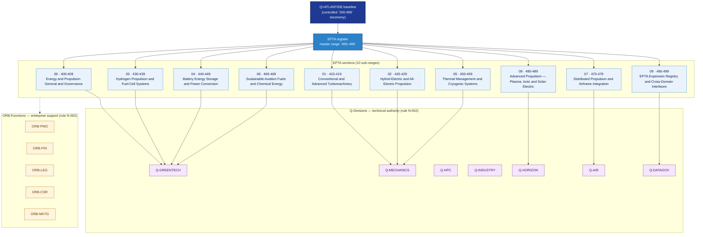

# 400–499 EPTA — Energy and Propulsion Technology Architecture

## 1. Purpose

Energy and propulsion technology architecture band covering governance and taxonomy, conventional and advanced turbomachinery, hybrid/all-electric propulsion, hydrogen propulsion and fuel-cell systems, battery energy storage and power conversion, thermal management and cryogenic systems, sustainable aviation fuels and chemical energy, distributed propulsion and airframe integration, advanced propulsion concepts (plasma, ionic, solar-electric), and cross-domain expansion interfaces.

This folder is part of the **ATLAS-1000** register, a subpart of the controlled **Q+ATLANTIDE** baseline[^baseline][^n001]. Bands classify technologies, Q-Divisions provide technical authority, and ORB-Functions provide enterprise support[^n002].

## 2. Glossary of Terms & Acronyms

| Term / Acronym | Expansion | Meaning in this band |
|---|---|---|
| EPTA | Energy and Propulsion Technology Architecture | Architecture band `400-499`. |
| BLI | Boundary-Layer Ingestion | Propulsion–airframe integration technique. |
| BMS | Battery Management System | Electronic system monitoring and controlling battery cells. |
| CSDB | Common Source DataBase | S1000D technical-publication data environment. |
| FADEC | Full Authority Digital Engine/Electronic Controller | Propulsion control system. |
| FC | Fuel Cell | Electrochemical device converting hydrogen + O₂ to electricity. |
| HPC | High-Performance Computing | Used for propulsion simulation and optimization. |
| HVDC | High Voltage Direct Current | Electrical distribution bus for hybrid/electric propulsion. |
| LH₂ | Liquid Hydrogen | Cryogenic hydrogen fuel / energy carrier. |
| MHD | Magnetohydrodynamic | Field-assisted propulsion concept. |
| SAF | Sustainable Aviation Fuel | Drop-in or non-drop-in low-carbon aviation fuel. |
| SoC | State of Charge | Battery energy level metric. |
| SoH | State of Health | Battery condition/degradation metric. |
| Q+ATLANTIDE | Controlled baseline for the `000-999` architecture-band taxonomy. | Parent baseline of this register. |
| ATLAS-1000 | Umbrella register of the 10 architectures inside Q+ATLANTIDE. | Subpart of Q+ATLANTIDE; not a numeric band. |
| Q-Division | Technical authority unit (e.g. Q-GREENTECH, Q-MECHANICS, Q-HPC). | Owns architecture decisions inside a band (rule N-002). |
| ORB | Organizational Resource Backbone — enterprise support functions. | Provides enterprise-side support to bands (rule N-002). |
| LC | Lifecycle phase / acceptance gate | Used across SSOT/LC01–LC14. |

Cross-reference the full Q+ATLANTIDE acronym set at [`organization/Q+ATLANTIDE.md` §2](../../organization/Q+ATLANTIDE.md#2-acronyms)[^glossary].

## 3. Architecture Table

Sub-ranges within this band, sourced from the Q+ATLANTIDE controlled baseline[^baseline] §3 *Consolidated Architecture Table*[^table].

| Code range | Section | Section title | Subject | Subject title | Primary focus | Primary Q-Division | Support Q-Divisions | ORB support |
|---:|---:|---|---:|---|---|---|---|---|
| 400–409 | 00 | Energía y Propulsión — General y Gobernanza | 00 | General Information | Taxonomy, requirements governance, safety/certification basis, classification, p… | Q-GREENTECH | Q-MECHANICS, Q-DATAGOV, Q-INDUSTRY, Q-HORIZON | ORB-PMO, ORB-LEG |
| 410–419 | 01 | Turbomaquinaria Convencional y Avanzada | 00 | General Information | Gas turbine core, compressors/fans/bypass, combustors, turbines/nozzles/exhaust,… | Q-MECHANICS | Q-GREENTECH, Q-DATAGOV, Q-AIR, Q-INDUSTRY | ORB-PMO, ORB-FIN |
| 420–429 | 02 | Propulsión Híbrido-Eléctrica y Totalmente Eléctrica | 00 | General Information | Electric propulsion architecture, electric motors/drives, inverters/converters/p… | Q-MECHANICS | Q-GREENTECH, Q-AIR, Q-HPC, Q-INDUSTRY | ORB-PMO, ORB-FIN, ORB-CSR |
| 430–439 | 03 | Propulsión por Hidrógeno y Sistemas de Pilas de Combustible | 00 | General Information | LH2 storage/cryogenic tanks, hydrogen distribution/conditioning/valves, fuel-cel… | Q-GREENTECH | Q-MECHANICS, Q-AIR, Q-HORIZON, Q-INDUSTRY | ORB-PMO, ORB-LEG, ORB-CSR |
| 440–449 | 04 | Almacenamiento de Energía en Baterías y Conversión de Potencia | 00 | General Information | Battery cell chemistry/module architecture, battery pack design/structural integ… | Q-GREENTECH | Q-MECHANICS, Q-AIR, Q-HPC, Q-INDUSTRY | ORB-PMO, ORB-FIN, ORB-CSR |
| 450–459 | 05 | Gestión Térmica y Sistemas Criogénicos | 00 | General Information | Heat exchangers/cold plates/thermal buses, liquid cooling loops/pumps, air cooli… | Q-MECHANICS | Q-GREENTECH, Q-AIR, Q-STRUCTURES, Q-INDUSTRY | ORB-PMO, ORB-LEG |
| 460–469 | 06 | Combustibles de Aviación Sostenibles y Energía Química | 00 | General Information | SAF types/feedstocks/fuel pathways, drop-in fuel compatibility/material effects,… | Q-GREENTECH | Q-MECHANICS, Q-AIR, Q-DATAGOV, Q-INDUSTRY | ORB-PMO, ORB-CSR, ORB-LEG |
| 470–479 | 07 | Propulsión Distribuida e Integración con la Célula | 00 | General Information | Propulsor placement/airframe coupling, boundary-layer ingestion integration, win… | Q-AIR | Q-GREENTECH, Q-MECHANICS, Q-STRUCTURES, Q-HPC | ORB-PMO, ORB-FIN, ORB-LEG |
| 480–489 | 08 | Propulsión Avanzada — Plasma, Iónica y Solar-Eléctrica | 00 | General Information | Plasma propulsion, ionic/electrostatic propulsion, solar-electric propulsion/ene… | Q-HORIZON | Q-GREENTECH, Q-HPC, Q-SPACE, Q-DATAGOV | ORB-PMO, ORB-LEG, ORB-MKTG |
| 490–499 | 09 | Registro de Expansión EPTA e Interfaces entre Dominios | 00 | General Information | Cross-domain interfaces to ATLAS aircraft systems, STA space systems, DTCEC digi… | Q-DATAGOV | Q-GREENTECH, Q-HORIZON, Q-MECHANICS, Q-AIR | ORB-PMO, ORB-LEG |

## 4. Interfaces Diagram

*Solid arrows denote primary Q-Division ownership (rule N-002); dotted arrows denote ORB enterprise support.*

## 5. Footprint

| Metric | Value |
|---|---|
| Master range | `400–499` |
| Sub-ranges | 10 |
| Architecture code | `EPTA` |
| Governance class | `baseline` |
| Restricted band | No |
| Primary Q-Divisions | Q-GREENTECH, Q-MECHANICS, Q-HPC, Q-INDUSTRY, Q-HORIZON |
| Folder path | `Q+ATLANTIDE/400-499_EPTA/` |
| Documents | `README.md` (this file) + 10 section `README.md` indexes |
| Subsections | 100 (10 per section) |
| Parent baseline | [`organization/Q+ATLANTIDE.md`](../../organization/Q+ATLANTIDE.md) |
| Register subpart | ATLAS-1000 |

## Governance

Governed by [`organization/Q+ATLANTIDE.md`](../../organization/Q+ATLANTIDE.md)[^baseline]. Templates declared in this band must populate `architecture_band`, `architecture_code = EPTA`, `q_division_owner` and `orb_function_support` per the Templates System[^templates]. The No-AAA Rule[^n004] applies.

## 6. References & Citations

[^baseline]: **Q+ATLANTIDE controlled baseline (v1.0.0)** — [`organization/Q+ATLANTIDE.md`](../../organization/Q+ATLANTIDE.md). Defines the controlled `000-999` architecture-band taxonomy and the ATLAS-1000 register subpart.

[^table]: **§3 — Consolidated Architecture Table** — [`organization/Q+ATLANTIDE.md` §3](../../organization/Q+ATLANTIDE.md#3-consolidated-architecture-table).

[^glossary]: **§2 — Acronyms** — [`organization/Q+ATLANTIDE.md` §2](../../organization/Q+ATLANTIDE.md#2-acronyms).

[^templates]: **§5 — Templates System** — [`organization/Q+ATLANTIDE.md` §5](../../organization/Q+ATLANTIDE.md#5-templates-system). Mandatory template header fields, naming rules and lifecycle integration.

[^n001]: **Note N-001** — Q+ATLANTIDE (with its ATLAS-1000 register subpart) is a taxonomy and traceability ecosystem, not an organization chart. See [`organization/Q+ATLANTIDE.md` §4](../../organization/Q+ATLANTIDE.md#4-notes).

[^n002]: **Note N-002** — Architecture bands classify technologies; Q-Divisions provide technical authority; ORB-Functions provide enterprise support. See [`organization/Q+ATLANTIDE.md` §4](../../organization/Q+ATLANTIDE.md#4-notes).

[^n003]: **Note N-003** — The `000-999` range is controlled; `ATLAS-1000` is the umbrella name, not an additional numeric band. See [`organization/Q+ATLANTIDE.md` §4](../../organization/Q+ATLANTIDE.md#4-notes).

[^n004]: **Note N-004 (No-AAA Rule)** — "AAA" is not a valid domain, division, architecture, interface or function in this baseline. See [`organization/Q+ATLANTIDE.md` §4](../../organization/Q+ATLANTIDE.md#4-notes).

[^repo]: **Repository root README** — [`README.md`](../../README.md). Top-level entry point referencing the Q+ATLANTIDE baseline and the ATLAS-1000 register subpart.
