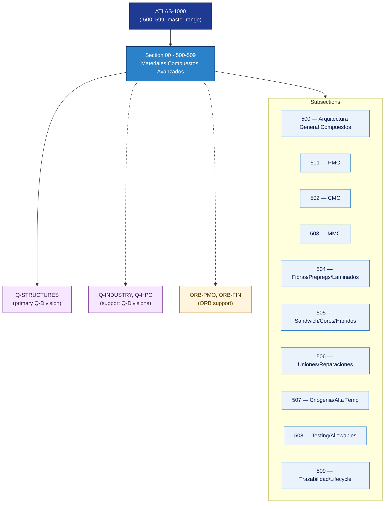

# AMTA 500-509 · Section 00 — Materiales Compuestos Avanzados

## 1. Purpose

Section-level index for *Materiales Compuestos Avanzados* (`500-509`) within the AMTA band. Arquitectura general de compuestos, matrices poliméricas PMC, matrices cerámicas CMC, matrices metálicas MMC, fibras y prepregs, estructuras sandwich, uniones y reparaciones, comportamiento en extremos criogénicos/altas temperaturas, testing y qualification, y trazabilidad del ciclo de vida.

This section is part of the **ATLAS-1000** register, a subpart of the controlled **Q+ATLANTIDE** baseline[^baseline][^n001]. Bands classify technologies, Q-Divisions provide technical authority and ORB-Functions provide enterprise support[^n002].

## 2. Scope

- Aggregates the subsections within the `500-509` code range listed in §3.
- Inherits Q-Division authority and ORB support from the parent row in [`../README.md` §3](../README.md#3-architecture-table)[^archtable].
- Each subsection folder contains its own `README.md` (subsection index) and may contain Overview and subsubject documents.

## 3. Subsection Index

| Code | Title | Folder | Status |
|---:|---|---|---|
| `500` | Arquitectura General de Materiales Compuestos Avanzados | [`./500_Arquitectura-General-de-Materiales-Compuestos-Avanzados/`](./500_Arquitectura-General-de-Materiales-Compuestos-Avanzados/) | reserved |
| `501` | Compuestos de Matriz Polimérica PMC | [`./501_Compuestos-de-Matriz-Polimerica-PMC/`](./501_Compuestos-de-Matriz-Polimerica-PMC/) | reserved |
| `502` | Compuestos de Matriz Cerámica CMC | [`./502_Compuestos-de-Matriz-Ceramica-CMC/`](./502_Compuestos-de-Matriz-Ceramica-CMC/) | reserved |
| `503` | Compuestos de Matriz Metálica MMC | [`./503_Compuestos-de-Matriz-Metalica-MMC/`](./503_Compuestos-de-Matriz-Metalica-MMC/) | reserved |
| `504` | Fibras, Refuerzos, Prepregs y Laminados | [`./504_Fibras-Refuerzos-Prepregs-y-Laminados/`](./504_Fibras-Refuerzos-Prepregs-y-Laminados/) | reserved |
| `505` | Sandwich Structures, Cores y Paneles Híbridos | [`./505_Sandwich-Structures-Cores-y-Paneles-Hibridos/`](./505_Sandwich-Structures-Cores-y-Paneles-Hibridos/) | reserved |
| `506` | Uniones, Reparaciones y Bonding Controlado | [`./506_Uniones-Reparaciones-y-Bonding-Controlado/`](./506_Uniones-Reparaciones-y-Bonding-Controlado/) | reserved |
| `507` | Criogenia, Alta Temperatura y Ambientes Extremos | [`./507_Criogenia-Alta-Temperatura-y-Ambientes-Extremos/`](./507_Criogenia-Alta-Temperatura-y-Ambientes-Extremos/) | reserved |
| `508` | Testing, Allowables y Qualification Evidence | [`./508_Testing-Allowables-y-Qualification-Evidence/`](./508_Testing-Allowables-y-Qualification-Evidence/) | reserved |
| `509` | Trazabilidad, Gobernanza y Lifecycle de Compuestos | [`./509_Trazabilidad-Gobernanza-y-Lifecycle-de-Compuestos/`](./509_Trazabilidad-Gobernanza-y-Lifecycle-de-Compuestos/) | reserved |

## 4. Interfaces Diagram

*Solid arrows show parent→section→subsection ownership and primary Q-Division authority; dotted arrows show support Q-Divisions and ORB enterprise support.*

## 5. Footprint

| Metric | Value |
|---|---|
| Architecture | `AMTA` — Advanced Material, Bio & Nanotechnology Architecture |
| Master range | `500–599` |
| Code range | `500-509` |
| Section | `00` — Materiales Compuestos Avanzados |
| Subsections | 10 reserved |
| Primary Q-Division | Q-STRUCTURES[^qdiv] |
| Support Q-Divisions | Q-INDUSTRY, Q-HPC |
| ORB support | ORB-PMO, ORB-FIN |
| Governance class | `baseline`[^gov] |
| Folder path | `Q+ATLANTIDE/500-599_AMTA/500-509_Materiales-Compuestos-Avanzados/` |
| Document | `README.md` (this file) |
| Parent architecture | [`../README.md`](../README.md) |
| Parent baseline | [`organization/Q+ATLANTIDE.md`](../../../../organization/Q+ATLANTIDE.md) |

## Governance

Governed by [`organization/Q+ATLANTIDE.md`](../../../../organization/Q+ATLANTIDE.md)[^baseline]. All subsections under this section inherit `architecture_code = AMTA`, `primary_q_division = Q-STRUCTURES` and `governance_class = baseline` from this section header. Templates declared in this section must populate `architecture_band`, `architecture_code = AMTA`, `q_division_owner` and `orb_function_support` per the Templates System[^templates]. The No-AAA Rule[^n004] applies.

## 6. References & Citations

[^baseline]: **Q+ATLANTIDE controlled baseline (v1.0.0)** — [`organization/Q+ATLANTIDE.md`](../../../../organization/Q+ATLANTIDE.md). Defines the controlled `000-999` architecture-band taxonomy and the ATLAS-1000 register subpart.

[^archtable]: **§3 — Architecture Table (parent)** — [`../README.md` §3](../README.md#3-architecture-table). Source of authority for primary/support Q-Divisions and ORB support of this section.

[^qdiv]: **Q-Division authority** — [`organization/Q-Divisions/`](../../../../organization/Q-Divisions/). Technical-authority units for the Q+ATLANTIDE baseline.

[^gov]: **Governance class** — `baseline` denotes documents under controlled change management within the Q+ATLANTIDE baseline.

[^templates]: **§5 — Templates System** — [`organization/Q+ATLANTIDE.md` §5](../../../../organization/Q+ATLANTIDE.md#5-templates-system).

[^n001]: **Note N-001** — Q+ATLANTIDE (with its ATLAS-1000 register subpart) is a taxonomy and traceability ecosystem, not an organization chart. See [`organization/Q+ATLANTIDE.md` §4](../../../../organization/Q+ATLANTIDE.md#4-notes).

[^n002]: **Note N-002** — Architecture bands classify technologies; Q-Divisions provide technical authority; ORB-Functions provide enterprise support. See [`organization/Q+ATLANTIDE.md` §4](../../../../organization/Q+ATLANTIDE.md#4-notes).

[^n004]: **Note N-004 (No-AAA Rule)** — "AAA" is not a valid domain, division, architecture, interface or function in this baseline. See [`organization/Q+ATLANTIDE.md` §4](../../../../organization/Q+ATLANTIDE.md#4-notes).
