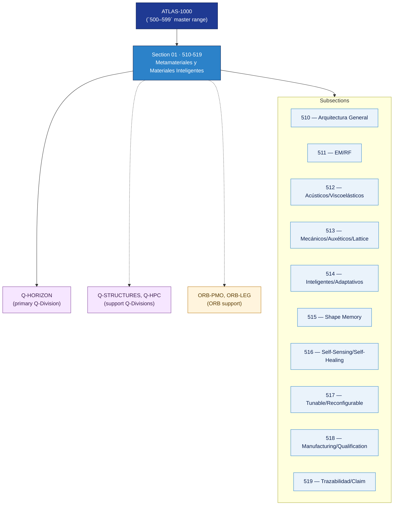

# AMTA 510-519 · Section 01 — Metamateriales y Materiales Inteligentes

## 1. Purpose

Section-level index for *Metamateriales y Materiales Inteligentes* (`510-519`) within the AMTA band. Arquitectura general, metamateriales EM y RF, metamateriales acústicos y viscoelásticos, metamateriales mecánicos auxéticos y lattice, materiales inteligentes adaptativos, shape-memory, self-sensing/self-healing, tunable/reconfigurable materials, validación y qualification, y trazabilidad.

This section is part of the **ATLAS-1000** register, a subpart of the controlled **Q+ATLANTIDE** baseline[^baseline][^n001]. Bands classify technologies, Q-Divisions provide technical authority and ORB-Functions provide enterprise support[^n002].

## 2. Scope

- Aggregates the subsections within the `510-519` code range listed in §3.
- Inherits Q-Division authority and ORB support from the parent row in [`../README.md` §3](../README.md#3-architecture-table)[^archtable].
- Each subsection folder contains its own `README.md` (subsection index) and may contain Overview and subsubject documents.

## 3. Subsection Index

| Code | Title | Folder | Status |
|---:|---|---|---|
| `510` | Arquitectura General de Metamateriales y Smart Materials | [`./510_Arquitectura-General-de-Metamateriales-y-Smart-Materials/`](./510_Arquitectura-General-de-Metamateriales-y-Smart-Materials/) | reserved |
| `511` | Metamateriales Electromagnéticos y RF | [`./511_Metamateriales-Electromagneticos-y-RF/`](./511_Metamateriales-Electromagneticos-y-RF/) | reserved |
| `512` | Metamateriales Acústicos y Viscoelásticos | [`./512_Metamateriales-Acusticos-y-Vibroelasticos/`](./512_Metamateriales-Acusticos-y-Vibroelasticos/) | reserved |
| `513` | Metamateriales Mecánicos Auxéticos y Lattice | [`./513_Metamateriales-Mecanicos-Auxeticos-y-Lattice/`](./513_Metamateriales-Mecanicos-Auxeticos-y-Lattice/) | reserved |
| `514` | Materiales Inteligentes Sensibles y Adaptativos | [`./514_Materiales-Inteligentes-Sensibles-y-Adaptativos/`](./514_Materiales-Inteligentes-Sensibles-y-Adaptativos/) | reserved |
| `515` | Shape Memory Materials y Actuación Estructural | [`./515_Shape-Memory-Materials-y-Actuacion-Estructural/`](./515_Shape-Memory-Materials-y-Actuacion-Estructural/) | reserved |
| `516` | Self-Sensing, Self-Healing y Structural Response | [`./516_Self-Sensing-Self-Healing-y-Structural-Response/`](./516_Self-Sensing-Self-Healing-y-Structural-Response/) | reserved |
| `517` | Tunable, Reconfigurable and Programmable Materials | [`./517_Tunable-Reconfigurable-and-Programmable-Materials/`](./517_Tunable-Reconfigurable-and-Programmable-Materials/) | reserved |
| `518` | Manufacturing, Validation y Qualification Boundaries | [`./518_Manufacturing-Validation-y-Qualification-Boundaries/`](./518_Manufacturing-Validation-y-Qualification-Boundaries/) | reserved |
| `519` | Trazabilidad, Gobernanza y Claim Discipline | [`./519_Trazabilidad-Gobernanza-y-Claim-Discipline/`](./519_Trazabilidad-Gobernanza-y-Claim-Discipline/) | reserved |

## 4. Interfaces Diagram

*Solid arrows show parent→section→subsection ownership and primary Q-Division authority; dotted arrows show support Q-Divisions and ORB enterprise support.*

## 5. Footprint

| Metric | Value |
|---|---|
| Architecture | `AMTA` — Advanced Material, Bio & Nanotechnology Architecture |
| Master range | `500–599` |
| Code range | `510-519` |
| Section | `01` — Metamateriales y Materiales Inteligentes |
| Subsections | 10 reserved |
| Primary Q-Division | Q-HORIZON[^qdiv] |
| Support Q-Divisions | Q-STRUCTURES, Q-HPC |
| ORB support | ORB-PMO, ORB-LEG |
| Governance class | `baseline`[^gov] |
| Folder path | `Q+ATLANTIDE/500-599_AMTA/510-519_Metamateriales-y-Materiales-Inteligentes/` |
| Document | `README.md` (this file) |
| Parent architecture | [`../README.md`](../README.md) |
| Parent baseline | [`organization/Q+ATLANTIDE.md`](../../../../organization/Q+ATLANTIDE.md) |

## Governance

Governed by [`organization/Q+ATLANTIDE.md`](../../../../organization/Q+ATLANTIDE.md)[^baseline]. All subsections under this section inherit `architecture_code = AMTA`, `primary_q_division = Q-HORIZON` and `governance_class = baseline` from this section header. Templates declared in this section must populate `architecture_band`, `architecture_code = AMTA`, `q_division_owner` and `orb_function_support` per the Templates System[^templates]. The No-AAA Rule[^n004] applies.

## 6. References & Citations

[^baseline]: **Q+ATLANTIDE controlled baseline (v1.0.0)** — [`organization/Q+ATLANTIDE.md`](../../../../organization/Q+ATLANTIDE.md). Defines the controlled `000-999` architecture-band taxonomy and the ATLAS-1000 register subpart.

[^archtable]: **§3 — Architecture Table (parent)** — [`../README.md` §3](../README.md#3-architecture-table). Source of authority for primary/support Q-Divisions and ORB support of this section.

[^qdiv]: **Q-Division authority** — [`organization/Q-Divisions/`](../../../../organization/Q-Divisions/). Technical-authority units for the Q+ATLANTIDE baseline.

[^gov]: **Governance class** — `baseline` denotes documents under controlled change management within the Q+ATLANTIDE baseline.

[^templates]: **§5 — Templates System** — [`organization/Q+ATLANTIDE.md` §5](../../../../organization/Q+ATLANTIDE.md#5-templates-system).

[^n001]: **Note N-001** — Q+ATLANTIDE (with its ATLAS-1000 register subpart) is a taxonomy and traceability ecosystem, not an organization chart. See [`organization/Q+ATLANTIDE.md` §4](../../../../organization/Q+ATLANTIDE.md#4-notes).

[^n002]: **Note N-002** — Architecture bands classify technologies; Q-Divisions provide technical authority; ORB-Functions provide enterprise support. See [`organization/Q+ATLANTIDE.md` §4](../../../../organization/Q+ATLANTIDE.md#4-notes).

[^n004]: **Note N-004 (No-AAA Rule)** — "AAA" is not a valid domain, division, architecture, interface or function in this baseline. See [`organization/Q+ATLANTIDE.md` §4](../../../../organization/Q+ATLANTIDE.md#4-notes).
