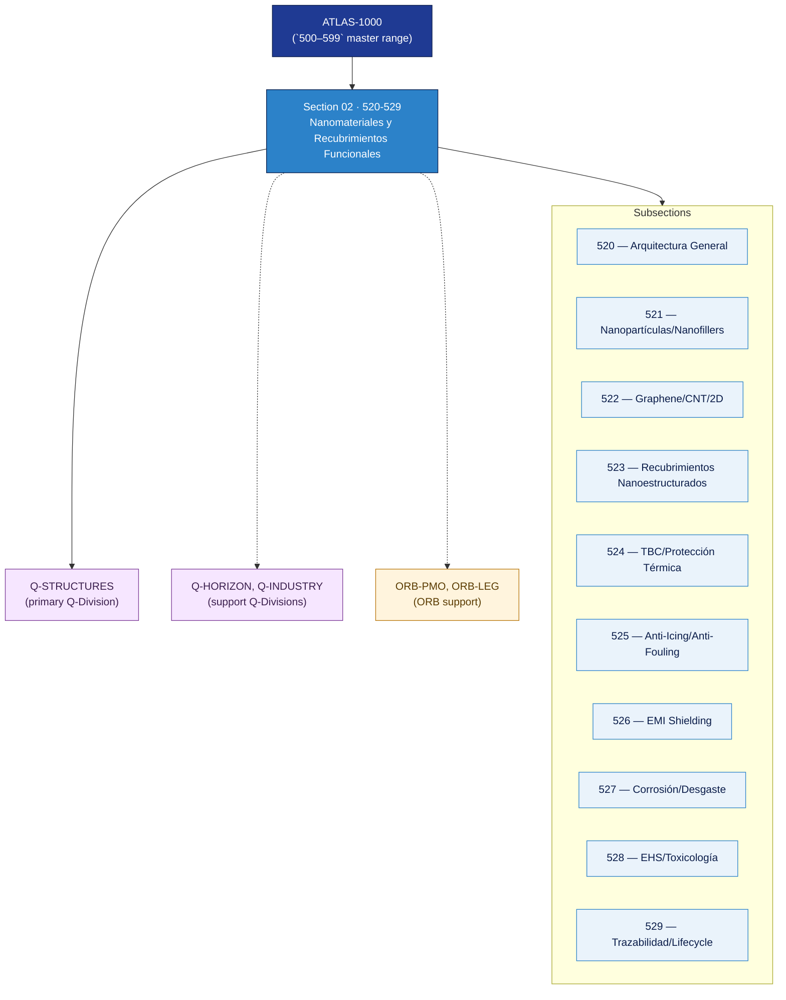

# AMTA 520-529 · Section 02 — Nanomateriales y Recubrimientos Funcionales

## 1. Purpose

Section-level index for *Nanomateriales y Recubrimientos Funcionales* (`520-529`) within the AMTA band. Arquitectura general, nanopartículas/nanofillers/dispersión, grafeno/CNT/materiales 2D, recubrimientos nanoestructurados, thermal barrier coatings, anti-icing/anti-fouling, blindaje EM/EMI, protección contra corrosión/erosión, EHS/toxicología, y trazabilidad del ciclo de vida de coatings.

This section is part of the **ATLAS-1000** register, a subpart of the controlled **Q+ATLANTIDE** baseline[^baseline][^n001]. Bands classify technologies, Q-Divisions provide technical authority and ORB-Functions provide enterprise support[^n002].

## 2. Scope

- Aggregates the subsections within the `520-529` code range listed in §3.
- Inherits Q-Division authority and ORB support from the parent row in [`../README.md` §3](../README.md#3-architecture-table)[^archtable].
- Each subsection folder contains its own `README.md` (subsection index) and may contain Overview and subsubject documents.

## 3. Subsection Index

| Code | Title | Folder | Status |
|---:|---|---|---|
| `520` | Arquitectura General de Nanomateriales y Coatings | [`./520_Arquitectura-General-de-Nanomateriales-y-Coatings/`](./520_Arquitectura-General-de-Nanomateriales-y-Coatings/) | reserved |
| `521` | Nanopartículas, Nanofillers y Dispersión Control | [`./521_Nanoparticulas-Nanofillers-y-Dispersion-Control/`](./521_Nanoparticulas-Nanofillers-y-Dispersion-Control/) | reserved |
| `522` | Graphene, CNT y Materiales 2D | [`./522_Graphene-CNT-y-Materiales-2D/`](./522_Graphene-CNT-y-Materiales-2D/) | reserved |
| `523` | Recubrimientos Nanoestructurados y Funcionales | [`./523_Recubrimientos-Nanoestructurados-y-Funcionales/`](./523_Recubrimientos-Nanoestructurados-y-Funcionales/) | reserved |
| `524` | Thermal Barrier Coatings y Protección Térmica | [`./524_Thermal-Barrier-Coatings-y-Proteccion-Termica/`](./524_Thermal-Barrier-Coatings-y-Proteccion-Termica/) | reserved |
| `525` | Anti-Icing, Anti-Fouling y Self-Cleaning Surfaces | [`./525_Anti-Icing-Anti-Fouling-y-Self-Cleaning-Surfaces/`](./525_Anti-Icing-Anti-Fouling-y-Self-Cleaning-Surfaces/) | reserved |
| `526` | Conductive, EMI Shielding y Surface Electronics | [`./526_Conductive-EMI-Shielding-y-Surface-Electronics/`](./526_Conductive-EMI-Shielding-y-Surface-Electronics/) | reserved |
| `527` | Corrosión, Desgaste, Erosión y Environmental Protection | [`./527_Corrosion-Wear-Erosion-y-Environmental-Protection/`](./527_Corrosion-Wear-Erosion-y-Environmental-Protection/) | reserved |
| `528` | EHS, Toxicología, Qualification y Handling Boundaries | [`./528_EHS-Toxicology-Qualification-y-Handling-Boundaries/`](./528_EHS-Toxicology-Qualification-y-Handling-Boundaries/) | reserved |
| `529` | Trazabilidad, Gobernanza y Lifecycle de Coatings | [`./529_Trazabilidad-Gobernanza-y-Lifecycle-de-Coatings/`](./529_Trazabilidad-Gobernanza-y-Lifecycle-de-Coatings/) | reserved |

## 4. Interfaces Diagram

*Solid arrows show parent→section→subsection ownership and primary Q-Division authority; dotted arrows show support Q-Divisions and ORB enterprise support.*

## 5. Footprint

| Metric | Value |
|---|---|
| Architecture | `AMTA` — Advanced Material, Bio & Nanotechnology Architecture |
| Master range | `500–599` |
| Code range | `520-529` |
| Section | `02` — Nanomateriales y Recubrimientos Funcionales |
| Subsections | 10 reserved |
| Primary Q-Division | Q-STRUCTURES[^qdiv] |
| Support Q-Divisions | Q-HORIZON, Q-INDUSTRY |
| ORB support | ORB-PMO, ORB-LEG |
| Governance class | `baseline`[^gov] |
| Folder path | `Q+ATLANTIDE/500-599_AMTA/520-529_Nanomateriales-y-Recubrimientos-Funcionales/` |
| Document | `README.md` (this file) |
| Parent architecture | [`../README.md`](../README.md) |
| Parent baseline | [`organization/Q+ATLANTIDE.md`](../../../../organization/Q+ATLANTIDE.md) |

## Governance

Governed by [`organization/Q+ATLANTIDE.md`](../../../../organization/Q+ATLANTIDE.md)[^baseline]. All subsections under this section inherit `architecture_code = AMTA`, `primary_q_division = Q-STRUCTURES` and `governance_class = baseline` from this section header. Templates declared in this section must populate `architecture_band`, `architecture_code = AMTA`, `q_division_owner` and `orb_function_support` per the Templates System[^templates]. The No-AAA Rule[^n004] applies.

## 6. References & Citations

[^baseline]: **Q+ATLANTIDE controlled baseline (v1.0.0)** — [`organization/Q+ATLANTIDE.md`](../../../../organization/Q+ATLANTIDE.md). Defines the controlled `000-999` architecture-band taxonomy and the ATLAS-1000 register subpart.

[^archtable]: **§3 — Architecture Table (parent)** — [`../README.md` §3](../README.md#3-architecture-table). Source of authority for primary/support Q-Divisions and ORB support of this section.

[^qdiv]: **Q-Division authority** — [`organization/Q-Divisions/`](../../../../organization/Q-Divisions/). Technical-authority units for the Q+ATLANTIDE baseline.

[^gov]: **Governance class** — `baseline` denotes documents under controlled change management within the Q+ATLANTIDE baseline.

[^templates]: **§5 — Templates System** — [`organization/Q+ATLANTIDE.md` §5](../../../../organization/Q+ATLANTIDE.md#5-templates-system).

[^n001]: **Note N-001** — Q+ATLANTIDE (with its ATLAS-1000 register subpart) is a taxonomy and traceability ecosystem, not an organization chart. See [`organization/Q+ATLANTIDE.md` §4](../../../../organization/Q+ATLANTIDE.md#4-notes).

[^n002]: **Note N-002** — Architecture bands classify technologies; Q-Divisions provide technical authority; ORB-Functions provide enterprise support. See [`organization/Q+ATLANTIDE.md` §4](../../../../organization/Q+ATLANTIDE.md#4-notes).

[^n004]: **Note N-004 (No-AAA Rule)** — "AAA" is not a valid domain, division, architecture, interface or function in this baseline. See [`organization/Q+ATLANTIDE.md` §4](../../../../organization/Q+ATLANTIDE.md#4-notes).
