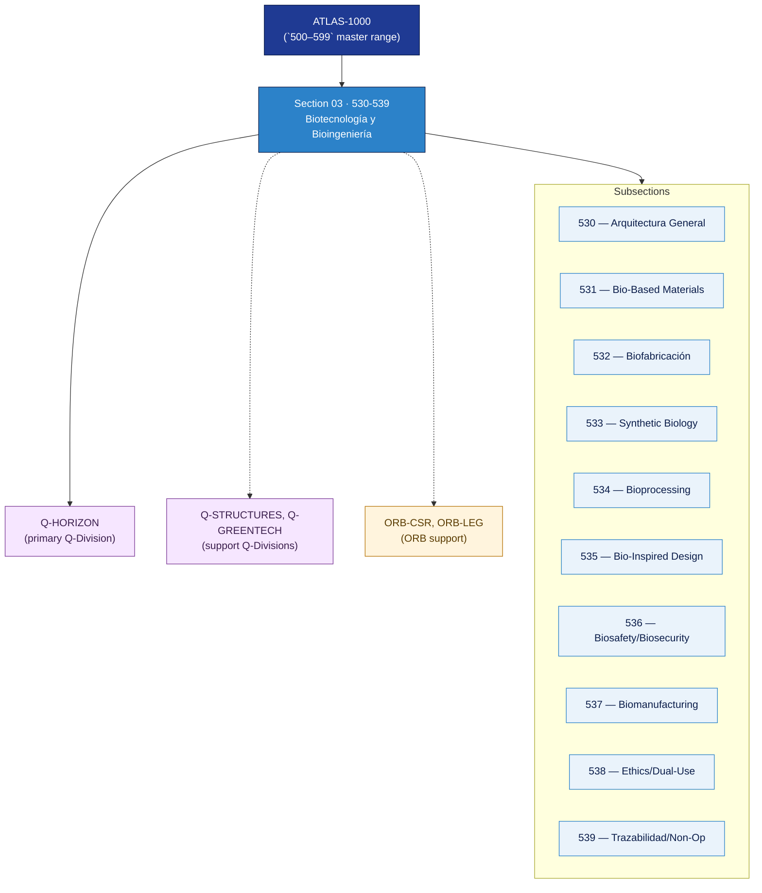

# AMTA 530-539 · Section 03 — Biotecnología y Bioingeniería

## 1. Purpose

Section-level index for *Biotecnología y Bioingeniería* (`530-539`) within the AMTA band. Arquitectura general, materiales bio-based, biofabricación y bioprocesos, biología sintética (conceptual y fronteras gobernadas), bioprocessing industrial, bio-inspired design, bioseguridad y bioseguridad, biomanufacturing y supply chain, ética regulatoria y dual-use, y trazabilidad con fronteras no operacionales.

This section is part of the **ATLAS-1000** register, a subpart of the controlled **Q+ATLANTIDE** baseline[^baseline][^n001]. Bands classify technologies, Q-Divisions provide technical authority and ORB-Functions provide enterprise support[^n002].

## 2. Scope

- Aggregates the subsections within the `530-539` code range listed in §3.
- Inherits Q-Division authority and ORB support from the parent row in [`../README.md` §3](../README.md#3-architecture-table)[^archtable].
- Each subsection folder contains its own `README.md` (subsection index) and may contain Overview and subsubject documents.
- **Dual-use boundary applies**: bioengineering nodes remain non-operational unless separately authorized per the AMTA dual-use boundary rule.

## 3. Subsection Index

| Code | Title | Folder | Status |
|---:|---|---|---|
| `530` | Arquitectura General de Biotecnología y Bioingeniería | [`./530_Arquitectura-General-de-Biotecnologia-y-Bioingenieria/`](./530_Arquitectura-General-de-Biotecnologia-y-Bioingenieria/) | reserved |
| `531` | Bio-Based Materials y Materiales Derivados | [`./531_Bio-Based-Materials-y-Materiales-Derivados/`](./531_Bio-Based-Materials-y-Materiales-Derivados/) | reserved |
| `532` | Biofabricación y Bioprocesos para Materiales | [`./532_Biofabricacion-y-Bioprocesos-para-Materiales/`](./532_Biofabricacion-y-Bioprocesos-para-Materiales/) | reserved |
| `533` | Synthetic Biology Conceptual y Governed Boundaries | [`./533_Synthetic-Biology-Conceptual-y-Governed-Boundaries/`](./533_Synthetic-Biology-Conceptual-y-Governed-Boundaries/) | reserved |
| `534` | Bioprocessing Industrial y Quality Control | [`./534_Bioprocessing-Industrial-y-Quality-Control/`](./534_Bioprocessing-Industrial-y-Quality-Control/) | reserved |
| `535` | Bio-Inspired Design y Biomimetic Engineering | [`./535_Bio-Inspired-Design-y-Biomimetic-Engineering/`](./535_Bio-Inspired-Design-y-Biomimetic-Engineering/) | reserved |
| `536` | Biosafety, Biosecurity y Containment Governance | [`./536_Biosafety-Biosecurity-y-Containment-Governance/`](./536_Biosafety-Biosecurity-y-Containment-Governance/) | reserved |
| `537` | Biomanufacturing Validation y Supply Chain Control | [`./537_Biomanufacturing-Validation-y-Supply-Chain-Control/`](./537_Biomanufacturing-Validation-y-Supply-Chain-Control/) | reserved |
| `538` | Regulatory Ethics y Dual-Use Risk Screening | [`./538_Regulatory-Ethics-y-Dual-Use-Risk-Screening/`](./538_Regulatory-Ethics-y-Dual-Use-Risk-Screening/) | reserved |
| `539` | Trazabilidad, Gobernanza y Non-Operational Boundaries | [`./539_Trazabilidad-Gobernanza-y-Non-Operational-Boundaries/`](./539_Trazabilidad-Gobernanza-y-Non-Operational-Boundaries/) | reserved |

## 4. Interfaces Diagram

*Solid arrows show parent→section→subsection ownership and primary Q-Division authority; dotted arrows show support Q-Divisions and ORB enterprise support.*

## 5. Footprint

| Metric | Value |
|---|---|
| Architecture | `AMTA` — Advanced Material, Bio & Nanotechnology Architecture |
| Master range | `500–599` |
| Code range | `530-539` |
| Section | `03` — Biotecnología y Bioingeniería |
| Subsections | 10 reserved |
| Primary Q-Division | Q-HORIZON[^qdiv] |
| Support Q-Divisions | Q-STRUCTURES, Q-GREENTECH |
| ORB support | ORB-CSR, ORB-LEG |
| Governance class | `baseline`[^gov] |
| Folder path | `Q+ATLANTIDE/500-599_AMTA/530-539_Biotecnologia-y-Bioingenieria/` |
| Document | `README.md` (this file) |
| Parent architecture | [`../README.md`](../README.md) |
| Parent baseline | [`organization/Q+ATLANTIDE.md`](../../../../organization/Q+ATLANTIDE.md) |

## Governance

Governed by [`organization/Q+ATLANTIDE.md`](../../../../organization/Q+ATLANTIDE.md)[^baseline]. All subsections under this section inherit `architecture_code = AMTA`, `primary_q_division = Q-HORIZON` and `governance_class = baseline` from this section header. Bioengineering and synthetic biology nodes are non-operational unless separately authorized per the AMTA dual-use boundary. Templates declared in this section must populate `architecture_band`, `architecture_code = AMTA`, `q_division_owner` and `orb_function_support` per the Templates System[^templates]. The No-AAA Rule[^n004] applies.

## 6. References & Citations

[^baseline]: **Q+ATLANTIDE controlled baseline (v1.0.0)** — [`organization/Q+ATLANTIDE.md`](../../../../organization/Q+ATLANTIDE.md). Defines the controlled `000-999` architecture-band taxonomy and the ATLAS-1000 register subpart.

[^archtable]: **§3 — Architecture Table (parent)** — [`../README.md` §3](../README.md#3-architecture-table). Source of authority for primary/support Q-Divisions and ORB support of this section.

[^qdiv]: **Q-Division authority** — [`organization/Q-Divisions/`](../../../../organization/Q-Divisions/). Technical-authority units for the Q+ATLANTIDE baseline.

[^gov]: **Governance class** — `baseline` denotes documents under controlled change management within the Q+ATLANTIDE baseline.

[^templates]: **§5 — Templates System** — [`organization/Q+ATLANTIDE.md` §5](../../../../organization/Q+ATLANTIDE.md#5-templates-system).

[^n001]: **Note N-001** — Q+ATLANTIDE (with its ATLAS-1000 register subpart) is a taxonomy and traceability ecosystem, not an organization chart. See [`organization/Q+ATLANTIDE.md` §4](../../../../organization/Q+ATLANTIDE.md#4-notes).

[^n002]: **Note N-002** — Architecture bands classify technologies; Q-Divisions provide technical authority; ORB-Functions provide enterprise support. See [`organization/Q+ATLANTIDE.md` §4](../../../../organization/Q+ATLANTIDE.md#4-notes).

[^n004]: **Note N-004 (No-AAA Rule)** — "AAA" is not a valid domain, division, architecture, interface or function in this baseline. See [`organization/Q+ATLANTIDE.md` §4](../../../../organization/Q+ATLANTIDE.md#4-notes).
