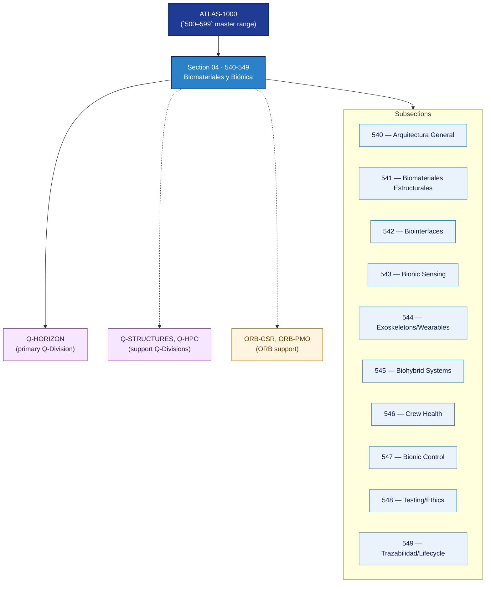

# AMTA 540-549 · Section 04 — Biomateriales y Biónica

## 1. Purpose

Section-level index for *Biomateriales y Biónica* (`540-549`) within the AMTA band. Arquitectura general, biomateriales estructurales y funcionales, biointerfaces y compatibilidad humano-sistema, bionic sensing y actuación, exoesqueletos/wearables/human augmentation, sistemas biohíbridos, materiales para salud de tripulación, control biónico y factores humanos, testing/ética/biocompatibilidad, y trazabilidad del ciclo de vida.

This section is part of the **ATLAS-1000** register, a subpart of the controlled **Q+ATLANTIDE** baseline[^baseline][^n001]. Bands classify technologies, Q-Divisions provide technical authority and ORB-Functions provide enterprise support[^n002].

## 2. Scope

- Aggregates the subsections within the `540-549` code range listed in §3.
- Inherits Q-Division authority and ORB support from the parent row in [`../README.md` §3](../README.md#3-architecture-table)[^archtable].
- Each subsection folder contains its own `README.md` (subsection index) and may contain Overview and subsubject documents.

## 3. Subsection Index

| Code | Title | Folder | Status |
|---:|---|---|---|
| `540` | Arquitectura General de Biomateriales y Biónica | [`./540_Arquitectura-General-de-Biomateriales-y-Bionica/`](./540_Arquitectura-General-de-Biomateriales-y-Bionica/) | reserved |
| `541` | Biomateriales Estructurales y Funcionales | [`./541_Biomateriales-Estructurales-y-Funcionales/`](./541_Biomateriales-Estructurales-y-Funcionales/) | reserved |
| `542` | Biointerfaces y Compatibilidad Humano-Sistema | [`./542_Biointerfaces-y-Compatibilidad-Humano-Sistema/`](./542_Biointerfaces-y-Compatibilidad-Humano-Sistema/) | reserved |
| `543` | Bionic Sensing y Actuation Concepts | [`./543_Bionic-Sensing-y-Actuation-Concepts/`](./543_Bionic-Sensing-y-Actuation-Concepts/) | reserved |
| `544` | Exoskeletons, Wearables y Human Augmentation Boundaries | [`./544_Exoskeletons-Wearables-y-Human-Augmentation-Boundaries/`](./544_Exoskeletons-Wearables-y-Human-Augmentation-Boundaries/) | reserved |
| `545` | Biohybrid Systems Conceptual and Assurance Limits | [`./545_Biohybrid-Systems-Conceptual-and-Assurance-Limits/`](./545_Biohybrid-Systems-Conceptual-and-Assurance-Limits/) | reserved |
| `546` | Crew Health Materials y Habitability Interfaces | [`./546_Crew-Health-Materials-y-Habitability-Interfaces/`](./546_Crew-Health-Materials-y-Habitability-Interfaces/) | reserved |
| `547` | Bionic Control, Human Factors y Operator Safety | [`./547_Bionic-Control-Human-Factors-y-Operator-Safety/`](./547_Bionic-Control-Human-Factors-y-Operator-Safety/) | reserved |
| `548` | Testing, Ethics, Biocompatibility y Assurance | [`./548_Testing-Ethics-Biocompatibility-y-Assurance/`](./548_Testing-Ethics-Biocompatibility-y-Assurance/) | reserved |
| `549` | Trazabilidad, Gobernanza y Lifecycle de Biónica | [`./549_Trazabilidad-Gobernanza-y-Lifecycle-de-Bionica/`](./549_Trazabilidad-Gobernanza-y-Lifecycle-de-Bionica/) | reserved |

## 4. Interfaces Diagram

*Solid arrows show parent→section→subsection ownership and primary Q-Division authority; dotted arrows show support Q-Divisions and ORB enterprise support.*

## 5. Footprint

| Metric | Value |
|---|---|
| Architecture | `AMTA` — Advanced Material, Bio & Nanotechnology Architecture |
| Master range | `500–599` |
| Code range | `540-549` |
| Section | `04` — Biomateriales y Biónica |
| Subsections | 10 reserved |
| Primary Q-Division | Q-HORIZON[^qdiv] |
| Support Q-Divisions | Q-STRUCTURES, Q-HPC |
| ORB support | ORB-CSR, ORB-PMO |
| Governance class | `baseline`[^gov] |
| Folder path | `Q+ATLANTIDE/500-599_AMTA/540-549_Biomateriales-y-Bionica/` |
| Document | `README.md` (this file) |
| Parent architecture | [`../README.md`](../README.md) |
| Parent baseline | [`organization/Q+ATLANTIDE.md`](../../../../organization/Q+ATLANTIDE.md) |

## Governance

Governed by [`organization/Q+ATLANTIDE.md`](../../../../organization/Q+ATLANTIDE.md)[^baseline]. All subsections under this section inherit `architecture_code = AMTA`, `primary_q_division = Q-HORIZON` and `governance_class = baseline` from this section header. Templates declared in this section must populate `architecture_band`, `architecture_code = AMTA`, `q_division_owner` and `orb_function_support` per the Templates System[^templates]. The No-AAA Rule[^n004] applies.

## 6. References & Citations

[^baseline]: **Q+ATLANTIDE controlled baseline (v1.0.0)** — [`organization/Q+ATLANTIDE.md`](../../../../organization/Q+ATLANTIDE.md). Defines the controlled `000-999` architecture-band taxonomy and the ATLAS-1000 register subpart.

[^archtable]: **§3 — Architecture Table (parent)** — [`../README.md` §3](../README.md#3-architecture-table). Source of authority for primary/support Q-Divisions and ORB support of this section.

[^qdiv]: **Q-Division authority** — [`organization/Q-Divisions/`](../../../../organization/Q-Divisions/). Technical-authority units for the Q+ATLANTIDE baseline.

[^gov]: **Governance class** — `baseline` denotes documents under controlled change management within the Q+ATLANTIDE baseline.

[^templates]: **§5 — Templates System** — [`organization/Q+ATLANTIDE.md` §5](../../../../organization/Q+ATLANTIDE.md#5-templates-system).

[^n001]: **Note N-001** — Q+ATLANTIDE (with its ATLAS-1000 register subpart) is a taxonomy and traceability ecosystem, not an organization chart. See [`organization/Q+ATLANTIDE.md` §4](../../../../organization/Q+ATLANTIDE.md#4-notes).

[^n002]: **Note N-002** — Architecture bands classify technologies; Q-Divisions provide technical authority; ORB-Functions provide enterprise support. See [`organization/Q+ATLANTIDE.md` §4](../../../../organization/Q+ATLANTIDE.md#4-notes).

[^n004]: **Note N-004 (No-AAA Rule)** — "AAA" is not a valid domain, division, architecture, interface or function in this baseline. See [`organization/Q+ATLANTIDE.md` §4](../../../../organization/Q+ATLANTIDE.md#4-notes).
