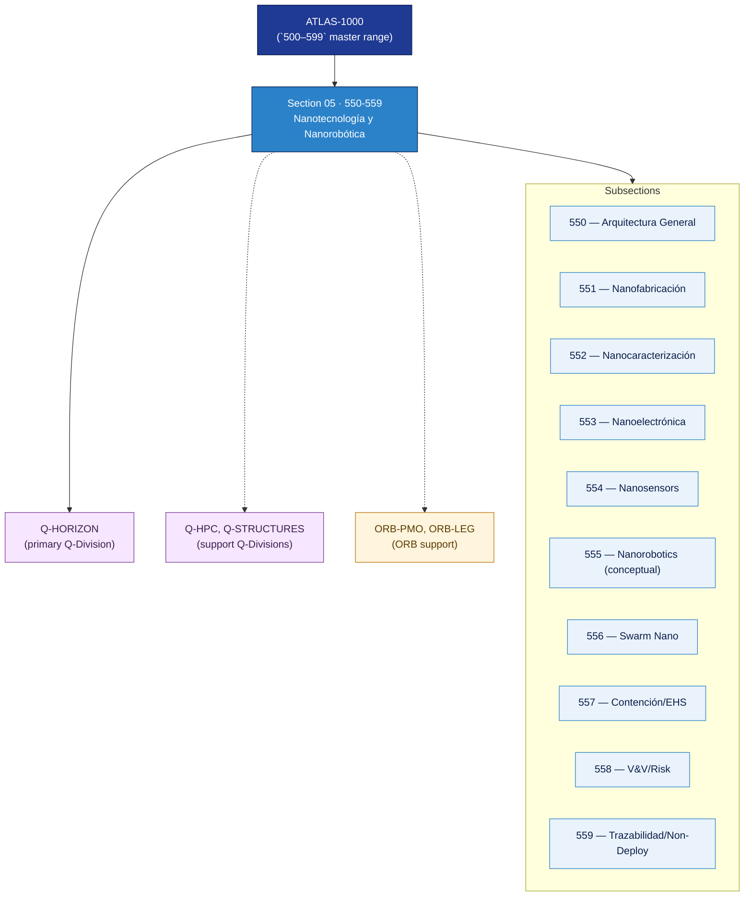

# AMTA 550-559 · Section 05 — Nanotecnología y Nanorobótica

## 1. Purpose

Section-level index for *Nanotecnología y Nanorobótica* (`550-559`) within the AMTA band. Arquitectura general, nanofabricación y nano-manufacturing, nanocaracterización y metrología, nanoelectrónica, nanosensores e instrumentación embebida, nanorobótica (conceptual y taxonomía no operacional), swarm nano (claim discipline), contención/EHS/bioseguridad, verificación y validación, y trazabilidad con fronteras de no-despliegue.

This section is part of the **ATLAS-1000** register, a subpart of the controlled **Q+ATLANTIDE** baseline[^baseline][^n001]. Bands classify technologies, Q-Divisions provide technical authority and ORB-Functions provide enterprise support[^n002].

## 2. Scope

- Aggregates the subsections within the `550-559` code range listed in §3.
- Inherits Q-Division authority and ORB support from the parent row in [`../README.md` §3](../README.md#3-architecture-table)[^archtable].
- Each subsection folder contains its own `README.md` (subsection index) and may contain Overview and subsubject documents.
- **Dual-use boundary applies**: nanorobotics nodes remain non-operational unless separately authorized per the AMTA dual-use boundary rule.

## 3. Subsection Index

| Code | Title | Folder | Status |
|---:|---|---|---|
| `550` | Arquitectura General de Nanotecnología y Nanorobótica | [`./550_Arquitectura-General-de-Nanotecnologia-y-Nanorobotica/`](./550_Arquitectura-General-de-Nanotecnologia-y-Nanorobotica/) | reserved |
| `551` | Nanofabricación y Nano-Manufacturing Methods | [`./551_Nanofabrication-y-Nano-Manufacturing-Methods/`](./551_Nanofabrication-y-Nano-Manufacturing-Methods/) | reserved |
| `552` | Nanocharacterization, Metrology y Inspection | [`./552_Nanocharacterization-Metrology-y-Inspection/`](./552_Nanocharacterization-Metrology-y-Inspection/) | reserved |
| `553` | Nanoelectronics y Nanoscale Device Concepts | [`./553_Nanoelectronics-y-Nanoscale-Device-Concepts/`](./553_Nanoelectronics-y-Nanoscale-Device-Concepts/) | reserved |
| `554` | Nanosensors y Embedded Nano Instrumentation | [`./554_Nanosensors-y-Embedded-Nano-Instrumentation/`](./554_Nanosensors-y-Embedded-Nano-Instrumentation/) | reserved |
| `555` | Nanorobotics Conceptual and Non-Operational Taxonomy | [`./555_Nanorobotics-Conceptual-and-Non-Operational-Taxonomy/`](./555_Nanorobotics-Conceptual-and-Non-Operational-Taxonomy/) | reserved |
| `556` | Swarm Nano Concepts, Claim Discipline and Limits | [`./556_Swarm-Nano-Concepts-Claim-Discipline-and-Limits/`](./556_Swarm-Nano-Concepts-Claim-Discipline-and-Limits/) | reserved |
| `557` | Containment, EHS, Biosafety y Environmental Boundaries | [`./557_Containment-EHS-Biosafety-y-Environmental-Boundaries/`](./557_Containment-EHS-Biosafety-y-Environmental-Boundaries/) | reserved |
| `558` | Verification, Validation y Risk Screening | [`./558_Verification-Validation-y-Risk-Screening/`](./558_Verification-Validation-y-Risk-Screening/) | reserved |
| `559` | Trazabilidad, Gobernanza y Non-Deployment Boundaries | [`./559_Trazabilidad-Gobernanza-y-Non-Deployment-Boundaries/`](./559_Trazabilidad-Gobernanza-y-Non-Deployment-Boundaries/) | reserved |

## 4. Interfaces Diagram

*Solid arrows show parent→section→subsection ownership and primary Q-Division authority; dotted arrows show support Q-Divisions and ORB enterprise support.*

## 5. Footprint

| Metric | Value |
|---|---|
| Architecture | `AMTA` — Advanced Material, Bio & Nanotechnology Architecture |
| Master range | `500–599` |
| Code range | `550-559` |
| Section | `05` — Nanotecnología y Nanorobótica |
| Subsections | 10 reserved |
| Primary Q-Division | Q-HORIZON[^qdiv] |
| Support Q-Divisions | Q-HPC, Q-STRUCTURES |
| ORB support | ORB-PMO, ORB-LEG |
| Governance class | `baseline`[^gov] |
| Folder path | `Q+ATLANTIDE/500-599_AMTA/550-559_Nanotecnologia-y-Nanorobotica/` |
| Document | `README.md` (this file) |
| Parent architecture | [`../README.md`](../README.md) |
| Parent baseline | [`organization/Q+ATLANTIDE.md`](../../../../organization/Q+ATLANTIDE.md) |

## Governance

Governed by [`organization/Q+ATLANTIDE.md`](../../../../organization/Q+ATLANTIDE.md)[^baseline]. All subsections under this section inherit `architecture_code = AMTA`, `primary_q_division = Q-HORIZON` and `governance_class = baseline` from this section header. Nanorobotics nodes are non-operational unless separately authorized per the AMTA dual-use boundary. Templates declared in this section must populate `architecture_band`, `architecture_code = AMTA`, `q_division_owner` and `orb_function_support` per the Templates System[^templates]. The No-AAA Rule[^n004] applies.

## 6. References & Citations

[^baseline]: **Q+ATLANTIDE controlled baseline (v1.0.0)** — [`organization/Q+ATLANTIDE.md`](../../../../organization/Q+ATLANTIDE.md). Defines the controlled `000-999` architecture-band taxonomy and the ATLAS-1000 register subpart.

[^archtable]: **§3 — Architecture Table (parent)** — [`../README.md` §3](../README.md#3-architecture-table). Source of authority for primary/support Q-Divisions and ORB support of this section.

[^qdiv]: **Q-Division authority** — [`organization/Q-Divisions/`](../../../../organization/Q-Divisions/). Technical-authority units for the Q+ATLANTIDE baseline.

[^gov]: **Governance class** — `baseline` denotes documents under controlled change management within the Q+ATLANTIDE baseline.

[^templates]: **§5 — Templates System** — [`organization/Q+ATLANTIDE.md` §5](../../../../organization/Q+ATLANTIDE.md#5-templates-system).

[^n001]: **Note N-001** — Q+ATLANTIDE (with its ATLAS-1000 register subpart) is a taxonomy and traceability ecosystem, not an organization chart. See [`organization/Q+ATLANTIDE.md` §4](../../../../organization/Q+ATLANTIDE.md#4-notes).

[^n002]: **Note N-002** — Architecture bands classify technologies; Q-Divisions provide technical authority; ORB-Functions provide enterprise support. See [`organization/Q+ATLANTIDE.md` §4](../../../../organization/Q+ATLANTIDE.md#4-notes).

[^n004]: **Note N-004 (No-AAA Rule)** — "AAA" is not a valid domain, division, architecture, interface or function in this baseline. See [`organization/Q+ATLANTIDE.md` §4](../../../../organization/Q+ATLANTIDE.md#4-notes).
