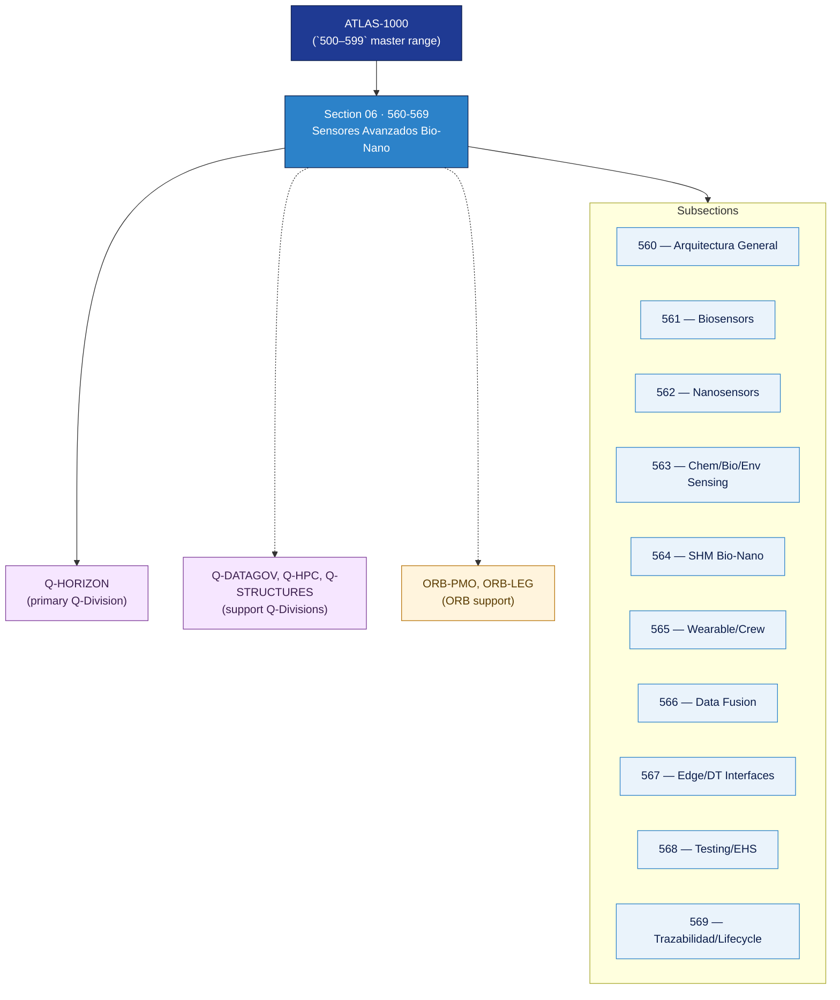

# AMTA 560-569 · Section 06 — Sensores Avanzados Bio-Nano

## 1. Purpose

Section-level index for *Sensores Avanzados Bio-Nano* (`560-569`) within the AMTA band. Arquitectura general, biosensores y biointerfases de medición, nanosensores, sensado químico/biológico/ambiental, SHM bio-nano mejorado, sensores wearable y de factores humanos, fusión de datos y calibración, edge sensing y digital twin interfaces, testing/qualification/EHS, y trazabilidad del ciclo de vida del sensor.

This section is part of the **ATLAS-1000** register, a subpart of the controlled **Q+ATLANTIDE** baseline[^baseline][^n001]. Bands classify technologies, Q-Divisions provide technical authority and ORB-Functions provide enterprise support[^n002].

## 2. Scope

- Aggregates the subsections within the `560-569` code range listed in §3.
- Inherits Q-Division authority and ORB support from the parent row in [`../README.md` §3](../README.md#3-architecture-table)[^archtable].
- Each subsection folder contains its own `README.md` (subsection index) and may contain Overview and subsubject documents.

## 3. Subsection Index

| Code | Title | Folder | Status |
|---:|---|---|---|
| `560` | Arquitectura General de Sensores Avanzados Bio-Nano | [`./560_Arquitectura-General-de-Sensores-Avanzados-Bio-Nano/`](./560_Arquitectura-General-de-Sensores-Avanzados-Bio-Nano/) | reserved |
| `561` | Biosensors y Biointerfaces de Medición | [`./561_Biosensors-y-Biointerfaces-de-Medicion/`](./561_Biosensors-y-Biointerfaces-de-Medicion/) | reserved |
| `562` | Nanosensors y Nano-Enabled Sensing | [`./562_Nanosensors-y-Nano-Enabled-Sensing/`](./562_Nanosensors-y-Nano-Enabled-Sensing/) | reserved |
| `563` | Chemical, Biological and Environmental Sensing | [`./563_Chemical-Biological-and-Environmental-Sensing/`](./563_Chemical-Biological-and-Environmental-Sensing/) | reserved |
| `564` | Structural Health Monitoring Bio-Nano Enhanced | [`./564_Structural-Health-Monitoring-Bio-Nano-Enhanced/`](./564_Structural-Health-Monitoring-Bio-Nano-Enhanced/) | reserved |
| `565` | Wearable, Crew and Human Factors Sensors | [`./565_Wearable-Crew-and-Human-Factors-Sensors/`](./565_Wearable-Crew-and-Human-Factors-Sensors/) | reserved |
| `566` | Data Fusion, Calibration y Uncertainty Control | [`./566_Data-Fusion-Calibration-y-Uncertainty-Control/`](./566_Data-Fusion-Calibration-y-Uncertainty-Control/) | reserved |
| `567` | Edge Sensing, Embedded Analytics y Digital Twin Interfaces | [`./567_Edge-Sensing-Embedded-Analytics-y-Digital-Twin-Interfaces/`](./567_Edge-Sensing-Embedded-Analytics-y-Digital-Twin-Interfaces/) | reserved |
| `568` | Testing, Qualification, EHS y Assurance Boundaries | [`./568_Testing-Qualification-EHS-y-Assurance-Boundaries/`](./568_Testing-Qualification-EHS-y-Assurance-Boundaries/) | reserved |
| `569` | Trazabilidad, Gobernanza y Sensor Lifecycle | [`./569_Trazabilidad-Gobernanza-y-Sensor-Lifecycle/`](./569_Trazabilidad-Gobernanza-y-Sensor-Lifecycle/) | reserved |

## 4. Interfaces Diagram

*Solid arrows show parent→section→subsection ownership and primary Q-Division authority; dotted arrows show support Q-Divisions and ORB enterprise support.*

## 5. Footprint

| Metric | Value |
|---|---|
| Architecture | `AMTA` — Advanced Material, Bio & Nanotechnology Architecture |
| Master range | `500–599` |
| Code range | `560-569` |
| Section | `06` — Sensores Avanzados Bio-Nano |
| Subsections | 10 reserved |
| Primary Q-Division | Q-HORIZON[^qdiv] |
| Support Q-Divisions | Q-DATAGOV, Q-HPC, Q-STRUCTURES |
| ORB support | ORB-PMO, ORB-LEG |
| Governance class | `baseline`[^gov] |
| Folder path | `Q+ATLANTIDE/500-599_AMTA/560-569_Sensores-Avanzados-Bio-Nano/` |
| Document | `README.md` (this file) |
| Parent architecture | [`../README.md`](../README.md) |
| Parent baseline | [`organization/Q+ATLANTIDE.md`](../../../../organization/Q+ATLANTIDE.md) |

## Governance

Governed by [`organization/Q+ATLANTIDE.md`](../../../../organization/Q+ATLANTIDE.md)[^baseline]. All subsections under this section inherit `architecture_code = AMTA`, `primary_q_division = Q-HORIZON` and `governance_class = baseline` from this section header. Templates declared in this section must populate `architecture_band`, `architecture_code = AMTA`, `q_division_owner` and `orb_function_support` per the Templates System[^templates]. The No-AAA Rule[^n004] applies.

## 6. References & Citations

[^baseline]: **Q+ATLANTIDE controlled baseline (v1.0.0)** — [`organization/Q+ATLANTIDE.md`](../../../../organization/Q+ATLANTIDE.md). Defines the controlled `000-999` architecture-band taxonomy and the ATLAS-1000 register subpart.

[^archtable]: **§3 — Architecture Table (parent)** — [`../README.md` §3](../README.md#3-architecture-table). Source of authority for primary/support Q-Divisions and ORB support of this section.

[^qdiv]: **Q-Division authority** — [`organization/Q-Divisions/`](../../../../organization/Q-Divisions/). Technical-authority units for the Q+ATLANTIDE baseline.

[^gov]: **Governance class** — `baseline` denotes documents under controlled change management within the Q+ATLANTIDE baseline.

[^templates]: **§5 — Templates System** — [`organization/Q+ATLANTIDE.md` §5](../../../../organization/Q+ATLANTIDE.md#5-templates-system).

[^n001]: **Note N-001** — Q+ATLANTIDE (with its ATLAS-1000 register subpart) is a taxonomy and traceability ecosystem, not an organization chart. See [`organization/Q+ATLANTIDE.md` §4](../../../../organization/Q+ATLANTIDE.md#4-notes).

[^n002]: **Note N-002** — Architecture bands classify technologies; Q-Divisions provide technical authority; ORB-Functions provide enterprise support. See [`organization/Q+ATLANTIDE.md` §4](../../../../organization/Q+ATLANTIDE.md#4-notes).

[^n004]: **Note N-004 (No-AAA Rule)** — "AAA" is not a valid domain, division, architecture, interface or function in this baseline. See [`organization/Q+ATLANTIDE.md` §4](../../../../organization/Q+ATLANTIDE.md#4-notes).
