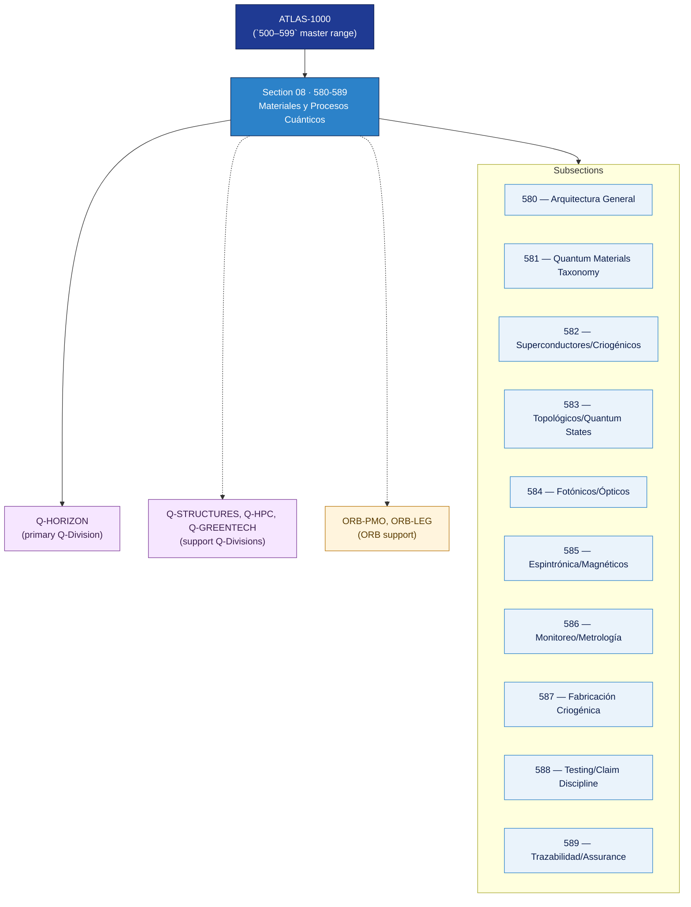

# AMTA 580-589 · Section 08 — Materiales y Procesos Cuánticos

## 1. Purpose

Section-level index for *Materiales y Procesos Cuánticos* (`580-589`) within the AMTA band. Arquitectura general, materiales cuánticos (taxonomía controlada), materiales superconductores e interfaces criogénicas, materiales topológicos y estados cuánticos, materiales fotónicos cuánticos e interfaces ópticas, espintrónica/magnéticos/defect centers, monitoreo de procesos cuánticos y metrología, fabricación criogénica, testing y verificación (claim discipline), y gobernanza/aseguramiento cuántico.

This section is part of the **ATLAS-1000** register, a subpart of the controlled **Q+ATLANTIDE** baseline[^baseline][^n001]. Bands classify technologies, Q-Divisions provide technical authority and ORB-Functions provide enterprise support[^n002].

## 2. Scope

- Aggregates the subsections within the `580-589` code range listed in §3.
- Inherits Q-Division authority and ORB support from the parent row in [`../README.md` §3](../README.md#3-architecture-table)[^archtable].
- Each subsection folder contains its own `README.md` (subsection index) and may contain Overview and subsubject documents.
- **Dual-use boundary applies**: quantum-material nodes remain non-operational unless separately authorized per the AMTA dual-use boundary rule.

## 3. Subsection Index

| Code | Title | Folder | Status |
|---:|---|---|---|
| `580` | Arquitectura General de Materiales y Procesos Cuánticos | [`./580_Arquitectura-General-de-Materiales-y-Procesos-Cuanticos/`](./580_Arquitectura-General-de-Materiales-y-Procesos-Cuanticos/) | reserved |
| `581` | Quantum Materials Controlled Taxonomy | [`./581_Quantum-Materials-Controlled-Taxonomy/`](./581_Quantum-Materials-Controlled-Taxonomy/) | reserved |
| `582` | Superconducting Materials and Cryogenic Interfaces | [`./582_Superconducting-Materials-and-Cryogenic-Interfaces/`](./582_Superconducting-Materials-and-Cryogenic-Interfaces/) | reserved |
| `583` | Topological Materials and Quantum States | [`./583_Topological-Materials-and-Quantum-States/`](./583_Topological-Materials-and-Quantum-States/) | reserved |
| `584` | Photonic Quantum Materials and Optical Interfaces | [`./584_Photonic-Quantum-Materials-and-Optical-Interfaces/`](./584_Photonic-Quantum-Materials-and-Optical-Interfaces/) | reserved |
| `585` | Spintronic, Magnetic and Defect Center Materials | [`./585_Spintronic-Magnetic-and-Defect-Center-Materials/`](./585_Spintronic-Magnetic-and-Defect-Center-Materials/) | reserved |
| `586` | Quantum Process Monitoring and Metrology | [`./586_Quantum-Process-Monitoring-and-Metrology/`](./586_Quantum-Process-Monitoring-and-Metrology/) | reserved |
| `587` | Cryogenic Manufacturing and Material Behavior | [`./587_Cryogenic-Manufacturing-and-Material-Behavior/`](./587_Cryogenic-Manufacturing-and-Material-Behavior/) | reserved |
| `588` | Testing, Verification and Claim Discipline | [`./588_Testing-Verification-and-Claim-Discipline/`](./588_Testing-Verification-and-Claim-Discipline/) | reserved |
| `589` | Trazabilidad, Gobernanza y Quantum Assurance | [`./589_Trazabilidad-Gobernanza-y-Quantum-Assurance/`](./589_Trazabilidad-Gobernanza-y-Quantum-Assurance/) | reserved |

## 4. Interfaces Diagram

*Solid arrows show parent→section→subsection ownership and primary Q-Division authority; dotted arrows show support Q-Divisions and ORB enterprise support.*

## 5. Footprint

| Metric | Value |
|---|---|
| Architecture | `AMTA` — Advanced Material, Bio & Nanotechnology Architecture |
| Master range | `500–599` |
| Code range | `580-589` |
| Section | `08` — Materiales y Procesos Cuánticos |
| Subsections | 10 reserved |
| Primary Q-Division | Q-HORIZON[^qdiv] |
| Support Q-Divisions | Q-STRUCTURES, Q-HPC, Q-GREENTECH |
| ORB support | ORB-PMO, ORB-LEG |
| Governance class | `baseline`[^gov] |
| Folder path | `Q+ATLANTIDE/500-599_AMTA/580-589_Materiales-y-Procesos-Cuanticos/` |
| Document | `README.md` (this file) |
| Parent architecture | [`../README.md`](../README.md) |
| Parent baseline | [`organization/Q+ATLANTIDE.md`](../../../../organization/Q+ATLANTIDE.md) |

## Governance

Governed by [`organization/Q+ATLANTIDE.md`](../../../../organization/Q+ATLANTIDE.md)[^baseline]. All subsections under this section inherit `architecture_code = AMTA`, `primary_q_division = Q-HORIZON` and `governance_class = baseline` from this section header. Quantum-material nodes are non-operational unless separately authorized per the AMTA dual-use boundary. Templates declared in this section must populate `architecture_band`, `architecture_code = AMTA`, `q_division_owner` and `orb_function_support` per the Templates System[^templates]. The No-AAA Rule[^n004] applies.

## 6. References & Citations

[^baseline]: **Q+ATLANTIDE controlled baseline (v1.0.0)** — [`organization/Q+ATLANTIDE.md`](../../../../organization/Q+ATLANTIDE.md). Defines the controlled `000-999` architecture-band taxonomy and the ATLAS-1000 register subpart.

[^archtable]: **§3 — Architecture Table (parent)** — [`../README.md` §3](../README.md#3-architecture-table). Source of authority for primary/support Q-Divisions and ORB support of this section.

[^qdiv]: **Q-Division authority** — [`organization/Q-Divisions/`](../../../../organization/Q-Divisions/). Technical-authority units for the Q+ATLANTIDE baseline.

[^gov]: **Governance class** — `baseline` denotes documents under controlled change management within the Q+ATLANTIDE baseline.

[^templates]: **§5 — Templates System** — [`organization/Q+ATLANTIDE.md` §5](../../../../organization/Q+ATLANTIDE.md#5-templates-system).

[^n001]: **Note N-001** — Q+ATLANTIDE (with its ATLAS-1000 register subpart) is a taxonomy and traceability ecosystem, not an organization chart. See [`organization/Q+ATLANTIDE.md` §4](../../../../organization/Q+ATLANTIDE.md#4-notes).

[^n002]: **Note N-002** — Architecture bands classify technologies; Q-Divisions provide technical authority; ORB-Functions provide enterprise support. See [`organization/Q+ATLANTIDE.md` §4](../../../../organization/Q+ATLANTIDE.md#4-notes).

[^n004]: **Note N-004 (No-AAA Rule)** — "AAA" is not a valid domain, division, architecture, interface or function in this baseline. See [`organization/Q+ATLANTIDE.md` §4](../../../../organization/Q+ATLANTIDE.md#4-notes).
