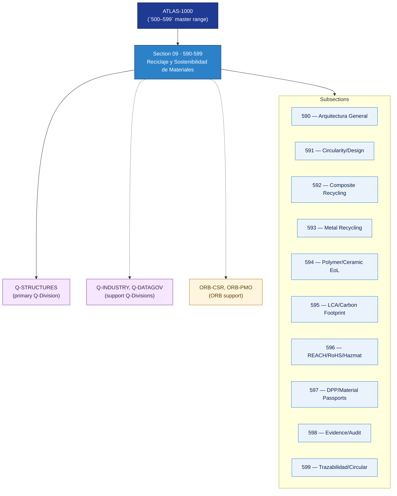

# AMTA 590-599 · Section 09 — Reciclaje y Sostenibilidad de Materiales

## 1. Purpose

Section-level index for *Reciclaje y Sostenibilidad de Materiales* (`590-599`) within the AMTA band. Arquitectura general, circularidad y diseño para el reciclaje, reciclaje de compuestos y recuperación de fibra, reciclaje de metales y materiales críticos, end-of-life de polímeros/cerámica/coatings, LCA y huella de carbono, materiales peligrosos/REACH/RoHS, Digital Product Passport, evidencia y auditoría de sostenibilidad, y trazabilidad del ciclo de vida circular.

This section is part of the **ATLAS-1000** register, a subpart of the controlled **Q+ATLANTIDE** baseline[^baseline][^n001]. Bands classify technologies, Q-Divisions provide technical authority and ORB-Functions provide enterprise support[^n002].

## 2. Scope

- Aggregates the subsections within the `590-599` code range listed in §3.
- Inherits Q-Division authority and ORB support from the parent row in [`../README.md` §3](../README.md#3-architecture-table)[^archtable].
- Each subsection folder contains its own `README.md` (subsection index) and may contain Overview and subsubject documents.

## 3. Subsection Index

| Code | Title | Folder | Status |
|---:|---|---|---|
| `590` | Arquitectura General de Reciclaje y Sostenibilidad | [`./590_Arquitectura-General-de-Reciclaje-y-Sostenibilidad/`](./590_Arquitectura-General-de-Reciclaje-y-Sostenibilidad/) | reserved |
| `591` | Material Circularity and Design for Recycling | [`./591_Material-Circularity-and-Design-for-Recycling/`](./591_Material-Circularity-and-Design-for-Recycling/) | reserved |
| `592` | Composite Recycling and Fiber Recovery | [`./592_Composite-Recycling-and-Fiber-Recovery/`](./592_Composite-Recycling-and-Fiber-Recovery/) | reserved |
| `593` | Metal Alloy Recycling and Critical Raw Materials | [`./593_Metal-Alloy-Recycling-and-Critical-Raw-Materials/`](./593_Metal-Alloy-Recycling-and-Critical-Raw-Materials/) | reserved |
| `594` | Polymer, Ceramic and Coating End-of-Life | [`./594_Polymer-Ceramic-and-Coating-End-of-Life/`](./594_Polymer-Ceramic-and-Coating-End-of-Life/) | reserved |
| `595` | LCA, Carbon Footprint and Environmental Impact | [`./595_LCA-Carbon-Footprint-and-Environmental-Impact/`](./595_LCA-Carbon-Footprint-and-Environmental-Impact/) | reserved |
| `596` | Hazardous Materials, REACH, RoHS and Waste Control | [`./596_Hazardous-Materials-REACH-RoHS-and-Waste-Control/`](./596_Hazardous-Materials-REACH-RoHS-and-Waste-Control/) | reserved |
| `597` | Digital Product Passport DPP and Material Passports | [`./597_Digital-Product-Passport-DPP-and-Material-Passports/`](./597_Digital-Product-Passport-DPP-and-Material-Passports/) | reserved |
| `598` | Evidence, Audit and Sustainability Claims | [`./598_Evidence-Audit-and-Sustainability-Claims/`](./598_Evidence-Audit-and-Sustainability-Claims/) | reserved |
| `599` | Trazabilidad, Gobernanza y Circular Lifecycle | [`./599_Trazabilidad-Gobernanza-y-Circular-Lifecycle/`](./599_Trazabilidad-Gobernanza-y-Circular-Lifecycle/) | reserved |

## 4. Interfaces Diagram

*Solid arrows show parent→section→subsection ownership and primary Q-Division authority; dotted arrows show support Q-Divisions and ORB enterprise support.*

## 5. Footprint

| Metric | Value |
|---|---|
| Architecture | `AMTA` — Advanced Material, Bio & Nanotechnology Architecture |
| Master range | `500–599` |
| Code range | `590-599` |
| Section | `09` — Reciclaje y Sostenibilidad de Materiales |
| Subsections | 10 reserved |
| Primary Q-Division | Q-STRUCTURES[^qdiv] |
| Support Q-Divisions | Q-INDUSTRY, Q-DATAGOV |
| ORB support | ORB-CSR, ORB-PMO |
| Governance class | `baseline`[^gov] |
| Folder path | `Q+ATLANTIDE/500-599_AMTA/590-599_Reciclaje-y-Sostenibilidad-de-Materiales/` |
| Document | `README.md` (this file) |
| Parent architecture | [`../README.md`](../README.md) |
| Parent baseline | [`organization/Q+ATLANTIDE.md`](../../../../organization/Q+ATLANTIDE.md) |

## Governance

Governed by [`organization/Q+ATLANTIDE.md`](../../../../organization/Q+ATLANTIDE.md)[^baseline]. All subsections under this section inherit `architecture_code = AMTA`, `primary_q_division = Q-STRUCTURES` and `governance_class = baseline` from this section header. Templates declared in this section must populate `architecture_band`, `architecture_code = AMTA`, `q_division_owner` and `orb_function_support` per the Templates System[^templates]. The No-AAA Rule[^n004] applies.

## 6. References & Citations

[^baseline]: **Q+ATLANTIDE controlled baseline (v1.0.0)** — [`organization/Q+ATLANTIDE.md`](../../../../organization/Q+ATLANTIDE.md). Defines the controlled `000-999` architecture-band taxonomy and the ATLAS-1000 register subpart.

[^archtable]: **§3 — Architecture Table (parent)** — [`../README.md` §3](../README.md#3-architecture-table). Source of authority for primary/support Q-Divisions and ORB support of this section.

[^qdiv]: **Q-Division authority** — [`organization/Q-Divisions/`](../../../../organization/Q-Divisions/). Technical-authority units for the Q+ATLANTIDE baseline.

[^gov]: **Governance class** — `baseline` denotes documents under controlled change management within the Q+ATLANTIDE baseline.

[^templates]: **§5 — Templates System** — [`organization/Q+ATLANTIDE.md` §5](../../../../organization/Q+ATLANTIDE.md#5-templates-system).

[^n001]: **Note N-001** — Q+ATLANTIDE (with its ATLAS-1000 register subpart) is a taxonomy and traceability ecosystem, not an organization chart. See [`organization/Q+ATLANTIDE.md` §4](../../../../organization/Q+ATLANTIDE.md#4-notes).

[^n002]: **Note N-002** — Architecture bands classify technologies; Q-Divisions provide technical authority; ORB-Functions provide enterprise support. See [`organization/Q+ATLANTIDE.md` §4](../../../../organization/Q+ATLANTIDE.md#4-notes).

[^n004]: **Note N-004 (No-AAA Rule)** — "AAA" is not a valid domain, division, architecture, interface or function in this baseline. See [`organization/Q+ATLANTIDE.md` §4](../../../../organization/Q+ATLANTIDE.md#4-notes).
