# OGATA 610–619 · Section 01 — Vehículos Autónomos Terrestres

## 1. Purpose

Section-level index for *Vehículos Autónomos Terrestres* (`610-619`) within the OGATA band. AGV, AMR, robots móviles industriales, vehículos autónomos para operaciones exteriores, percepción, SLAM, planificación de rutas, V2X y gobernanza.

This section is part of the **ATLAS-1000** register, a subpart of the controlled **Q+ATLANTIDE** baseline[^baseline][^n001]. Bands classify technologies, Q-Divisions provide technical authority and ORB-Functions provide enterprise support[^n002].

## 2. Scope

- Aggregates the subsections within the `610-619` code range listed in §3.
- Inherits Q-Division authority and ORB support from the parent row in [`../README.md` §3](../README.md#3-architecture-table)[^archtable].
- Each subsection folder contains its own `README.md` (subsection index) and may contain Overview and subsubject documents.

## 3. Subsection Index

| Code | Title | Folder | Status |
|---:|---|---|---|
| `610` | Arquitectura General de Vehículos Autónomos Terrestres | [`./610_Arquitectura-General-de-Vehiculos-Autonomos-Terrestres/`](./610_Arquitectura-General-de-Vehiculos-Autonomos-Terrestres/) | reserved |
| `611` | AGV, AMR y Robots Móviles Industriales | [`./611_AGV-AMR-y-Robots-Moviles-Industriales/`](./611_AGV-AMR-y-Robots-Moviles-Industriales/) | reserved |
| `612` | Autonomous Ground Vehicles — Outdoor Operations | [`./612_Autonomous-Ground-Vehicles-Outdoor-Operations/`](./612_Autonomous-Ground-Vehicles-Outdoor-Operations/) | reserved |
| `613` | Percepción, Localización y SLAM | [`./613_Percepcion-Localizacion-y-SLAM/`](./613_Percepcion-Localizacion-y-SLAM/) | reserved |
| `614` | Path Planning, Navigation y Fleet Coordination | [`./614_Path-Planning-Navigation-y-Fleet-Coordination/`](./614_Path-Planning-Navigation-y-Fleet-Coordination/) | reserved |
| `615` | V2X, V2I y Infraestructura Conectada | [`./615_V2X-V2I-y-Infraestructura-Conectada/`](./615_V2X-V2I-y-Infraestructura-Conectada/) | reserved |
| `616` | Safety, Geofencing y Minimum Risk Condition | [`./616_Safety-Geofencing-y-Minimum-Risk-Condition/`](./616_Safety-Geofencing-y-Minimum-Risk-Condition/) | reserved |
| `617` | Energy, Charging y Docking Interfaces | [`./617_Energy-Charging-y-Docking-Interfaces/`](./617_Energy-Charging-y-Docking-Interfaces/) | reserved |
| `618` | Evidencia, Trazabilidad y Gobernanza AGV-AMR | [`./618_Evidencia-Trazabilidad-y-Gobernanza-AGV-AMR/`](./618_Evidencia-Trazabilidad-y-Gobernanza-AGV-AMR/) | reserved |
| `619` | Operational Design Domain y Assurance Boundaries | [`./619_Operational-Design-Domain-y-Assurance-Boundaries/`](./619_Operational-Design-Domain-y-Assurance-Boundaries/) | reserved |

## 4. Interfaces Diagram

```mermaid
flowchart TB
    PARENT["ATLAS-1000<br/>(`600–699` master range)"]:::parent
    SEC["Section 01 · 610-619<br/>Vehículos Autónomos Terrestres"]:::sec
    PARENT --> SEC

    subgraph SUBS["Subsections"]
        direction LR
        SUB_610["610 — Arquitectura General de Vehículos Autónomos Terrestres"]:::sub
        SUB_611["611 — AGV, AMR y Robots Móviles Industriales"]:::sub
        SUB_612["612 — Autonomous Ground Vehicles — Outdoor Operations"]:::sub
        SUB_613["613 — Percepción, Localización y SLAM"]:::sub
        SUB_614["614 — Path Planning, Navigation y Fleet Coordination"]:::sub
        SUB_615["615 — V2X, V2I y Infraestructura Conectada"]:::sub
        SUB_616["616 — Safety, Geofencing y Minimum Risk Condition"]:::sub
        SUB_617["617 — Energy, Charging y Docking Interfaces"]:::sub
        SUB_618["618 — Evidencia, Trazabilidad y Gobernanza AGV-AMR"]:::sub
        SUB_619["619 — Operational Design Domain y Assurance Boundaries"]:::sub
    end
    SEC --> SUBS

    QPRIM["Q-GROUND<br/>(primary Q-Division)"]:::qdiv
    QSUPP["Q-HPC, Q-INDUSTRY, Q-DATAGOV<br/>(support Q-Divisions)"]:::qdiv
    ORB["ORB-PMO, ORB-FIN<br/>(ORB support)"]:::orb

    SEC --> QPRIM
    SEC -.-> QSUPP
    SEC -.-> ORB

    SUBS --> SUB_610
    SUBS --> SUB_611
    SUBS --> SUB_612
    SUBS --> SUB_613
    SUBS --> SUB_614
    SUBS --> SUB_615
    SUBS --> SUB_616
    SUBS --> SUB_617
    SUBS --> SUB_618
    SUBS --> SUB_619

    classDef parent fill:#1f3a93,stroke:#0b1d4a,color:#fff
    classDef sec fill:#2c82c9,stroke:#0b1d4a,color:#fff
    classDef sub fill:#eaf3fb,stroke:#2c82c9,color:#0b1d4a
    classDef qdiv fill:#f6e6ff,stroke:#7d3c98,color:#3b1f4d
    classDef orb fill:#fff4dd,stroke:#b9770e,color:#5a3b00
    classDef ext fill:#fdebd0,stroke:#b9770e,color:#5a3b00,stroke-dasharray:3 3
```

*Solid arrows show parent→section→subsection ownership and primary Q-Division authority; dotted arrows show support Q-Divisions, ORB enterprise support, and notable cross-section interfaces.*

## 5. Footprint

| Metric | Value |
|---|---|
| Architecture | `OGATA` — On-Ground Automation Technology Architecture |
| Master range | `600–699` |
| Code range | `610-619` |
| Section | `01` — Vehículos Autónomos Terrestres |
| Subsections | 10 reserved |
| Primary Q-Division | Q-GROUND[^qdiv] |
| Support Q-Divisions | Q-HPC, Q-INDUSTRY, Q-DATAGOV |
| ORB support | ORB-PMO, ORB-FIN |
| Governance class | `baseline`[^gov] |
| Folder path | `Q+ATLANTIDE/600-699_OGATA/610-619_Vehiculos-Autonomos-Terrestres/` |
| Document | `README.md` (this file) |
| Parent architecture | [`../README.md`](../README.md) |
| Parent baseline | [`organization/Q+ATLANTIDE.md`](../../../organization/Q+ATLANTIDE.md) |

## Governance

Governed by [`organization/Q+ATLANTIDE.md`](../../../organization/Q+ATLANTIDE.md)[^baseline]. All subsections under this section inherit `architecture_code = OGATA`, `primary_q_division = Q-GROUND` and `governance_class = baseline` from this section header. Templates declared in this section must populate `architecture_band`, `architecture_code = OGATA`, `q_division_owner` and `orb_function_support` per the Templates System[^templates]. The No-AAA Rule[^n004] applies.

## 6. References & Citations

[^baseline]: **Q+ATLANTIDE controlled baseline (v1.0.0)** — [`organization/Q+ATLANTIDE.md`](../../../organization/Q+ATLANTIDE.md). Defines the controlled `000-999` architecture-band taxonomy and the ATLAS-1000 register subpart.

[^archtable]: **§3 — Architecture Table (parent)** — [`../README.md` §3](../README.md#3-architecture-table). Source of authority for primary/support Q-Divisions and ORB support of this section.

[^qdiv]: **Q-Division authority** — [`organization/Q-Divisions/`](../../../organization/Q-Divisions/). Technical-authority units for the Q+ATLANTIDE baseline.

[^gov]: **Governance class** — `baseline` denotes documents under controlled change management within the Q+ATLANTIDE baseline.

[^templates]: **§5 — Templates System** — [`organization/Q+ATLANTIDE.md` §5](../../../organization/Q+ATLANTIDE.md#5-templates-system).

[^n001]: **Note N-001** — Q+ATLANTIDE (with its ATLAS-1000 register subpart) is a taxonomy and traceability ecosystem, not an organization chart. See [`organization/Q+ATLANTIDE.md` §4](../../../organization/Q+ATLANTIDE.md#4-notes).

[^n002]: **Note N-002** — Architecture bands classify technologies; Q-Divisions provide technical authority; ORB-Functions provide enterprise support. See [`organization/Q+ATLANTIDE.md` §4](../../../organization/Q+ATLANTIDE.md#4-notes).

[^n004]: **Note N-004 (No-AAA Rule)** — "AAA" is not a valid domain, division, architecture, interface or function in this baseline. See [`organization/Q+ATLANTIDE.md` §4](../../../organization/Q+ATLANTIDE.md#4-notes).
