# OGATA 620–629 · Section 02 — Infraestructura Inteligente

## 1. Purpose

Section-level index for *Infraestructura Inteligente* (`620-629`) within the OGATA band. Infraestructura inteligente conectada, sensores IoT, digital twins de infraestructura, gestión de edificios, mantenimiento predictivo y gobernanza.

This section is part of the **ATLAS-1000** register, a subpart of the controlled **Q+ATLANTIDE** baseline[^baseline][^n001]. Bands classify technologies, Q-Divisions provide technical authority and ORB-Functions provide enterprise support[^n002].

## 2. Scope

- Aggregates the subsections within the `620-629` code range listed in §3.
- Inherits Q-Division authority and ORB support from the parent row in [`../README.md` §3](../README.md#3-architecture-table)[^archtable].
- Each subsection folder contains its own `README.md` (subsection index) and may contain Overview and subsubject documents.

## 3. Subsection Index

| Code | Title | Folder | Status |
|---:|---|---|---|
| `620` | Arquitectura General de Infraestructura Inteligente | [`./620_Arquitectura-General-de-Infraestructura-Inteligente/`](./620_Arquitectura-General-de-Infraestructura-Inteligente/) | reserved |
| `621` | Smart Airports, Smart Spaceports y Smart Facilities | [`./621_Smart-Airports-Smart-Spaceports-y-Smart-Facilities/`](./621_Smart-Airports-Smart-Spaceports-y-Smart-Facilities/) | reserved |
| `622` | Sensores, Infraestructura IoT y Edge Nodes | [`./622_Sensores-Infraestructura-IoT-y-Edge-Nodes/`](./622_Sensores-Infraestructura-IoT-y-Edge-Nodes/) | reserved |
| `623` | Digital Twins de Infraestructura | [`./623_Digital-Twins-de-Infraestructura/`](./623_Digital-Twins-de-Infraestructura/) | reserved |
| `624` | Building Management Systems y Facility Automation | [`./624_Building-Management-Systems-y-Facility-Automation/`](./624_Building-Management-Systems-y-Facility-Automation/) | reserved |
| `625` | Asset Monitoring y Predictive Maintenance | [`./625_Asset-Monitoring-y-Predictive-Maintenance/`](./625_Asset-Monitoring-y-Predictive-Maintenance/) | reserved |
| `626` | Energy, Water, Waste y Resource Optimization | [`./626_Energy-Water-Waste-y-Resource-Optimization/`](./626_Energy-Water-Waste-y-Resource-Optimization/) | reserved |
| `627` | Safety, Security y Access Control Interfaces | [`./627_Safety-Security-y-Access-Control-Interfaces/`](./627_Safety-Security-y-Access-Control-Interfaces/) | reserved |
| `628` | Evidencia, Trazabilidad y Gobernanza Infraestructura | [`./628_Evidencia-Trazabilidad-y-Gobernanza-Infraestructura/`](./628_Evidencia-Trazabilidad-y-Gobernanza-Infraestructura/) | reserved |
| `629` | Resilience, Cyber-Physical y Operational Boundaries | [`./629_Resilience-Cyber-Physical-y-Operational-Boundaries/`](./629_Resilience-Cyber-Physical-y-Operational-Boundaries/) | reserved |

## 4. Interfaces Diagram

```mermaid
flowchart TB
    PARENT["ATLAS-1000<br/>(`600–699` master range)"]:::parent
    SEC["Section 02 · 620-629<br/>Infraestructura Inteligente"]:::sec
    PARENT --> SEC

    subgraph SUBS["Subsections"]
        direction LR
        SUB_620["620 — Arquitectura General de Infraestructura Inteligente"]:::sub
        SUB_621["621 — Smart Airports, Smart Spaceports y Smart Facilities"]:::sub
        SUB_622["622 — Sensores, Infraestructura IoT y Edge Nodes"]:::sub
        SUB_623["623 — Digital Twins de Infraestructura"]:::sub
        SUB_624["624 — Building Management Systems y Facility Automation"]:::sub
        SUB_625["625 — Asset Monitoring y Predictive Maintenance"]:::sub
        SUB_626["626 — Energy, Water, Waste y Resource Optimization"]:::sub
        SUB_627["627 — Safety, Security y Access Control Interfaces"]:::sub
        SUB_628["628 — Evidencia, Trazabilidad y Gobernanza Infraestructura"]:::sub
        SUB_629["629 — Resilience, Cyber-Physical y Operational Boundaries"]:::sub
    end
    SEC --> SUBS

    QPRIM["Q-GROUND<br/>(primary Q-Division)"]:::qdiv
    QSUPP["Q-DATAGOV, Q-INDUSTRY<br/>(support Q-Divisions)"]:::qdiv
    ORB["ORB-FIN, ORB-PMO<br/>(ORB support)"]:::orb

    SEC --> QPRIM
    SEC -.-> QSUPP
    SEC -.-> ORB

    SUBS --> SUB_620
    SUBS --> SUB_621
    SUBS --> SUB_622
    SUBS --> SUB_623
    SUBS --> SUB_624
    SUBS --> SUB_625
    SUBS --> SUB_626
    SUBS --> SUB_627
    SUBS --> SUB_628
    SUBS --> SUB_629

    classDef parent fill:#1f3a93,stroke:#0b1d4a,color:#fff
    classDef sec fill:#2c82c9,stroke:#0b1d4a,color:#fff
    classDef sub fill:#eaf3fb,stroke:#2c82c9,color:#0b1d4a
    classDef qdiv fill:#f6e6ff,stroke:#7d3c98,color:#3b1f4d
    classDef orb fill:#fff4dd,stroke:#b9770e,color:#5a3b00
    classDef ext fill:#fdebd0,stroke:#b9770e,color:#5a3b00,stroke-dasharray:3 3
```

*Solid arrows show parent→section→subsection ownership and primary Q-Division authority; dotted arrows show support Q-Divisions, ORB enterprise support, and notable cross-section interfaces.*

## 5. Footprint

| Metric | Value |
|---|---|
| Architecture | `OGATA` — On-Ground Automation Technology Architecture |
| Master range | `600–699` |
| Code range | `620-629` |
| Section | `02` — Infraestructura Inteligente |
| Subsections | 10 reserved |
| Primary Q-Division | Q-GROUND[^qdiv] |
| Support Q-Divisions | Q-DATAGOV, Q-INDUSTRY |
| ORB support | ORB-FIN, ORB-PMO |
| Governance class | `baseline`[^gov] |
| Folder path | `Q+ATLANTIDE/600-699_OGATA/620-629_Infraestructura-Inteligente/` |
| Document | `README.md` (this file) |
| Parent architecture | [`../README.md`](../README.md) |
| Parent baseline | [`organization/Q+ATLANTIDE.md`](../../../organization/Q+ATLANTIDE.md) |

## Governance

Governed by [`organization/Q+ATLANTIDE.md`](../../../organization/Q+ATLANTIDE.md)[^baseline]. All subsections under this section inherit `architecture_code = OGATA`, `primary_q_division = Q-GROUND` and `governance_class = baseline` from this section header. Templates declared in this section must populate `architecture_band`, `architecture_code = OGATA`, `q_division_owner` and `orb_function_support` per the Templates System[^templates]. The No-AAA Rule[^n004] applies.

## 6. References & Citations

[^baseline]: **Q+ATLANTIDE controlled baseline (v1.0.0)** — [`organization/Q+ATLANTIDE.md`](../../../organization/Q+ATLANTIDE.md). Defines the controlled `000-999` architecture-band taxonomy and the ATLAS-1000 register subpart.

[^archtable]: **§3 — Architecture Table (parent)** — [`../README.md` §3](../README.md#3-architecture-table). Source of authority for primary/support Q-Divisions and ORB support of this section.

[^qdiv]: **Q-Division authority** — [`organization/Q-Divisions/`](../../../organization/Q-Divisions/). Technical-authority units for the Q+ATLANTIDE baseline.

[^gov]: **Governance class** — `baseline` denotes documents under controlled change management within the Q+ATLANTIDE baseline.

[^templates]: **§5 — Templates System** — [`organization/Q+ATLANTIDE.md` §5](../../../organization/Q+ATLANTIDE.md#5-templates-system).

[^n001]: **Note N-001** — Q+ATLANTIDE (with its ATLAS-1000 register subpart) is a taxonomy and traceability ecosystem, not an organization chart. See [`organization/Q+ATLANTIDE.md` §4](../../../organization/Q+ATLANTIDE.md#4-notes).

[^n002]: **Note N-002** — Architecture bands classify technologies; Q-Divisions provide technical authority; ORB-Functions provide enterprise support. See [`organization/Q+ATLANTIDE.md` §4](../../../organization/Q+ATLANTIDE.md#4-notes).

[^n004]: **Note N-004 (No-AAA Rule)** — "AAA" is not a valid domain, division, architecture, interface or function in this baseline. See [`organization/Q+ATLANTIDE.md` §4](../../../organization/Q+ATLANTIDE.md#4-notes).
