# OGATA 630–639 · Section 03 — Fábricas 4.0 y Manufactura Avanzada

## 1. Purpose

Section-level index for *Fábricas 4.0 y Manufactura Avanzada* (`630-639`) within the OGATA band. Manufactura digital, automatización FAL, MES, robótica, sistemas ciber-físicos de producción, inspección de calidad, fabricación aditiva-sustractiva y gobernanza.

This section is part of the **ATLAS-1000** register, a subpart of the controlled **Q+ATLANTIDE** baseline[^baseline][^n001]. Bands classify technologies, Q-Divisions provide technical authority and ORB-Functions provide enterprise support[^n002].

## 2. Scope

- Aggregates the subsections within the `630-639` code range listed in §3.
- Inherits Q-Division authority and ORB support from the parent row in [`../README.md` §3](../README.md#3-architecture-table)[^archtable].
- Each subsection folder contains its own `README.md` (subsection index) and may contain Overview and subsubject documents.

## 3. Subsection Index

| Code | Title | Folder | Status |
|---:|---|---|---|
| `630` | Arquitectura General de Fábricas 4.0 | [`./630_Arquitectura-General-de-Fabricas-4-0/`](./630_Arquitectura-General-de-Fabricas-4-0/) | reserved |
| `631` | Cyber-Physical Production Systems | [`./631_Cyber-Physical-Production-Systems/`](./631_Cyber-Physical-Production-Systems/) | reserved |
| `632` | MES, MOM, ERP y PLM Integration | [`./632_MES-MOM-ERP-y-PLM-Integration/`](./632_MES-MOM-ERP-y-PLM-Integration/) | reserved |
| `633` | Industrial IoT y Edge Manufacturing | [`./633_Industrial-IoT-y-Edge-Manufacturing/`](./633_Industrial-IoT-y-Edge-Manufacturing/) | reserved |
| `634` | Robotic Workcells y Automated Assembly | [`./634_Robotic-Workcells-y-Automated-Assembly/`](./634_Robotic-Workcells-y-Automated-Assembly/) | reserved |
| `635` | Quality Inspection, Metrology y In-Process Control | [`./635_Quality-Inspection-Metrology-y-In-Process-Control/`](./635_Quality-Inspection-Metrology-y-In-Process-Control/) | reserved |
| `636` | Additive, Subtractive and Hybrid Manufacturing Cells | [`./636_Additive-Subtractive-and-Hybrid-Manufacturing-Cells/`](./636_Additive-Subtractive-and-Hybrid-Manufacturing-Cells/) | reserved |
| `637` | Digital Thread, MBOM, EBOM y Configuration Control | [`./637_Digital-Thread-MBOM-EBOM-y-Configuration-Control/`](./637_Digital-Thread-MBOM-EBOM-y-Configuration-Control/) | reserved |
| `638` | Evidencia, Trazabilidad y Gobernanza Fábrica 4.0 | [`./638_Evidencia-Trazabilidad-y-Gobernanza-Fabrica-4-0/`](./638_Evidencia-Trazabilidad-y-Gobernanza-Fabrica-4-0/) | reserved |
| `639` | Safety, Cybersecurity y Production Assurance Boundaries | [`./639_Safety-Cybersecurity-y-Production-Assurance-Boundaries/`](./639_Safety-Cybersecurity-y-Production-Assurance-Boundaries/) | reserved |

## 4. Interfaces Diagram

```mermaid
flowchart TB
    PARENT["ATLAS-1000<br/>(`600–699` master range)"]:::parent
    SEC["Section 03 · 630-639<br/>Fábricas 4.0 y Manufactura Avanzada"]:::sec
    PARENT --> SEC

    subgraph SUBS["Subsections"]
        direction LR
        SUB_630["630 — Arquitectura General de Fábricas 4.0"]:::sub
        SUB_631["631 — Cyber-Physical Production Systems"]:::sub
        SUB_632["632 — MES, MOM, ERP y PLM Integration"]:::sub
        SUB_633["633 — Industrial IoT y Edge Manufacturing"]:::sub
        SUB_634["634 — Robotic Workcells y Automated Assembly"]:::sub
        SUB_635["635 — Quality Inspection, Metrology y In-Process Control"]:::sub
        SUB_636["636 — Additive, Subtractive and Hybrid Manufacturing Cells"]:::sub
        SUB_637["637 — Digital Thread, MBOM, EBOM y Configuration Control"]:::sub
        SUB_638["638 — Evidencia, Trazabilidad y Gobernanza Fábrica 4.0"]:::sub
        SUB_639["639 — Safety, Cybersecurity y Production Assurance Boundaries"]:::sub
    end
    SEC --> SUBS

    QPRIM["Q-INDUSTRY<br/>(primary Q-Division)"]:::qdiv
    QSUPP["Q-DATAGOV, Q-HPC<br/>(support Q-Divisions)"]:::qdiv
    ORB["ORB-PMO, ORB-FIN<br/>(ORB support)"]:::orb

    SEC --> QPRIM
    SEC -.-> QSUPP
    SEC -.-> ORB

    SUBS --> SUB_630
    SUBS --> SUB_631
    SUBS --> SUB_632
    SUBS --> SUB_633
    SUBS --> SUB_634
    SUBS --> SUB_635
    SUBS --> SUB_636
    SUBS --> SUB_637
    SUBS --> SUB_638
    SUBS --> SUB_639

    classDef parent fill:#1f3a93,stroke:#0b1d4a,color:#fff
    classDef sec fill:#2c82c9,stroke:#0b1d4a,color:#fff
    classDef sub fill:#eaf3fb,stroke:#2c82c9,color:#0b1d4a
    classDef qdiv fill:#f6e6ff,stroke:#7d3c98,color:#3b1f4d
    classDef orb fill:#fff4dd,stroke:#b9770e,color:#5a3b00
    classDef ext fill:#fdebd0,stroke:#b9770e,color:#5a3b00,stroke-dasharray:3 3
```

*Solid arrows show parent→section→subsection ownership and primary Q-Division authority; dotted arrows show support Q-Divisions, ORB enterprise support, and notable cross-section interfaces.*

## 5. Footprint

| Metric | Value |
|---|---|
| Architecture | `OGATA` — On-Ground Automation Technology Architecture |
| Master range | `600–699` |
| Code range | `630-639` |
| Section | `03` — Fábricas 4.0 y Manufactura Avanzada |
| Subsections | 10 reserved |
| Primary Q-Division | Q-INDUSTRY[^qdiv] |
| Support Q-Divisions | Q-DATAGOV, Q-HPC |
| ORB support | ORB-PMO, ORB-FIN |
| Governance class | `baseline`[^gov] |
| Folder path | `Q+ATLANTIDE/600-699_OGATA/630-639_Fabricas-4-0-y-Manufactura-Avanzada/` |
| Document | `README.md` (this file) |
| Parent architecture | [`../README.md`](../README.md) |
| Parent baseline | [`organization/Q+ATLANTIDE.md`](../../../organization/Q+ATLANTIDE.md) |

## Governance

Governed by [`organization/Q+ATLANTIDE.md`](../../../organization/Q+ATLANTIDE.md)[^baseline]. All subsections under this section inherit `architecture_code = OGATA`, `primary_q_division = Q-INDUSTRY` and `governance_class = baseline` from this section header. Templates declared in this section must populate `architecture_band`, `architecture_code = OGATA`, `q_division_owner` and `orb_function_support` per the Templates System[^templates]. The No-AAA Rule[^n004] applies.

## 6. References & Citations

[^baseline]: **Q+ATLANTIDE controlled baseline (v1.0.0)** — [`organization/Q+ATLANTIDE.md`](../../../organization/Q+ATLANTIDE.md). Defines the controlled `000-999` architecture-band taxonomy and the ATLAS-1000 register subpart.

[^archtable]: **§3 — Architecture Table (parent)** — [`../README.md` §3](../README.md#3-architecture-table). Source of authority for primary/support Q-Divisions and ORB support of this section.

[^qdiv]: **Q-Division authority** — [`organization/Q-Divisions/`](../../../organization/Q-Divisions/). Technical-authority units for the Q+ATLANTIDE baseline.

[^gov]: **Governance class** — `baseline` denotes documents under controlled change management within the Q+ATLANTIDE baseline.

[^templates]: **§5 — Templates System** — [`organization/Q+ATLANTIDE.md` §5](../../../organization/Q+ATLANTIDE.md#5-templates-system).

[^n001]: **Note N-001** — Q+ATLANTIDE (with its ATLAS-1000 register subpart) is a taxonomy and traceability ecosystem, not an organization chart. See [`organization/Q+ATLANTIDE.md` §4](../../../organization/Q+ATLANTIDE.md#4-notes).

[^n002]: **Note N-002** — Architecture bands classify technologies; Q-Divisions provide technical authority; ORB-Functions provide enterprise support. See [`organization/Q+ATLANTIDE.md` §4](../../../organization/Q+ATLANTIDE.md#4-notes).

[^n004]: **Note N-004 (No-AAA Rule)** — "AAA" is not a valid domain, division, architecture, interface or function in this baseline. See [`organization/Q+ATLANTIDE.md` §4](../../../organization/Q+ATLANTIDE.md#4-notes).
