# OGATA 640–649 · Section 04 — Logística y Almacenamiento Automatizado

## 1. Purpose

Section-level index for *Logística y Almacenamiento Automatizado* (`640-649`) within the OGATA band. Almacenes automatizados, ASRS, picking robótico, gestión de flotas AGV/AMR, control de inventarios RFID/UWB, cadena de frío y gobernanza.

This section is part of the **ATLAS-1000** register, a subpart of the controlled **Q+ATLANTIDE** baseline[^baseline][^n001]. Bands classify technologies, Q-Divisions provide technical authority and ORB-Functions provide enterprise support[^n002].

## 2. Scope

- Aggregates the subsections within the `640-649` code range listed in §3.
- Inherits Q-Division authority and ORB support from the parent row in [`../README.md` §3](../README.md#3-architecture-table)[^archtable].
- Each subsection folder contains its own `README.md` (subsection index) and may contain Overview and subsubject documents.

## 3. Subsection Index

| Code | Title | Folder | Status |
|---:|---|---|---|
| `640` | Arquitectura General de Logística y Almacenamiento Automatizado | [`./640_Arquitectura-General-de-Logistica-y-Almacenamiento-Automatizado/`](./640_Arquitectura-General-de-Logistica-y-Almacenamiento-Automatizado/) | reserved |
| `641` | Automated Warehouses y Storage Systems | [`./641_Automated-Warehouses-y-Storage-Systems/`](./641_Automated-Warehouses-y-Storage-Systems/) | reserved |
| `642` | ASRS, Conveyors, Sorters y Material Handling | [`./642_ASRS-Conveyors-Sorters-y-Material-Handling/`](./642_ASRS-Conveyors-Sorters-y-Material-Handling/) | reserved |
| `643` | Robotic Picking, Packing y Kitting | [`./643_Robotic-Picking-Packing-y-Kitting/`](./643_Robotic-Picking-Packing-y-Kitting/) | reserved |
| `644` | Fleet Management, AGV, AMR y Yard Automation | [`./644_Fleet-Management-AGV-AMR-y-Yard-Automation/`](./644_Fleet-Management-AGV-AMR-y-Yard-Automation/) | reserved |
| `645` | Inventory Control, RFID, UWB y Traceability | [`./645_Inventory-Control-RFID-UWB-y-Traceability/`](./645_Inventory-Control-RFID-UWB-y-Traceability/) | reserved |
| `646` | Cold Chain, Hazardous Goods y Special Handling | [`./646_Cold-Chain-Hazardous-Goods-y-Special-Handling/`](./646_Cold-Chain-Hazardous-Goods-y-Special-Handling/) | reserved |
| `647` | WMS, TMS, MES y Supply Chain Integration | [`./647_WMS-TMS-MES-y-Supply-Chain-Integration/`](./647_WMS-TMS-MES-y-Supply-Chain-Integration/) | reserved |
| `648` | Evidencia, Trazabilidad y Gobernanza Logística | [`./648_Evidencia-Trazabilidad-y-Gobernanza-Logistica/`](./648_Evidencia-Trazabilidad-y-Gobernanza-Logistica/) | reserved |
| `649` | Safety, Access Control y Operational Boundaries | [`./649_Safety-Access-Control-y-Operational-Boundaries/`](./649_Safety-Access-Control-y-Operational-Boundaries/) | reserved |

## 4. Interfaces Diagram

```mermaid
flowchart TB
    PARENT["ATLAS-1000<br/>(`600–699` master range)"]:::parent
    SEC["Section 04 · 640-649<br/>Logística y Almacenamiento Automatizado"]:::sec
    PARENT --> SEC

    subgraph SUBS["Subsections"]
        direction LR
        SUB_640["640 — Arquitectura General de Logística y Almacenamiento Automatizado"]:::sub
        SUB_641["641 — Automated Warehouses y Storage Systems"]:::sub
        SUB_642["642 — ASRS, Conveyors, Sorters y Material Handling"]:::sub
        SUB_643["643 — Robotic Picking, Packing y Kitting"]:::sub
        SUB_644["644 — Fleet Management, AGV, AMR y Yard Automation"]:::sub
        SUB_645["645 — Inventory Control, RFID, UWB y Traceability"]:::sub
        SUB_646["646 — Cold Chain, Hazardous Goods y Special Handling"]:::sub
        SUB_647["647 — WMS, TMS, MES y Supply Chain Integration"]:::sub
        SUB_648["648 — Evidencia, Trazabilidad y Gobernanza Logística"]:::sub
        SUB_649["649 — Safety, Access Control y Operational Boundaries"]:::sub
    end
    SEC --> SUBS

    QPRIM["Q-INDUSTRY<br/>(primary Q-Division)"]:::qdiv
    QSUPP["Q-GROUND, Q-DATAGOV<br/>(support Q-Divisions)"]:::qdiv
    ORB["ORB-FIN, ORB-PMO<br/>(ORB support)"]:::orb

    SEC --> QPRIM
    SEC -.-> QSUPP
    SEC -.-> ORB

    SUBS --> SUB_640
    SUBS --> SUB_641
    SUBS --> SUB_642
    SUBS --> SUB_643
    SUBS --> SUB_644
    SUBS --> SUB_645
    SUBS --> SUB_646
    SUBS --> SUB_647
    SUBS --> SUB_648
    SUBS --> SUB_649

    classDef parent fill:#1f3a93,stroke:#0b1d4a,color:#fff
    classDef sec fill:#2c82c9,stroke:#0b1d4a,color:#fff
    classDef sub fill:#eaf3fb,stroke:#2c82c9,color:#0b1d4a
    classDef qdiv fill:#f6e6ff,stroke:#7d3c98,color:#3b1f4d
    classDef orb fill:#fff4dd,stroke:#b9770e,color:#5a3b00
    classDef ext fill:#fdebd0,stroke:#b9770e,color:#5a3b00,stroke-dasharray:3 3
```

*Solid arrows show parent→section→subsection ownership and primary Q-Division authority; dotted arrows show support Q-Divisions, ORB enterprise support, and notable cross-section interfaces.*

## 5. Footprint

| Metric | Value |
|---|---|
| Architecture | `OGATA` — On-Ground Automation Technology Architecture |
| Master range | `600–699` |
| Code range | `640-649` |
| Section | `04` — Logística y Almacenamiento Automatizado |
| Subsections | 10 reserved |
| Primary Q-Division | Q-INDUSTRY[^qdiv] |
| Support Q-Divisions | Q-GROUND, Q-DATAGOV |
| ORB support | ORB-FIN, ORB-PMO |
| Governance class | `baseline`[^gov] |
| Folder path | `Q+ATLANTIDE/600-699_OGATA/640-649_Logistica-y-Almacenamiento-Automatizado/` |
| Document | `README.md` (this file) |
| Parent architecture | [`../README.md`](../README.md) |
| Parent baseline | [`organization/Q+ATLANTIDE.md`](../../../organization/Q+ATLANTIDE.md) |

## Governance

Governed by [`organization/Q+ATLANTIDE.md`](../../../organization/Q+ATLANTIDE.md)[^baseline]. All subsections under this section inherit `architecture_code = OGATA`, `primary_q_division = Q-INDUSTRY` and `governance_class = baseline` from this section header. Templates declared in this section must populate `architecture_band`, `architecture_code = OGATA`, `q_division_owner` and `orb_function_support` per the Templates System[^templates]. The No-AAA Rule[^n004] applies.

## 6. References & Citations

[^baseline]: **Q+ATLANTIDE controlled baseline (v1.0.0)** — [`organization/Q+ATLANTIDE.md`](../../../organization/Q+ATLANTIDE.md). Defines the controlled `000-999` architecture-band taxonomy and the ATLAS-1000 register subpart.

[^archtable]: **§3 — Architecture Table (parent)** — [`../README.md` §3](../README.md#3-architecture-table). Source of authority for primary/support Q-Divisions and ORB support of this section.

[^qdiv]: **Q-Division authority** — [`organization/Q-Divisions/`](../../../organization/Q-Divisions/). Technical-authority units for the Q+ATLANTIDE baseline.

[^gov]: **Governance class** — `baseline` denotes documents under controlled change management within the Q+ATLANTIDE baseline.

[^templates]: **§5 — Templates System** — [`organization/Q+ATLANTIDE.md` §5](../../../organization/Q+ATLANTIDE.md#5-templates-system).

[^n001]: **Note N-001** — Q+ATLANTIDE (with its ATLAS-1000 register subpart) is a taxonomy and traceability ecosystem, not an organization chart. See [`organization/Q+ATLANTIDE.md` §4](../../../organization/Q+ATLANTIDE.md#4-notes).

[^n002]: **Note N-002** — Architecture bands classify technologies; Q-Divisions provide technical authority; ORB-Functions provide enterprise support. See [`organization/Q+ATLANTIDE.md` §4](../../../organization/Q+ATLANTIDE.md#4-notes).

[^n004]: **Note N-004 (No-AAA Rule)** — "AAA" is not a valid domain, division, architecture, interface or function in this baseline. See [`organization/Q+ATLANTIDE.md` §4](../../../organization/Q+ATLANTIDE.md#4-notes).
