# OGATA 650–659 · Section 05 — Agricultura de Precisión

## 1. Purpose

Section-level index for *Agricultura de Precisión* (`650-659`) within the OGATA band. Agro-automatización, robótica agrícola, sensores agroambientales, drones y rovers, teledetección, mapas de prescripción, riego y gobernanza.

This section is part of the **ATLAS-1000** register, a subpart of the controlled **Q+ATLANTIDE** baseline[^baseline][^n001]. Bands classify technologies, Q-Divisions provide technical authority and ORB-Functions provide enterprise support[^n002].

## 2. Scope

- Aggregates the subsections within the `650-659` code range listed in §3.
- Inherits Q-Division authority and ORB support from the parent row in [`../README.md` §3](../README.md#3-architecture-table)[^archtable].
- Each subsection folder contains its own `README.md` (subsection index) and may contain Overview and subsubject documents.

## 3. Subsection Index

| Code | Title | Folder | Status |
|---:|---|---|---|
| `650` | Arquitectura General de Agricultura de Precisión | [`./650_Arquitectura-General-de-Agricultura-de-Precision/`](./650_Arquitectura-General-de-Agricultura-de-Precision/) | reserved |
| `651` | Sensores Agroambientales y Soil Monitoring | [`./651_Sensores-Agroambientales-y-Soil-Monitoring/`](./651_Sensores-Agroambientales-y-Soil-Monitoring/) | reserved |
| `652` | Drones, Rovers y Autonomous Field Platforms | [`./652_Drones-Rovers-y-Autonomous-Field-Platforms/`](./652_Drones-Rovers-y-Autonomous-Field-Platforms/) | reserved |
| `653` | Remote Sensing, Multispectral y Data Fusion | [`./653_Remote-Sensing-Multispectral-y-Data-Fusion/`](./653_Remote-Sensing-Multispectral-y-Data-Fusion/) | reserved |
| `654` | Prescription Maps y Variable-Rate Application | [`./654_Prescription-Maps-y-Variable-Rate-Application/`](./654_Prescription-Maps-y-Variable-Rate-Application/) | reserved |
| `655` | Irrigation, Fertilization y Resource Optimization | [`./655_Irrigation-Fertilization-y-Resource-Optimization/`](./655_Irrigation-Fertilization-y-Resource-Optimization/) | reserved |
| `656` | Crop Health, Pest Detection y Yield Forecasting | [`./656_Crop-Health-Pest-Detection-y-Yield-Forecasting/`](./656_Crop-Health-Pest-Detection-y-Yield-Forecasting/) | reserved |
| `657` | Sustainability, Soil Carbon y Water Governance | [`./657_Sustainability-Soil-Carbon-y-Water-Governance/`](./657_Sustainability-Soil-Carbon-y-Water-Governance/) | reserved |
| `658` | Evidencia, Trazabilidad y Gobernanza AgroTech | [`./658_Evidencia-Trazabilidad-y-Gobernanza-AgroTech/`](./658_Evidencia-Trazabilidad-y-Gobernanza-AgroTech/) | reserved |
| `659` | Safety, Biosafety y Environmental Boundaries | [`./659_Safety-Biosafety-y-Environmental-Boundaries/`](./659_Safety-Biosafety-y-Environmental-Boundaries/) | reserved |

## 4. Interfaces Diagram

```mermaid
flowchart TB
    PARENT["ATLAS-1000<br/>(`600–699` master range)"]:::parent
    SEC["Section 05 · 650-659<br/>Agricultura de Precisión"]:::sec
    PARENT --> SEC

    subgraph SUBS["Subsections"]
        direction LR
        SUB_650["650 — Arquitectura General de Agricultura de Precisión"]:::sub
        SUB_651["651 — Sensores Agroambientales y Soil Monitoring"]:::sub
        SUB_652["652 — Drones, Rovers y Autonomous Field Platforms"]:::sub
        SUB_653["653 — Remote Sensing, Multispectral y Data Fusion"]:::sub
        SUB_654["654 — Prescription Maps y Variable-Rate Application"]:::sub
        SUB_655["655 — Irrigation, Fertilization y Resource Optimization"]:::sub
        SUB_656["656 — Crop Health, Pest Detection y Yield Forecasting"]:::sub
        SUB_657["657 — Sustainability, Soil Carbon y Water Governance"]:::sub
        SUB_658["658 — Evidencia, Trazabilidad y Gobernanza AgroTech"]:::sub
        SUB_659["659 — Safety, Biosafety y Environmental Boundaries"]:::sub
    end
    SEC --> SUBS

    QPRIM["Q-HORIZON<br/>(primary Q-Division)"]:::qdiv
    QSUPP["Q-HPC, Q-GROUND<br/>(support Q-Divisions)"]:::qdiv
    ORB["ORB-CSR, ORB-MKTG<br/>(ORB support)"]:::orb

    SEC --> QPRIM
    SEC -.-> QSUPP
    SEC -.-> ORB

    SUBS --> SUB_650
    SUBS --> SUB_651
    SUBS --> SUB_652
    SUBS --> SUB_653
    SUBS --> SUB_654
    SUBS --> SUB_655
    SUBS --> SUB_656
    SUBS --> SUB_657
    SUBS --> SUB_658
    SUBS --> SUB_659

    classDef parent fill:#1f3a93,stroke:#0b1d4a,color:#fff
    classDef sec fill:#2c82c9,stroke:#0b1d4a,color:#fff
    classDef sub fill:#eaf3fb,stroke:#2c82c9,color:#0b1d4a
    classDef qdiv fill:#f6e6ff,stroke:#7d3c98,color:#3b1f4d
    classDef orb fill:#fff4dd,stroke:#b9770e,color:#5a3b00
    classDef ext fill:#fdebd0,stroke:#b9770e,color:#5a3b00,stroke-dasharray:3 3
```

*Solid arrows show parent→section→subsection ownership and primary Q-Division authority; dotted arrows show support Q-Divisions, ORB enterprise support, and notable cross-section interfaces.*

## 5. Footprint

| Metric | Value |
|---|---|
| Architecture | `OGATA` — On-Ground Automation Technology Architecture |
| Master range | `600–699` |
| Code range | `650-659` |
| Section | `05` — Agricultura de Precisión |
| Subsections | 10 reserved |
| Primary Q-Division | Q-HORIZON[^qdiv] |
| Support Q-Divisions | Q-HPC, Q-GROUND |
| ORB support | ORB-CSR, ORB-MKTG |
| Governance class | `baseline`[^gov] |
| Folder path | `Q+ATLANTIDE/600-699_OGATA/650-659_Agricultura-de-Precision/` |
| Document | `README.md` (this file) |
| Parent architecture | [`../README.md`](../README.md) |
| Parent baseline | [`organization/Q+ATLANTIDE.md`](../../../organization/Q+ATLANTIDE.md) |

## Governance

Governed by [`organization/Q+ATLANTIDE.md`](../../../organization/Q+ATLANTIDE.md)[^baseline]. All subsections under this section inherit `architecture_code = OGATA`, `primary_q_division = Q-HORIZON` and `governance_class = baseline` from this section header. Templates declared in this section must populate `architecture_band`, `architecture_code = OGATA`, `q_division_owner` and `orb_function_support` per the Templates System[^templates]. The No-AAA Rule[^n004] applies.

## 6. References & Citations

[^baseline]: **Q+ATLANTIDE controlled baseline (v1.0.0)** — [`organization/Q+ATLANTIDE.md`](../../../organization/Q+ATLANTIDE.md). Defines the controlled `000-999` architecture-band taxonomy and the ATLAS-1000 register subpart.

[^archtable]: **§3 — Architecture Table (parent)** — [`../README.md` §3](../README.md#3-architecture-table). Source of authority for primary/support Q-Divisions and ORB support of this section.

[^qdiv]: **Q-Division authority** — [`organization/Q-Divisions/`](../../../organization/Q-Divisions/). Technical-authority units for the Q+ATLANTIDE baseline.

[^gov]: **Governance class** — `baseline` denotes documents under controlled change management within the Q+ATLANTIDE baseline.

[^templates]: **§5 — Templates System** — [`organization/Q+ATLANTIDE.md` §5](../../../organization/Q+ATLANTIDE.md#5-templates-system).

[^n001]: **Note N-001** — Q+ATLANTIDE (with its ATLAS-1000 register subpart) is a taxonomy and traceability ecosystem, not an organization chart. See [`organization/Q+ATLANTIDE.md` §4](../../../organization/Q+ATLANTIDE.md#4-notes).

[^n002]: **Note N-002** — Architecture bands classify technologies; Q-Divisions provide technical authority; ORB-Functions provide enterprise support. See [`organization/Q+ATLANTIDE.md` §4](../../../organization/Q+ATLANTIDE.md#4-notes).

[^n004]: **Note N-004 (No-AAA Rule)** — "AAA" is not a valid domain, division, architecture, interface or function in this baseline. See [`organization/Q+ATLANTIDE.md` §4](../../../organization/Q+ATLANTIDE.md#4-notes).
