# OGATA 660–669 · Section 06 — Construcción y Demolición Automatizada

## 1. Purpose

Section-level index for *Construcción y Demolición Automatizada* (`660-669`) within the OGATA band. Robótica de construcción, movimiento de tierras autónomo, impresión 3D constructiva, grúas autónomas, demolición robótica, digital twin de obra y gobernanza.

This section is part of the **ATLAS-1000** register, a subpart of the controlled **Q+ATLANTIDE** baseline[^baseline][^n001]. Bands classify technologies, Q-Divisions provide technical authority and ORB-Functions provide enterprise support[^n002].

## 2. Scope

- Aggregates the subsections within the `660-669` code range listed in §3.
- Inherits Q-Division authority and ORB support from the parent row in [`../README.md` §3](../README.md#3-architecture-table)[^archtable].
- Each subsection folder contains its own `README.md` (subsection index) and may contain Overview and subsubject documents.

## 3. Subsection Index

| Code | Title | Folder | Status |
|---:|---|---|---|
| `660` | Arquitectura General de Construcción y Demolición Automatizada | [`./660_Arquitectura-General-de-Construccion-y-Demolicion-Automatizada/`](./660_Arquitectura-General-de-Construccion-y-Demolicion-Automatizada/) | reserved |
| `661` | Robotic Construction Site Automation | [`./661_Robotic-Construction-Site-Automation/`](./661_Robotic-Construction-Site-Automation/) | reserved |
| `662` | Automated Earthmoving, Grading y Site Preparation | [`./662_Automated-Earthmoving-Grading-y-Site-Preparation/`](./662_Automated-Earthmoving-Grading-y-Site-Preparation/) | reserved |
| `663` | 3D Printing Construction y Additive Building | [`./663_3D-Printing-Construction-y-Additive-Building/`](./663_3D-Printing-Construction-y-Additive-Building/) | reserved |
| `664` | Autonomous Cranes, Lifting y Heavy Handling | [`./664_Autonomous-Cranes-Lifting-y-Heavy-Handling/`](./664_Autonomous-Cranes-Lifting-y-Heavy-Handling/) | reserved |
| `665` | Demolition Robotics y Deconstruction Planning | [`./665_Demolition-Robotics-y-Deconstruction-Planning/`](./665_Demolition-Robotics-y-Deconstruction-Planning/) | reserved |
| `666` | Site Perception, Mapping y Digital Twin Construction | [`./666_Site-Perception-Mapping-y-Digital-Twin-Construction/`](./666_Site-Perception-Mapping-y-Digital-Twin-Construction/) | reserved |
| `667` | Waste Sorting, Recycling y Circular Construction | [`./667_Waste-Sorting-Recycling-y-Circular-Construction/`](./667_Waste-Sorting-Recycling-y-Circular-Construction/) | reserved |
| `668` | Evidencia, Trazabilidad y Gobernanza Construcción | [`./668_Evidencia-Trazabilidad-y-Gobernanza-Construccion/`](./668_Evidencia-Trazabilidad-y-Gobernanza-Construccion/) | reserved |
| `669` | Safety, Exclusion Zones y Structural Risk Boundaries | [`./669_Safety-Exclusion-Zones-y-Structural-Risk-Boundaries/`](./669_Safety-Exclusion-Zones-y-Structural-Risk-Boundaries/) | reserved |

## 4. Interfaces Diagram

```mermaid
flowchart TB
    PARENT["ATLAS-1000<br/>(`600–699` master range)"]:::parent
    SEC["Section 06 · 660-669<br/>Construcción y Demolición Automatizada"]:::sec
    PARENT --> SEC

    subgraph SUBS["Subsections"]
        direction LR
        SUB_660["660 — Arquitectura General de Construcción y Demolición Automatizada"]:::sub
        SUB_661["661 — Robotic Construction Site Automation"]:::sub
        SUB_662["662 — Automated Earthmoving, Grading y Site Preparation"]:::sub
        SUB_663["663 — 3D Printing Construction y Additive Building"]:::sub
        SUB_664["664 — Autonomous Cranes, Lifting y Heavy Handling"]:::sub
        SUB_665["665 — Demolition Robotics y Deconstruction Planning"]:::sub
        SUB_666["666 — Site Perception, Mapping y Digital Twin Construction"]:::sub
        SUB_667["667 — Waste Sorting, Recycling y Circular Construction"]:::sub
        SUB_668["668 — Evidencia, Trazabilidad y Gobernanza Construcción"]:::sub
        SUB_669["669 — Safety, Exclusion Zones y Structural Risk Boundaries"]:::sub
    end
    SEC --> SUBS

    QPRIM["Q-GROUND<br/>(primary Q-Division)"]:::qdiv
    QSUPP["Q-INDUSTRY, Q-HPC<br/>(support Q-Divisions)"]:::qdiv
    ORB["ORB-PMO, ORB-LEG<br/>(ORB support)"]:::orb

    SEC --> QPRIM
    SEC -.-> QSUPP
    SEC -.-> ORB

    SUBS --> SUB_660
    SUBS --> SUB_661
    SUBS --> SUB_662
    SUBS --> SUB_663
    SUBS --> SUB_664
    SUBS --> SUB_665
    SUBS --> SUB_666
    SUBS --> SUB_667
    SUBS --> SUB_668
    SUBS --> SUB_669

    classDef parent fill:#1f3a93,stroke:#0b1d4a,color:#fff
    classDef sec fill:#2c82c9,stroke:#0b1d4a,color:#fff
    classDef sub fill:#eaf3fb,stroke:#2c82c9,color:#0b1d4a
    classDef qdiv fill:#f6e6ff,stroke:#7d3c98,color:#3b1f4d
    classDef orb fill:#fff4dd,stroke:#b9770e,color:#5a3b00
    classDef ext fill:#fdebd0,stroke:#b9770e,color:#5a3b00,stroke-dasharray:3 3
```

*Solid arrows show parent→section→subsection ownership and primary Q-Division authority; dotted arrows show support Q-Divisions, ORB enterprise support, and notable cross-section interfaces.*

## 5. Footprint

| Metric | Value |
|---|---|
| Architecture | `OGATA` — On-Ground Automation Technology Architecture |
| Master range | `600–699` |
| Code range | `660-669` |
| Section | `06` — Construcción y Demolición Automatizada |
| Subsections | 10 reserved |
| Primary Q-Division | Q-GROUND[^qdiv] |
| Support Q-Divisions | Q-INDUSTRY, Q-HPC |
| ORB support | ORB-PMO, ORB-LEG |
| Governance class | `baseline`[^gov] |
| Folder path | `Q+ATLANTIDE/600-699_OGATA/660-669_Construccion-y-Demolicion-Automatizada/` |
| Document | `README.md` (this file) |
| Parent architecture | [`../README.md`](../README.md) |
| Parent baseline | [`organization/Q+ATLANTIDE.md`](../../../organization/Q+ATLANTIDE.md) |

## Governance

Governed by [`organization/Q+ATLANTIDE.md`](../../../organization/Q+ATLANTIDE.md)[^baseline]. All subsections under this section inherit `architecture_code = OGATA`, `primary_q_division = Q-GROUND` and `governance_class = baseline` from this section header. Templates declared in this section must populate `architecture_band`, `architecture_code = OGATA`, `q_division_owner` and `orb_function_support` per the Templates System[^templates]. The No-AAA Rule[^n004] applies.

## 6. References & Citations

[^baseline]: **Q+ATLANTIDE controlled baseline (v1.0.0)** — [`organization/Q+ATLANTIDE.md`](../../../organization/Q+ATLANTIDE.md). Defines the controlled `000-999` architecture-band taxonomy and the ATLAS-1000 register subpart.

[^archtable]: **§3 — Architecture Table (parent)** — [`../README.md` §3](../README.md#3-architecture-table). Source of authority for primary/support Q-Divisions and ORB support of this section.

[^qdiv]: **Q-Division authority** — [`organization/Q-Divisions/`](../../../organization/Q-Divisions/). Technical-authority units for the Q+ATLANTIDE baseline.

[^gov]: **Governance class** — `baseline` denotes documents under controlled change management within the Q+ATLANTIDE baseline.

[^templates]: **§5 — Templates System** — [`organization/Q+ATLANTIDE.md` §5](../../../organization/Q+ATLANTIDE.md#5-templates-system).

[^n001]: **Note N-001** — Q+ATLANTIDE (with its ATLAS-1000 register subpart) is a taxonomy and traceability ecosystem, not an organization chart. See [`organization/Q+ATLANTIDE.md` §4](../../../organization/Q+ATLANTIDE.md#4-notes).

[^n002]: **Note N-002** — Architecture bands classify technologies; Q-Divisions provide technical authority; ORB-Functions provide enterprise support. See [`organization/Q+ATLANTIDE.md` §4](../../../organization/Q+ATLANTIDE.md#4-notes).

[^n004]: **Note N-004 (No-AAA Rule)** — "AAA" is not a valid domain, division, architecture, interface or function in this baseline. See [`organization/Q+ATLANTIDE.md` §4](../../../organization/Q+ATLANTIDE.md#4-notes).
