# OGATA 670–679 · Section 07 — Servicios Autónomos en Entornos Cerrados

## 1. Purpose

Section-level index for *Servicios Autónomos en Entornos Cerrados* (`670-679`) within the OGATA band. Robótica de servicios indoor, robots de limpieza e inspección, entrega autónoma interior, patrullaje de seguridad, soporte sanitario y gobernanza.

This section is part of the **ATLAS-1000** register, a subpart of the controlled **Q+ATLANTIDE** baseline[^baseline][^n001]. Bands classify technologies, Q-Divisions provide technical authority and ORB-Functions provide enterprise support[^n002].

## 2. Scope

- Aggregates the subsections within the `670-679` code range listed in §3.
- Inherits Q-Division authority and ORB support from the parent row in [`../README.md` §3](../README.md#3-architecture-table)[^archtable].
- Each subsection folder contains its own `README.md` (subsection index) and may contain Overview and subsubject documents.

## 3. Subsection Index

| Code | Title | Folder | Status |
|---:|---|---|---|
| `670` | Arquitectura General de Servicios Autónomos en Entornos Cerrados | [`./670_Arquitectura-General-de-Servicios-Autonomos-en-Entornos-Cerrados/`](./670_Arquitectura-General-de-Servicios-Autonomos-en-Entornos-Cerrados/) | reserved |
| `671` | Cleaning, Inspection y Facility Service Robots | [`./671_Cleaning-Inspection-y-Facility-Service-Robots/`](./671_Cleaning-Inspection-y-Facility-Service-Robots/) | reserved |
| `672` | Logistics, Delivery y Indoor Mobile Robots | [`./672_Logistics-Delivery-y-Indoor-Mobile-Robots/`](./672_Logistics-Delivery-y-Indoor-Mobile-Robots/) | reserved |
| `673` | Security, Patrol y Monitoring Robots | [`./673_Security-Patrol-y-Monitoring-Robots/`](./673_Security-Patrol-y-Monitoring-Robots/) | reserved |
| `674` | Healthcare, Lab y Support Service Robots | [`./674_Healthcare-Lab-y-Support-Service-Robots/`](./674_Healthcare-Lab-y-Support-Service-Robots/) | reserved |
| `675` | Hospitality, Retail y Public Service Automation | [`./675_Hospitality-Retail-y-Public-Service-Automation/`](./675_Hospitality-Retail-y-Public-Service-Automation/) | reserved |
| `676` | Indoor Navigation, Localization y Human-Aware Motion | [`./676_Indoor-Navigation-Localization-y-Human-Aware-Motion/`](./676_Indoor-Navigation-Localization-y-Human-Aware-Motion/) | reserved |
| `677` | Task Orchestration, Fleet Management y Service Levels | [`./677_Task-Orchestration-Fleet-Management-y-Service-Levels/`](./677_Task-Orchestration-Fleet-Management-y-Service-Levels/) | reserved |
| `678` | Evidencia, Trazabilidad y Gobernanza Servicios Autónomos | [`./678_Evidencia-Trazabilidad-y-Gobernanza-Servicios-Autonomos/`](./678_Evidencia-Trazabilidad-y-Gobernanza-Servicios-Autonomos/) | reserved |
| `679` | Safety, Privacy, HRI y Operational Boundaries | [`./679_Safety-Privacy-HRI-y-Operational-Boundaries/`](./679_Safety-Privacy-HRI-y-Operational-Boundaries/) | reserved |

## 4. Interfaces Diagram

```mermaid
flowchart TB
    PARENT["ATLAS-1000<br/>(`600–699` master range)"]:::parent
    SEC["Section 07 · 670-679<br/>Servicios Autónomos en Entornos Cerrados"]:::sec
    PARENT --> SEC

    subgraph SUBS["Subsections"]
        direction LR
        SUB_670["670 — Arquitectura General de Servicios Autónomos en Entornos Cerrados"]:::sub
        SUB_671["671 — Cleaning, Inspection y Facility Service Robots"]:::sub
        SUB_672["672 — Logistics, Delivery y Indoor Mobile Robots"]:::sub
        SUB_673["673 — Security, Patrol y Monitoring Robots"]:::sub
        SUB_674["674 — Healthcare, Lab y Support Service Robots"]:::sub
        SUB_675["675 — Hospitality, Retail y Public Service Automation"]:::sub
        SUB_676["676 — Indoor Navigation, Localization y Human-Aware Motion"]:::sub
        SUB_677["677 — Task Orchestration, Fleet Management y Service Levels"]:::sub
        SUB_678["678 — Evidencia, Trazabilidad y Gobernanza Servicios Autónomos"]:::sub
        SUB_679["679 — Safety, Privacy, HRI y Operational Boundaries"]:::sub
    end
    SEC --> SUBS

    QPRIM["Q-GROUND<br/>(primary Q-Division)"]:::qdiv
    QSUPP["Q-HPC, Q-DATAGOV<br/>(support Q-Divisions)"]:::qdiv
    ORB["ORB-PMO, ORB-HR<br/>(ORB support)"]:::orb

    SEC --> QPRIM
    SEC -.-> QSUPP
    SEC -.-> ORB

    SUBS --> SUB_670
    SUBS --> SUB_671
    SUBS --> SUB_672
    SUBS --> SUB_673
    SUBS --> SUB_674
    SUBS --> SUB_675
    SUBS --> SUB_676
    SUBS --> SUB_677
    SUBS --> SUB_678
    SUBS --> SUB_679

    classDef parent fill:#1f3a93,stroke:#0b1d4a,color:#fff
    classDef sec fill:#2c82c9,stroke:#0b1d4a,color:#fff
    classDef sub fill:#eaf3fb,stroke:#2c82c9,color:#0b1d4a
    classDef qdiv fill:#f6e6ff,stroke:#7d3c98,color:#3b1f4d
    classDef orb fill:#fff4dd,stroke:#b9770e,color:#5a3b00
    classDef ext fill:#fdebd0,stroke:#b9770e,color:#5a3b00,stroke-dasharray:3 3
```

*Solid arrows show parent→section→subsection ownership and primary Q-Division authority; dotted arrows show support Q-Divisions, ORB enterprise support, and notable cross-section interfaces.*

## 5. Footprint

| Metric | Value |
|---|---|
| Architecture | `OGATA` — On-Ground Automation Technology Architecture |
| Master range | `600–699` |
| Code range | `670-679` |
| Section | `07` — Servicios Autónomos en Entornos Cerrados |
| Subsections | 10 reserved |
| Primary Q-Division | Q-GROUND[^qdiv] |
| Support Q-Divisions | Q-HPC, Q-DATAGOV |
| ORB support | ORB-PMO, ORB-HR |
| Governance class | `baseline`[^gov] |
| Folder path | `Q+ATLANTIDE/600-699_OGATA/670-679_Servicios-Autonomos-en-Entornos-Cerrados/` |
| Document | `README.md` (this file) |
| Parent architecture | [`../README.md`](../README.md) |
| Parent baseline | [`organization/Q+ATLANTIDE.md`](../../../organization/Q+ATLANTIDE.md) |

## Governance

Governed by [`organization/Q+ATLANTIDE.md`](../../../organization/Q+ATLANTIDE.md)[^baseline]. All subsections under this section inherit `architecture_code = OGATA`, `primary_q_division = Q-GROUND` and `governance_class = baseline` from this section header. Templates declared in this section must populate `architecture_band`, `architecture_code = OGATA`, `q_division_owner` and `orb_function_support` per the Templates System[^templates]. The No-AAA Rule[^n004] applies.

## 6. References & Citations

[^baseline]: **Q+ATLANTIDE controlled baseline (v1.0.0)** — [`organization/Q+ATLANTIDE.md`](../../../organization/Q+ATLANTIDE.md). Defines the controlled `000-999` architecture-band taxonomy and the ATLAS-1000 register subpart.

[^archtable]: **§3 — Architecture Table (parent)** — [`../README.md` §3](../README.md#3-architecture-table). Source of authority for primary/support Q-Divisions and ORB support of this section.

[^qdiv]: **Q-Division authority** — [`organization/Q-Divisions/`](../../../organization/Q-Divisions/). Technical-authority units for the Q+ATLANTIDE baseline.

[^gov]: **Governance class** — `baseline` denotes documents under controlled change management within the Q+ATLANTIDE baseline.

[^templates]: **§5 — Templates System** — [`organization/Q+ATLANTIDE.md` §5](../../../organization/Q+ATLANTIDE.md#5-templates-system).

[^n001]: **Note N-001** — Q+ATLANTIDE (with its ATLAS-1000 register subpart) is a taxonomy and traceability ecosystem, not an organization chart. See [`organization/Q+ATLANTIDE.md` §4](../../../organization/Q+ATLANTIDE.md#4-notes).

[^n002]: **Note N-002** — Architecture bands classify technologies; Q-Divisions provide technical authority; ORB-Functions provide enterprise support. See [`organization/Q+ATLANTIDE.md` §4](../../../organization/Q+ATLANTIDE.md#4-notes).

[^n004]: **Note N-004 (No-AAA Rule)** — "AAA" is not a valid domain, division, architecture, interface or function in this baseline. See [`organization/Q+ATLANTIDE.md` §4](../../../organization/Q+ATLANTIDE.md#4-notes).
