# OGATA 690–699 · Section 09 — Interacción Humano-Robot y Seguridad

## 1. Purpose

Section-level index for *Interacción Humano-Robot y Seguridad* (`690-699`) within the OGATA band. HRI, factores humanos, ergonomía, sistemas de seguridad certificados, supervisión humana, formación de operadores, evaluación de riesgos y gobernanza.

This section is part of the **ATLAS-1000** register, a subpart of the controlled **Q+ATLANTIDE** baseline[^baseline][^n001]. Bands classify technologies, Q-Divisions provide technical authority and ORB-Functions provide enterprise support[^n002].

## 2. Scope

- Aggregates the subsections within the `690-699` code range listed in §3.
- Inherits Q-Division authority and ORB support from the parent row in [`../README.md` §3](../README.md#3-architecture-table)[^archtable].
- Each subsection folder contains its own `README.md` (subsection index) and may contain Overview and subsubject documents.

## 3. Subsection Index

| Code | Title | Folder | Status |
|---:|---|---|---|
| `690` | Arquitectura General de HRI y Seguridad | [`./690_Arquitectura-General-de-HRI-y-Seguridad/`](./690_Arquitectura-General-de-HRI-y-Seguridad/) | reserved |
| `691` | Human-Robot Interaction — Controlled Definition | [`./691_Human-Robot-Interaction-Controlled-Definition/`](./691_Human-Robot-Interaction-Controlled-Definition/) | reserved |
| `692` | Human Factors, Ergonomics y Cognitive Load | [`./692_Human-Factors-Ergonomics-y-Cognitive-Load/`](./692_Human-Factors-Ergonomics-y-Cognitive-Load/) | reserved |
| `693` | Safety-Rated Systems y Collaborative Operations | [`./693_Safety-Rated-Systems-y-Collaborative-Operations/`](./693_Safety-Rated-Systems-y-Collaborative-Operations/) | reserved |
| `694` | Human-in-the-Loop y Supervisory Control | [`./694_Human-in-the-Loop-y-Supervisory-Control/`](./694_Human-in-the-Loop-y-Supervisory-Control/) | reserved |
| `695` | Operator Training, Certification y Competence | [`./695_Operator-Training-Certification-y-Competence/`](./695_Operator-Training-Certification-y-Competence/) | reserved |
| `696` | Risk Assessment, Hazards y Protective Measures | [`./696_Risk-Assessment-Hazards-y-Protective-Measures/`](./696_Risk-Assessment-Hazards-y-Protective-Measures/) | reserved |
| `697` | Incident Reporting, Learning y Safety Culture | [`./697_Incident-Reporting-Learning-y-Safety-Culture/`](./697_Incident-Reporting-Learning-y-Safety-Culture/) | reserved |
| `698` | Evidencia, Trazabilidad y Gobernanza HRI Safety | [`./698_Evidencia-Trazabilidad-y-Gobernanza-HRI-Safety/`](./698_Evidencia-Trazabilidad-y-Gobernanza-HRI-Safety/) | reserved |
| `699` | Ethics, Privacy, Accessibility y Trust Boundaries | [`./699_Ethics-Privacy-Accessibility-y-Trust-Boundaries/`](./699_Ethics-Privacy-Accessibility-y-Trust-Boundaries/) | reserved |

## 4. Interfaces Diagram

```mermaid
flowchart TB
    PARENT["ATLAS-1000<br/>(`600–699` master range)"]:::parent
    SEC["Section 09 · 690-699<br/>Interacción Humano-Robot y Seguridad"]:::sec
    PARENT --> SEC

    subgraph SUBS["Subsections"]
        direction LR
        SUB_690["690 — Arquitectura General de HRI y Seguridad"]:::sub
        SUB_691["691 — Human-Robot Interaction — Controlled Definition"]:::sub
        SUB_692["692 — Human Factors, Ergonomics y Cognitive Load"]:::sub
        SUB_693["693 — Safety-Rated Systems y Collaborative Operations"]:::sub
        SUB_694["694 — Human-in-the-Loop y Supervisory Control"]:::sub
        SUB_695["695 — Operator Training, Certification y Competence"]:::sub
        SUB_696["696 — Risk Assessment, Hazards y Protective Measures"]:::sub
        SUB_697["697 — Incident Reporting, Learning y Safety Culture"]:::sub
        SUB_698["698 — Evidencia, Trazabilidad y Gobernanza HRI Safety"]:::sub
        SUB_699["699 — Ethics, Privacy, Accessibility y Trust Boundaries"]:::sub
    end
    SEC --> SUBS

    QPRIM["Q-INDUSTRY<br/>(primary Q-Division)"]:::qdiv
    QSUPP["Q-HPC, Q-GROUND<br/>(support Q-Divisions)"]:::qdiv
    ORB["ORB-HR, ORB-LEG<br/>(ORB support)"]:::orb

    SEC --> QPRIM
    SEC -.-> QSUPP
    SEC -.-> ORB

    SUBS --> SUB_690
    SUBS --> SUB_691
    SUBS --> SUB_692
    SUBS --> SUB_693
    SUBS --> SUB_694
    SUBS --> SUB_695
    SUBS --> SUB_696
    SUBS --> SUB_697
    SUBS --> SUB_698
    SUBS --> SUB_699

    classDef parent fill:#1f3a93,stroke:#0b1d4a,color:#fff
    classDef sec fill:#2c82c9,stroke:#0b1d4a,color:#fff
    classDef sub fill:#eaf3fb,stroke:#2c82c9,color:#0b1d4a
    classDef qdiv fill:#f6e6ff,stroke:#7d3c98,color:#3b1f4d
    classDef orb fill:#fff4dd,stroke:#b9770e,color:#5a3b00
    classDef ext fill:#fdebd0,stroke:#b9770e,color:#5a3b00,stroke-dasharray:3 3
```

*Solid arrows show parent→section→subsection ownership and primary Q-Division authority; dotted arrows show support Q-Divisions, ORB enterprise support, and notable cross-section interfaces.*

## 5. Footprint

| Metric | Value |
|---|---|
| Architecture | `OGATA` — On-Ground Automation Technology Architecture |
| Master range | `600–699` |
| Code range | `690-699` |
| Section | `09` — Interacción Humano-Robot y Seguridad |
| Subsections | 10 reserved |
| Primary Q-Division | Q-INDUSTRY[^qdiv] |
| Support Q-Divisions | Q-HPC, Q-GROUND |
| ORB support | ORB-HR, ORB-LEG |
| Governance class | `baseline`[^gov] |
| Folder path | `Q+ATLANTIDE/600-699_OGATA/690-699_Interaccion-Humano-Robot-y-Seguridad/` |
| Document | `README.md` (this file) |
| Parent architecture | [`../README.md`](../README.md) |
| Parent baseline | [`organization/Q+ATLANTIDE.md`](../../../organization/Q+ATLANTIDE.md) |

## Governance

Governed by [`organization/Q+ATLANTIDE.md`](../../../organization/Q+ATLANTIDE.md)[^baseline]. All subsections under this section inherit `architecture_code = OGATA`, `primary_q_division = Q-INDUSTRY` and `governance_class = baseline` from this section header. Templates declared in this section must populate `architecture_band`, `architecture_code = OGATA`, `q_division_owner` and `orb_function_support` per the Templates System[^templates]. The No-AAA Rule[^n004] applies.

## 6. References & Citations

[^baseline]: **Q+ATLANTIDE controlled baseline (v1.0.0)** — [`organization/Q+ATLANTIDE.md`](../../../organization/Q+ATLANTIDE.md). Defines the controlled `000-999` architecture-band taxonomy and the ATLAS-1000 register subpart.

[^archtable]: **§3 — Architecture Table (parent)** — [`../README.md` §3](../README.md#3-architecture-table). Source of authority for primary/support Q-Divisions and ORB support of this section.

[^qdiv]: **Q-Division authority** — [`organization/Q-Divisions/`](../../../organization/Q-Divisions/). Technical-authority units for the Q+ATLANTIDE baseline.

[^gov]: **Governance class** — `baseline` denotes documents under controlled change management within the Q+ATLANTIDE baseline.

[^templates]: **§5 — Templates System** — [`organization/Q+ATLANTIDE.md` §5](../../../organization/Q+ATLANTIDE.md#5-templates-system).

[^n001]: **Note N-001** — Q+ATLANTIDE (with its ATLAS-1000 register subpart) is a taxonomy and traceability ecosystem, not an organization chart. See [`organization/Q+ATLANTIDE.md` §4](../../../organization/Q+ATLANTIDE.md#4-notes).

[^n002]: **Note N-002** — Architecture bands classify technologies; Q-Divisions provide technical authority; ORB-Functions provide enterprise support. See [`organization/Q+ATLANTIDE.md` §4](../../../organization/Q+ATLANTIDE.md#4-notes).

[^n004]: **Note N-004 (No-AAA Rule)** — "AAA" is not a valid domain, division, architecture, interface or function in this baseline. See [`organization/Q+ATLANTIDE.md` §4](../../../organization/Q+ATLANTIDE.md#4-notes).
