# ACV 700-709 · Section 00 — Vehículos de Movilidad Aérea Urbana

## 1. Purpose

Section-level index for *Vehículos de Movilidad Aérea Urbana* (`700-709`) within the ACV band. UAM vehicles, eVTOL platforms, VTOL/STOL configurations, electric-hybrid and H2 propulsion, batteries, avionics, cabin design, maintenance, evidence traceability and certification boundaries.

This section is part of the **ATLAS-1000** register, a subpart of the controlled **Q+ATLANTIDE** baseline[^baseline][^n001]. Bands classify technologies, Q-Divisions provide technical authority and ORB-Functions provide enterprise support[^n002].

## 2. Scope

- Aggregates the subsections within the `700-709` code range listed in §3.
- Inherits Q-Division authority and ORB support from the parent row in [`../README.md` §3](../README.md#3-architecture-table)[^archtable].
- Each subsection folder may contain Overview and subsubject documents per the Q+ATLANTIDE Templates System[^templates].

## 3. Subsection Index

| Code | Title | Folder | Status |
|---:|---|---|---|
| `700` | Arquitectura General de Vehiculos UAM | [`./700_Arquitectura-General-de-Vehiculos-UAM/`](./700_Arquitectura-General-de-Vehiculos-UAM/) | active |
| `701` | eVTOL y Aeronaves de Movilidad Aerea Urbana | [`./701_eVTOL-y-Aeronaves-de-Movilidad-Aerea-Urbana/`](./701_eVTOL-y-Aeronaves-de-Movilidad-Aerea-Urbana/) | active |
| `702` | VTOL STOL y Configuraciones Hibridas | [`./702_VTOL-STOL-y-Configuraciones-Hibridas/`](./702_VTOL-STOL-y-Configuraciones-Hibridas/) | active |
| `703` | Propulsion Electrica Hibrida y H2 para UAM | [`./703_Propulsion-Electrica-Hibrida-y-H2-para-UAM/`](./703_Propulsion-Electrica-Hibrida-y-H2-para-UAM/) | active |
| `704` | Baterias Energia y Gestion Termica UAM | [`./704_Baterias-Energia-y-Gestion-Termica-UAM/`](./704_Baterias-Energia-y-Gestion-Termica-UAM/) | active |
| `705` | Avionica GNC y Autonomia UAM | [`./705_Avionica-GNC-y-Autonomia-UAM/`](./705_Avionica-GNC-y-Autonomia-UAM/) | active |
| `706` | Cabina Pasajeros Carga y Accesibilidad | [`./706_Cabina-Pasajeros-Carga-y-Accesibilidad/`](./706_Cabina-Pasajeros-Carga-y-Accesibilidad/) | active |
| `707` | Mantenimiento Inspeccion y Health Monitoring UAM | [`./707_Mantenimiento-Inspeccion-y-Health-Monitoring-UAM/`](./707_Mantenimiento-Inspeccion-y-Health-Monitoring-UAM/) | active |
| `708` | Evidencia Trazabilidad y Gobernanza de Vehiculos UAM | [`./708_Evidencia-Trazabilidad-y-Gobernanza-de-Vehiculos-UAM/`](./708_Evidencia-Trazabilidad-y-Gobernanza-de-Vehiculos-UAM/) | active |
| `709` | Safety Certificacion y Operational Boundaries | [`./709_Safety-Certificacion-y-Operational-Boundaries/`](./709_Safety-Certificacion-y-Operational-Boundaries/) | active |

## 4. Interfaces Diagram

```mermaid
flowchart TB
    PARENT["ACV<br/>(`700–799` master range)"]:::parent
    SEC["Section 00 · 700-709<br/>Vehículos de Movilidad Aérea Urbana"]:::sec
    PARENT --> SEC

    subgraph SUBS["Subsections"]
        direction LR
        SUB_700["700 — Arquitectura General de Vehiculos UAM"]:::sub
        SUB_701["701 — eVTOL y Aeronaves de Movilidad Aerea Urbana"]:::sub
        SUB_702["702 — VTOL STOL y Configuraciones Hibridas"]:::sub
        SUB_703["703 — Propulsion Electrica Hibrida y H2 para UAM"]:::sub
        SUB_704["704 — Baterias Energia y Gestion Termica UAM"]:::sub
        SUB_705["705 — Avionica GNC y Autonomia UAM"]:::sub
        SUB_706["706 — Cabina Pasajeros Carga y Accesibilidad"]:::sub
        SUB_707["707 — Mantenimiento Inspeccion y Health Monitoring UAM"]:::sub
        SUB_708["708 — Evidencia Trazabilidad y Gobernanza de Vehiculos UAM"]:::sub
        SUB_709["709 — Safety Certificacion y Operational Boundaries"]:::sub
    end
    SEC --> SUBS

    SUBS --> SUB_700
    SUBS --> SUB_701
    SUBS --> SUB_702
    SUBS --> SUB_703
    SUBS --> SUB_704
    SUBS --> SUB_705
    SUBS --> SUB_706
    SUBS --> SUB_707
    SUBS --> SUB_708
    SUBS --> SUB_709

    QPRIM["Q-AIR<br/>(primary Q-Division)"]:::qdiv
    QSUPP["Q-GREENTECH, Q-STRUCTURES, Q-HPC<br/>(support Q-Divisions)"]:::qdiv
    ORB["ORB-MKTG, ORB-PMO<br/>(ORB support)"]:::orb

    SEC --> QPRIM
    SEC -.-> QSUPP
    SEC -.-> ORB

    classDef parent fill:#1f3a93,stroke:#0b1d4a,color:#fff
    classDef sec fill:#2c82c9,stroke:#0b1d4a,color:#fff
    classDef sub fill:#eaf3fb,stroke:#2c82c9,color:#0b1d4a
    classDef qdiv fill:#f6e6ff,stroke:#7d3c98,color:#3b1f4d
    classDef orb fill:#fff4dd,stroke:#b9770e,color:#5a3b00
```

*Solid arrows show parent→section→subsection ownership and primary Q-Division authority; dotted arrows show support Q-Divisions and ORB enterprise support.*

## 5. Footprint

| Metric | Value |
|---|---|
| Architecture | `ACV` — Aerial City Viability / UAM Architecture |
| Master range | `700–799` |
| Code range | `700-709` |
| Section | `00` — Vehículos de Movilidad Aérea Urbana |
| Subsections | 10 reserved |
| Primary Q-Division | Q-AIR[^qdiv] |
| Support Q-Divisions | Q-GREENTECH, Q-STRUCTURES, Q-HPC |
| ORB support | ORB-MKTG, ORB-PMO |
| Governance class | `baseline`[^gov] |
| Folder path | `Q+ATLANTIDE/700-799_ACV/700-709_Vehiculos-de-Movilidad-Aerea-Urbana/` |
| Document | `README.md` (this file) |
| Parent architecture | [`../README.md`](../README.md) |
| Parent baseline | [`organization/Q+ATLANTIDE.md`](../../../organization/Q+ATLANTIDE.md) |

## Governance

Governed by [`organization/Q+ATLANTIDE.md`](../../../organization/Q+ATLANTIDE.md)[^baseline]. All subsections under this section inherit `architecture_code = ACV`, `primary_q_division = Q-AIR`, and `governance_class = baseline` from this section header. Templates declared in this section must populate `architecture_band`, `architecture_code = ACV`, `q_division_owner` and `orb_function_support` per the Templates System[^templates]. The No-AAA Rule[^n004] applies.

## 6. References & Citations

[^baseline]: **Q+ATLANTIDE controlled baseline (v1.0.0)** — [`organization/Q+ATLANTIDE.md`](../../../organization/Q+ATLANTIDE.md). Defines the controlled `000-999` architecture-band taxonomy and the ATLAS-1000 register subpart.

[^archtable]: **§3 — Architecture Table (parent)** — [`../README.md` §3](../README.md#3-architecture-table). Source of authority for primary/support Q-Divisions and ORB support of this section.

[^qdiv]: **Q-Division authority** — [`organization/Q-Divisions/`](../../../organization/Q-Divisions/). Technical-authority units for the Q+ATLANTIDE baseline.

[^gov]: **Governance class** — `baseline` denotes documents following standard Q+ATLANTIDE governance rules (rule N-002).

[^templates]: **§5 — Templates System** — [`organization/Q+ATLANTIDE.md` §5](../../../organization/Q+ATLANTIDE.md#5-templates-system).

[^n001]: **Note N-001** — Q+ATLANTIDE (with its ATLAS-1000 register subpart) is a taxonomy and traceability ecosystem, not an organization chart. See [`organization/Q+ATLANTIDE.md` §4](../../../organization/Q+ATLANTIDE.md#4-notes).

[^n002]: **Note N-002** — Architecture bands classify technologies; Q-Divisions provide technical authority; ORB-Functions provide enterprise support. See [`organization/Q+ATLANTIDE.md` §4](../../../organization/Q+ATLANTIDE.md#4-notes).

[^n004]: **Note N-004 (No-AAA Rule)** — "AAA" is not a valid domain, division, architecture, interface or function in this baseline. See [`organization/Q+ATLANTIDE.md` §4](../../../organization/Q+ATLANTIDE.md#4-notes).

[^repo]: **Repository root README** — [`README.md`](../../../README.md). Top-level entry point referencing the Q+ATLANTIDE baseline and the ATLAS-1000 register subpart.
