# ACV 710-719 · Section 01 — Vertipuertos y Heliplataformas

## 1. Purpose

Section-level index for *Vertipuertos y Heliplataformas* (`710-719`) within the ACV band. Vertiport and heliplatform architecture, site selection, landing/takeoff pads, passenger flow, charging and H2 infrastructure, fire safety, ground handling, digital infrastructure, evidence traceability and urban-risk boundaries.

This section is part of the **ATLAS-1000** register, a subpart of the controlled **Q+ATLANTIDE** baseline[^baseline][^n001]. Bands classify technologies, Q-Divisions provide technical authority and ORB-Functions provide enterprise support[^n002].

## 2. Scope

- Aggregates the subsections within the `710-719` code range listed in §3.
- Inherits Q-Division authority and ORB support from the parent row in [`../README.md` §3](../README.md#3-architecture-table)[^archtable].
- Each subsection folder may contain Overview and subsubject documents per the Q+ATLANTIDE Templates System[^templates].

## 3. Subsection Index

| Code | Title | Folder | Status |
|---:|---|---|---|
| `710` | Arquitectura General de Vertipuertos y Heliplataformas | [`./710_Arquitectura-General-de-Vertipuertos-y-Heliplataformas/`](./710_Arquitectura-General-de-Vertipuertos-y-Heliplataformas/) | active |
| `711` | Site Selection Urban Integration y Zoning | [`./711_Site-Selection-Urban-Integration-y-Zoning/`](./711_Site-Selection-Urban-Integration-y-Zoning/) | active |
| `712` | Landing Takeoff Pads y FATO TLOF Areas | [`./712_Landing-Takeoff-Pads-y-FATO-TLOF-Areas/`](./712_Landing-Takeoff-Pads-y-FATO-TLOF-Areas/) | active |
| `713` | Passenger Flow Terminal Interfaces y Accessibility | [`./713_Passenger-Flow-Terminal-Interfaces-y-Accessibility/`](./713_Passenger-Flow-Terminal-Interfaces-y-Accessibility/) | active |
| `714` | Charging H2 Servicing y Energy Infrastructure | [`./714_Charging-H2-Servicing-y-Energy-Infrastructure/`](./714_Charging-H2-Servicing-y-Energy-Infrastructure/) | active |
| `715` | Fire Safety Rescue and Emergency Response | [`./715_Fire-Safety-Rescue-and-Emergency-Response/`](./715_Fire-Safety-Rescue-and-Emergency-Response/) | active |
| `716` | Ground Handling GSE y Turnaround Operations | [`./716_Ground-Handling-GSE-y-Turnaround-Operations/`](./716_Ground-Handling-GSE-y-Turnaround-Operations/) | active |
| `717` | Digital Infrastructure CNS y Vertiport Systems | [`./717_Digital-Infrastructure-CNS-y-Vertiport-Systems/`](./717_Digital-Infrastructure-CNS-y-Vertiport-Systems/) | active |
| `718` | Evidencia Trazabilidad y Gobernanza de Vertipuertos | [`./718_Evidencia-Trazabilidad-y-Gobernanza-de-Vertipuertos/`](./718_Evidencia-Trazabilidad-y-Gobernanza-de-Vertipuertos/) | active |
| `719` | Safety Urban Risk y Certification Boundaries | [`./719_Safety-Urban-Risk-y-Certification-Boundaries/`](./719_Safety-Urban-Risk-y-Certification-Boundaries/) | active |

## 4. Interfaces Diagram

```mermaid
flowchart TB
    PARENT["ACV<br/>(`700–799` master range)"]:::parent
    SEC["Section 01 · 710-719<br/>Vertipuertos y Heliplataformas"]:::sec
    PARENT --> SEC

    subgraph SUBS["Subsections"]
        direction LR
        SUB_710["710 — Arquitectura General de Vertipuertos y Heliplataformas"]:::sub
        SUB_711["711 — Site Selection Urban Integration y Zoning"]:::sub
        SUB_712["712 — Landing Takeoff Pads y FATO TLOF Areas"]:::sub
        SUB_713["713 — Passenger Flow Terminal Interfaces y Accessibility"]:::sub
        SUB_714["714 — Charging H2 Servicing y Energy Infrastructure"]:::sub
        SUB_715["715 — Fire Safety Rescue and Emergency Response"]:::sub
        SUB_716["716 — Ground Handling GSE y Turnaround Operations"]:::sub
        SUB_717["717 — Digital Infrastructure CNS y Vertiport Systems"]:::sub
        SUB_718["718 — Evidencia Trazabilidad y Gobernanza de Vertipuertos"]:::sub
        SUB_719["719 — Safety Urban Risk y Certification Boundaries"]:::sub
    end
    SEC --> SUBS

    SUBS --> SUB_710
    SUBS --> SUB_711
    SUBS --> SUB_712
    SUBS --> SUB_713
    SUBS --> SUB_714
    SUBS --> SUB_715
    SUBS --> SUB_716
    SUBS --> SUB_717
    SUBS --> SUB_718
    SUBS --> SUB_719

    QPRIM["Q-GROUND<br/>(primary Q-Division)"]:::qdiv
    QSUPP["Q-GREENTECH, Q-INDUSTRY<br/>(support Q-Divisions)"]:::qdiv
    ORB["ORB-FIN, ORB-PMO<br/>(ORB support)"]:::orb

    SEC --> QPRIM
    SEC -.-> QSUPP
    SEC -.-> ORB

    classDef parent fill:#1f3a93,stroke:#0b1d4a,color:#fff
    classDef sec fill:#2c82c9,stroke:#0b1d4a,color:#fff
    classDef sub fill:#eaf3fb,stroke:#2c82c9,color:#0b1d4a
    classDef qdiv fill:#f6e6ff,stroke:#7d3c98,color:#3b1f4d
    classDef orb fill:#fff4dd,stroke:#b9770e,color:#5a3b00
```

*Solid arrows show parent→section→subsection ownership and primary Q-Division authority; dotted arrows show support Q-Divisions and ORB enterprise support.*

## 5. Footprint

| Metric | Value |
|---|---|
| Architecture | `ACV` — Aerial City Viability / UAM Architecture |
| Master range | `700–799` |
| Code range | `710-719` |
| Section | `01` — Vertipuertos y Heliplataformas |
| Subsections | 10 reserved |
| Primary Q-Division | Q-GROUND[^qdiv] |
| Support Q-Divisions | Q-GREENTECH, Q-INDUSTRY |
| ORB support | ORB-FIN, ORB-PMO |
| Governance class | `baseline`[^gov] |
| Folder path | `Q+ATLANTIDE/700-799_ACV/710-719_Vertipuertos-y-Heliplataformas/` |
| Document | `README.md` (this file) |
| Parent architecture | [`../README.md`](../README.md) |
| Parent baseline | [`organization/Q+ATLANTIDE.md`](../../../organization/Q+ATLANTIDE.md) |

## Governance

Governed by [`organization/Q+ATLANTIDE.md`](../../../organization/Q+ATLANTIDE.md)[^baseline]. All subsections under this section inherit `architecture_code = ACV`, `primary_q_division = Q-GROUND`, and `governance_class = baseline` from this section header. Templates declared in this section must populate `architecture_band`, `architecture_code = ACV`, `q_division_owner` and `orb_function_support` per the Templates System[^templates]. The No-AAA Rule[^n004] applies.

## 6. References & Citations

[^baseline]: **Q+ATLANTIDE controlled baseline (v1.0.0)** — [`organization/Q+ATLANTIDE.md`](../../../organization/Q+ATLANTIDE.md). Defines the controlled `000-999` architecture-band taxonomy and the ATLAS-1000 register subpart.

[^archtable]: **§3 — Architecture Table (parent)** — [`../README.md` §3](../README.md#3-architecture-table). Source of authority for primary/support Q-Divisions and ORB support of this section.

[^qdiv]: **Q-Division authority** — [`organization/Q-Divisions/`](../../../organization/Q-Divisions/). Technical-authority units for the Q+ATLANTIDE baseline.

[^gov]: **Governance class** — `baseline` denotes documents following standard Q+ATLANTIDE governance rules (rule N-002).

[^templates]: **§5 — Templates System** — [`organization/Q+ATLANTIDE.md` §5](../../../organization/Q+ATLANTIDE.md#5-templates-system).

[^n001]: **Note N-001** — Q+ATLANTIDE (with its ATLAS-1000 register subpart) is a taxonomy and traceability ecosystem, not an organization chart. See [`organization/Q+ATLANTIDE.md` §4](../../../organization/Q+ATLANTIDE.md#4-notes).

[^n002]: **Note N-002** — Architecture bands classify technologies; Q-Divisions provide technical authority; ORB-Functions provide enterprise support. See [`organization/Q+ATLANTIDE.md` §4](../../../organization/Q+ATLANTIDE.md#4-notes).

[^n004]: **Note N-004 (No-AAA Rule)** — "AAA" is not a valid domain, division, architecture, interface or function in this baseline. See [`organization/Q+ATLANTIDE.md` §4](../../../organization/Q+ATLANTIDE.md#4-notes).

[^repo]: **Repository root README** — [`README.md`](../../../README.md). Top-level entry point referencing the Q+ATLANTIDE baseline and the ATLAS-1000 register subpart.
