# ACV 720-729 · Section 02 — Gestión del Tráfico Aéreo Urbano

## 1. Purpose

Section-level index for *Gestión del Tráfico Aéreo Urbano* (`720-729`) within the ACV band. UTM/U-Space and urban airspace integration, strategic and tactical deconfliction, CNS, detect-and-avoid, weather constraints, emergency routing, evidence traceability and airspace-authority boundaries.

This section is part of the **ATLAS-1000** register, a subpart of the controlled **Q+ATLANTIDE** baseline[^baseline][^n001]. Bands classify technologies, Q-Divisions provide technical authority and ORB-Functions provide enterprise support[^n002].

## 2. Scope

- Aggregates the subsections within the `720-729` code range listed in §3.
- Inherits Q-Division authority and ORB support from the parent row in [`../README.md` §3](../README.md#3-architecture-table)[^archtable].
- Each subsection folder may contain Overview and subsubject documents per the Q+ATLANTIDE Templates System[^templates].

## 3. Subsection Index

| Code | Title | Folder | Status |
|---:|---|---|---|
| `720` | Arquitectura General de Gestion del Trafico Urbano | [`./720_Arquitectura-General-de-Gestion-del-Trafico-Urbano/`](./720_Arquitectura-General-de-Gestion-del-Trafico-Urbano/) | active |
| `721` | UTM U Space y Urban Airspace Integration | [`./721_UTM-U-Space-y-Urban-Airspace-Integration/`](./721_UTM-U-Space-y-Urban-Airspace-Integration/) | active |
| `722` | Strategic Deconfliction y Flight Planning | [`./722_Strategic-Deconfliction-y-Flight-Planning/`](./722_Strategic-Deconfliction-y-Flight-Planning/) | active |
| `723` | Tactical Deconfliction y Separation Management | [`./723_Tactical-Deconfliction-y-Separation-Management/`](./723_Tactical-Deconfliction-y-Separation-Management/) | active |
| `724` | CNS Communication Navigation Surveillance UAM | [`./724_CNS-Communication-Navigation-Surveillance-UAM/`](./724_CNS-Communication-Navigation-Surveillance-UAM/) | active |
| `725` | Detect and Avoid y Conflict Resolution | [`./725_Detect-and-Avoid-y-Conflict-Resolution/`](./725_Detect-and-Avoid-y-Conflict-Resolution/) | active |
| `726` | Weather Microclimate y Operational Constraints | [`./726_Weather-Microclimate-y-Operational-Constraints/`](./726_Weather-Microclimate-y-Operational-Constraints/) | active |
| `727` | Emergency Routing Priority y Contingency Flows | [`./727_Emergency-Routing-Priority-y-Contingency-Flows/`](./727_Emergency-Routing-Priority-y-Contingency-Flows/) | active |
| `728` | Evidencia Trazabilidad y Gobernanza UTM UAM | [`./728_Evidencia-Trazabilidad-y-Gobernanza-UTM-UAM/`](./728_Evidencia-Trazabilidad-y-Gobernanza-UTM-UAM/) | active |
| `729` | Safety Airspace Authority y Assurance Boundaries | [`./729_Safety-Airspace-Authority-y-Assurance-Boundaries/`](./729_Safety-Airspace-Authority-y-Assurance-Boundaries/) | active |

## 4. Interfaces Diagram

```mermaid
flowchart TB
    PARENT["ACV<br/>(`700–799` master range)"]:::parent
    SEC["Section 02 · 720-729<br/>Gestión del Tráfico Aéreo Urbano"]:::sec
    PARENT --> SEC

    subgraph SUBS["Subsections"]
        direction LR
        SUB_720["720 — Arquitectura General de Gestion del Trafico Urbano"]:::sub
        SUB_721["721 — UTM U Space y Urban Airspace Integration"]:::sub
        SUB_722["722 — Strategic Deconfliction y Flight Planning"]:::sub
        SUB_723["723 — Tactical Deconfliction y Separation Management"]:::sub
        SUB_724["724 — CNS Communication Navigation Surveillance UAM"]:::sub
        SUB_725["725 — Detect and Avoid y Conflict Resolution"]:::sub
        SUB_726["726 — Weather Microclimate y Operational Constraints"]:::sub
        SUB_727["727 — Emergency Routing Priority y Contingency Flows"]:::sub
        SUB_728["728 — Evidencia Trazabilidad y Gobernanza UTM UAM"]:::sub
        SUB_729["729 — Safety Airspace Authority y Assurance Boundaries"]:::sub
    end
    SEC --> SUBS

    SUBS --> SUB_720
    SUBS --> SUB_721
    SUBS --> SUB_722
    SUBS --> SUB_723
    SUBS --> SUB_724
    SUBS --> SUB_725
    SUBS --> SUB_726
    SUBS --> SUB_727
    SUBS --> SUB_728
    SUBS --> SUB_729

    QPRIM["Q-AIR<br/>(primary Q-Division)"]:::qdiv
    QSUPP["Q-DATAGOV, Q-SPACE, Q-HPC<br/>(support Q-Divisions)"]:::qdiv
    ORB["ORB-PMO, ORB-LEG<br/>(ORB support)"]:::orb

    SEC --> QPRIM
    SEC -.-> QSUPP
    SEC -.-> ORB

    classDef parent fill:#1f3a93,stroke:#0b1d4a,color:#fff
    classDef sec fill:#2c82c9,stroke:#0b1d4a,color:#fff
    classDef sub fill:#eaf3fb,stroke:#2c82c9,color:#0b1d4a
    classDef qdiv fill:#f6e6ff,stroke:#7d3c98,color:#3b1f4d
    classDef orb fill:#fff4dd,stroke:#b9770e,color:#5a3b00
```

*Solid arrows show parent→section→subsection ownership and primary Q-Division authority; dotted arrows show support Q-Divisions and ORB enterprise support.*

## 5. Footprint

| Metric | Value |
|---|---|
| Architecture | `ACV` — Aerial City Viability / UAM Architecture |
| Master range | `700–799` |
| Code range | `720-729` |
| Section | `02` — Gestión del Tráfico Aéreo Urbano |
| Subsections | 10 reserved |
| Primary Q-Division | Q-AIR[^qdiv] |
| Support Q-Divisions | Q-DATAGOV, Q-SPACE, Q-HPC |
| ORB support | ORB-PMO, ORB-LEG |
| Governance class | `baseline`[^gov] |
| Folder path | `Q+ATLANTIDE/700-799_ACV/720-729_Gestion-del-Trafico-Aereo-Urbano/` |
| Document | `README.md` (this file) |
| Parent architecture | [`../README.md`](../README.md) |
| Parent baseline | [`organization/Q+ATLANTIDE.md`](../../../organization/Q+ATLANTIDE.md) |

## Governance

Governed by [`organization/Q+ATLANTIDE.md`](../../../organization/Q+ATLANTIDE.md)[^baseline]. All subsections under this section inherit `architecture_code = ACV`, `primary_q_division = Q-AIR`, and `governance_class = baseline` from this section header. Templates declared in this section must populate `architecture_band`, `architecture_code = ACV`, `q_division_owner` and `orb_function_support` per the Templates System[^templates]. The No-AAA Rule[^n004] applies.

## 6. References & Citations

[^baseline]: **Q+ATLANTIDE controlled baseline (v1.0.0)** — [`organization/Q+ATLANTIDE.md`](../../../organization/Q+ATLANTIDE.md). Defines the controlled `000-999` architecture-band taxonomy and the ATLAS-1000 register subpart.

[^archtable]: **§3 — Architecture Table (parent)** — [`../README.md` §3](../README.md#3-architecture-table). Source of authority for primary/support Q-Divisions and ORB support of this section.

[^qdiv]: **Q-Division authority** — [`organization/Q-Divisions/`](../../../organization/Q-Divisions/). Technical-authority units for the Q+ATLANTIDE baseline.

[^gov]: **Governance class** — `baseline` denotes documents following standard Q+ATLANTIDE governance rules (rule N-002).

[^templates]: **§5 — Templates System** — [`organization/Q+ATLANTIDE.md` §5](../../../organization/Q+ATLANTIDE.md#5-templates-system).

[^n001]: **Note N-001** — Q+ATLANTIDE (with its ATLAS-1000 register subpart) is a taxonomy and traceability ecosystem, not an organization chart. See [`organization/Q+ATLANTIDE.md` §4](../../../organization/Q+ATLANTIDE.md#4-notes).

[^n002]: **Note N-002** — Architecture bands classify technologies; Q-Divisions provide technical authority; ORB-Functions provide enterprise support. See [`organization/Q+ATLANTIDE.md` §4](../../../organization/Q+ATLANTIDE.md#4-notes).

[^n004]: **Note N-004 (No-AAA Rule)** — "AAA" is not a valid domain, division, architecture, interface or function in this baseline. See [`organization/Q+ATLANTIDE.md` §4](../../../organization/Q+ATLANTIDE.md#4-notes).

[^repo]: **Repository root README** — [`README.md`](../../../README.md). Top-level entry point referencing the Q+ATLANTIDE baseline and the ATLAS-1000 register subpart.
