# ACV 730-739 · Section 03 — Ruido y Acústica Urbana

## 1. Purpose

Section-level index for *Ruido y Acústica Urbana* (`730-739`) within the ACV band. Noise sources from rotors and airframes, acoustic footprint mapping, exposure metrics, low-noise propulsor design, community impact, monitoring sensors, noise-abatement procedures, evidence traceability and social-regulatory boundaries.

This section is part of the **ATLAS-1000** register, a subpart of the controlled **Q+ATLANTIDE** baseline[^baseline][^n001]. Bands classify technologies, Q-Divisions provide technical authority and ORB-Functions provide enterprise support[^n002].

## 2. Scope

- Aggregates the subsections within the `730-739` code range listed in §3.
- Inherits Q-Division authority and ORB support from the parent row in [`../README.md` §3](../README.md#3-architecture-table)[^archtable].
- Each subsection folder may contain Overview and subsubject documents per the Q+ATLANTIDE Templates System[^templates].

## 3. Subsection Index

| Code | Title | Folder | Status |
|---:|---|---|---|
| `730` | Arquitectura General de Ruido y Acustica Urbana | [`./730_Arquitectura-General-de-Ruido-y-Acustica-Urbana/`](./730_Arquitectura-General-de-Ruido-y-Acustica-Urbana/) | active |
| `731` | Noise Sources Rotors Propulsors y Airframe | [`./731_Noise-Sources-Rotors-Propulsors-y-Airframe/`](./731_Noise-Sources-Rotors-Propulsors-y-Airframe/) | active |
| `732` | Acoustic Footprint y Urban Soundscape Mapping | [`./732_Acoustic-Footprint-y-Urban-Soundscape-Mapping/`](./732_Acoustic-Footprint-y-Urban-Soundscape-Mapping/) | active |
| `733` | Metrics Limits y Noise Exposure Assessment | [`./733_Metrics-Limits-y-Noise-Exposure-Assessment/`](./733_Metrics-Limits-y-Noise-Exposure-Assessment/) | active |
| `734` | Low Noise Propulsor and Trajectory Design | [`./734_Low-Noise-Propulsor-and-Trajectory-Design/`](./734_Low-Noise-Propulsor-and-Trajectory-Design/) | active |
| `735` | Community Impact Health y Annoyance Assessment | [`./735_Community-Impact-Health-y-Annoyance-Assessment/`](./735_Community-Impact-Health-y-Annoyance-Assessment/) | active |
| `736` | Monitoring Sensors y Acoustic Data Governance | [`./736_Monitoring-Sensors-y-Acoustic-Data-Governance/`](./736_Monitoring-Sensors-y-Acoustic-Data-Governance/) | active |
| `737` | Noise Abatement Procedures y Operational Rules | [`./737_Noise-Abatement-Procedures-y-Operational-Rules/`](./737_Noise-Abatement-Procedures-y-Operational-Rules/) | active |
| `738` | Evidencia Trazabilidad y Gobernanza Acustica | [`./738_Evidencia-Trazabilidad-y-Gobernanza-Acustica/`](./738_Evidencia-Trazabilidad-y-Gobernanza-Acustica/) | active |
| `739` | Limites Sociales Regulatorios y Claim Discipline | [`./739_Limites-Sociales-Regulatorios-y-Claim-Discipline/`](./739_Limites-Sociales-Regulatorios-y-Claim-Discipline/) | active |

## 4. Interfaces Diagram

```mermaid
flowchart TB
    PARENT["ACV<br/>(`700–799` master range)"]:::parent
    SEC["Section 03 · 730-739<br/>Ruido y Acústica Urbana"]:::sec
    PARENT --> SEC

    subgraph SUBS["Subsections"]
        direction LR
        SUB_730["730 — Arquitectura General de Ruido y Acustica Urbana"]:::sub
        SUB_731["731 — Noise Sources Rotors Propulsors y Airframe"]:::sub
        SUB_732["732 — Acoustic Footprint y Urban Soundscape Mapping"]:::sub
        SUB_733["733 — Metrics Limits y Noise Exposure Assessment"]:::sub
        SUB_734["734 — Low Noise Propulsor and Trajectory Design"]:::sub
        SUB_735["735 — Community Impact Health y Annoyance Assessment"]:::sub
        SUB_736["736 — Monitoring Sensors y Acoustic Data Governance"]:::sub
        SUB_737["737 — Noise Abatement Procedures y Operational Rules"]:::sub
        SUB_738["738 — Evidencia Trazabilidad y Gobernanza Acustica"]:::sub
        SUB_739["739 — Limites Sociales Regulatorios y Claim Discipline"]:::sub
    end
    SEC --> SUBS

    SUBS --> SUB_730
    SUBS --> SUB_731
    SUBS --> SUB_732
    SUBS --> SUB_733
    SUBS --> SUB_734
    SUBS --> SUB_735
    SUBS --> SUB_736
    SUBS --> SUB_737
    SUBS --> SUB_738
    SUBS --> SUB_739

    QPRIM["Q-AIR<br/>(primary Q-Division)"]:::qdiv
    QSUPP["Q-HPC, Q-GREENTECH<br/>(support Q-Divisions)"]:::qdiv
    ORB["ORB-CSR, ORB-MKTG<br/>(ORB support)"]:::orb

    SEC --> QPRIM
    SEC -.-> QSUPP
    SEC -.-> ORB

    classDef parent fill:#1f3a93,stroke:#0b1d4a,color:#fff
    classDef sec fill:#2c82c9,stroke:#0b1d4a,color:#fff
    classDef sub fill:#eaf3fb,stroke:#2c82c9,color:#0b1d4a
    classDef qdiv fill:#f6e6ff,stroke:#7d3c98,color:#3b1f4d
    classDef orb fill:#fff4dd,stroke:#b9770e,color:#5a3b00
```

*Solid arrows show parent→section→subsection ownership and primary Q-Division authority; dotted arrows show support Q-Divisions and ORB enterprise support.*

## 5. Footprint

| Metric | Value |
|---|---|
| Architecture | `ACV` — Aerial City Viability / UAM Architecture |
| Master range | `700–799` |
| Code range | `730-739` |
| Section | `03` — Ruido y Acústica Urbana |
| Subsections | 10 reserved |
| Primary Q-Division | Q-AIR[^qdiv] |
| Support Q-Divisions | Q-HPC, Q-GREENTECH |
| ORB support | ORB-CSR, ORB-MKTG |
| Governance class | `baseline`[^gov] |
| Folder path | `Q+ATLANTIDE/700-799_ACV/730-739_Ruido-y-Acustica-Urbana/` |
| Document | `README.md` (this file) |
| Parent architecture | [`../README.md`](../README.md) |
| Parent baseline | [`organization/Q+ATLANTIDE.md`](../../../organization/Q+ATLANTIDE.md) |

## Governance

Governed by [`organization/Q+ATLANTIDE.md`](../../../organization/Q+ATLANTIDE.md)[^baseline]. All subsections under this section inherit `architecture_code = ACV`, `primary_q_division = Q-AIR`, and `governance_class = baseline` from this section header. Templates declared in this section must populate `architecture_band`, `architecture_code = ACV`, `q_division_owner` and `orb_function_support` per the Templates System[^templates]. The No-AAA Rule[^n004] applies.

## 6. References & Citations

[^baseline]: **Q+ATLANTIDE controlled baseline (v1.0.0)** — [`organization/Q+ATLANTIDE.md`](../../../organization/Q+ATLANTIDE.md). Defines the controlled `000-999` architecture-band taxonomy and the ATLAS-1000 register subpart.

[^archtable]: **§3 — Architecture Table (parent)** — [`../README.md` §3](../README.md#3-architecture-table). Source of authority for primary/support Q-Divisions and ORB support of this section.

[^qdiv]: **Q-Division authority** — [`organization/Q-Divisions/`](../../../organization/Q-Divisions/). Technical-authority units for the Q+ATLANTIDE baseline.

[^gov]: **Governance class** — `baseline` denotes documents following standard Q+ATLANTIDE governance rules (rule N-002).

[^templates]: **§5 — Templates System** — [`organization/Q+ATLANTIDE.md` §5](../../../organization/Q+ATLANTIDE.md#5-templates-system).

[^n001]: **Note N-001** — Q+ATLANTIDE (with its ATLAS-1000 register subpart) is a taxonomy and traceability ecosystem, not an organization chart. See [`organization/Q+ATLANTIDE.md` §4](../../../organization/Q+ATLANTIDE.md#4-notes).

[^n002]: **Note N-002** — Architecture bands classify technologies; Q-Divisions provide technical authority; ORB-Functions provide enterprise support. See [`organization/Q+ATLANTIDE.md` §4](../../../organization/Q+ATLANTIDE.md#4-notes).

[^n004]: **Note N-004 (No-AAA Rule)** — "AAA" is not a valid domain, division, architecture, interface or function in this baseline. See [`organization/Q+ATLANTIDE.md` §4](../../../organization/Q+ATLANTIDE.md#4-notes).

[^repo]: **Repository root README** — [`README.md`](../../../README.md). Top-level entry point referencing the Q+ATLANTIDE baseline and the ATLAS-1000 register subpart.
