# ACV 740-749 · Section 04 — Sostenibilidad Ambiental en UAM

## 1. Purpose

Section-level index for *Sostenibilidad Ambiental en UAM* (`740-749`) within the ACV band. Life-cycle assessment, energy mix and emissions, battery and H2 materials end-of-life, land use, circularity and recycling, ESG data, climate resilience, evidence traceability and environmental-social boundaries.

This section is part of the **ATLAS-1000** register, a subpart of the controlled **Q+ATLANTIDE** baseline[^baseline][^n001]. Bands classify technologies, Q-Divisions provide technical authority and ORB-Functions provide enterprise support[^n002].

## 2. Scope

- Aggregates the subsections within the `740-749` code range listed in §3.
- Inherits Q-Division authority and ORB support from the parent row in [`../README.md` §3](../README.md#3-architecture-table)[^archtable].
- Each subsection folder may contain Overview and subsubject documents per the Q+ATLANTIDE Templates System[^templates].

## 3. Subsection Index

| Code | Title | Folder | Status |
|---:|---|---|---|
| `740` | Arquitectura General de Sostenibilidad Ambiental UAM | [`./740_Arquitectura-General-de-Sostenibilidad-Ambiental-UAM/`](./740_Arquitectura-General-de-Sostenibilidad-Ambiental-UAM/) | active |
| `741` | Life Cycle Assessment LCA y Carbon Footprint | [`./741_Life-Cycle-Assessment-LCA-y-Carbon-Footprint/`](./741_Life-Cycle-Assessment-LCA-y-Carbon-Footprint/) | active |
| `742` | Energy Mix Emissions y Renewable Integration | [`./742_Energy-Mix-Emissions-y-Renewable-Integration/`](./742_Energy-Mix-Emissions-y-Renewable-Integration/) | active |
| `743` | Battery H2 Materials y End of Life | [`./743_Battery-H2-Materials-y-End-of-Life/`](./743_Battery-H2-Materials-y-End-of-Life/) | active |
| `744` | Land Use Biodiversity y Urban Environmental Impact | [`./744_Land-Use-Biodiversity-y-Urban-Environmental-Impact/`](./744_Land-Use-Biodiversity-y-Urban-Environmental-Impact/) | active |
| `745` | Circularity Recycling y Resource Efficiency | [`./745_Circularity-Recycling-y-Resource-Efficiency/`](./745_Circularity-Recycling-y-Resource-Efficiency/) | active |
| `746` | Environmental Monitoring y ESG Data | [`./746_Environmental-Monitoring-y-ESG-Data/`](./746_Environmental-Monitoring-y-ESG-Data/) | active |
| `747` | Climate Resilience y Adaptation for UAM | [`./747_Climate-Resilience-y-Adaptation-for-UAM/`](./747_Climate-Resilience-y-Adaptation-for-UAM/) | active |
| `748` | Evidencia Trazabilidad y Gobernanza ESG UAM | [`./748_Evidencia-Trazabilidad-y-Gobernanza-ESG-UAM/`](./748_Evidencia-Trazabilidad-y-Gobernanza-ESG-UAM/) | active |
| `749` | Limites Ambientales Sociales y Sustainability Claims | [`./749_Limites-Ambientales-Sociales-y-Sustainability-Claims/`](./749_Limites-Ambientales-Sociales-y-Sustainability-Claims/) | active |

## 4. Interfaces Diagram

```mermaid
flowchart TB
    PARENT["ACV<br/>(`700–799` master range)"]:::parent
    SEC["Section 04 · 740-749<br/>Sostenibilidad Ambiental en UAM"]:::sec
    PARENT --> SEC

    subgraph SUBS["Subsections"]
        direction LR
        SUB_740["740 — Arquitectura General de Sostenibilidad Ambiental UAM"]:::sub
        SUB_741["741 — Life Cycle Assessment LCA y Carbon Footprint"]:::sub
        SUB_742["742 — Energy Mix Emissions y Renewable Integration"]:::sub
        SUB_743["743 — Battery H2 Materials y End of Life"]:::sub
        SUB_744["744 — Land Use Biodiversity y Urban Environmental Impact"]:::sub
        SUB_745["745 — Circularity Recycling y Resource Efficiency"]:::sub
        SUB_746["746 — Environmental Monitoring y ESG Data"]:::sub
        SUB_747["747 — Climate Resilience y Adaptation for UAM"]:::sub
        SUB_748["748 — Evidencia Trazabilidad y Gobernanza ESG UAM"]:::sub
        SUB_749["749 — Limites Ambientales Sociales y Sustainability Claims"]:::sub
    end
    SEC --> SUBS

    SUBS --> SUB_740
    SUBS --> SUB_741
    SUBS --> SUB_742
    SUBS --> SUB_743
    SUBS --> SUB_744
    SUBS --> SUB_745
    SUBS --> SUB_746
    SUBS --> SUB_747
    SUBS --> SUB_748
    SUBS --> SUB_749

    QPRIM["Q-GREENTECH<br/>(primary Q-Division)"]:::qdiv
    QSUPP["Q-DATAGOV, Q-HPC<br/>(support Q-Divisions)"]:::qdiv
    ORB["ORB-CSR, ORB-PMO<br/>(ORB support)"]:::orb

    SEC --> QPRIM
    SEC -.-> QSUPP
    SEC -.-> ORB

    classDef parent fill:#1f3a93,stroke:#0b1d4a,color:#fff
    classDef sec fill:#2c82c9,stroke:#0b1d4a,color:#fff
    classDef sub fill:#eaf3fb,stroke:#2c82c9,color:#0b1d4a
    classDef qdiv fill:#f6e6ff,stroke:#7d3c98,color:#3b1f4d
    classDef orb fill:#fff4dd,stroke:#b9770e,color:#5a3b00
```

*Solid arrows show parent→section→subsection ownership and primary Q-Division authority; dotted arrows show support Q-Divisions and ORB enterprise support.*

## 5. Footprint

| Metric | Value |
|---|---|
| Architecture | `ACV` — Aerial City Viability / UAM Architecture |
| Master range | `700–799` |
| Code range | `740-749` |
| Section | `04` — Sostenibilidad Ambiental en UAM |
| Subsections | 10 reserved |
| Primary Q-Division | Q-GREENTECH[^qdiv] |
| Support Q-Divisions | Q-DATAGOV, Q-HPC |
| ORB support | ORB-CSR, ORB-PMO |
| Governance class | `baseline`[^gov] |
| Folder path | `Q+ATLANTIDE/700-799_ACV/740-749_Sostenibilidad-Ambiental-en-UAM/` |
| Document | `README.md` (this file) |
| Parent architecture | [`../README.md`](../README.md) |
| Parent baseline | [`organization/Q+ATLANTIDE.md`](../../../organization/Q+ATLANTIDE.md) |

## Governance

Governed by [`organization/Q+ATLANTIDE.md`](../../../organization/Q+ATLANTIDE.md)[^baseline]. All subsections under this section inherit `architecture_code = ACV`, `primary_q_division = Q-GREENTECH`, and `governance_class = baseline` from this section header. Templates declared in this section must populate `architecture_band`, `architecture_code = ACV`, `q_division_owner` and `orb_function_support` per the Templates System[^templates]. The No-AAA Rule[^n004] applies.

## 6. References & Citations

[^baseline]: **Q+ATLANTIDE controlled baseline (v1.0.0)** — [`organization/Q+ATLANTIDE.md`](../../../organization/Q+ATLANTIDE.md). Defines the controlled `000-999` architecture-band taxonomy and the ATLAS-1000 register subpart.

[^archtable]: **§3 — Architecture Table (parent)** — [`../README.md` §3](../README.md#3-architecture-table). Source of authority for primary/support Q-Divisions and ORB support of this section.

[^qdiv]: **Q-Division authority** — [`organization/Q-Divisions/`](../../../organization/Q-Divisions/). Technical-authority units for the Q+ATLANTIDE baseline.

[^gov]: **Governance class** — `baseline` denotes documents following standard Q+ATLANTIDE governance rules (rule N-002).

[^templates]: **§5 — Templates System** — [`organization/Q+ATLANTIDE.md` §5](../../../organization/Q+ATLANTIDE.md#5-templates-system).

[^n001]: **Note N-001** — Q+ATLANTIDE (with its ATLAS-1000 register subpart) is a taxonomy and traceability ecosystem, not an organization chart. See [`organization/Q+ATLANTIDE.md` §4](../../../organization/Q+ATLANTIDE.md#4-notes).

[^n002]: **Note N-002** — Architecture bands classify technologies; Q-Divisions provide technical authority; ORB-Functions provide enterprise support. See [`organization/Q+ATLANTIDE.md` §4](../../../organization/Q+ATLANTIDE.md#4-notes).

[^n004]: **Note N-004 (No-AAA Rule)** — "AAA" is not a valid domain, division, architecture, interface or function in this baseline. See [`organization/Q+ATLANTIDE.md` §4](../../../organization/Q+ATLANTIDE.md#4-notes).

[^repo]: **Repository root README** — [`README.md`](../../../README.md). Top-level entry point referencing the Q+ATLANTIDE baseline and the ATLAS-1000 register subpart.
