# ACV 750-759 · Section 05 — Legal, Regulación y Certificación UAM

## 1. Purpose

Section-level index for *Legal, Regulación y Certificación UAM* (`750-759`) within the ACV band. EASA/FAA certification basis, airworthiness special conditions, operational approval, vertiport permitting, liability and insurance, data-privacy compliance, safety-case evidence, regulatory traceability and legal-public-interest boundaries.

This section is part of the **ATLAS-1000** register, a subpart of the controlled **Q+ATLANTIDE** baseline[^baseline][^n001]. Bands classify technologies, Q-Divisions provide technical authority and ORB-Functions provide enterprise support[^n002].

## 2. Scope

- Aggregates the subsections within the `750-759` code range listed in §3.
- Inherits Q-Division authority and ORB support from the parent row in [`../README.md` §3](../README.md#3-architecture-table)[^archtable].
- Each subsection folder may contain Overview and subsubject documents per the Q+ATLANTIDE Templates System[^templates].

## 3. Subsection Index

| Code | Title | Folder | Status |
|---:|---|---|---|
| `750` | Arquitectura General Legal Regulatoria y Certificacion UAM | [`./750_Arquitectura-General-Legal-Regulatoria-y-Certificacion-UAM/`](./750_Arquitectura-General-Legal-Regulatoria-y-Certificacion-UAM/) | active |
| `751` | EASA FAA y International Certification Basis | [`./751_EASA-FAA-y-International-Certification-Basis/`](./751_EASA-FAA-y-International-Certification-Basis/) | active |
| `752` | Airworthiness Special Conditions y Means of Compliance | [`./752_Airworthiness-Special-Conditions-y-Means-of-Compliance/`](./752_Airworthiness-Special-Conditions-y-Means-of-Compliance/) | active |
| `753` | Operational Approval AOC y Urban Route Authorization | [`./753_Operational-Approval-AOC-y-Urban-Route-Authorization/`](./753_Operational-Approval-AOC-y-Urban-Route-Authorization/) | active |
| `754` | Vertiport Certification Zoning y Permitting | [`./754_Vertiport-Certification-Zoning-y-Permitting/`](./754_Vertiport-Certification-Zoning-y-Permitting/) | active |
| `755` | Liability Insurance y Risk Allocation | [`./755_Liability-Insurance-y-Risk-Allocation/`](./755_Liability-Insurance-y-Risk-Allocation/) | active |
| `756` | Data Privacy Cybersecurity y Digital Compliance | [`./756_Data-Privacy-Cybersecurity-y-Digital-Compliance/`](./756_Data-Privacy-Cybersecurity-y-Digital-Compliance/) | active |
| `757` | Acceptable Risk Safety Case y Regulatory Evidence | [`./757_Acceptable-Risk-Safety-Case-y-Regulatory-Evidence/`](./757_Acceptable-Risk-Safety-Case-y-Regulatory-Evidence/) | active |
| `758` | Evidencia Trazabilidad y Gobernanza Regulatoria UAM | [`./758_Evidencia-Trazabilidad-y-Gobernanza-Regulatoria-UAM/`](./758_Evidencia-Trazabilidad-y-Gobernanza-Regulatoria-UAM/) | active |
| `759` | Legal Boundaries Human Rights y Public Interest | [`./759_Legal-Boundaries-Human-Rights-y-Public-Interest/`](./759_Legal-Boundaries-Human-Rights-y-Public-Interest/) | active |

## 4. Interfaces Diagram

```mermaid
flowchart TB
    PARENT["ACV<br/>(`700–799` master range)"]:::parent
    SEC["Section 05 · 750-759<br/>Legal, Regulación y Certificación UAM"]:::sec
    PARENT --> SEC

    subgraph SUBS["Subsections"]
        direction LR
        SUB_750["750 — Arquitectura General Legal Regulatoria y Certificacion UAM"]:::sub
        SUB_751["751 — EASA FAA y International Certification Basis"]:::sub
        SUB_752["752 — Airworthiness Special Conditions y Means of Compliance"]:::sub
        SUB_753["753 — Operational Approval AOC y Urban Route Authorization"]:::sub
        SUB_754["754 — Vertiport Certification Zoning y Permitting"]:::sub
        SUB_755["755 — Liability Insurance y Risk Allocation"]:::sub
        SUB_756["756 — Data Privacy Cybersecurity y Digital Compliance"]:::sub
        SUB_757["757 — Acceptable Risk Safety Case y Regulatory Evidence"]:::sub
        SUB_758["758 — Evidencia Trazabilidad y Gobernanza Regulatoria UAM"]:::sub
        SUB_759["759 — Legal Boundaries Human Rights y Public Interest"]:::sub
    end
    SEC --> SUBS

    SUBS --> SUB_750
    SUBS --> SUB_751
    SUBS --> SUB_752
    SUBS --> SUB_753
    SUBS --> SUB_754
    SUBS --> SUB_755
    SUBS --> SUB_756
    SUBS --> SUB_757
    SUBS --> SUB_758
    SUBS --> SUB_759

    QPRIM["Q-DATAGOV<br/>(primary Q-Division)"]:::qdiv
    QSUPP["Q-AIR, Q-GROUND<br/>(support Q-Divisions)"]:::qdiv
    ORB["ORB-LEG, ORB-PMO<br/>(ORB support)"]:::orb

    SEC --> QPRIM
    SEC -.-> QSUPP
    SEC -.-> ORB

    classDef parent fill:#1f3a93,stroke:#0b1d4a,color:#fff
    classDef sec fill:#2c82c9,stroke:#0b1d4a,color:#fff
    classDef sub fill:#eaf3fb,stroke:#2c82c9,color:#0b1d4a
    classDef qdiv fill:#f6e6ff,stroke:#7d3c98,color:#3b1f4d
    classDef orb fill:#fff4dd,stroke:#b9770e,color:#5a3b00
```

*Solid arrows show parent→section→subsection ownership and primary Q-Division authority; dotted arrows show support Q-Divisions and ORB enterprise support.*

## 5. Footprint

| Metric | Value |
|---|---|
| Architecture | `ACV` — Aerial City Viability / UAM Architecture |
| Master range | `700–799` |
| Code range | `750-759` |
| Section | `05` — Legal, Regulación y Certificación UAM |
| Subsections | 10 reserved |
| Primary Q-Division | Q-DATAGOV[^qdiv] |
| Support Q-Divisions | Q-AIR, Q-GROUND |
| ORB support | ORB-LEG, ORB-PMO |
| Governance class | `baseline`[^gov] |
| Folder path | `Q+ATLANTIDE/700-799_ACV/750-759_Legal-Regulacion-y-Certificacion-UAM/` |
| Document | `README.md` (this file) |
| Parent architecture | [`../README.md`](../README.md) |
| Parent baseline | [`organization/Q+ATLANTIDE.md`](../../../organization/Q+ATLANTIDE.md) |

## Governance

Governed by [`organization/Q+ATLANTIDE.md`](../../../organization/Q+ATLANTIDE.md)[^baseline]. All subsections under this section inherit `architecture_code = ACV`, `primary_q_division = Q-DATAGOV`, and `governance_class = baseline` from this section header. Templates declared in this section must populate `architecture_band`, `architecture_code = ACV`, `q_division_owner` and `orb_function_support` per the Templates System[^templates]. The No-AAA Rule[^n004] applies.

## 6. References & Citations

[^baseline]: **Q+ATLANTIDE controlled baseline (v1.0.0)** — [`organization/Q+ATLANTIDE.md`](../../../organization/Q+ATLANTIDE.md). Defines the controlled `000-999` architecture-band taxonomy and the ATLAS-1000 register subpart.

[^archtable]: **§3 — Architecture Table (parent)** — [`../README.md` §3](../README.md#3-architecture-table). Source of authority for primary/support Q-Divisions and ORB support of this section.

[^qdiv]: **Q-Division authority** — [`organization/Q-Divisions/`](../../../organization/Q-Divisions/). Technical-authority units for the Q+ATLANTIDE baseline.

[^gov]: **Governance class** — `baseline` denotes documents following standard Q+ATLANTIDE governance rules (rule N-002).

[^templates]: **§5 — Templates System** — [`organization/Q+ATLANTIDE.md` §5](../../../organization/Q+ATLANTIDE.md#5-templates-system).

[^n001]: **Note N-001** — Q+ATLANTIDE (with its ATLAS-1000 register subpart) is a taxonomy and traceability ecosystem, not an organization chart. See [`organization/Q+ATLANTIDE.md` §4](../../../organization/Q+ATLANTIDE.md#4-notes).

[^n002]: **Note N-002** — Architecture bands classify technologies; Q-Divisions provide technical authority; ORB-Functions provide enterprise support. See [`organization/Q+ATLANTIDE.md` §4](../../../organization/Q+ATLANTIDE.md#4-notes).

[^n004]: **Note N-004 (No-AAA Rule)** — "AAA" is not a valid domain, division, architecture, interface or function in this baseline. See [`organization/Q+ATLANTIDE.md` §4](../../../organization/Q+ATLANTIDE.md#4-notes).

[^repo]: **Repository root README** — [`README.md`](../../../README.md). Top-level entry point referencing the Q+ATLANTIDE baseline and the ATLAS-1000 register subpart.
