# ACV 760-769 · Section 06 — Interfaz Urbana y Aceptación Social

## 1. Purpose

Section-level index for *Interfaz Urbana y Aceptación Social* (`760-769`) within the ACV band. Urban integration and intermodality, public engagement, accessibility and equity, privacy and visual impact, safety perception, service design, social licence, evidence traceability and ethical-non-discrimination boundaries.

This section is part of the **ATLAS-1000** register, a subpart of the controlled **Q+ATLANTIDE** baseline[^baseline][^n001]. Bands classify technologies, Q-Divisions provide technical authority and ORB-Functions provide enterprise support[^n002].

## 2. Scope

- Aggregates the subsections within the `760-769` code range listed in §3.
- Inherits Q-Division authority and ORB support from the parent row in [`../README.md` §3](../README.md#3-architecture-table)[^archtable].
- Each subsection folder may contain Overview and subsubject documents per the Q+ATLANTIDE Templates System[^templates].

## 3. Subsection Index

| Code | Title | Folder | Status |
|---:|---|---|---|
| `760` | Arquitectura General de Interfaz Urbana y Aceptacion Social | [`./760_Arquitectura-General-de-Interfaz-Urbana-y-Aceptacion-Social/`](./760_Arquitectura-General-de-Interfaz-Urbana-y-Aceptacion-Social/) | active |
| `761` | Urban Integration Mobility Networks y Intermodality | [`./761_Urban-Integration-Mobility-Networks-y-Intermodality/`](./761_Urban-Integration-Mobility-Networks-y-Intermodality/) | active |
| `762` | Public Engagement Stakeholders y Participatory Planning | [`./762_Public-Engagement-Stakeholders-y-Participatory-Planning/`](./762_Public-Engagement-Stakeholders-y-Participatory-Planning/) | active |
| `763` | Accessibility Equity y Inclusive Mobility | [`./763_Accessibility-Equity-y-Inclusive-Mobility/`](./763_Accessibility-Equity-y-Inclusive-Mobility/) | active |
| `764` | Privacy Visual Impact y Perceived Intrusion | [`./764_Privacy-Visual-Impact-y-Perceived-Intrusion/`](./764_Privacy-Visual-Impact-y-Perceived-Intrusion/) | active |
| `765` | Safety Perception Trust y Community Confidence | [`./765_Safety-Perception-Trust-y-Community-Confidence/`](./765_Safety-Perception-Trust-y-Community-Confidence/) | active |
| `766` | Service Design Passenger Experience y Human Factors | [`./766_Service-Design-Passenger-Experience-y-Human-Factors/`](./766_Service-Design-Passenger-Experience-y-Human-Factors/) | active |
| `767` | Social License to Operate y Governance Mechanisms | [`./767_Social-License-to-Operate-y-Governance-Mechanisms/`](./767_Social-License-to-Operate-y-Governance-Mechanisms/) | active |
| `768` | Evidencia Trazabilidad y Gobernanza Social UAM | [`./768_Evidencia-Trazabilidad-y-Gobernanza-Social-UAM/`](./768_Evidencia-Trazabilidad-y-Gobernanza-Social-UAM/) | active |
| `769` | Limites Eticos Sociales y Non Discrimination Boundaries | [`./769_Limites-Eticos-Sociales-y-Non-Discrimination-Boundaries/`](./769_Limites-Eticos-Sociales-y-Non-Discrimination-Boundaries/) | active |

## 4. Interfaces Diagram

```mermaid
flowchart TB
    PARENT["ACV<br/>(`700–799` master range)"]:::parent
    SEC["Section 06 · 760-769<br/>Interfaz Urbana y Aceptación Social"]:::sec
    PARENT --> SEC

    subgraph SUBS["Subsections"]
        direction LR
        SUB_760["760 — Arquitectura General de Interfaz Urbana y Aceptacion Social"]:::sub
        SUB_761["761 — Urban Integration Mobility Networks y Intermodality"]:::sub
        SUB_762["762 — Public Engagement Stakeholders y Participatory Planning"]:::sub
        SUB_763["763 — Accessibility Equity y Inclusive Mobility"]:::sub
        SUB_764["764 — Privacy Visual Impact y Perceived Intrusion"]:::sub
        SUB_765["765 — Safety Perception Trust y Community Confidence"]:::sub
        SUB_766["766 — Service Design Passenger Experience y Human Factors"]:::sub
        SUB_767["767 — Social License to Operate y Governance Mechanisms"]:::sub
        SUB_768["768 — Evidencia Trazabilidad y Gobernanza Social UAM"]:::sub
        SUB_769["769 — Limites Eticos Sociales y Non Discrimination Boundaries"]:::sub
    end
    SEC --> SUBS

    SUBS --> SUB_760
    SUBS --> SUB_761
    SUBS --> SUB_762
    SUBS --> SUB_763
    SUBS --> SUB_764
    SUBS --> SUB_765
    SUBS --> SUB_766
    SUBS --> SUB_767
    SUBS --> SUB_768
    SUBS --> SUB_769

    QPRIM["Q-GROUND<br/>(primary Q-Division)"]:::qdiv
    QSUPP["Q-AIR, Q-DATAGOV<br/>(support Q-Divisions)"]:::qdiv
    ORB["ORB-MKTG, ORB-CSR<br/>(ORB support)"]:::orb

    SEC --> QPRIM
    SEC -.-> QSUPP
    SEC -.-> ORB

    classDef parent fill:#1f3a93,stroke:#0b1d4a,color:#fff
    classDef sec fill:#2c82c9,stroke:#0b1d4a,color:#fff
    classDef sub fill:#eaf3fb,stroke:#2c82c9,color:#0b1d4a
    classDef qdiv fill:#f6e6ff,stroke:#7d3c98,color:#3b1f4d
    classDef orb fill:#fff4dd,stroke:#b9770e,color:#5a3b00
```

*Solid arrows show parent→section→subsection ownership and primary Q-Division authority; dotted arrows show support Q-Divisions and ORB enterprise support.*

## 5. Footprint

| Metric | Value |
|---|---|
| Architecture | `ACV` — Aerial City Viability / UAM Architecture |
| Master range | `700–799` |
| Code range | `760-769` |
| Section | `06` — Interfaz Urbana y Aceptación Social |
| Subsections | 10 reserved |
| Primary Q-Division | Q-GROUND[^qdiv] |
| Support Q-Divisions | Q-AIR, Q-DATAGOV |
| ORB support | ORB-MKTG, ORB-CSR |
| Governance class | `baseline`[^gov] |
| Folder path | `Q+ATLANTIDE/700-799_ACV/760-769_Interfaz-Urbana-y-Aceptacion-Social/` |
| Document | `README.md` (this file) |
| Parent architecture | [`../README.md`](../README.md) |
| Parent baseline | [`organization/Q+ATLANTIDE.md`](../../../organization/Q+ATLANTIDE.md) |

## Governance

Governed by [`organization/Q+ATLANTIDE.md`](../../../organization/Q+ATLANTIDE.md)[^baseline]. All subsections under this section inherit `architecture_code = ACV`, `primary_q_division = Q-GROUND`, and `governance_class = baseline` from this section header. Templates declared in this section must populate `architecture_band`, `architecture_code = ACV`, `q_division_owner` and `orb_function_support` per the Templates System[^templates]. The No-AAA Rule[^n004] applies.

## 6. References & Citations

[^baseline]: **Q+ATLANTIDE controlled baseline (v1.0.0)** — [`organization/Q+ATLANTIDE.md`](../../../organization/Q+ATLANTIDE.md). Defines the controlled `000-999` architecture-band taxonomy and the ATLAS-1000 register subpart.

[^archtable]: **§3 — Architecture Table (parent)** — [`../README.md` §3](../README.md#3-architecture-table). Source of authority for primary/support Q-Divisions and ORB support of this section.

[^qdiv]: **Q-Division authority** — [`organization/Q-Divisions/`](../../../organization/Q-Divisions/). Technical-authority units for the Q+ATLANTIDE baseline.

[^gov]: **Governance class** — `baseline` denotes documents following standard Q+ATLANTIDE governance rules (rule N-002).

[^templates]: **§5 — Templates System** — [`organization/Q+ATLANTIDE.md` §5](../../../organization/Q+ATLANTIDE.md#5-templates-system).

[^n001]: **Note N-001** — Q+ATLANTIDE (with its ATLAS-1000 register subpart) is a taxonomy and traceability ecosystem, not an organization chart. See [`organization/Q+ATLANTIDE.md` §4](../../../organization/Q+ATLANTIDE.md#4-notes).

[^n002]: **Note N-002** — Architecture bands classify technologies; Q-Divisions provide technical authority; ORB-Functions provide enterprise support. See [`organization/Q+ATLANTIDE.md` §4](../../../organization/Q+ATLANTIDE.md#4-notes).

[^n004]: **Note N-004 (No-AAA Rule)** — "AAA" is not a valid domain, division, architecture, interface or function in this baseline. See [`organization/Q+ATLANTIDE.md` §4](../../../organization/Q+ATLANTIDE.md#4-notes).

[^repo]: **Repository root README** — [`README.md`](../../../README.md). Top-level entry point referencing the Q+ATLANTIDE baseline and the ATLAS-1000 register subpart.
