# ACV 770-779 · Section 07 — Seguridad y Resiliencia Operacional

## 1. Purpose

Section-level index for *Seguridad y Resiliencia Operacional* (`770-779`) within the ACV band. Operational safety risk assessment, emergency landing and fail-safe modes, system redundancy and FDIR, cyber-physical security, weather resilience, emergency response, operational continuity, evidence traceability and human-oversight boundaries.

This section is part of the **ATLAS-1000** register, a subpart of the controlled **Q+ATLANTIDE** baseline[^baseline][^n001]. Bands classify technologies, Q-Divisions provide technical authority and ORB-Functions provide enterprise support[^n002].

## 2. Scope

- Aggregates the subsections within the `770-779` code range listed in §3.
- Inherits Q-Division authority and ORB support from the parent row in [`../README.md` §3](../README.md#3-architecture-table)[^archtable].
- Each subsection folder may contain Overview and subsubject documents per the Q+ATLANTIDE Templates System[^templates].

## 3. Subsection Index

| Code | Title | Folder | Status |
|---:|---|---|---|
| `770` | Arquitectura General de Seguridad y Resiliencia UAM | [`./770_Arquitectura-General-de-Seguridad-y-Resiliencia-UAM/`](./770_Arquitectura-General-de-Seguridad-y-Resiliencia-UAM/) | active |
| `771` | Operational Safety Risk Assessment y Safety Case | [`./771_Operational-Safety-Risk-Assessment-y-Safety-Case/`](./771_Operational-Safety-Risk-Assessment-y-Safety-Case/) | active |
| `772` | Emergency Landing Contingency y Fail Safe Modes | [`./772_Emergency-Landing-Contingency-y-Fail-Safe-Modes/`](./772_Emergency-Landing-Contingency-y-Fail-Safe-Modes/) | active |
| `773` | System Redundancy FDIR y Minimum Risk Condition | [`./773_System-Redundancy-FDIR-y-Minimum-Risk-Condition/`](./773_System-Redundancy-FDIR-y-Minimum-Risk-Condition/) | active |
| `774` | Cyber Physical Security y Threat Resilience | [`./774_Cyber-Physical-Security-y-Threat-Resilience/`](./774_Cyber-Physical-Security-y-Threat-Resilience/) | active |
| `775` | Weather Resilience y Disruption Management | [`./775_Weather-Resilience-y-Disruption-Management/`](./775_Weather-Resilience-y-Disruption-Management/) | active |
| `776` | Emergency Response Rescue y Crisis Coordination | [`./776_Emergency-Response-Rescue-y-Crisis-Coordination/`](./776_Emergency-Response-Rescue-y-Crisis-Coordination/) | active |
| `777` | Operational Continuity y Fleet Recovery | [`./777_Operational-Continuity-y-Fleet-Recovery/`](./777_Operational-Continuity-y-Fleet-Recovery/) | active |
| `778` | Evidencia Trazabilidad y Gobernanza de Resiliencia UAM | [`./778_Evidencia-Trazabilidad-y-Gobernanza-de-Resiliencia-UAM/`](./778_Evidencia-Trazabilidad-y-Gobernanza-de-Resiliencia-UAM/) | active |
| `779` | Safety Assurance Human Oversight y Release Boundaries | [`./779_Safety-Assurance-Human-Oversight-y-Release-Boundaries/`](./779_Safety-Assurance-Human-Oversight-y-Release-Boundaries/) | active |

## 4. Interfaces Diagram

```mermaid
flowchart TB
    PARENT["ACV<br/>(`700–799` master range)"]:::parent
    SEC["Section 07 · 770-779<br/>Seguridad y Resiliencia Operacional"]:::sec
    PARENT --> SEC

    subgraph SUBS["Subsections"]
        direction LR
        SUB_770["770 — Arquitectura General de Seguridad y Resiliencia UAM"]:::sub
        SUB_771["771 — Operational Safety Risk Assessment y Safety Case"]:::sub
        SUB_772["772 — Emergency Landing Contingency y Fail Safe Modes"]:::sub
        SUB_773["773 — System Redundancy FDIR y Minimum Risk Condition"]:::sub
        SUB_774["774 — Cyber Physical Security y Threat Resilience"]:::sub
        SUB_775["775 — Weather Resilience y Disruption Management"]:::sub
        SUB_776["776 — Emergency Response Rescue y Crisis Coordination"]:::sub
        SUB_777["777 — Operational Continuity y Fleet Recovery"]:::sub
        SUB_778["778 — Evidencia Trazabilidad y Gobernanza de Resiliencia UAM"]:::sub
        SUB_779["779 — Safety Assurance Human Oversight y Release Boundaries"]:::sub
    end
    SEC --> SUBS

    SUBS --> SUB_770
    SUBS --> SUB_771
    SUBS --> SUB_772
    SUBS --> SUB_773
    SUBS --> SUB_774
    SUBS --> SUB_775
    SUBS --> SUB_776
    SUBS --> SUB_777
    SUBS --> SUB_778
    SUBS --> SUB_779

    QPRIM["Q-AIR<br/>(primary Q-Division)"]:::qdiv
    QSUPP["Q-GROUND, Q-DATAGOV, Q-HPC<br/>(support Q-Divisions)"]:::qdiv
    ORB["ORB-PMO, ORB-LEG<br/>(ORB support)"]:::orb

    SEC --> QPRIM
    SEC -.-> QSUPP
    SEC -.-> ORB

    classDef parent fill:#1f3a93,stroke:#0b1d4a,color:#fff
    classDef sec fill:#2c82c9,stroke:#0b1d4a,color:#fff
    classDef sub fill:#eaf3fb,stroke:#2c82c9,color:#0b1d4a
    classDef qdiv fill:#f6e6ff,stroke:#7d3c98,color:#3b1f4d
    classDef orb fill:#fff4dd,stroke:#b9770e,color:#5a3b00
```

*Solid arrows show parent→section→subsection ownership and primary Q-Division authority; dotted arrows show support Q-Divisions and ORB enterprise support.*

## 5. Footprint

| Metric | Value |
|---|---|
| Architecture | `ACV` — Aerial City Viability / UAM Architecture |
| Master range | `700–799` |
| Code range | `770-779` |
| Section | `07` — Seguridad y Resiliencia Operacional |
| Subsections | 10 reserved |
| Primary Q-Division | Q-AIR[^qdiv] |
| Support Q-Divisions | Q-GROUND, Q-DATAGOV, Q-HPC |
| ORB support | ORB-PMO, ORB-LEG |
| Governance class | `baseline`[^gov] |
| Folder path | `Q+ATLANTIDE/700-799_ACV/770-779_Seguridad-y-Resiliencia-Operacional/` |
| Document | `README.md` (this file) |
| Parent architecture | [`../README.md`](../README.md) |
| Parent baseline | [`organization/Q+ATLANTIDE.md`](../../../organization/Q+ATLANTIDE.md) |

## Governance

Governed by [`organization/Q+ATLANTIDE.md`](../../../organization/Q+ATLANTIDE.md)[^baseline]. All subsections under this section inherit `architecture_code = ACV`, `primary_q_division = Q-AIR`, and `governance_class = baseline` from this section header. Templates declared in this section must populate `architecture_band`, `architecture_code = ACV`, `q_division_owner` and `orb_function_support` per the Templates System[^templates]. The No-AAA Rule[^n004] applies.

## 6. References & Citations

[^baseline]: **Q+ATLANTIDE controlled baseline (v1.0.0)** — [`organization/Q+ATLANTIDE.md`](../../../organization/Q+ATLANTIDE.md). Defines the controlled `000-999` architecture-band taxonomy and the ATLAS-1000 register subpart.

[^archtable]: **§3 — Architecture Table (parent)** — [`../README.md` §3](../README.md#3-architecture-table). Source of authority for primary/support Q-Divisions and ORB support of this section.

[^qdiv]: **Q-Division authority** — [`organization/Q-Divisions/`](../../../organization/Q-Divisions/). Technical-authority units for the Q+ATLANTIDE baseline.

[^gov]: **Governance class** — `baseline` denotes documents following standard Q+ATLANTIDE governance rules (rule N-002).

[^templates]: **§5 — Templates System** — [`organization/Q+ATLANTIDE.md` §5](../../../organization/Q+ATLANTIDE.md#5-templates-system).

[^n001]: **Note N-001** — Q+ATLANTIDE (with its ATLAS-1000 register subpart) is a taxonomy and traceability ecosystem, not an organization chart. See [`organization/Q+ATLANTIDE.md` §4](../../../organization/Q+ATLANTIDE.md#4-notes).

[^n002]: **Note N-002** — Architecture bands classify technologies; Q-Divisions provide technical authority; ORB-Functions provide enterprise support. See [`organization/Q+ATLANTIDE.md` §4](../../../organization/Q+ATLANTIDE.md#4-notes).

[^n004]: **Note N-004 (No-AAA Rule)** — "AAA" is not a valid domain, division, architecture, interface or function in this baseline. See [`organization/Q+ATLANTIDE.md` §4](../../../organization/Q+ATLANTIDE.md#4-notes).

[^repo]: **Repository root README** — [`README.md`](../../../README.md). Top-level entry point referencing the Q+ATLANTIDE baseline and the ATLAS-1000 register subpart.
