# ACV 780-789 · Section 08 — Optimización Cuántica de Tráfico y Logística UAM

## 1. Purpose

Section-level index for *Optimización Cuántica de Tráfico y Logística UAM* (`780-789`) within the ACV band. Quantum routing and fleet optimisation, vertiport slot allocation, energy-aware routing, disruption recovery, QAOA and annealing patterns, AI/ML hybrid optimisation with digital-twin interfaces, robustness analysis, evidence traceability and autonomy boundaries.

This section is part of the **ATLAS-1000** register, a subpart of the controlled **Q+ATLANTIDE** baseline[^baseline][^n001]. Bands classify technologies, Q-Divisions provide technical authority and ORB-Functions provide enterprise support[^n002].

## 2. Scope

- Aggregates the subsections within the `780-789` code range listed in §3.
- Inherits Q-Division authority and ORB support from the parent row in [`../README.md` §3](../README.md#3-architecture-table)[^archtable].
- Each subsection folder may contain Overview and subsubject documents per the Q+ATLANTIDE Templates System[^templates].

## 3. Subsection Index

| Code | Title | Folder | Status |
|---:|---|---|---|
| `780` | Arquitectura General de Optimizacion Cuantica UAM | [`./780_Arquitectura-General-de-Optimizacion-Cuantica-UAM/`](./780_Arquitectura-General-de-Optimizacion-Cuantica-UAM/) | active |
| `781` | Routing Scheduling y Fleet Optimization | [`./781_Routing-Scheduling-y-Fleet-Optimization/`](./781_Routing-Scheduling-y-Fleet-Optimization/) | active |
| `782` | Vertiport Slot Allocation y Turnaround Optimization | [`./782_Vertiport-Slot-Allocation-y-Turnaround-Optimization/`](./782_Vertiport-Slot-Allocation-y-Turnaround-Optimization/) | active |
| `783` | Energy Aware Routing y Charging Optimization | [`./783_Energy-Aware-Routing-y-Charging-Optimization/`](./783_Energy-Aware-Routing-y-Charging-Optimization/) | active |
| `784` | Disruption Recovery y Resilience Optimization | [`./784_Disruption-Recovery-y-Resilience-Optimization/`](./784_Disruption-Recovery-y-Resilience-Optimization/) | active |
| `785` | Quantum Optimization QAOA y Annealing Patterns | [`./785_Quantum-Optimization-QAOA-y-Annealing-Patterns/`](./785_Quantum-Optimization-QAOA-y-Annealing-Patterns/) | active |
| `786` | AI ML Hybrid Optimization y Digital Twin Interfaces | [`./786_AI-ML-Hybrid-Optimization-y-Digital-Twin-Interfaces/`](./786_AI-ML-Hybrid-Optimization-y-Digital-Twin-Interfaces/) | active |
| `787` | Uncertainty Robustness y Sensitivity Analysis | [`./787_Uncertainty-Robustness-y-Sensitivity-Analysis/`](./787_Uncertainty-Robustness-y-Sensitivity-Analysis/) | active |
| `788` | Evidencia Trazabilidad y Gobernanza de Optimizacion UAM | [`./788_Evidencia-Trazabilidad-y-Gobernanza-de-Optimizacion-UAM/`](./788_Evidencia-Trazabilidad-y-Gobernanza-de-Optimizacion-UAM/) | active |
| `789` | Assurance Claim Discipline y Autonomy Boundaries | [`./789_Assurance-Claim-Discipline-y-Autonomy-Boundaries/`](./789_Assurance-Claim-Discipline-y-Autonomy-Boundaries/) | active |

## 4. Interfaces Diagram

```mermaid
flowchart TB
    PARENT["ACV<br/>(`700–799` master range)"]:::parent
    SEC["Section 08 · 780-789<br/>Optimización Cuántica de Tráfico y Logística UAM"]:::sec
    PARENT --> SEC

    subgraph SUBS["Subsections"]
        direction LR
        SUB_780["780 — Arquitectura General de Optimizacion Cuantica UAM"]:::sub
        SUB_781["781 — Routing Scheduling y Fleet Optimization"]:::sub
        SUB_782["782 — Vertiport Slot Allocation y Turnaround Optimization"]:::sub
        SUB_783["783 — Energy Aware Routing y Charging Optimization"]:::sub
        SUB_784["784 — Disruption Recovery y Resilience Optimization"]:::sub
        SUB_785["785 — Quantum Optimization QAOA y Annealing Patterns"]:::sub
        SUB_786["786 — AI ML Hybrid Optimization y Digital Twin Interfaces"]:::sub
        SUB_787["787 — Uncertainty Robustness y Sensitivity Analysis"]:::sub
        SUB_788["788 — Evidencia Trazabilidad y Gobernanza de Optimizacion UAM"]:::sub
        SUB_789["789 — Assurance Claim Discipline y Autonomy Boundaries"]:::sub
    end
    SEC --> SUBS

    SUBS --> SUB_780
    SUBS --> SUB_781
    SUBS --> SUB_782
    SUBS --> SUB_783
    SUBS --> SUB_784
    SUBS --> SUB_785
    SUBS --> SUB_786
    SUBS --> SUB_787
    SUBS --> SUB_788
    SUBS --> SUB_789

    QPRIM["Q-HPC<br/>(primary Q-Division)"]:::qdiv
    QSUPP["Q-AIR, Q-DATAGOV, Q-HORIZON<br/>(support Q-Divisions)"]:::qdiv
    ORB["ORB-PMO, ORB-FIN<br/>(ORB support)"]:::orb

    SEC --> QPRIM
    SEC -.-> QSUPP
    SEC -.-> ORB

    classDef parent fill:#1f3a93,stroke:#0b1d4a,color:#fff
    classDef sec fill:#2c82c9,stroke:#0b1d4a,color:#fff
    classDef sub fill:#eaf3fb,stroke:#2c82c9,color:#0b1d4a
    classDef qdiv fill:#f6e6ff,stroke:#7d3c98,color:#3b1f4d
    classDef orb fill:#fff4dd,stroke:#b9770e,color:#5a3b00
```

*Solid arrows show parent→section→subsection ownership and primary Q-Division authority; dotted arrows show support Q-Divisions and ORB enterprise support.*

## 5. Footprint

| Metric | Value |
|---|---|
| Architecture | `ACV` — Aerial City Viability / UAM Architecture |
| Master range | `700–799` |
| Code range | `780-789` |
| Section | `08` — Optimización Cuántica de Tráfico y Logística UAM |
| Subsections | 10 reserved |
| Primary Q-Division | Q-HPC[^qdiv] |
| Support Q-Divisions | Q-AIR, Q-DATAGOV, Q-HORIZON |
| ORB support | ORB-PMO, ORB-FIN |
| Governance class | `baseline`[^gov] |
| Folder path | `Q+ATLANTIDE/700-799_ACV/780-789_Optimizacion-Cuantica-de-Trafico-y-Logistica-UAM/` |
| Document | `README.md` (this file) |
| Parent architecture | [`../README.md`](../README.md) |
| Parent baseline | [`organization/Q+ATLANTIDE.md`](../../../organization/Q+ATLANTIDE.md) |

## Governance

Governed by [`organization/Q+ATLANTIDE.md`](../../../organization/Q+ATLANTIDE.md)[^baseline]. All subsections under this section inherit `architecture_code = ACV`, `primary_q_division = Q-HPC`, and `governance_class = baseline` from this section header. Templates declared in this section must populate `architecture_band`, `architecture_code = ACV`, `q_division_owner` and `orb_function_support` per the Templates System[^templates]. The No-AAA Rule[^n004] applies.

## 6. References & Citations

[^baseline]: **Q+ATLANTIDE controlled baseline (v1.0.0)** — [`organization/Q+ATLANTIDE.md`](../../../organization/Q+ATLANTIDE.md). Defines the controlled `000-999` architecture-band taxonomy and the ATLAS-1000 register subpart.

[^archtable]: **§3 — Architecture Table (parent)** — [`../README.md` §3](../README.md#3-architecture-table). Source of authority for primary/support Q-Divisions and ORB support of this section.

[^qdiv]: **Q-Division authority** — [`organization/Q-Divisions/`](../../../organization/Q-Divisions/). Technical-authority units for the Q+ATLANTIDE baseline.

[^gov]: **Governance class** — `baseline` denotes documents following standard Q+ATLANTIDE governance rules (rule N-002).

[^templates]: **§5 — Templates System** — [`organization/Q+ATLANTIDE.md` §5](../../../organization/Q+ATLANTIDE.md#5-templates-system).

[^n001]: **Note N-001** — Q+ATLANTIDE (with its ATLAS-1000 register subpart) is a taxonomy and traceability ecosystem, not an organization chart. See [`organization/Q+ATLANTIDE.md` §4](../../../organization/Q+ATLANTIDE.md#4-notes).

[^n002]: **Note N-002** — Architecture bands classify technologies; Q-Divisions provide technical authority; ORB-Functions provide enterprise support. See [`organization/Q+ATLANTIDE.md` §4](../../../organization/Q+ATLANTIDE.md#4-notes).

[^n004]: **Note N-004 (No-AAA Rule)** — "AAA" is not a valid domain, division, architecture, interface or function in this baseline. See [`organization/Q+ATLANTIDE.md` §4](../../../organization/Q+ATLANTIDE.md#4-notes).

[^repo]: **Repository root README** — [`README.md`](../../../README.md). Top-level entry point referencing the Q+ATLANTIDE baseline and the ATLAS-1000 register subpart.
