# ACV 790-799 · Section 09 — Modelos de Negocio y Ecosistemas UAM

## 1. Purpose

Section-level index for *Modelos de Negocio y Ecosistemas UAM* (`790-799`) within the ACV band. Operator models, infrastructure business models and vertiport economics, public-private partnerships, pricing and demand forecasting, fleet finance, insurance and risk pooling, ecosystem partners and industrialisation, evidence traceability and public-value boundaries.

This section is part of the **ATLAS-1000** register, a subpart of the controlled **Q+ATLANTIDE** baseline[^baseline][^n001]. Bands classify technologies, Q-Divisions provide technical authority and ORB-Functions provide enterprise support[^n002].

## 2. Scope

- Aggregates the subsections within the `790-799` code range listed in §3.
- Inherits Q-Division authority and ORB support from the parent row in [`../README.md` §3](../README.md#3-architecture-table)[^archtable].
- Each subsection folder may contain Overview and subsubject documents per the Q+ATLANTIDE Templates System[^templates].

## 3. Subsection Index

| Code | Title | Folder | Status |
|---:|---|---|---|
| `790` | Arquitectura General de Modelos de Negocio y Ecosistemas UAM | [`./790_Arquitectura-General-de-Modelos-de-Negocio-y-Ecosistemas-UAM/`](./790_Arquitectura-General-de-Modelos-de-Negocio-y-Ecosistemas-UAM/) | active |
| `791` | Operator Models Airline Taxi Shuttle y Cargo | [`./791_Operator-Models-Airline-Taxi-Shuttle-y-Cargo/`](./791_Operator-Models-Airline-Taxi-Shuttle-y-Cargo/) | active |
| `792` | Infrastructure Business Models y Vertiport Economics | [`./792_Infrastructure-Business-Models-y-Vertiport-Economics/`](./792_Infrastructure-Business-Models-y-Vertiport-Economics/) | active |
| `793` | Public Private Partnerships y Urban Concessions | [`./793_Public-Private-Partnerships-y-Urban-Concessions/`](./793_Public-Private-Partnerships-y-Urban-Concessions/) | active |
| `794` | Pricing Demand Forecasting y Service Accessibility | [`./794_Pricing-Demand-Forecasting-y-Service-Accessibility/`](./794_Pricing-Demand-Forecasting-y-Service-Accessibility/) | active |
| `795` | Fleet Finance Leasing y Asset Management | [`./795_Fleet-Finance-Leasing-y-Asset-Management/`](./795_Fleet-Finance-Leasing-y-Asset-Management/) | active |
| `796` | Insurance Liability y Risk Pooling | [`./796_Insurance-Liability-y-Risk-Pooling/`](./796_Insurance-Liability-y-Risk-Pooling/) | active |
| `797` | Ecosystem Partners Supply Chain y Industrialization | [`./797_Ecosystem-Partners-Supply-Chain-y-Industrialization/`](./797_Ecosystem-Partners-Supply-Chain-y-Industrialization/) | active |
| `798` | Evidencia Trazabilidad y Gobernanza Ecosistema UAM | [`./798_Evidencia-Trazabilidad-y-Gobernanza-Ecosistema-UAM/`](./798_Evidencia-Trazabilidad-y-Gobernanza-Ecosistema-UAM/) | active |
| `799` | Limites Eticos Competencia y Public Value Boundaries | [`./799_Limites-Eticos-Competencia-y-Public-Value-Boundaries/`](./799_Limites-Eticos-Competencia-y-Public-Value-Boundaries/) | active |

## 4. Interfaces Diagram

```mermaid
flowchart TB
    PARENT["ACV<br/>(`700–799` master range)"]:::parent
    SEC["Section 09 · 790-799<br/>Modelos de Negocio y Ecosistemas UAM"]:::sec
    PARENT --> SEC

    subgraph SUBS["Subsections"]
        direction LR
        SUB_790["790 — Arquitectura General de Modelos de Negocio y Ecosistemas UAM"]:::sub
        SUB_791["791 — Operator Models Airline Taxi Shuttle y Cargo"]:::sub
        SUB_792["792 — Infrastructure Business Models y Vertiport Economics"]:::sub
        SUB_793["793 — Public Private Partnerships y Urban Concessions"]:::sub
        SUB_794["794 — Pricing Demand Forecasting y Service Accessibility"]:::sub
        SUB_795["795 — Fleet Finance Leasing y Asset Management"]:::sub
        SUB_796["796 — Insurance Liability y Risk Pooling"]:::sub
        SUB_797["797 — Ecosystem Partners Supply Chain y Industrialization"]:::sub
        SUB_798["798 — Evidencia Trazabilidad y Gobernanza Ecosistema UAM"]:::sub
        SUB_799["799 — Limites Eticos Competencia y Public Value Boundaries"]:::sub
    end
    SEC --> SUBS

    SUBS --> SUB_790
    SUBS --> SUB_791
    SUBS --> SUB_792
    SUBS --> SUB_793
    SUBS --> SUB_794
    SUBS --> SUB_795
    SUBS --> SUB_796
    SUBS --> SUB_797
    SUBS --> SUB_798
    SUBS --> SUB_799

    QPRIM["Q-HORIZON<br/>(primary Q-Division)"]:::qdiv
    QSUPP["Q-AIR, Q-GROUND<br/>(support Q-Divisions)"]:::qdiv
    ORB["ORB-MKTG, ORB-FIN<br/>(ORB support)"]:::orb

    SEC --> QPRIM
    SEC -.-> QSUPP
    SEC -.-> ORB

    classDef parent fill:#1f3a93,stroke:#0b1d4a,color:#fff
    classDef sec fill:#2c82c9,stroke:#0b1d4a,color:#fff
    classDef sub fill:#eaf3fb,stroke:#2c82c9,color:#0b1d4a
    classDef qdiv fill:#f6e6ff,stroke:#7d3c98,color:#3b1f4d
    classDef orb fill:#fff4dd,stroke:#b9770e,color:#5a3b00
```

*Solid arrows show parent→section→subsection ownership and primary Q-Division authority; dotted arrows show support Q-Divisions and ORB enterprise support.*

## 5. Footprint

| Metric | Value |
|---|---|
| Architecture | `ACV` — Aerial City Viability / UAM Architecture |
| Master range | `700–799` |
| Code range | `790-799` |
| Section | `09` — Modelos de Negocio y Ecosistemas UAM |
| Subsections | 10 reserved |
| Primary Q-Division | Q-HORIZON[^qdiv] |
| Support Q-Divisions | Q-AIR, Q-GROUND |
| ORB support | ORB-MKTG, ORB-FIN |
| Governance class | `baseline`[^gov] |
| Folder path | `Q+ATLANTIDE/700-799_ACV/790-799_Modelos-de-Negocio-y-Ecosistemas-UAM/` |
| Document | `README.md` (this file) |
| Parent architecture | [`../README.md`](../README.md) |
| Parent baseline | [`organization/Q+ATLANTIDE.md`](../../../organization/Q+ATLANTIDE.md) |

## Governance

Governed by [`organization/Q+ATLANTIDE.md`](../../../organization/Q+ATLANTIDE.md)[^baseline]. All subsections under this section inherit `architecture_code = ACV`, `primary_q_division = Q-HORIZON`, and `governance_class = baseline` from this section header. Templates declared in this section must populate `architecture_band`, `architecture_code = ACV`, `q_division_owner` and `orb_function_support` per the Templates System[^templates]. The No-AAA Rule[^n004] applies.

## 6. References & Citations

[^baseline]: **Q+ATLANTIDE controlled baseline (v1.0.0)** — [`organization/Q+ATLANTIDE.md`](../../../organization/Q+ATLANTIDE.md). Defines the controlled `000-999` architecture-band taxonomy and the ATLAS-1000 register subpart.

[^archtable]: **§3 — Architecture Table (parent)** — [`../README.md` §3](../README.md#3-architecture-table). Source of authority for primary/support Q-Divisions and ORB support of this section.

[^qdiv]: **Q-Division authority** — [`organization/Q-Divisions/`](../../../organization/Q-Divisions/). Technical-authority units for the Q+ATLANTIDE baseline.

[^gov]: **Governance class** — `baseline` denotes documents following standard Q+ATLANTIDE governance rules (rule N-002).

[^templates]: **§5 — Templates System** — [`organization/Q+ATLANTIDE.md` §5](../../../organization/Q+ATLANTIDE.md#5-templates-system).

[^n001]: **Note N-001** — Q+ATLANTIDE (with its ATLAS-1000 register subpart) is a taxonomy and traceability ecosystem, not an organization chart. See [`organization/Q+ATLANTIDE.md` §4](../../../organization/Q+ATLANTIDE.md#4-notes).

[^n002]: **Note N-002** — Architecture bands classify technologies; Q-Divisions provide technical authority; ORB-Functions provide enterprise support. See [`organization/Q+ATLANTIDE.md` §4](../../../organization/Q+ATLANTIDE.md#4-notes).

[^n004]: **Note N-004 (No-AAA Rule)** — "AAA" is not a valid domain, division, architecture, interface or function in this baseline. See [`organization/Q+ATLANTIDE.md` §4](../../../organization/Q+ATLANTIDE.md#4-notes).

[^repo]: **Repository root README** — [`README.md`](../../../README.md). Top-level entry point referencing the Q+ATLANTIDE baseline and the ATLAS-1000 register subpart.
