# CYB 800-809 · Section 00 — Gobernanza y Gestión de Riesgos de Ciberseguridad

## 1. Purpose

Section-level index for *Gobernanza y Gestión de Riesgos de Ciberseguridad* (`800-809`) within the CYB band. Cybersecurity governance framework, risk management, policies, standards, compliance, supply chain risk, audit and ethics.

This section is part of the **ATLAS-1000** register, a subpart of the controlled **Q+ATLANTIDE** baseline[^baseline][^n001]. Bands classify technologies, Q-Divisions provide technical authority and ORB-Functions provide enterprise support[^n002].

**Restricted band (N-006[^n006]).** Documents in this section must declare `governance_class: restricted`, `evidence_package_id` and `access_control_profile`.

**Non-offensive boundary.** This section provides cybersecurity architecture, defensive controls, risk governance and assurance evidence only. It does not contain exploit instructions, offensive procedures, credential theft methods, evasion techniques, malware implementation, persistence logic or misuse-enabling operational detail.

## 2. Scope

- Aggregates the subjects within the `800-809` code range listed in §3.
- Inherits Q-Division authority and ORB support from the parent row in [`../README.md` §3](../README.md#3-architecture-table)[^archtable].
- Each subject folder contains its own documents. Subject codes use absolute numbering (`800`–`809`).

## 3. Subject Index

| Code | Title | Folder | Status |
|---:|---|---|---|
| `800` | Arquitectura General de Gobernanza Cyber | [`./800_Arquitectura-General-de-Gobernanza-Cyber/`](./800_Arquitectura-General-de-Gobernanza-Cyber/) | reserved |
| `801` | Cybersecurity Governance Framework | [`./801_Cybersecurity-Governance-Framework/`](./801_Cybersecurity-Governance-Framework/) | reserved |
| `802` | Risk Management y Risk Register Cyber | [`./802_Risk-Management-y-Risk-Register-Cyber/`](./802_Risk-Management-y-Risk-Register-Cyber/) | reserved |
| `803` | Policies Standards y Control Baselines | [`./803_Policies-Standards-y-Control-Baselines/`](./803_Policies-Standards-y-Control-Baselines/) | reserved |
| `804` | Compliance NIST ISO IEC EU y Aerospace Mapping | [`./804_Compliance-NIST-ISO-IEC-EU-y-Aerospace-Mapping/`](./804_Compliance-NIST-ISO-IEC-EU-y-Aerospace-Mapping/) | reserved |
| `805` | Security Roles Responsibilities y Authority | [`./805_Security-Roles-Responsibilities-y-Authority/`](./805_Security-Roles-Responsibilities-y-Authority/) | reserved |
| `806` | Third Party Supplier y Supply Chain Risk | [`./806_Third-Party-Supplier-y-Supply-Chain-Risk/`](./806_Third-Party-Supplier-y-Supply-Chain-Risk/) | reserved |
| `807` | Audit Assurance y Management Review | [`./807_Audit-Assurance-y-Management-Review/`](./807_Audit-Assurance-y-Management-Review/) | reserved |
| `808` | Evidencia Trazabilidad y Gobernanza de Riesgos | [`./808_Evidencia-Trazabilidad-y-Gobernanza-de-Riesgos/`](./808_Evidencia-Trazabilidad-y-Gobernanza-de-Riesgos/) | reserved |
| `809` | Ethics Legal Privacy y Non Offensive Boundaries | [`./809_Ethics-Legal-Privacy-y-Non-Offensive-Boundaries/`](./809_Ethics-Legal-Privacy-y-Non-Offensive-Boundaries/) | reserved |

## 4. Interfaces Diagram

```mermaid
flowchart TB
    PARENT["CYB<br/>(`800–899` master range)"]:::parent
    SEC["Section 00 · 800-809<br/>Gobernanza y Gestion de Riesgos de Ciberseguridad"]:::sec
    PARENT --> SEC

    subgraph SUBS["Subjects"]
        direction LR
        SUB_800["800 — Arquitectura General de Gobernanza Cyber"]:::sub
        SUB_801["801 — Cybersecurity Governance Framework"]:::sub
        SUB_802["802 — Risk Management y Risk Register Cyber"]:::sub
        SUB_803["803 — Policies Standards y Control Baselines"]:::sub
        SUB_804["804 — Compliance NIST ISO IEC EU y Aerospace Mapping"]:::sub
        SUB_805["805 — Security Roles Responsibilities y Authority"]:::sub
        SUB_806["806 — Third Party Supplier y Supply Chain Risk"]:::sub
        SUB_807["807 — Audit Assurance y Management Review"]:::sub
        SUB_808["808 — Evidencia Trazabilidad y Gobernanza de Riesgos"]:::sub
        SUB_809["809 — Ethics Legal Privacy y Non Offensive Boundaries"]:::sub
    end
    SEC --> SUBS

    SUBS --> SUB_800
    SUBS --> SUB_801
    SUBS --> SUB_802
    SUBS --> SUB_803
    SUBS --> SUB_804
    SUBS --> SUB_805
    SUBS --> SUB_806
    SUBS --> SUB_807
    SUBS --> SUB_808
    SUBS --> SUB_809

    QPRIM["Q-DATAGOV<br/>(primary Q-Division)"]:::qdiv
    QSUPP["Q-HPC, Q-HORIZON<br/>(support Q-Divisions)"]:::qdiv
    ORB["ORB-LEG, ORB-PMO<br/>(ORB support)"]:::orb

    SEC --> QPRIM
    SEC -.-> QSUPP
    SEC -.-> ORB

    classDef parent fill:#1f3a93,stroke:#0b1d4a,color:#fff
    classDef sec fill:#2c82c9,stroke:#0b1d4a,color:#fff
    classDef sub fill:#eaf3fb,stroke:#2c82c9,color:#0b1d4a
    classDef qdiv fill:#f6e6ff,stroke:#7d3c98,color:#3b1f4d
    classDef orb fill:#fff4dd,stroke:#b9770e,color:#5a3b00
```

*Solid arrows show parent→section→subject ownership and primary Q-Division authority; dotted arrows show support Q-Divisions and ORB enterprise support.*

## 5. Footprint

| Metric | Value |
|---|---|
| Architecture | `CYB` — Cybersecurity Architecture |
| Master range | `800–899` |
| Code range | `800-809` |
| Section | `00` — Gobernanza y Gestión de Riesgos de Ciberseguridad |
| Subjects | 10 reserved |
| Primary Q-Division | Q-DATAGOV[^qdiv] |
| Support Q-Divisions | Q-HPC, Q-HORIZON |
| ORB support | ORB-LEG, ORB-PMO |
| Governance class | `restricted`[^gov] |
| Folder path | `Q+ATLANTIDE/800-899_CYB/800-809_Gobernanza-y-Gestion-de-Riesgos-de-Ciberseguridad/` |
| Document | `README.md` (this file) |
| Parent architecture | [`../README.md`](../README.md) |
| Parent baseline | [`organization/Q+ATLANTIDE.md`](../../../organization/Q+ATLANTIDE.md) |

## Governance

Governed by [`organization/Q+ATLANTIDE.md`](../../../organization/Q+ATLANTIDE.md)[^baseline]. All subjects under this section inherit `architecture_code = CYB`, `primary_q_division = Q-DATAGOV`, `governance_class = restricted`, and must additionally declare `evidence_package_id` and `access_control_profile` per N-006[^n006]. The No-AAA Rule[^n004] applies.

## 6. References & Citations

[^baseline]: **Q+ATLANTIDE controlled baseline (v1.0.0)** — [`organization/Q+ATLANTIDE.md`](../../../organization/Q+ATLANTIDE.md).

[^archtable]: **§3 — Architecture Table (parent)** — [`../README.md` §3](../README.md#3-architecture-table).

[^qdiv]: **Q-Division authority** — [`organization/Q-Divisions/`](../../../organization/Q-Divisions/).

[^gov]: **Governance class** — `restricted` per N-006 for CYB band documents.

[^templates]: **§5 — Templates System** — [`organization/Q+ATLANTIDE.md` §5](../../../organization/Q+ATLANTIDE.md#5-templates-system).

[^n001]: **Note N-001** — Q+ATLANTIDE is a taxonomy and traceability ecosystem, not an organization chart. See [`organization/Q+ATLANTIDE.md` §4](../../../organization/Q+ATLANTIDE.md#4-notes).

[^n002]: **Note N-002** — Architecture bands classify technologies; Q-Divisions provide technical authority; ORB-Functions provide enterprise support. See [`organization/Q+ATLANTIDE.md` §4](../../../organization/Q+ATLANTIDE.md#4-notes).

[^n004]: **Note N-004 (No-AAA Rule)** — "AAA" is not a valid domain, division, architecture, interface or function in this baseline. See [`organization/Q+ATLANTIDE.md` §4](../../../organization/Q+ATLANTIDE.md#4-notes).

[^n006]: **Note N-006 (Restricted bands)** — Defence-related (`200-299` DTTA), cybersecurity-related (`800-899` CYB) and quantum-related (`900-999` QCSAA) bands require additional governance, evidence packages and access controls beyond the baseline trace record. Templates must additionally declare `governance_class: restricted`, `evidence_package_id` and `access_control_profile`. See [`organization/Q+ATLANTIDE.md` §5.3](../../../organization/Q+ATLANTIDE.md#53-restricted-band-templates-n-006).
