# CYB 810-819 · Section 01 — Seguridad de Redes y Comunicaciones

## 1. Purpose

Section-level index for *Seguridad de Redes y Comunicaciones* (`810-819`) within the CYB band. Network security architecture, segmentation, zero trust, secure routing, VPN/TLS, wireless, SATCOM, monitoring, firewalls, DDoS resilience.

This section is part of the **ATLAS-1000** register, a subpart of the controlled **Q+ATLANTIDE** baseline[^baseline][^n001]. Bands classify technologies, Q-Divisions provide technical authority and ORB-Functions provide enterprise support[^n002].

**Restricted band (N-006[^n006]).** Documents in this section must declare `governance_class: restricted`, `evidence_package_id` and `access_control_profile`.

**Non-offensive boundary.** This section provides cybersecurity architecture, defensive controls, risk governance and assurance evidence only. It does not contain exploit instructions, offensive procedures, credential theft methods, evasion techniques, malware implementation, persistence logic or misuse-enabling operational detail.

## 2. Scope

- Aggregates the subjects within the `810-819` code range listed in §3.
- Inherits Q-Division authority and ORB support from the parent row in [`../README.md` §3](../README.md#3-architecture-table)[^archtable].
- Each subject folder contains its own documents. Subject codes use absolute numbering (`810`–`819`).

## 3. Subject Index

| Code | Title | Folder | Status |
|---:|---|---|---|
| `810` | Arquitectura General de Seguridad de Redes | [`./810_Arquitectura-General-de-Seguridad-de-Redes/`](./810_Arquitectura-General-de-Seguridad-de-Redes/) | reserved |
| `811` | Network Segmentation y Zero Trust Networking | [`./811_Network-Segmentation-y-Zero-Trust-Networking/`](./811_Network-Segmentation-y-Zero-Trust-Networking/) | reserved |
| `812` | Secure Routing Switching y Network Hardening | [`./812_Secure-Routing-Switching-y-Network-Hardening/`](./812_Secure-Routing-Switching-y-Network-Hardening/) | reserved |
| `813` | Secure Communications VPN TLS y Tunnels | [`./813_Secure-Communications-VPN-TLS-y-Tunnels/`](./813_Secure-Communications-VPN-TLS-y-Tunnels/) | reserved |
| `814` | Wireless Security SATCOM y RF Communication Boundaries | [`./814_Wireless-Security-SATCOM-y-RF-Communication-Boundaries/`](./814_Wireless-Security-SATCOM-y-RF-Communication-Boundaries/) | reserved |
| `815` | Network Monitoring Detection y Telemetry | [`./815_Network-Monitoring-Detection-y-Telemetry/`](./815_Network-Monitoring-Detection-y-Telemetry/) | reserved |
| `816` | Firewalls Gateways y Boundary Protection | [`./816_Firewalls-Gateways-y-Boundary-Protection/`](./816_Firewalls-Gateways-y-Boundary-Protection/) | reserved |
| `817` | DDoS Resilience y Traffic Protection | [`./817_DDoS-Resilience-y-Traffic-Protection/`](./817_DDoS-Resilience-y-Traffic-Protection/) | reserved |
| `818` | Evidencia Trazabilidad y Gobernanza de Redes | [`./818_Evidencia-Trazabilidad-y-Gobernanza-de-Redes/`](./818_Evidencia-Trazabilidad-y-Gobernanza-de-Redes/) | reserved |
| `819` | Legal Privacy y Communications Assurance Boundaries | [`./819_Legal-Privacy-y-Communications-Assurance-Boundaries/`](./819_Legal-Privacy-y-Communications-Assurance-Boundaries/) | reserved |

## 4. Interfaces Diagram

```mermaid
flowchart TB
    PARENT["CYB<br/>(`800–899` master range)"]:::parent
    SEC["Section 01 · 810-819<br/>Seguridad de Redes y Comunicaciones"]:::sec
    PARENT --> SEC

    subgraph SUBS["Subjects"]
        direction LR
        SUB_810["810 — Arquitectura General de Seguridad de Redes"]:::sub
        SUB_811["811 — Network Segmentation y Zero Trust Networking"]:::sub
        SUB_812["812 — Secure Routing Switching y Network Hardening"]:::sub
        SUB_813["813 — Secure Communications VPN TLS y Tunnels"]:::sub
        SUB_814["814 — Wireless Security SATCOM y RF Communication Boundaries"]:::sub
        SUB_815["815 — Network Monitoring Detection y Telemetry"]:::sub
        SUB_816["816 — Firewalls Gateways y Boundary Protection"]:::sub
        SUB_817["817 — DDoS Resilience y Traffic Protection"]:::sub
        SUB_818["818 — Evidencia Trazabilidad y Gobernanza de Redes"]:::sub
        SUB_819["819 — Legal Privacy y Communications Assurance Boundaries"]:::sub
    end
    SEC --> SUBS

    SUBS --> SUB_810
    SUBS --> SUB_811
    SUBS --> SUB_812
    SUBS --> SUB_813
    SUBS --> SUB_814
    SUBS --> SUB_815
    SUBS --> SUB_816
    SUBS --> SUB_817
    SUBS --> SUB_818
    SUBS --> SUB_819

    QPRIM["Q-DATAGOV<br/>(primary Q-Division)"]:::qdiv
    QSUPP["Q-HPC, Q-HORIZON<br/>(support Q-Divisions)"]:::qdiv
    ORB["ORB-PMO, ORB-LEG<br/>(ORB support)"]:::orb

    SEC --> QPRIM
    SEC -.-> QSUPP
    SEC -.-> ORB

    classDef parent fill:#1f3a93,stroke:#0b1d4a,color:#fff
    classDef sec fill:#2c82c9,stroke:#0b1d4a,color:#fff
    classDef sub fill:#eaf3fb,stroke:#2c82c9,color:#0b1d4a
    classDef qdiv fill:#f6e6ff,stroke:#7d3c98,color:#3b1f4d
    classDef orb fill:#fff4dd,stroke:#b9770e,color:#5a3b00
```

*Solid arrows show parent→section→subject ownership and primary Q-Division authority; dotted arrows show support Q-Divisions and ORB enterprise support.*

## 5. Footprint

| Metric | Value |
|---|---|
| Architecture | `CYB` — Cybersecurity Architecture |
| Master range | `800–899` |
| Code range | `810-819` |
| Section | `01` — Seguridad de Redes y Comunicaciones |
| Subjects | 10 reserved |
| Primary Q-Division | Q-DATAGOV[^qdiv] |
| Support Q-Divisions | Q-HPC, Q-HORIZON |
| ORB support | ORB-PMO, ORB-LEG |
| Governance class | `restricted`[^gov] |
| Folder path | `Q+ATLANTIDE/800-899_CYB/810-819_Seguridad-de-Redes-y-Comunicaciones/` |
| Document | `README.md` (this file) |
| Parent architecture | [`../README.md`](../README.md) |
| Parent baseline | [`organization/Q+ATLANTIDE.md`](../../../organization/Q+ATLANTIDE.md) |

## Governance

Governed by [`organization/Q+ATLANTIDE.md`](../../../organization/Q+ATLANTIDE.md)[^baseline]. All subjects under this section inherit `architecture_code = CYB`, `primary_q_division = Q-DATAGOV`, `governance_class = restricted`, and must additionally declare `evidence_package_id` and `access_control_profile` per N-006[^n006]. The No-AAA Rule[^n004] applies.

## 6. References & Citations

[^baseline]: **Q+ATLANTIDE controlled baseline (v1.0.0)** — [`organization/Q+ATLANTIDE.md`](../../../organization/Q+ATLANTIDE.md).

[^archtable]: **§3 — Architecture Table (parent)** — [`../README.md` §3](../README.md#3-architecture-table).

[^qdiv]: **Q-Division authority** — [`organization/Q-Divisions/`](../../../organization/Q-Divisions/).

[^gov]: **Governance class** — `restricted` per N-006 for CYB band documents.

[^templates]: **§5 — Templates System** — [`organization/Q+ATLANTIDE.md` §5](../../../organization/Q+ATLANTIDE.md#5-templates-system).

[^n001]: **Note N-001** — Q+ATLANTIDE is a taxonomy and traceability ecosystem, not an organization chart. See [`organization/Q+ATLANTIDE.md` §4](../../../organization/Q+ATLANTIDE.md#4-notes).

[^n002]: **Note N-002** — Architecture bands classify technologies; Q-Divisions provide technical authority; ORB-Functions provide enterprise support. See [`organization/Q+ATLANTIDE.md` §4](../../../organization/Q+ATLANTIDE.md#4-notes).

[^n004]: **Note N-004 (No-AAA Rule)** — "AAA" is not a valid domain, division, architecture, interface or function in this baseline. See [`organization/Q+ATLANTIDE.md` §4](../../../organization/Q+ATLANTIDE.md#4-notes).

[^n006]: **Note N-006 (Restricted bands)** — Defence-related (`200-299` DTTA), cybersecurity-related (`800-899` CYB) and quantum-related (`900-999` QCSAA) bands require additional governance, evidence packages and access controls beyond the baseline trace record. Templates must additionally declare `governance_class: restricted`, `evidence_package_id` and `access_control_profile`. See [`organization/Q+ATLANTIDE.md` §5.3](../../../organization/Q+ATLANTIDE.md#53-restricted-band-templates-n-006).
