# CYB 830-839 · Section 03 — Gestión de Identidades y Acceso

## 1. Purpose

Section-level index for *Gestión de Identidades y Acceso* (`830-839`) within the CYB band. IAM architecture, identity lifecycle, MFA/passwordless, RBAC/ABAC, PAM, federation/SSO, machine identity, access review and segregation of duties.

This section is part of the **ATLAS-1000** register, a subpart of the controlled **Q+ATLANTIDE** baseline[^baseline][^n001]. Bands classify technologies, Q-Divisions provide technical authority and ORB-Functions provide enterprise support[^n002].

**Restricted band (N-006[^n006]).** Documents in this section must declare `governance_class: restricted`, `evidence_package_id` and `access_control_profile`.

**Non-offensive boundary.** This section provides cybersecurity architecture, defensive controls, risk governance and assurance evidence only. It does not contain exploit instructions, offensive procedures, credential theft methods, evasion techniques, malware implementation, persistence logic or misuse-enabling operational detail.

## 2. Scope

- Aggregates the subjects within the `830-839` code range listed in §3.
- Inherits Q-Division authority and ORB support from the parent row in [`../README.md` §3](../README.md#3-architecture-table)[^archtable].
- Each subject folder contains its own documents. Subject codes use absolute numbering (`830`–`839`).

## 3. Subject Index

| Code | Title | Folder | Status |
|---:|---|---|---|
| `830` | Arquitectura General de IAM | [`./830_Arquitectura-General-de-IAM/`](./830_Arquitectura-General-de-IAM/) | reserved |
| `831` | Identity Lifecycle y Provisioning | [`./831_Identity-Lifecycle-y-Provisioning/`](./831_Identity-Lifecycle-y-Provisioning/) | reserved |
| `832` | Authentication MFA y Passwordless Controls | [`./832_Authentication-MFA-y-Passwordless-Controls/`](./832_Authentication-MFA-y-Passwordless-Controls/) | reserved |
| `833` | Authorization RBAC ABAC y Policy Based Access | [`./833_Authorization-RBAC-ABAC-y-Policy-Based-Access/`](./833_Authorization-RBAC-ABAC-y-Policy-Based-Access/) | reserved |
| `834` | Privileged Access Management PAM | [`./834_Privileged-Access-Management-PAM/`](./834_Privileged-Access-Management-PAM/) | reserved |
| `835` | Federation SSO OAuth OIDC y SAML | [`./835_Federation-SSO-OAuth-OIDC-y-SAML/`](./835_Federation-SSO-OAuth-OIDC-y-SAML/) | reserved |
| `836` | Machine Identity Secrets y Service Accounts | [`./836_Machine-Identity-Secrets-y-Service-Accounts/`](./836_Machine-Identity-Secrets-y-Service-Accounts/) | reserved |
| `837` | Access Review Recertification y Segregation of Duties | [`./837_Access-Review-Recertification-y-Segregation-of-Duties/`](./837_Access-Review-Recertification-y-Segregation-of-Duties/) | reserved |
| `838` | Evidencia Trazabilidad y Gobernanza IAM | [`./838_Evidencia-Trazabilidad-y-Gobernanza-IAM/`](./838_Evidencia-Trazabilidad-y-Gobernanza-IAM/) | reserved |
| `839` | Legal Privacy y Identity Assurance Boundaries | [`./839_Legal-Privacy-y-Identity-Assurance-Boundaries/`](./839_Legal-Privacy-y-Identity-Assurance-Boundaries/) | reserved |

## 4. Interfaces Diagram

```mermaid
flowchart TB
    PARENT["CYB<br/>(`800–899` master range)"]:::parent
    SEC["Section 03 · 830-839<br/>Gestion de Identidades y Acceso"]:::sec
    PARENT --> SEC

    subgraph SUBS["Subjects"]
        direction LR
        SUB_830["830 — Arquitectura General de IAM"]:::sub
        SUB_831["831 — Identity Lifecycle y Provisioning"]:::sub
        SUB_832["832 — Authentication MFA y Passwordless Controls"]:::sub
        SUB_833["833 — Authorization RBAC ABAC y Policy Based Access"]:::sub
        SUB_834["834 — Privileged Access Management PAM"]:::sub
        SUB_835["835 — Federation SSO OAuth OIDC y SAML"]:::sub
        SUB_836["836 — Machine Identity Secrets y Service Accounts"]:::sub
        SUB_837["837 — Access Review Recertification y Segregation of Duties"]:::sub
        SUB_838["838 — Evidencia Trazabilidad y Gobernanza IAM"]:::sub
        SUB_839["839 — Legal Privacy y Identity Assurance Boundaries"]:::sub
    end
    SEC --> SUBS

    SUBS --> SUB_830
    SUBS --> SUB_831
    SUBS --> SUB_832
    SUBS --> SUB_833
    SUBS --> SUB_834
    SUBS --> SUB_835
    SUBS --> SUB_836
    SUBS --> SUB_837
    SUBS --> SUB_838
    SUBS --> SUB_839

    QPRIM["Q-DATAGOV<br/>(primary Q-Division)"]:::qdiv
    QSUPP["Q-HPC, Q-HORIZON<br/>(support Q-Divisions)"]:::qdiv
    ORB["ORB-PMO, ORB-LEG<br/>(ORB support)"]:::orb

    SEC --> QPRIM
    SEC -.-> QSUPP
    SEC -.-> ORB

    classDef parent fill:#1f3a93,stroke:#0b1d4a,color:#fff
    classDef sec fill:#2c82c9,stroke:#0b1d4a,color:#fff
    classDef sub fill:#eaf3fb,stroke:#2c82c9,color:#0b1d4a
    classDef qdiv fill:#f6e6ff,stroke:#7d3c98,color:#3b1f4d
    classDef orb fill:#fff4dd,stroke:#b9770e,color:#5a3b00
```

*Solid arrows show parent→section→subject ownership and primary Q-Division authority; dotted arrows show support Q-Divisions and ORB enterprise support.*

## 5. Footprint

| Metric | Value |
|---|---|
| Architecture | `CYB` — Cybersecurity Architecture |
| Master range | `800–899` |
| Code range | `830-839` |
| Section | `03` — Gestión de Identidades y Acceso |
| Subjects | 10 reserved |
| Primary Q-Division | Q-DATAGOV[^qdiv] |
| Support Q-Divisions | Q-HPC, Q-HORIZON |
| ORB support | ORB-PMO, ORB-LEG |
| Governance class | `restricted`[^gov] |
| Folder path | `Q+ATLANTIDE/800-899_CYB/830-839_Gestion-de-Identidades-y-Acceso/` |
| Document | `README.md` (this file) |
| Parent architecture | [`../README.md`](../README.md) |
| Parent baseline | [`organization/Q+ATLANTIDE.md`](../../../organization/Q+ATLANTIDE.md) |

## Governance

Governed by [`organization/Q+ATLANTIDE.md`](../../../organization/Q+ATLANTIDE.md)[^baseline]. All subjects under this section inherit `architecture_code = CYB`, `primary_q_division = Q-DATAGOV`, `governance_class = restricted`, and must additionally declare `evidence_package_id` and `access_control_profile` per N-006[^n006]. The No-AAA Rule[^n004] applies.

## 6. References & Citations

[^baseline]: **Q+ATLANTIDE controlled baseline (v1.0.0)** — [`organization/Q+ATLANTIDE.md`](../../../organization/Q+ATLANTIDE.md).

[^archtable]: **§3 — Architecture Table (parent)** — [`../README.md` §3](../README.md#3-architecture-table).

[^qdiv]: **Q-Division authority** — [`organization/Q-Divisions/`](../../../organization/Q-Divisions/).

[^gov]: **Governance class** — `restricted` per N-006 for CYB band documents.

[^templates]: **§5 — Templates System** — [`organization/Q+ATLANTIDE.md` §5](../../../organization/Q+ATLANTIDE.md#5-templates-system).

[^n001]: **Note N-001** — Q+ATLANTIDE is a taxonomy and traceability ecosystem, not an organization chart. See [`organization/Q+ATLANTIDE.md` §4](../../../organization/Q+ATLANTIDE.md#4-notes).

[^n002]: **Note N-002** — Architecture bands classify technologies; Q-Divisions provide technical authority; ORB-Functions provide enterprise support. See [`organization/Q+ATLANTIDE.md` §4](../../../organization/Q+ATLANTIDE.md#4-notes).

[^n004]: **Note N-004 (No-AAA Rule)** — "AAA" is not a valid domain, division, architecture, interface or function in this baseline. See [`organization/Q+ATLANTIDE.md` §4](../../../organization/Q+ATLANTIDE.md#4-notes).

[^n006]: **Note N-006 (Restricted bands)** — Defence-related (`200-299` DTTA), cybersecurity-related (`800-899` CYB) and quantum-related (`900-999` QCSAA) bands require additional governance, evidence packages and access controls beyond the baseline trace record. Templates must additionally declare `governance_class: restricted`, `evidence_package_id` and `access_control_profile`. See [`organization/Q+ATLANTIDE.md` §5.3](../../../organization/Q+ATLANTIDE.md#53-restricted-band-templates-n-006).
