# CYB 840-849 · Section 04 — Seguridad de Aplicaciones y Software

## 1. Purpose

Section-level index for *Seguridad de Aplicaciones y Software* (`840-849`) within the CYB band. Secure SDLC, threat modeling, SAST/DAST/IAST, API security, secrets management, SBOM/software supply chain, vulnerability management governance.

This section is part of the **ATLAS-1000** register, a subpart of the controlled **Q+ATLANTIDE** baseline[^baseline][^n001]. Bands classify technologies, Q-Divisions provide technical authority and ORB-Functions provide enterprise support[^n002].

**Restricted band (N-006[^n006]).** Documents in this section must declare `governance_class: restricted`, `evidence_package_id` and `access_control_profile`.

**Non-offensive boundary.** This section provides cybersecurity architecture, defensive controls, risk governance and assurance evidence only. It does not contain exploit instructions, offensive procedures, credential theft methods, evasion techniques, malware implementation, persistence logic or misuse-enabling operational detail.

## 2. Scope

- Aggregates the subjects within the `840-849` code range listed in §3.
- Inherits Q-Division authority and ORB support from the parent row in [`../README.md` §3](../README.md#3-architecture-table)[^archtable].
- Each subject folder contains its own documents. Subject codes use absolute numbering (`840`–`849`).

## 3. Subject Index

| Code | Title | Folder | Status |
|---:|---|---|---|
| `840` | Arquitectura General de Seguridad de Aplicaciones | [`./840_Arquitectura-General-de-Seguridad-de-Aplicaciones/`](./840_Arquitectura-General-de-Seguridad-de-Aplicaciones/) | reserved |
| `841` | Secure SDLC y Security by Design | [`./841_Secure-SDLC-y-Security-by-Design/`](./841_Secure-SDLC-y-Security-by-Design/) | reserved |
| `842` | Threat Modeling y Application Risk Assessment | [`./842_Threat-Modeling-y-Application-Risk-Assessment/`](./842_Threat-Modeling-y-Application-Risk-Assessment/) | reserved |
| `843` | Code Review SAST DAST IAST y SCA | [`./843_Code-Review-SAST-DAST-IAST-y-SCA/`](./843_Code-Review-SAST-DAST-IAST-y-SCA/) | reserved |
| `844` | API Security y Service Interface Protection | [`./844_API-Security-y-Service-Interface-Protection/`](./844_API-Security-y-Service-Interface-Protection/) | reserved |
| `845` | Secrets Management y Secure Configuration | [`./845_Secrets-Management-y-Secure-Configuration/`](./845_Secrets-Management-y-Secure-Configuration/) | reserved |
| `846` | Software Supply Chain SBOM y Provenance | [`./846_Software-Supply-Chain-SBOM-y-Provenance/`](./846_Software-Supply-Chain-SBOM-y-Provenance/) | reserved |
| `847` | Vulnerability Management y Remediation Governance | [`./847_Vulnerability-Management-y-Remediation-Governance/`](./847_Vulnerability-Management-y-Remediation-Governance/) | reserved |
| `848` | Evidencia Trazabilidad y Gobernanza AppSec | [`./848_Evidencia-Trazabilidad-y-Gobernanza-AppSec/`](./848_Evidencia-Trazabilidad-y-Gobernanza-AppSec/) | reserved |
| `849` | Non Offensive Testing y Disclosure Boundaries | [`./849_Non-Offensive-Testing-y-Disclosure-Boundaries/`](./849_Non-Offensive-Testing-y-Disclosure-Boundaries/) | reserved |

## 4. Interfaces Diagram

```mermaid
flowchart TB
    PARENT["CYB<br/>(`800–899` master range)"]:::parent
    SEC["Section 04 · 840-849<br/>Seguridad de Aplicaciones y Software"]:::sec
    PARENT --> SEC

    subgraph SUBS["Subjects"]
        direction LR
        SUB_840["840 — Arquitectura General de Seguridad de Aplicaciones"]:::sub
        SUB_841["841 — Secure SDLC y Security by Design"]:::sub
        SUB_842["842 — Threat Modeling y Application Risk Assessment"]:::sub
        SUB_843["843 — Code Review SAST DAST IAST y SCA"]:::sub
        SUB_844["844 — API Security y Service Interface Protection"]:::sub
        SUB_845["845 — Secrets Management y Secure Configuration"]:::sub
        SUB_846["846 — Software Supply Chain SBOM y Provenance"]:::sub
        SUB_847["847 — Vulnerability Management y Remediation Governance"]:::sub
        SUB_848["848 — Evidencia Trazabilidad y Gobernanza AppSec"]:::sub
        SUB_849["849 — Non Offensive Testing y Disclosure Boundaries"]:::sub
    end
    SEC --> SUBS

    SUBS --> SUB_840
    SUBS --> SUB_841
    SUBS --> SUB_842
    SUBS --> SUB_843
    SUBS --> SUB_844
    SUBS --> SUB_845
    SUBS --> SUB_846
    SUBS --> SUB_847
    SUBS --> SUB_848
    SUBS --> SUB_849

    QPRIM["Q-DATAGOV<br/>(primary Q-Division)"]:::qdiv
    QSUPP["Q-HPC, Q-HORIZON<br/>(support Q-Divisions)"]:::qdiv
    ORB["ORB-PMO, ORB-LEG<br/>(ORB support)"]:::orb

    SEC --> QPRIM
    SEC -.-> QSUPP
    SEC -.-> ORB

    classDef parent fill:#1f3a93,stroke:#0b1d4a,color:#fff
    classDef sec fill:#2c82c9,stroke:#0b1d4a,color:#fff
    classDef sub fill:#eaf3fb,stroke:#2c82c9,color:#0b1d4a
    classDef qdiv fill:#f6e6ff,stroke:#7d3c98,color:#3b1f4d
    classDef orb fill:#fff4dd,stroke:#b9770e,color:#5a3b00
```

*Solid arrows show parent→section→subject ownership and primary Q-Division authority; dotted arrows show support Q-Divisions and ORB enterprise support.*

## 5. Footprint

| Metric | Value |
|---|---|
| Architecture | `CYB` — Cybersecurity Architecture |
| Master range | `800–899` |
| Code range | `840-849` |
| Section | `04` — Seguridad de Aplicaciones y Software |
| Subjects | 10 reserved |
| Primary Q-Division | Q-DATAGOV[^qdiv] |
| Support Q-Divisions | Q-HPC, Q-HORIZON |
| ORB support | ORB-PMO, ORB-LEG |
| Governance class | `restricted`[^gov] |
| Folder path | `Q+ATLANTIDE/800-899_CYB/840-849_Seguridad-de-Aplicaciones-y-Software/` |
| Document | `README.md` (this file) |
| Parent architecture | [`../README.md`](../README.md) |
| Parent baseline | [`organization/Q+ATLANTIDE.md`](../../../organization/Q+ATLANTIDE.md) |

## Governance

Governed by [`organization/Q+ATLANTIDE.md`](../../../organization/Q+ATLANTIDE.md)[^baseline]. All subjects under this section inherit `architecture_code = CYB`, `primary_q_division = Q-DATAGOV`, `governance_class = restricted`, and must additionally declare `evidence_package_id` and `access_control_profile` per N-006[^n006]. The No-AAA Rule[^n004] applies.

## 6. References & Citations

[^baseline]: **Q+ATLANTIDE controlled baseline (v1.0.0)** — [`organization/Q+ATLANTIDE.md`](../../../organization/Q+ATLANTIDE.md).

[^archtable]: **§3 — Architecture Table (parent)** — [`../README.md` §3](../README.md#3-architecture-table).

[^qdiv]: **Q-Division authority** — [`organization/Q-Divisions/`](../../../organization/Q-Divisions/).

[^gov]: **Governance class** — `restricted` per N-006 for CYB band documents.

[^templates]: **§5 — Templates System** — [`organization/Q+ATLANTIDE.md` §5](../../../organization/Q+ATLANTIDE.md#5-templates-system).

[^n001]: **Note N-001** — Q+ATLANTIDE is a taxonomy and traceability ecosystem, not an organization chart. See [`organization/Q+ATLANTIDE.md` §4](../../../organization/Q+ATLANTIDE.md#4-notes).

[^n002]: **Note N-002** — Architecture bands classify technologies; Q-Divisions provide technical authority; ORB-Functions provide enterprise support. See [`organization/Q+ATLANTIDE.md` §4](../../../organization/Q+ATLANTIDE.md#4-notes).

[^n004]: **Note N-004 (No-AAA Rule)** — "AAA" is not a valid domain, division, architecture, interface or function in this baseline. See [`organization/Q+ATLANTIDE.md` §4](../../../organization/Q+ATLANTIDE.md#4-notes).

[^n006]: **Note N-006 (Restricted bands)** — Defence-related (`200-299` DTTA), cybersecurity-related (`800-899` CYB) and quantum-related (`900-999` QCSAA) bands require additional governance, evidence packages and access controls beyond the baseline trace record. Templates must additionally declare `governance_class: restricted`, `evidence_package_id` and `access_control_profile`. See [`organization/Q+ATLANTIDE.md` §5.3](../../../organization/Q+ATLANTIDE.md#53-restricted-band-templates-n-006).
