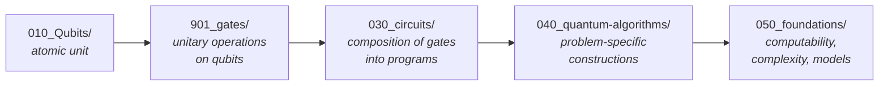

# QCSAA 900-909 · Section 00 — Fundamentos de Computación Cuántica (Reading Order Index)

## 1. Purpose

Declares the **acyclic dependency graph** of the `900-909` foundational range of QCSAA and the canonical reading order for contributors. Unlike the ATLAS bands, which are *partitions* (each subsection is a peer slice of an aircraft), the QCSAA `900-909` range is a *dependency graph*: each subsection presupposes the ones above it. Authoring against this index prevents content downstream from referring to terms not yet defined.

## 2. Scope

- Covers the section-level reading order for the foundational QCSAA range `900-909` only. Subsection-level indices live in each subsection's own `README.md`.
- Inherits Q-Division authority and ORB support from the parent row in [`../README.md` §3](../README.md#3-architecture-table)[^archtable].

## 3. Dependency Graph and Reading Order

Read in the order shown. Every chapter to the right relies on definitions from the chapters to its left and **shall not redefine** them; back-references into a specific subsubject of an upstream chapter are required.

## 4. Subsection Index

| Order | Subsection | Title | Index | Role |
|---:|---|---|---|---|
| 1 | `010` | Qubits | [`010_Qubits/README.md`](./010_Qubits/README.md) | Atomic unit; upstream of everything else in QCSAA |
| 2 | `901` | Gates | [`901_gates/README.md`](./901_gates/README.md) | Unitary operations on qubits |
| 3 | `030` | Circuits | [`030_circuits/900_Overview.md`](./030_circuits/900_Overview.md) | Composition of gates into programs |
| 4 | `040` | Quantum Algorithms | [`040_quantum-algorithms/00_Overview.md`](./040_quantum-algorithms/00_Overview.md) | Problem-specific constructions |
| 5 | `050` | Foundations | [`050_foundations/00_Overview.md`](./050_foundations/00_Overview.md) | Computability, complexity, models |

## 5. Authoring Convention (Register-Wide)

This dependency-graph pattern is **register-wide for QCSAA** and is intentionally different from the partition pattern used by ATLAS bands. Contributors entering QCSAA from any of `910-979` (QML, networks, cybersecurity, sensing, simulation, robotics, sentient agency) shall:

1. Verify that any qubit/gate/circuit/algorithm concept they use is already defined in the corresponding `900-909` subsection.
2. Back-reference the **specific subsubject** of `900-909` that defines the concept, rather than re-introducing it.
3. Flag any required upstream extension as a gap against this index, not as new content in the downstream chapter.

## 6. Footprint

| Metric | Value |
|---|---|
| Architecture | `QCSAA` — Quantum Computing & Sentient Agency Architecture |
| Master range | `900–999` |
| Code range | `900-909` |
| Section | `00` — Fundamentos de Computación Cuántica |
| Primary Q-Division | Q-HORIZON[^qdiv] |
| Support Q-Divisions | Q-HPC, Q-DATAGOV |
| ORB support | ORB-PMO, ORB-LEG |
| Governance class | `restricted`[^gov] |
| Folder path | `Q+ATLANTIDE/900-999_QCSAA/900-909_Fundamentos-de-Computacion-Cuantica/` |
| Document | `00_INDEX.md` (this file) |
| Parent architecture | [`../README.md`](../README.md) |
| Parent baseline | [`organization/Q+ATLANTIDE.md`](../../../organization/Q+ATLANTIDE.md) |

## 7. References & Citations

[^baseline]: **Q+ATLANTIDE controlled baseline (v1.0.0)** — [`organization/Q+ATLANTIDE.md`](../../../organization/Q+ATLANTIDE.md). Defines the controlled `000-999` architecture-band taxonomy and the ATLAS-1000 register subpart.

[^archtable]: **QCSAA §3 Architecture Table** — [`../README.md`](../README.md). Authoritative source for the `900-909` row (Section `00` — Fundamentos de Computación Cuántica, Primary Q-Division Q-HORIZON).

[^qdiv]: **Q-Division authority** — Q-Divisions provide technical authority over an architecture row (Q+ATLANTIDE Note N-002). See [`organization/Q+ATLANTIDE.md` §4](../../../organization/Q+ATLANTIDE.md#4-notes).

[^gov]: **Governance class** — Bands are classified as `baseline` or `restricted` per Q+ATLANTIDE §4 governance rules.

[^ieeep7130]: **IEEE P7130 — Standard for Quantum Computing Definitions** — Vocabulary baseline for the quantum computing scope of QCSAA `900-999`.

[^s1000d]: **S1000D Issue 6.0 — International specification for technical publications** — Common Source DataBase (CSDB) and Data Module Code (DMC) specification used for all Q+ATLANTIDE artefacts.

[^as9100d]: **AS9100D — Quality Management Systems — Aviation, Space and Defense Organizations** — Quality-management baseline for all Q+ATLANTIDE deliverables.

### Applicable industry standards

- IEEE P7130 — Standard for Quantum Computing Definitions[^ieeep7130]
- S1000D Issue 6.0 — International specification for technical publications[^s1000d]
- AS9100D — Quality Management Systems — Aviation, Space and Defense Organizations[^as9100d]
