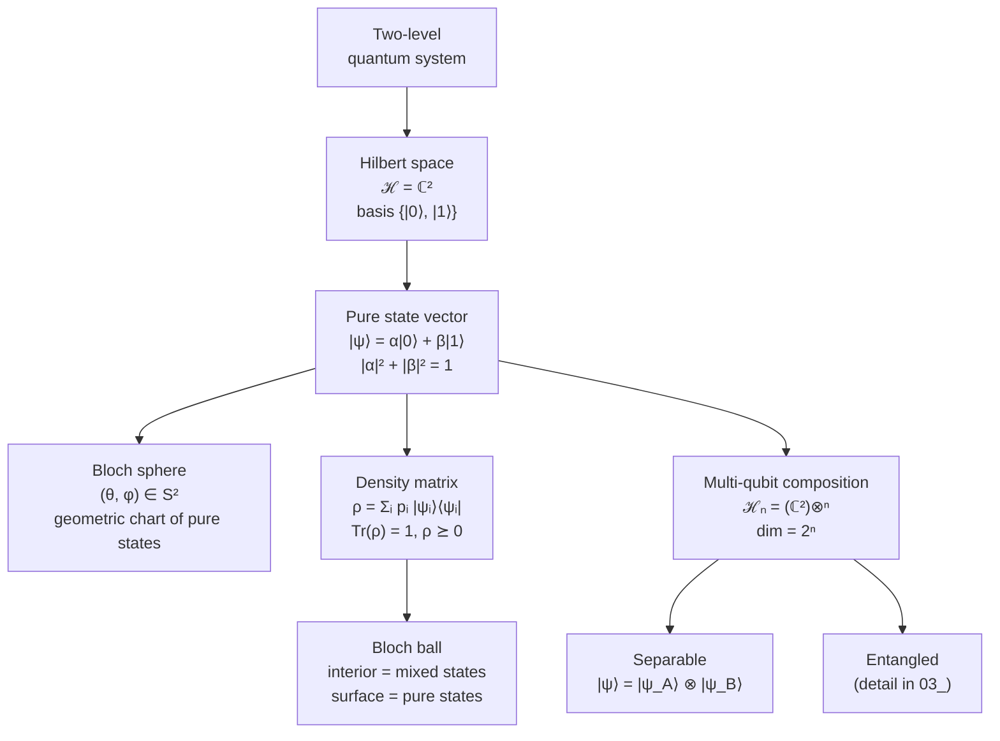

# QCSAA 900-909 · Section 00 · Subsection 010 · Subsubject 901 — Qubit Definition and Mathematical Formalism

## 1. Purpose

Defines the **qubit** — the atomic unit of quantum computation — as a two-level quantum system, and establishes the mathematical formalism (state vectors, Bloch sphere, density matrices, tensor-product composition) on which every downstream chapter of the QCSAA register depends. Aligns the register with the IEEE P7130 vocabulary[^ieeep7130] and with the controlled Q+ATLANTIDE baseline[^baseline].

## 2. Scope

- Covers the *Qubit Definition and Mathematical Formalism* subsubject (`901`) of subsection `010` *Qubits* within section `00` *Fundamentos de Computación Cuántica*.
- Inherits Q-Division authority and ORB support from the parent row in [`../../README.md` §3](../../README.md#3-architecture-table)[^archtable].
- Concepts in scope:
  - **Two-level quantum system** as the physical referent of a qubit.
  - **Hilbert space** $\mathcal{H} = \mathbb{C}^2$ with computational basis $\{|0\rangle, |1\rangle\}$.
  - **Pure-state vector** $|\psi\rangle = \alpha|0\rangle + \beta|1\rangle$ with $\alpha,\beta \in \mathbb{C}$, $|\alpha|^2 + |\beta|^2 = 1$ (normalisation), and global-phase equivalence.
  - **Bloch-sphere representation** $|\psi\rangle = \cos(\theta/2)|0\rangle + e^{i\varphi}\sin(\theta/2)|1\rangle$, mapping pure states to points on $S^2$.
  - **Density-matrix formalism** $\rho = \sum_i p_i |\psi_i\rangle\langle\psi_i|$ for mixed states; purity $\mathrm{Tr}(\rho^2)$; mapping mixed states to the interior of the Bloch ball.
  - **Multi-qubit composition** via tensor product $\mathcal{H}_n = (\mathbb{C}^2)^{\otimes n}$, dimension $2^n$, and the distinction between *separable* and *entangled* states (entanglement detail in `903_`).
- Out of scope: physical implementations (`902_`), gate-level operations and measurement (`903_`), noise (`904_`), and error correction (`905_`).

## 3. Diagram — Qubit Formalism Hierarchy

The mathematical objects introduced in §2 form a strict containment hierarchy: pure states are a subset of mixed (density-matrix) states, and single-qubit states extend to multi-qubit states by tensor product. The Bloch representation is a geometric chart of the same objects, not a separate ontology.

## 4. Footprint

| Metric | Value |
|---|---|
| Architecture | `QCSAA` — Quantum Computing & Sentient Agency Architecture |
| Master range | `900–999` |
| Code range | `900-909` |
| Section | `00` — Fundamentos de Computación Cuántica |
| Subject | `00` — General Information |
| Subsection | `010` — Qubits |
| Subsubject | `901` — Qubit Definition and Mathematical Formalism |
| Primary Q-Division | Q-HORIZON[^qdiv] |
| Support Q-Divisions | Q-HPC, Q-DATAGOV |
| ORB support | ORB-PMO, ORB-LEG |
| Governance class | `restricted`[^gov] |
| Folder path | `Q+ATLANTIDE/900-999_QCSAA/900-909_Fundamentos-de-Computacion-Cuantica/010_Qubits/` |
| Document | `901_Qubit-Definition-and-Mathematical-Formalism.md` (this file) |
| Parent subsection | [`README.md`](./README.md) · [`900_Overview.md`](./900_Overview.md) |
| Parent architecture | [`../../README.md`](../../README.md) |
| Parent baseline | [`organization/Q+ATLANTIDE.md`](../../../../organization/Q+ATLANTIDE.md) |

## 5. References & Citations

[^baseline]: **Q+ATLANTIDE controlled baseline (v1.0.0)** — [`organization/Q+ATLANTIDE.md`](../../../../organization/Q+ATLANTIDE.md). Defines the controlled `000-999` architecture-band taxonomy and the ATLAS-1000 register subpart.

[^archtable]: **QCSAA §3 Architecture Table** — [`../../README.md` §3](../../README.md#3-architecture-table). Authoritative source for the `900-909` row (Section `00` — Fundamentos de Computación Cuántica, Primary Q-Division Q-HORIZON).

[^qdiv]: **Q-Division authority** — Q-Divisions provide technical authority over an architecture row (Q+ATLANTIDE Note N-002). See [`organization/Q+ATLANTIDE.md` §4](../../../../organization/Q+ATLANTIDE.md#4-notes).

[^gov]: **Governance class** — Bands are classified as `baseline` or `restricted` per Q+ATLANTIDE §4 governance rules.

[^ieeep7130]: **IEEE P7130 — Standard for Quantum Computing Definitions** — Vocabulary baseline for the quantum computing scope of QCSAA `900-999`.

[^s1000d]: **S1000D Issue 6.0 — International specification for technical publications** — Common Source DataBase (CSDB) and Data Module Code (DMC) specification used for all Q+ATLANTIDE artefacts.

[^as9100d]: **AS9100D — Quality Management Systems — Aviation, Space and Defense Organizations** — Quality-management baseline for all Q+ATLANTIDE deliverables.

### Applicable industry standards

The following standards apply to this subsubject in addition to the cross-cutting Q+ATLANTIDE governance:

- IEEE P7130 — Standard for Quantum Computing Definitions[^ieeep7130]
- S1000D Issue 6.0 — International specification for technical publications[^s1000d]
- AS9100D — Quality Management Systems — Aviation, Space and Defense Organizations[^as9100d]
