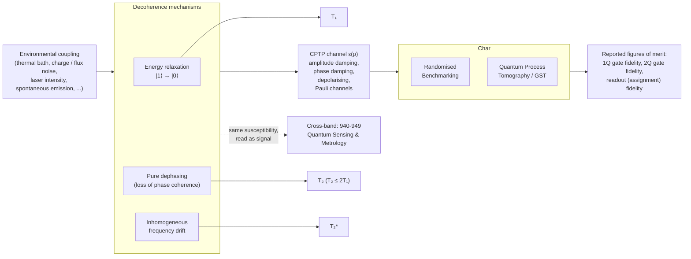

# QCSAA 900-909 · Section 00 · Subsection 010 · Subsubject 904 — Decoherence, Noise and Fidelity

## 1. Purpose

Characterises the **degradation modes** that distinguish real qubits from the idealised model of `901_`–`903_`: relaxation, dephasing, gate error, readout error, and the noise channels that summarise them. Defines the standard figures of merit ($T_1$, $T_2$, $T_2^*$, gate fidelity, readout fidelity) and the canonical experimental protocols (randomised benchmarking, quantum process tomography) used to estimate them. This subsubject is also where the bridge into `940-949` Quantum Sensing & Metrology becomes visible: the same susceptibility that limits computation enables measurement.

## 2. Scope

- Covers the *Decoherence, Noise and Fidelity* subsubject (`904`) of subsection `010` *Qubits* within section `00` *Fundamentos de Computación Cuántica*.
- Inherits Q-Division authority and ORB support from the parent row in [`../../README.md` §3](../../README.md#3-architecture-table)[^archtable].
- Concepts in scope:
  - **Coherence-time figures of merit** —
    - $T_1$ (energy relaxation, $|1\rangle \to |0\rangle$ via the environment).
    - $T_2$ (transverse / phase coherence; $T_2 \le 2 T_1$).
    - $T_2^{*}$ (inhomogeneous dephasing, including quasi-static frequency uncertainty).
  - **Gate fidelity** — average fidelity between an implemented operation and its ideal unitary; standard reporting via 1- and 2-qubit benchmarking.
  - **Readout fidelity** — assignment fidelity for measurement; symmetric (avg.) and asymmetric (per-state) reporting.
  - **Noise channels (CPTP maps)** — depolarising, amplitude damping, phase damping, Pauli channels; Kraus and process-matrix representations.
  - **Characterisation protocols** —
    - **Randomised benchmarking (RB)** and its variants (interleaved RB, simultaneous RB, cycle benchmarking) for scalable error-rate estimation.
    - **Quantum process tomography (QPT)** for full reconstruction of the channel; gate-set tomography (GST) as the self-consistent extension.
  - **Cross-band relevance** — back-referenced from `940-949` Quantum Sensing & Metrology, which exploits the *same* susceptibility ($T_2$, $T_2^*$, environmental coupling) as a signal rather than a defect.
- Out of scope: code-level mitigation (`905_`); circuit-level error-mitigation techniques (covered downstream in `030_circuits/` and `040_quantum-algorithms/`).

## 3. Diagram — From Environmental Coupling to Reported Fidelity

The pipeline below shows how a physical noise source becomes (a) a coherence-time figure of merit for the qubit, (b) a CPTP channel acting on the state, and (c) a benchmarked fidelity for a gate or readout. The same susceptibility, viewed from the opposite direction, becomes a sensing signal in `940-949`.

## 4. Footprint

| Metric | Value |
|---|---|
| Architecture | `QCSAA` — Quantum Computing & Sentient Agency Architecture |
| Master range | `900–999` |
| Code range | `900-909` |
| Section | `00` — Fundamentos de Computación Cuántica |
| Subject | `00` — General Information |
| Subsection | `010` — Qubits |
| Subsubject | `904` — Decoherence, Noise and Fidelity |
| Primary Q-Division | Q-HORIZON[^qdiv] |
| Support Q-Divisions | Q-HPC, Q-DATAGOV |
| ORB support | ORB-PMO, ORB-LEG |
| Governance class | `restricted`[^gov] |
| Folder path | `Q+ATLANTIDE/900-999_QCSAA/900-909_Fundamentos-de-Computacion-Cuantica/010_Qubits/` |
| Document | `904_Decoherence-Noise-and-Fidelity.md` (this file) |
| Parent subsection | [`README.md`](./README.md) · [`900_Overview.md`](./900_Overview.md) |
| Parent architecture | [`../../README.md`](../../README.md) |
| Parent baseline | [`organization/Q+ATLANTIDE.md`](../../../../organization/Q+ATLANTIDE.md) |

## 5. References & Citations

[^baseline]: **Q+ATLANTIDE controlled baseline (v1.0.0)** — [`organization/Q+ATLANTIDE.md`](../../../../organization/Q+ATLANTIDE.md). Defines the controlled `000-999` architecture-band taxonomy and the ATLAS-1000 register subpart.

[^archtable]: **QCSAA §3 Architecture Table** — [`../../README.md` §3](../../README.md#3-architecture-table). Authoritative source for the `900-909` row (Section `00` — Fundamentos de Computación Cuántica, Primary Q-Division Q-HORIZON).

[^qdiv]: **Q-Division authority** — Q-Divisions provide technical authority over an architecture row (Q+ATLANTIDE Note N-002). See [`organization/Q+ATLANTIDE.md` §4](../../../../organization/Q+ATLANTIDE.md#4-notes).

[^gov]: **Governance class** — Bands are classified as `baseline` or `restricted` per Q+ATLANTIDE §4 governance rules.

[^ieeep7130]: **IEEE P7130 — Standard for Quantum Computing Definitions** — Vocabulary baseline for the quantum computing scope of QCSAA `900-999`.

[^s1000d]: **S1000D Issue 6.0 — International specification for technical publications** — Common Source DataBase (CSDB) and Data Module Code (DMC) specification used for all Q+ATLANTIDE artefacts.

[^as9100d]: **AS9100D — Quality Management Systems — Aviation, Space and Defense Organizations** — Quality-management baseline for all Q+ATLANTIDE deliverables.

### Applicable industry standards

The following standards apply to this subsubject in addition to the cross-cutting Q+ATLANTIDE governance:

- IEEE P7130 — Standard for Quantum Computing Definitions[^ieeep7130]
- S1000D Issue 6.0 — International specification for technical publications[^s1000d]
- AS9100D — Quality Management Systems — Aviation, Space and Defense Organizations[^as9100d]
