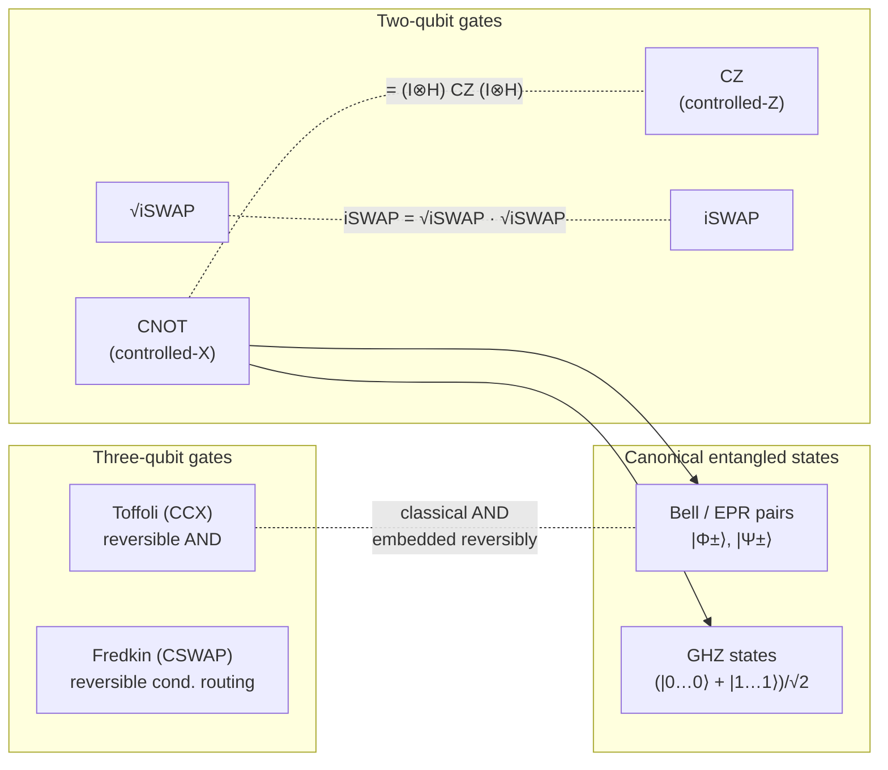

# QCSAA 900-909 · Section 00 · Subsection 020 · Subsubject 03 — Multi-Qubit Gates and Entangling Operations

## 1. Purpose

Catalogues the **multi-qubit gates** that act on two or more qubits simultaneously, with emphasis on the **entangling** primitives that take a separable input to a non-separable output and thereby supply the resource on which every quantum advantage depends. Records the canonical two-qubit family (CNOT, CZ, iSWAP, $\sqrt{\text{iSWAP}}$), the canonical three-qubit family (Toffoli, Fredkin), and the canonical entangled output states (Bell pairs, GHZ states) that contributors will refer to from `030_circuits/` and beyond.

## 2. Scope

- Covers the *Multi-Qubit Gates and Entangling Operations* subsubject (`03`) of subsection `020` *gates* within section `00` *Fundamentos de Computación Cuántica*.
- Inherits Q-Division authority and ORB support from the parent row in [`../../README.md` §3](../../README.md#3-architecture-table)[^archtable].
- Concepts in scope:
  - **Two-qubit controlled gates.**
    - **CNOT** (controlled-X) — the canonical entangler in the gate-based model; flips the target conditional on the control. Together with single-qubit gates (`02_`), CNOT is universal (see `04_`).
    - **CZ** (controlled-Z) — diagonal in the computational basis; equivalent to CNOT under a Hadamard basis change on the target ($\text{CNOT} = (I \otimes H)\,\text{CZ}\,(I \otimes H)$). Often the **native** two-qubit gate on superconducting and neutral-atom platforms.
  - **Two-qubit swap-family gates.**
    - **iSWAP** — exchanges the two qubits with an additional $i$ phase on the swapped amplitudes; native in many superconducting architectures via cross-resonance / exchange interactions.
    - **$\sqrt{\text{iSWAP}}$** — the half-power root of iSWAP; in combination with single-qubit gates it forms a continuous entangling family used in variational and analogue-style circuits.
  - **Three-qubit logic gates.**
    - **Toffoli (CCX)** — controlled-controlled-NOT; the canonical reversible embedding of classical AND. Universal for **classical** reversible computation by itself; together with H it is universal for quantum computation.
    - **Fredkin (CSWAP)** — controlled SWAP; the canonical reversible embedding of conditional data routing.
  - **Entanglement generation.** A two-qubit gate is **entangling** iff there exists a separable input state whose output is not separable. CNOT, CZ, and iSWAP are entangling; SWAP alone is **not**.
  - **Canonical entangled output states.**
    - **Bell / EPR pairs** — the four maximally entangled two-qubit states $|\Phi^\pm\rangle, |\Psi^\pm\rangle$. Standard preparation: $H$ on the first qubit followed by CNOT (control = first, target = second) applied to $|00\rangle$ produces $|\Phi^+\rangle = (|00\rangle + |11\rangle)/\sqrt{2}$.
    - **GHZ states** $|\text{GHZ}_n\rangle = (|0\rangle^{\otimes n} + |1\rangle^{\otimes n})/\sqrt{2}$ — multi-qubit generalisation; standard preparation: $H$ on the first qubit followed by a fan-out of CNOTs.
- Out of scope: physical implementation of two-qubit gates per modality (`05_`); use of entangled states inside complete algorithms (`040_quantum-algorithms/`); the role of entanglement in distributed quantum communication (`920-929_Redes-y-Comunicaciones-Cuanticas/`).

## 3. Diagram — Multi-Qubit Gate Family and Entangled Outputs

The diagram separates **gates** (left) from **states** (right), with the production arrows showing the canonical preparation circuits. The dashed equivalences record the basis-change relationships that contributors to `030_circuits/` rely on when deciding between native gates on a target platform.

## 4. Footprint

| Metric | Value |
|---|---|
| Architecture | `QCSAA` — Quantum Computing & Sentient Agency Architecture |
| Master range | `900–999` |
| Code range | `900-909` |
| Section | `00` — Fundamentos de Computación Cuántica |
| Subject | `00` — General Information |
| Subsection | `020` — gates |
| Subsubject | `03` — Multi-Qubit Gates and Entangling Operations |
| Primary Q-Division | Q-HORIZON[^qdiv] |
| Support Q-Divisions | Q-HPC, Q-DATAGOV |
| ORB support | ORB-PMO, ORB-LEG |
| Governance class | `restricted`[^gov] |
| Folder path | `Q+ATLANTIDE/900-999_QCSAA/900-909_Fundamentos-de-Computacion-Cuantica/020_gates/` |
| Document | `03_Multi-Qubit-Gates-and-Entangling-Operations.md` (this file) |
| Parent subsection | [`README.md`](./README.md) · [`00_Overview.md`](./00_Overview.md) |
| Parent architecture | [`../../README.md`](../../README.md) |
| Parent baseline | [`organization/Q+ATLANTIDE.md`](../../../../organization/Q+ATLANTIDE.md) |

## 5. References & Citations

[^baseline]: **Q+ATLANTIDE controlled baseline (v1.0.0)** — [`organization/Q+ATLANTIDE.md`](../../../../organization/Q+ATLANTIDE.md). Defines the controlled `000-999` architecture-band taxonomy and the ATLAS-1000 register subpart.

[^archtable]: **QCSAA §3 Architecture Table** — [`../../README.md` §3](../../README.md#3-architecture-table). Authoritative source for the `900-909` row (Section `00` — Fundamentos de Computación Cuántica, Primary Q-Division Q-HORIZON).

[^qdiv]: **Q-Division authority** — Q-Divisions provide technical authority over an architecture row (Q+ATLANTIDE Note N-002). See [`organization/Q+ATLANTIDE.md` §4](../../../../organization/Q+ATLANTIDE.md#4-notes).

[^gov]: **Governance class** — Bands are classified as `baseline` or `restricted` per Q+ATLANTIDE §4 governance rules.

[^ieeep7130]: **IEEE P7130 — Standard for Quantum Computing Definitions** — Vocabulary baseline for the quantum computing scope of QCSAA `900-999`.

[^s1000d]: **S1000D Issue 6.0 — International specification for technical publications** — Common Source DataBase (CSDB) and Data Module Code (DMC) specification used for all Q+ATLANTIDE artefacts.

[^as9100d]: **AS9100D — Quality Management Systems — Aviation, Space and Defense Organizations** — Quality-management baseline for all Q+ATLANTIDE deliverables.

### Applicable industry standards

The following standards apply to this subsubject in addition to the cross-cutting Q+ATLANTIDE governance:

- IEEE P7130 — Standard for Quantum Computing Definitions[^ieeep7130]
- S1000D Issue 6.0 — International specification for technical publications[^s1000d]
- AS9100D — Quality Management Systems — Aviation, Space and Defense Organizations[^as9100d]
