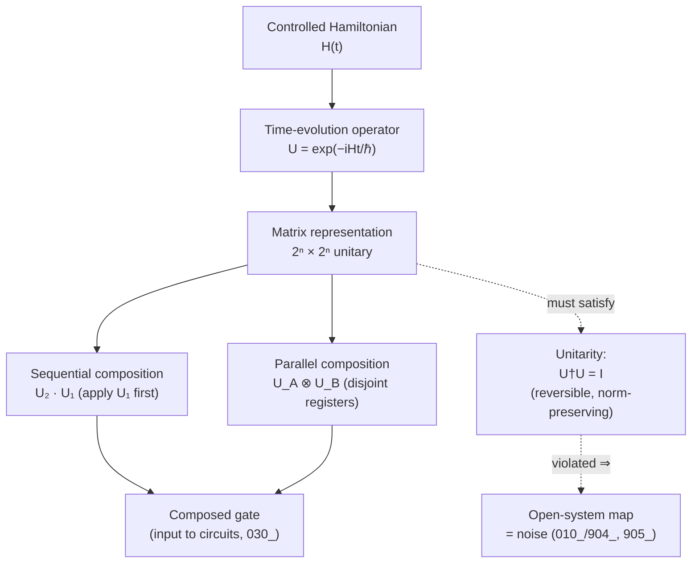

# QCSAA 900-909 · Section 00 · Subsection 020 · Subsubject 901 — Gate Definition and Unitary Formalism

## 1. Purpose

Defines the **quantum gate** as a unitary operator on the Hilbert space of one or more qubits, and establishes the formalism — unitarity, reversibility, matrix representation, composition, and the Hamiltonian origin of every gate via Schrödinger time evolution — on which all downstream chapters of `020_gates/` depend. Aligns the register with the IEEE P7130 vocabulary[^ieeep7130] and with the controlled Q+ATLANTIDE baseline[^baseline].

## 2. Scope

- Covers the *Gate Definition and Unitary Formalism* subsubject (`901`) of subsection `020` *gates* within section `00` *Fundamentos de Computación Cuántica*.
- Inherits Q-Division authority and ORB support from the parent row in [`../../README.md` §3](../../README.md#3-architecture-table)[^archtable].
- Concepts in scope:
  - **Gate as unitary operator.** A quantum gate on $n$ qubits is a unitary operator $U: \mathcal{H}_n \to \mathcal{H}_n$ acting on the $2^n$-dimensional Hilbert space defined in [`../010_Qubits/901_Qubit-Definition-and-Mathematical-Formalism.md`](../010_Qubits/901_Qubit-Definition-and-Mathematical-Formalism.md).
  - **Unitarity condition** $U^\dagger U = U U^\dagger = I$, equivalent to length-preservation $\langle U\psi | U\psi \rangle = \langle \psi | \psi \rangle$, hence preservation of the normalisation $\sum_i |\alpha_i|^2 = 1$.
  - **Reversibility.** Every quantum gate has an inverse $U^{-1} = U^\dagger$. There is **no quantum analogue of irreversible classical gates** (AND, OR, NAND in their standard two-input/one-output forms): irreversible logic must be embedded into reversible logic (Toffoli/Fredkin, see `903_`) before it can be executed quantumly.
  - **Matrix representation.** A gate is represented in the computational basis by a $2^n \times 2^n$ unitary matrix; the matrix coefficients are amplitudes that determine output superpositions.
  - **Gate composition.** Sequential application is matrix multiplication in **reverse temporal order**: applying $U_1$ then $U_2$ corresponds to the operator $U_2 U_1$. Parallel application on disjoint qubit registers is the tensor product $U_A \otimes U_B$.
  - **Hamiltonian origin (Schrödinger evolution).** Every gate is the time-evolution operator of some controlled Hamiltonian: $U = e^{-iHt/\hbar}$. This is the bridge between the abstract unitary algebra of `902_`–`904_` and the **physical pulse-level realization** in `905_`.
  - **Why unitarity is forced by the postulates.** Closed-system quantum mechanics (Schrödinger picture) requires linear, norm-preserving evolution; norm preservation plus linearity forces unitarity. Non-unitary maps are admissible only in the **open-system** picture — i.e. they describe interaction with an environment, which in `020_gates/` is treated as **noise** (see [`../010_Qubits/904_Decoherence-Noise-and-Fidelity.md`](../010_Qubits/904_Decoherence-Noise-and-Fidelity.md) and `905_` of this chapter), not as a primitive operation.
- Out of scope: the catalogue of single-qubit gates (`902_`), multi-qubit / entangling gates (`903_`), universal sets and decomposition (`904_`), and physical pulse-level realization, calibration, and benchmarking (`905_`).

## 3. Diagram — From Hamiltonian to Composed Unitary

The pipeline below shows the **single causal chain** from a controlled physical Hamiltonian to an executed quantum gate, and from individual gates to composed operations. The right-hand branch shows the constraint that closes the loop: every link in the chain must preserve the unitarity condition $U^\dagger U = I$, otherwise the operation falls outside the scope of `020_gates/` and is reclassified as noise.

## 4. Footprint

| Metric | Value |
|---|---|
| Architecture | `QCSAA` — Quantum Computing & Sentient Agency Architecture |
| Master range | `900–999` |
| Code range | `900-909` |
| Section | `00` — Fundamentos de Computación Cuántica |
| Subject | `00` — General Information |
| Subsection | `020` — gates |
| Subsubject | `901` — Gate Definition and Unitary Formalism |
| Primary Q-Division | Q-HORIZON[^qdiv] |
| Support Q-Divisions | Q-HPC, Q-DATAGOV |
| ORB support | ORB-PMO, ORB-LEG |
| Governance class | `restricted`[^gov] |
| Folder path | `Q+ATLANTIDE/900-999_QCSAA/900-909_Fundamentos-de-Computacion-Cuantica/020_gates/` |
| Document | `901_Gate-Definition-and-Unitary-Formalism.md` (this file) |
| Parent subsection | [`README.md`](./README.md) · [`900_Overview.md`](./900_Overview.md) |
| Parent architecture | [`../../README.md`](../../README.md) |
| Parent baseline | [`organization/Q+ATLANTIDE.md`](../../../../organization/Q+ATLANTIDE.md) |

## 5. References & Citations

[^baseline]: **Q+ATLANTIDE controlled baseline (v1.0.0)** — [`organization/Q+ATLANTIDE.md`](../../../../organization/Q+ATLANTIDE.md). Defines the controlled `000-999` architecture-band taxonomy and the ATLAS-1000 register subpart.

[^archtable]: **QCSAA §3 Architecture Table** — [`../../README.md` §3](../../README.md#3-architecture-table). Authoritative source for the `900-909` row (Section `00` — Fundamentos de Computación Cuántica, Primary Q-Division Q-HORIZON).

[^qdiv]: **Q-Division authority** — Q-Divisions provide technical authority over an architecture row (Q+ATLANTIDE Note N-002). See [`organization/Q+ATLANTIDE.md` §4](../../../../organization/Q+ATLANTIDE.md#4-notes).

[^gov]: **Governance class** — Bands are classified as `baseline` or `restricted` per Q+ATLANTIDE §4 governance rules.

[^ieeep7130]: **IEEE P7130 — Standard for Quantum Computing Definitions** — Vocabulary baseline for the quantum computing scope of QCSAA `900-999`.

[^s1000d]: **S1000D Issue 6.0 — International specification for technical publications** — Common Source DataBase (CSDB) and Data Module Code (DMC) specification used for all Q+ATLANTIDE artefacts.

[^as9100d]: **AS9100D — Quality Management Systems — Aviation, Space and Defense Organizations** — Quality-management baseline for all Q+ATLANTIDE deliverables.

### Applicable industry standards

The following standards apply to this subsubject in addition to the cross-cutting Q+ATLANTIDE governance:

- IEEE P7130 — Standard for Quantum Computing Definitions[^ieeep7130]
- S1000D Issue 6.0 — International specification for technical publications[^s1000d]
- AS9100D — Quality Management Systems — Aviation, Space and Defense Organizations[^as9100d]
