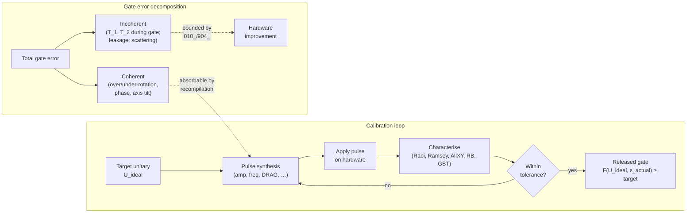

# QCSAA 900-909 · Section 00 · Subsection 020 · Subsubject 905 — Gate Implementation, Calibration and Error Characterization

## 1. Purpose

Records how the abstract gates of `901_`–`904_` are **physically realised** on each modality from [`../010_Qubits/902_Physical-Qubit-Implementations.md`](../010_Qubits/902_Physical-Qubit-Implementations.md), how they are **calibrated** to a target unitary, and how their **errors are characterised** (gate fidelity vs. operation fidelity, randomized benchmarking specific to gates, coherent vs. incoherent error decomposition). This subsubject also carries the **per-modality reality check** that the program's TRL claims have to land against: the (gate type) × (gate time) × (current fidelity) × (achievable fidelity) table in §3 is binding for any aerospace-integration argument that depends on gate-level performance.

## 2. Scope

- Covers the *Gate Implementation, Calibration and Error Characterization* subsubject (`05`) of subsection `020` *gates* within section `00` *Fundamentos de Computación Cuántica*.
- Inherits Q-Division authority and ORB support from the parent row in [`../../README.md` §3](../../README.md#3-architecture-table)[^archtable].
- Concepts in scope:
  - **Per-modality physical realisation of gates.**
    - **Superconducting (transmon, fluxonium):** microwave drive pulses through coplanar resonators or direct charge lines; single-qubit gates as resonant XY drives, two-qubit gates via flux-tunable couplers, cross-resonance, or parametric coupling.
    - **Trapped ion (hyperfine / optical):** laser pulses (Raman or direct) on the qubit transition; two-qubit gates via Mølmer–Sørensen or geometric-phase interactions mediated by collective motional modes.
    - **Neutral atom (Rydberg arrays):** optical pulses on the ground transition for single-qubit gates; two-qubit gates via Rydberg blockade between adjacent atoms in the optical-tweezer array.
    - **Photonic (dual-rail / CV):** linear-optical components (beam splitters, phase shifters) for single-qubit gates; entangling gates either measurement-induced (KLM) or via nonlinearities / squeezing on continuous-variable encodings.
    - **Spin (NV / Si):** microwave or RF pulses on the spin transition; two-qubit gates via exchange coupling (semiconductor spins) or dipolar / hyperfine coupling (NV).
  - **Pulse shaping and leakage suppression.** Naïve square pulses excite leakage transitions out of the qubit subspace. Standard mitigations include **DRAG** (Derivative Removal by Adiabatic Gate) for transmon-style multilevel systems, and analogous derivative-correction schemes on other modalities.
  - **Calibration loops.** Iterative tuning of pulse parameters (amplitude, frequency, duration, DRAG coefficient) against measured outcomes; canonical sequences include Rabi, Ramsey, AllXY, error amplification, and randomized benchmarking driven optimisation.
  - **Gate fidelity vs. operation fidelity.**
    - **Gate fidelity** $F(U_{\text{ideal}}, \mathcal{E}_{\text{actual}})$ — closeness of the implemented quantum operation to the ideal unitary, averaged or worst-case over input states.
    - **Operation fidelity** — the same quantity in context, with measurement and reset errors included; this is what the algorithm sees and what the resource estimates of `904_` consume.
    - These two numbers diverge whenever measurement/reset is non-negligible, and the divergence is what makes "99.9 % gate fidelity" not a sufficient claim by itself for aerospace-integration arguments.
  - **Randomized benchmarking specific to gates.** Standard RB measures average error per Clifford; **interleaved RB** isolates the error of a specific gate; **direct fidelity estimation** and **gate-set tomography** (GST) provide finer-grained characterisation when the noise structure matters.
  - **Coherent vs. incoherent gate errors.**
    - **Coherent** errors (over- or under-rotation, mis-tuned phase, axis tilt) are unitary mis-implementations of the target gate; they **add in amplitude** and can be partially absorbed by recompilation.
    - **Incoherent** errors (decoherence-during-gate, leakage, spontaneous emission) are non-unitary; they **add in probability** and are bounded by the qubit's intrinsic $T_1, T_2$ relative to gate time (see [`../010_Qubits/904_Decoherence-Noise-and-Fidelity.md`](../010_Qubits/904_Decoherence-Noise-and-Fidelity.md)).
- Out of scope: the qubit-level decoherence model itself (already in `010_Qubits/904_`); logical-qubit-level error correction (`010_Qubits/905_`); algorithm-level resource estimation including circuit depth and scheduling (`030_circuits/`, `040_quantum-algorithms/`).

## 3. Per-Modality Gate Performance Matrix

The matrix below records, **per modality and per gate type**, the four numbers that any aerospace-integration argument depending on gate-level performance must cite explicitly: typical gate time, current state-of-the-art fidelity, achievable fidelity by an indicative target year, and the dominant error mechanism. This mirrors the per-modality posture matrix in [`../010_Qubits/902_Physical-Qubit-Implementations.md`](../010_Qubits/902_Physical-Qubit-Implementations.md) §3 — and, like that matrix, **resists averaging across modalities**: a CNOT on a superconducting transmon and a CNOT on a trapped ion are not the same operation engineering-wise, and the program shall not allow them to be reported as if they were.

| Modality | Gate type | Gate time (typ.) | Current fidelity (SOTA, indicative) | Achievable fidelity by ~2030 (program target, indicative) | Dominant error mechanism |
|---|---|---|---|---|---|
| **Superconducting (transmon)** | 1Q (X / R_x, R_y, R_z) | 10–50 ns | 99.9–99.99 % | 99.99 %+ | Leakage to higher levels; control-pulse imperfection |
| **Superconducting (transmon)** | 2Q (CZ / CNOT, cross-resonance) | 30–200 ns | 99.0–99.7 % | 99.9 % | Crosstalk; coherent two-qubit miscalibration; T_1-during-gate |
| **Trapped ion (hyperfine)** | 1Q (single-ion laser pulse) | 1–10 µs | 99.99 %+ | 99.999 % | Laser-phase noise; off-resonant scattering |
| **Trapped ion (hyperfine)** | 2Q (Mølmer–Sørensen) | 10–200 µs | 99.5–99.9 % | 99.99 % | Motional-mode heating; laser intensity noise |
| **Neutral atom (Rydberg)** | 1Q (ground-state laser) | 0.1–10 µs | 99.5–99.9 % | 99.99 % | Spontaneous emission from intermediate states |
| **Neutral atom (Rydberg)** | 2Q (Rydberg blockade) | 0.1–1 µs | 99.0–99.5 % | 99.9 % | Rydberg-state decay; finite blockade strength |
| **Spin — semiconductor (Si/SiGe)** | 1Q (ESR / EDSR) | 10–100 ns | 99.9 %+ | 99.99 % | Charge noise; nuclear-spin bath |
| **Spin — semiconductor (Si/SiGe)** | 2Q (exchange) | 10–100 ns | 98–99.5 % | 99.9 % | Charge noise on exchange coupling; calibration drift |
| **Spin — NV centre (in-register)** | 1Q (microwave) | 10–100 ns | 99–99.9 % | 99.99 % | Nuclear-spin-bath dephasing; control bandwidth |
| **Spin — NV centre (in-register)** | 2Q (dipolar / hyperfine) | 0.1–10 µs | 95–99 % | 99.5 % | Inhomogeneous coupling; addressing crosstalk |
| **Photonic (dual-rail)** | 1Q (linear-optical) | sub-ns | 99 %+ (per element) | 99.9 % | Component loss; mode mismatch |
| **Photonic (dual-rail)** | 2Q (heralded / measurement-induced) | sub-ns (per heralded attempt) | 90–99 % (heralded) | 99 %+ (heralded) | Photon loss; non-deterministic success probability |

> **Interpretation — the factor-of-2000 in gate time matters.** A CNOT on a superconducting transmon (~30–200 ns) and a CNOT on a trapped ion (~10–200 µs) differ by roughly three orders of magnitude in gate time. For an algorithm with $10^9$ gates this is the difference between **seconds** (superconducting) and **days** (trapped ion). For aerospace integration this distinction is binding:
>
> - Optimisation problems with operational deadlines (flight planning, fleet routing, near-real-time scheduling) require modalities whose total runtime fits within the deadline → currently superconducting, with neutral-atom as the credible near-term alternative.
> - One-shot problems without a binding deadline (post-flight ML training over historical data, certification analyses, design-time tooling) can tolerate the longer wall-clock times of trapped-ion or photonic modalities and benefit from their higher per-gate fidelities.
>
> Aerospace-integration arguments shall pick **one** column of the matrix above and justify the choice; they shall not average gate times or fidelities across modalities.

## 4. Diagram — Calibration Loop and Error Decomposition

The diagram on the left is the **calibration loop** of §2: a closed-loop tuning process that drives the implemented operation $\mathcal{E}_{\text{actual}}$ towards the ideal $U_{\text{ideal}}$. The diagram on the right is the **error decomposition** that contributors to `010_Qubits/905_` rely on when assigning residual error budgets between coherent (recompilable) and incoherent (decoherence-bounded) sources.

## 5. Footprint

| Metric | Value |
|---|---|
| Architecture | `QCSAA` — Quantum Computing & Sentient Agency Architecture |
| Master range | `900–999` |
| Code range | `900-909` |
| Section | `00` — Fundamentos de Computación Cuántica |
| Subject | `00` — General Information |
| Subsection | `020` — gates |
| Subsubject | `905` — Gate Implementation, Calibration and Error Characterization |
| Primary Q-Division | Q-HORIZON[^qdiv] |
| Support Q-Divisions | Q-HPC, Q-DATAGOV |
| ORB support | ORB-PMO, ORB-LEG |
| Governance class | `restricted`[^gov] |
| Folder path | `Q+ATLANTIDE/900-999_QCSAA/900-909_Fundamentos-de-Computacion-Cuantica/020_gates/` |
| Document | `905_Gate-Implementation-Calibration-and-Error-Characterization.md` (this file) |
| Parent subsection | [`README.md`](./README.md) · [`900_Overview.md`](./900_Overview.md) |
| Parent architecture | [`../../README.md`](../../README.md) |
| Parent baseline | [`organization/Q+ATLANTIDE.md`](../../../../organization/Q+ATLANTIDE.md) |

## 6. References & Citations

[^baseline]: **Q+ATLANTIDE controlled baseline (v1.0.0)** — [`organization/Q+ATLANTIDE.md`](../../../../organization/Q+ATLANTIDE.md). Defines the controlled `000-999` architecture-band taxonomy and the ATLAS-1000 register subpart.

[^archtable]: **QCSAA §3 Architecture Table** — [`../../README.md` §3](../../README.md#3-architecture-table). Authoritative source for the `900-909` row (Section `00` — Fundamentos de Computación Cuántica, Primary Q-Division Q-HORIZON).

[^qdiv]: **Q-Division authority** — Q-Divisions provide technical authority over an architecture row (Q+ATLANTIDE Note N-002). See [`organization/Q+ATLANTIDE.md` §4](../../../../organization/Q+ATLANTIDE.md#4-notes).

[^gov]: **Governance class** — Bands are classified as `baseline` or `restricted` per Q+ATLANTIDE §4 governance rules.

[^ieeep7130]: **IEEE P7130 — Standard for Quantum Computing Definitions** — Vocabulary baseline for the quantum computing scope of QCSAA `900-999`.

[^s1000d]: **S1000D Issue 6.0 — International specification for technical publications** — Common Source DataBase (CSDB) and Data Module Code (DMC) specification used for all Q+ATLANTIDE artefacts.

[^as9100d]: **AS9100D — Quality Management Systems — Aviation, Space and Defense Organizations** — Quality-management baseline for all Q+ATLANTIDE deliverables.

### Applicable industry standards

The following standards apply to this subsubject in addition to the cross-cutting Q+ATLANTIDE governance:

- IEEE P7130 — Standard for Quantum Computing Definitions[^ieeep7130]
- S1000D Issue 6.0 — International specification for technical publications[^s1000d]
- AS9100D — Quality Management Systems — Aviation, Space and Defense Organizations[^as9100d]
