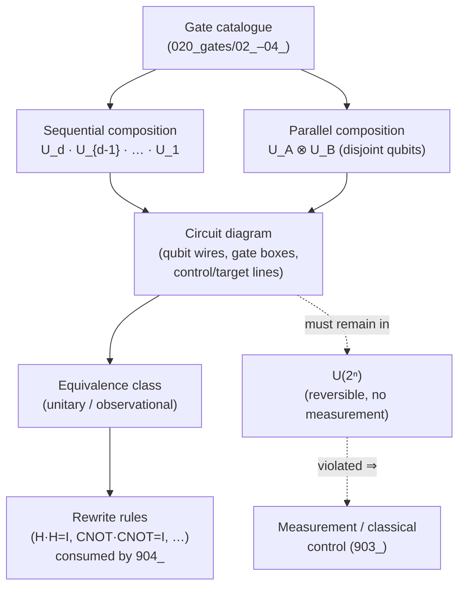

# QCSAA 900-909 · Section 00 · Subsection 030 · Subsubject 901 — Circuit Definition and Composition

## 1. Purpose

Defines the **quantum circuit** as a directed sequence of gates acting on a qubit register, and establishes the formalism — circuit diagram notation, sequential and parallel composition, circuit-as-unitary view, equivalence classes, gate cancellation identities, and reversibility — on which all downstream chapters of `030_circuits/` depend. Aligns the register with the IEEE P7130 vocabulary[^ieeep7130] and with the controlled Q+ATLANTIDE baseline[^baseline].

## 2. Scope

- Covers the *Circuit Definition and Composition* subsubject (`901`) of subsection `030` *circuits* within section `00` *Fundamentos de Computación Cuántica*.
- Inherits Q-Division authority and ORB support from the parent row in [`../../README.md` §3](../../README.md#3-architecture-table)[^archtable].
- Concepts in scope:
  - **Quantum circuit as a directed sequence of gates.** A quantum circuit on $n$ qubits is an ordered sequence of unitary operations $U_1, U_2, \ldots, U_d$ — each drawn from the gate catalogue of [`../020_gates/`](../020_gates/) — applied to a qubit register defined in [`../900_Qubits/001_Qubit-Definition-and-Mathematical-Formalism.md`](../900_Qubits/001_Qubit-Definition-and-Mathematical-Formalism.md), optionally interleaved with measurement and classical control (deferred to `903_`).
  - **Circuit-as-unitary view.** When the circuit contains no measurements, the entire computation is a single unitary $U_{\text{circ}} = U_d U_{d-1} \cdots U_1$ on the register Hilbert space. The reversed temporal order (apply $U_1$ first, write $U_d$ leftmost) is the same convention as gate composition in [`../020_gates/01_Gate-Definition-and-Unitary-Formalism.md`](../020_gates/01_Gate-Definition-and-Unitary-Formalism.md) §2.
  - **Sequential vs. parallel composition.** Sequential application on the same qubits is matrix multiplication; **simultaneous** application on **disjoint** qubit subregisters is the tensor product $U_A \otimes U_B$. The distinction between sequential and parallel composition is the seed of the depth-vs-width analysis of `902_`.
  - **Standard quantum circuit notation.** Horizontal wires represent qubits (time flows left-to-right); boxes represent single-qubit gates; vertical lines with filled/open circles represent control/target lines for multi-qubit gates; double-wire segments after a measurement carry classical bits (introduced fully in `903_`). Dirac/Penrose tensor-network notation is used as a complementary view when the entanglement structure is the subject.
  - **Circuit equivalence classes.** Two circuits are **unitarily equivalent** when they implement the same overall unitary up to a global phase; they are **observationally equivalent** under a fixed measurement when their output distributions agree on every input. Equivalence-class reasoning is the formal basis for the optimisation passes of `904_`.
  - **Gate cancellation and identities.** Foundational identities consumed by every optimisation pass: $H \cdot H = I$, $X \cdot X = I$, $Z \cdot Z = I$, $S \cdot S = Z$, $T \cdot T = S$, $\text{CNOT} \cdot \text{CNOT} = I \otimes I$, $H \cdot X \cdot H = Z$, $H \cdot Z \cdot H = X$, $\text{CNOT}_{a \to b} \cdot \text{CNOT}_{a \to b} = I$. These identities depend on the unitary algebra of [`../020_gates/02_Single-Qubit-Gates.md`](../020_gates/02_Single-Qubit-Gates.md) and [`../020_gates/03_Multi-Qubit-Gates-and-Entangling-Operations.md`](../020_gates/03_Multi-Qubit-Gates-and-Entangling-Operations.md); their use as **rewrite rules** is the proper subject of `904_`.
  - **Circuit reversibility.** A measurement-free circuit is reversible: $U_{\text{circ}}^{-1} = U_1^\dagger U_2^\dagger \cdots U_d^\dagger$, computed by reversing the gate order and replacing each gate with its adjoint. Reversibility is what allows uncomputation patterns (see `905_`) and is broken precisely by the introduction of measurement in `903_`.
- **Boundary against [`../020_gates/`](../020_gates/) (binding).** A statement about a single $U_i$ — its definition, its decomposition, its physical realisation — belongs in `020_`. A statement about an ordered or parallel composition of $U_i$'s, or about an equivalence between two such compositions, belongs here. The dividing line is **the sequence**.
- Out of scope: structural cost metrics over the sequence (`902_`), measurement and classical control (`903_`), the optimisation/compilation/transpilation pipeline that *uses* the equivalences listed here as rewrite rules (`904_`), and the noise-resilient circuit patterns that compose all the above (`905_`).

## 3. Diagram — From Gate Catalogue to Composed Circuit

The pipeline below shows the **single causal chain** from the gate catalogue of `020_` to a composed circuit suitable for downstream processing. The right-hand branch shows the constraint that closes the loop: every composed circuit, viewed as a measurement-free unitary, must remain in $U(2^n)$, otherwise the operation has crossed into the measurement/classical-control regime and is reclassified into `903_`.

## 4. Footprint

| Metric | Value |
|---|---|
| Architecture | `QCSAA` — Quantum Computing & Sentient Agency Architecture |
| Master range | `900–999` |
| Code range | `900-909` |
| Section | `00` — Fundamentos de Computación Cuántica |
| Subject | `00` — General Information |
| Subsection | `030` — circuits |
| Subsubject | `901` — Circuit Definition and Composition |
| Primary Q-Division | Q-HORIZON[^qdiv] |
| Support Q-Divisions | Q-HPC, Q-DATAGOV |
| ORB support | ORB-PMO, ORB-LEG |
| Governance class | `restricted`[^gov] |
| Folder path | `Q+ATLANTIDE/900-999_QCSAA/900-909_Fundamentos-de-Computacion-Cuantica/030_circuits/` |
| Document | `901_Circuit-Definition-and-Composition.md` (this file) |
| Parent subsection | [`README.md`](./README.md) · [`900_Overview.md`](./900_Overview.md) |
| Parent architecture | [`../../README.md`](../../README.md) |
| Parent baseline | [`organization/Q+ATLANTIDE.md`](../../../../organization/Q+ATLANTIDE.md) |

## 5. References & Citations

[^baseline]: **Q+ATLANTIDE controlled baseline (v1.0.0)** — [`organization/Q+ATLANTIDE.md`](../../../../organization/Q+ATLANTIDE.md). Defines the controlled `000-999` architecture-band taxonomy and the ATLAS-1000 register subpart.

[^archtable]: **QCSAA §3 Architecture Table** — [`../../README.md` §3](../../README.md#3-architecture-table). Authoritative source for the `900-909` row (Section `00` — Fundamentos de Computación Cuántica, Primary Q-Division Q-HORIZON).

[^qdiv]: **Q-Division authority** — Q-Divisions provide technical authority over an architecture row (Q+ATLANTIDE Note N-002). See [`organization/Q+ATLANTIDE.md` §4](../../../../organization/Q+ATLANTIDE.md#4-notes).

[^gov]: **Governance class** — Bands are classified as `baseline` or `restricted` per Q+ATLANTIDE §4 governance rules.

[^ieeep7130]: **IEEE P7130 — Standard for Quantum Computing Definitions** — Vocabulary baseline for the quantum computing scope of QCSAA `900-999`.

[^s1000d]: **S1000D Issue 6.0 — International specification for technical publications** — Common Source DataBase (CSDB) and Data Module Code (DMC) specification used for all Q+ATLANTIDE artefacts.

[^as9100d]: **AS9100D — Quality Management Systems — Aviation, Space and Defense Organizations** — Quality-management baseline for all Q+ATLANTIDE deliverables.

### Applicable industry standards

The following standards apply to this subsubject in addition to the cross-cutting Q+ATLANTIDE governance:

- IEEE P7130 — Standard for Quantum Computing Definitions[^ieeep7130]
- S1000D Issue 6.0 — International specification for technical publications[^s1000d]
- AS9100D — Quality Management Systems — Aviation, Space and Defense Organizations[^as9100d]
